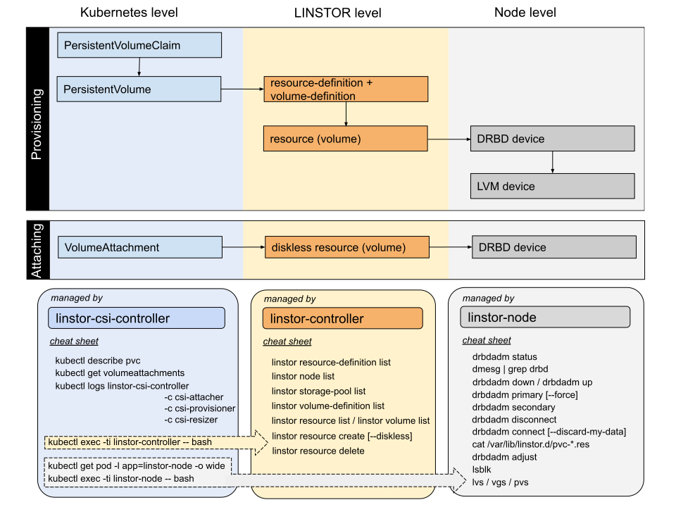


Работоспособность модуля гарантируется только при соблюдении [системных требований](./readme.html#системные-требования-и-рекомендации).
Использование в других условиях возможно, но стабильная работа в таких случаях не гарантируется.


## Когда следует использовать LVM, а когда LVMThin?

- LVM — это более простой вариант, который обеспечивает высокую производительность, близкую к производительности самого накопителя. Однако LVM не поддерживает использование снапшотов.
- LVMThin — позволяет создавать снапшоты и применять overprovisioning, что делает его более гибким, но с понижением общей производительности по сравнению с LVM.


Использование overprovisioning в LVMThin требует внимательного контроля уровня свободного места в пуле. Система мониторинга кластера уведомляет о снижении свободного места при достижении порогов 20%, 10%, 5% и 1%.

Если пул полностью исчерпает доступное место, это может привести к снижению производительности модуля и риску потери данных.


## Как получить информацию об используемом пространстве?

Существует два варианта:

1. Через дашборд Grafana:

   Перейдите в «Dashboards» → «Storage» → «LINSTOR/DRBD» в интерфейсе Grafana. В правом верхнем углу дашборда отображается информация о текущем использовании пространства в кластере.

   > **Внимание.** Эта информация отражает состояние всего доступного пространства в кластере.  Если необходимо создать тома в двух репликах, то эти значения стоит делить на два, чтобы получить представление о том, сколько таких томов можно разместить в кластере.

2. Через командный интерфейс:

   ```shell
   kubectl exec -n d8-sds-replicated-volume deploy/linstor-controller -- linstor storage-pool list
   ```

   > **Внимание.** Эта информация отражает состояние всего доступного пространства в кластере. Если создаются тома в двух репликах, то эти две реплики обязательно должны целиком поместиться на двух узлах вашего кластера.

## Как назначить StorageClass по умолчанию?

В соответствующем пользовательском ресурсе [ReplicatedStorageClass](./cr.html#replicatedstorageclass) в поле `spec.isDefault` указать `true`.  

## Как добавить существующую LVM Volume Group или LVMThin-пул?

1. Вручную назначьте на Volume Group LVM-тег `storage.deckhouse.io/enabled=true`:

   ```shell
   vgchange myvg-0 --add-tag storage.deckhouse.io/enabled=true
   ```

   Данный VG будет автоматически обнаружен и в кластере для него будет создан соответствующий ресурс `LVMVolumeGroup`.

1. Полученный ресурс укажите в параметрах [ReplicatedStoragePool](./cr.html#replicatedstoragepool) в поле `spec.lvmVolumeGroups[].name` (для LVMThin-пула необходимо дополнительно указать имя в `spec.lvmVolumeGroups[].thinPoolName`).

## Как увеличить ограничение на количество DRBD-томов / изменить порты, по которым DRBD-кластера общаются между собой?

Воспользуйтесь настройкой `drbdPortRange`. По умолчанию для DRBD-ресурсов используются TCP-порты 7000-7999. С помощью `minPort` и `maxPort` эти значения можно переопределить.


После изменения параметров `drbdPortRange`, `minPort` и `maxPort` перезапуск контроллера LINSTOR обязателен для применения новых настроек.

Изменение портов не повлияет на уже существующие DRBD-ресурсы — они продолжат работать на тех портах, которые были назначены ранее.

После изменения drbdPortRange minPort/maxPort linstor-controller нужно перезапустить.



## Как правильно перезагрузить узел с DRBD-ресурсами


Для повышения стабильности работы модуля рекомендуется избегать перезагрузки нескольких узлов одновременно.


1. Выполните drain узла:

   ```shell
   kubectl drain test-node-1 --ignore-daemonsets --delete-emptydir-data
   ```

1. Проверьте, что в DRBD нет проблемных ресурсов или ресурсов в `SyncTarget`. Если они есть, дождитесь синхронизации или примите меры для восстановления нормальной работоспособности.

   ```shell
   # kubectl -n d8-sds-replicated-volume exec -t deploy/linstor-controller -- linstor r l --faulty
   ```

   Пример вывода:

   ```console
   Defaulted container "linstor-controller" out of: linstor-controller, kube-rbac-proxy
   +----------------------------------------------------------------+
   | ResourceName | Node | Port | Usage | Conns | State | CreatedOn |
   |================================================================|
   +----------------------------------------------------------------+
   ```

1. Перезагрузите узел и дождитесь синхронизации **всех** DRBD-ресурсов. Выполните uncordon узла. При необходимости перезагрузки еще одного узла — повторите алгоритм.

   ```shell
   # kubectl uncordon test-node-1
   node/test-node-1 uncordoned
   ```

## Как освободить место в Storage Pool через перенос на другой узел

1. Проверьте список Storage Pool:

   ```shell
   `kubectl exec -n d8-sds-replicated-volume deploy/linstor-controller -- linstor storage-pool list -n OLD_NODE`
   ```

1. Проверьте расположение томов:

   ```shell
   `kubectl exec -n d8-sds-replicated-volume deploy/linstor-controller -- linstor volume list -n OLD_NODE`
   ```

1. Определитесь с ресурсами, которые вы хотите переместить:

   ```shell
   `kubectl exec -n d8-sds-replicated-volume deploy/linstor-controller -- linstor resource list-volumes`
   ```

1. Переместите ресурсы на другой узел (не более 1-2 ресурсов одновременно):

   ```shell
   kubectl exec -n d8-sds-replicated-volume deploy/linstor-controller -- linstor --yes-i-am-sane-and-i-understand-what-i-am-doing resource create NEW_NODE RESOURCE_NAME
   ```

   ```shell
   kubectl exec -n d8-sds-replicated-volume deploy/linstor-controller -- linstor resource-definition wait-sync RESOURCE_NAME
   ```

   ```shell
   kubectl exec -n d8-sds-replicated-volume deploy/linstor-controller -- linstor --yes-i-am-sane-and-i-understand-what-i-am-doing resource delete OLD_NODE RESOURCE_NAME
   ```

## Как вытеснить DRBD-ресурсы с узла?

1. Проверьте существование скрипта `evict.sh` на любом из master-узлов:

   ```shell
   ls -l /opt/deckhouse/sbin/evict.sh
   ```
2. Исправьте все ошибочные ресурсы в кластере. Чтобы найти их, выполните следующую команду:

   ```shell
   kubectl -n d8-sds-replicated-volume exec -ti deploy/linstor-controller -- linstor resource list --faulty
   ```

3. Убедитесь, что все поды в пространстве имен `d8-sds-replicated-volume` находятся в состоянии `Running`:

   ```shell
   kubectl -n d8-sds-replicated-volume get pods | grep -v Running
   ```

## Как удалить DRBD-ресурсы с узла с удалением из LINSTOR и Kubernetes?

Запустите скрипт `evict.sh` в интерактивном режиме, указав режим удаления `--delete-node`:

```shell
/opt/deckhouse/sbin/evict.sh --delete-node
```

Для запуска скрипта `evict.sh` в неинтерактивном режиме необходимо добавить флаг `--non-interactive` при его вызове, а также имя узла, с которого необходимо вытеснить ресурсы. В этом режиме скрипт выполнит все действия без запроса подтверждения от пользователя.

Пример вызова:

```shell
/opt/deckhouse/sbin/evict.sh --non-interactive --delete-node --node-name "worker-1"
```

## Как удалить DRBD-ресурсы с узла без удаления самого узла из LINSTOR и Kubernetes?

1. Запустите скрипт `evict.sh` в интерактивном режиме, указав режим удаления `--delete-resources-only`:

   ```shell
   /opt/deckhouse/sbin/evict.sh --delete-resources-only
   ```

Для запуска скрипта `evict.sh` в неинтерактивном режиме необходимо добавить флаг `--non-interactive` при его вызове, а также имя узла, с которого необходимо вытеснить ресурсы. В этом режиме скрипт выполнит все действия без запроса подтверждения от пользователя.

Пример вызова:

```shell
/opt/deckhouse/sbin/evict.sh --non-interactive --delete-resources-only --node-name "worker-1"
```

> **Важно.** После завершения работы скрипта узел в Kubernetes останется в статусе *SchedulingDisabled*, а в LINSTOR у данного узла будет выставлен параметр *AutoplaceTarget=false*, что запретит его планировщику создавать на этом узле ресурсы.

1. Если необходимо снова разрешить размещать DRBD-ресурсы и поды на узле, выполните команды:

   ```shell
   alias linstor='kubectl -n d8-sds-replicated-volume exec -ti deploy/linstor-controller -- linstor'
   linstor node set-property "worker-1" AutoplaceTarget
   kubectl uncordon "worker-1"
   ```

1. Проверьте параметр `AutoplaceTarget` у всех узлов (поле `AutoplaceTarget` будет пустым у тех узлов, на которых разрешено размещать ресурсы LINSTOR):

   ```shell
   alias linstor='kubectl -n d8-sds-replicated-volume exec -ti deploy/linstor-controller -- linstor'
   linstor node list -s AutoplaceTarget
   ```

## Диагностика проблем

Проблемы могут возникнуть на разных уровнях работы компонентов.
Эта шпаргалка поможет вам быстро сориентироваться при диагностике различных проблем с томами, созданными в LINSTOR:


<!--- Исходник: https://docs.google.com/drawings/d/19hn3nRj6jx4N_haJE0OydbGKgd-m8AUSr0IqfHfT6YA/edit --->

Некоторые типичные проблемы описаны ниже.

### linstor-node не может запуститься из-за невозможности загрузки DRBD-модуля

1. Проверьте состояние подов `linstor-node`:

   ```shell
   kubectl get pod -n d8-sds-replicated-volume -l app=linstor-node
   ```

1. Если некоторые поды находятся в состоянии `Init`, проверьте версию DRBD и логи bashible на узле:

   ```shell
   cat /proc/drbd
   journalctl -fu bashible
   ```

Наиболее вероятные причины, почему bashible не может загрузить модуль ядра:

- Возможно, загружена версия модуля DRBDv8 из ядра, в то время как требуется модуль DRBDv9. Для проверки версии загруженного модуля используйте команду:
  
  ```shell
  `cat /proc/drbd`
  ```
  
  Если файл отсутствует, значит модуль не загружен и проблема не в этом.

- Возможно, включен Secure Boot.
  Так как модуль DRBD компилируется динамически для вашего ядра (аналог dkms), он не имеет цифровой подписи.
  На данный момент мы не поддерживаем работу модуля DRBD в конфигурации с Secure Boot.

### Под не может запуститься из-за ошибки FailedMount

#### Под завис на стадии ContainerCreating

Если под завис на стадии `ContainerCreating`, а в выводе команды `kubectl describe pod` присутствуют ошибки вроде той, что представлена ниже, значит устройство смонтировано на одном из других узлов:

```console
rpc error: code = Internal desc = NodePublishVolume failed for pvc-b3e51b8a-9733-4d9a-bf34-84e0fee3168d: checking
for exclusive open failed: wrong medium type, check device health
```

Проверьте, где используется устройство, с помощью следующей команды:

```shell
alias linstor='kubectl -n d8-sds-replicated-volume exec -ti deploy/linstor-controller -- linstor'
linstor resource list -r pvc-b3e51b8a-9733-4d9a-bf34-84e0fee3168d
```

Флаг `InUse` укажет, на каком узле используется устройство, на этом узле потребуется вручную отмонтировать диск.

#### Ошибки вида Input/output error

Такие ошибки обычно возникают на стадии создания файловой системы (mkfs).

Проверьте `dmesg` на узле, где запускается под:

```shell
dmesg | grep 'Remote failed to finish a request within'
```

Если вывод команды не пустой (в выводе `dmesg` есть строки вида *"Remote failed to finish a request within ..."*), скорее всего, дисковая подсистема слишком медленная для нормального функционирования DRBD.

## Я удалил ресурс ReplicatedStoragePool, но соответствующий Storage Pool в бэкенде остался. Так и должно быть?

Да, в настоящий момент модуль `sds-replicated-volume` не обрабатывает операции при удалении ресурса ReplicatedStoragePool.

## Я не могу обновить поля в spec у ресурса ReplicatedStorageClass. Это ожидаемое поведение?

Да, поведение ожидаемое. В `spec` можно изменять только поле `isDefault`. Остальные поля в `spec` ресурса сделаны неизменяемыми.

## При удалении ресурса ReplicatedStorageClass не удаляется его дочерний StorageClass в Kubernetes. Что делать?

Если StorageClass находится в статусе `Created`, то его можно удалить. Если статус другой, нужно восстановить ресурс или удалить StorageClass вручную.

## При попытке создать Storage Pool или StorageClass возникла ошибка, но в итоге необходимая сущность успешно создалась. Такое допустимо?

Это поведение ожидаемо. Модуль автоматически повторит выполнение неудачной операции, если причиной ошибки послужили независящие от модуля обстоятельства (например, kube-apiserver временно стал недоступен).

## При выполнении команд в CLI, выдает ошибку "You're not allowed to change state of linstor cluster manually. Please contact tech support". Что делать?

Операции, которые требуют ручного вмешательства, в модуле `sds-replicated-volume` частично или полностью автоматизированы. Поэтому модуль `sds-replicated-volume` ограничивает список разрешенных команд в LINSTOR. Например, автоматизировано создание Tie-Breaker, —  сам LINSTOR иногда их не создает для ресурсов с двумя репликами. Список разрешенных команд можно посмотреть, выполнив следующую команду:

```shell
alias linstor='kubectl -n d8-sds-replicated-volume exec -ti deploy/linstor-controller -- linstor'
linstor --help
```

## Как восстановить БД из бэкапа?

Резервные копии ресурсов бэкенда лежат в секретах в виде YAML-файлов CRD, и имеют сегментированный формат. 

Резервное копирование происходит автоматически по расписанию.

Пример корректно сформированного бэкапа выглядит следующим образом:

```shell
linstor-20240425074718-backup-0              Opaque                           1      28s     sds-replicated-volume.deckhouse.io/linstor-db-backup=20240425074718
linstor-20240425074718-backup-1              Opaque                           1      28s     sds-replicated-volume.deckhouse.io/linstor-db-backup=20240425074718
linstor-20240425074718-backup-2              Opaque                           1      28s     sds-replicated-volume.deckhouse.io/linstor-db-backup=20240425074718
linstor-20240425074718-backup-completed      Opaque                           0      28s     <none>
```

Резервная копия хранится закодированными сегментами в секретах вида `linstor-%date_time%-backup-{0..2}`, секрет вида `linstor-%date_time%-backup-completed` не содержит данных, и служит маркером корректно отработавшего процесса резервного копирования.

### Процесс восстановления резервной копии

Установите значения переменных окружения:

```shell
NAMESPACE="d8-sds-replicated-volume"
BACKUP_NAME="linstor_db_backup"
```

Проверьте наличие резервных копий:

```shell
kubectl -n $NAMESPACE get secrets --show-labels
```

Пример вывода команды:

```shell
linstor-20240425072413-backup-0              Opaque                           1      33m     sds-replicated-volume.deckhouse.io/linstor-db-backup=20240425072413
linstor-20240425072413-backup-1              Opaque                           1      33m     sds-replicated-volume.deckhouse.io/linstor-db-backup=20240425072413
linstor-20240425072413-backup-2              Opaque                           1      33m     sds-replicated-volume.deckhouse.io/linstor-db-backup=20240425072413
linstor-20240425072413-backup-completed      Opaque                           0      33m     <none>
linstor-20240425072510-backup-0              Opaque                           1      32m     sds-replicated-volume.deckhouse.io/linstor-db-backup=20240425072510
linstor-20240425072510-backup-1              Opaque                           1      32m     sds-replicated-volume.deckhouse.io/linstor-db-backup=20240425072510
linstor-20240425072510-backup-2              Opaque                           1      32m     sds-replicated-volume.deckhouse.io/linstor-db-backup=20240425072510
linstor-20240425072510-backup-completed      Opaque                           0      32m     <none>
linstor-20240425072634-backup-0              Opaque                           1      31m     sds-replicated-volume.deckhouse.io/linstor-db-backup=20240425072634
linstor-20240425072634-backup-1              Opaque                           1      31m     sds-replicated-volume.deckhouse.io/linstor-db-backup=20240425072634
linstor-20240425072634-backup-2              Opaque                           1      31m     sds-replicated-volume.deckhouse.io/linstor-db-backup=20240425072634
linstor-20240425072634-backup-completed      Opaque                           0      31m     <none>
linstor-20240425072918-backup-0              Opaque                           1      28m     sds-replicated-volume.deckhouse.io/linstor-db-backup=20240425072918
linstor-20240425072918-backup-1              Opaque                           1      28m     sds-replicated-volume.deckhouse.io/linstor-db-backup=20240425072918
linstor-20240425072918-backup-2              Opaque                           1      28m     sds-replicated-volume.deckhouse.io/linstor-db-backup=20240425072918
linstor-20240425072918-backup-completed      Opaque                           0      28m     <none>
linstor-20240425074718-backup-0              Opaque                           1      10m     sds-replicated-volume.deckhouse.io/linstor-db-backup=20240425074718
linstor-20240425074718-backup-1              Opaque                           1      10m     sds-replicated-volume.deckhouse.io/linstor-db-backup=20240425074718
linstor-20240425074718-backup-2              Opaque                           1      10m     sds-replicated-volume.deckhouse.io/linstor-db-backup=20240425074718
linstor-20240425074718-backup-completed      Opaque                           0      10m     <none>
```

Каждая резервная копия имеет свою метку с временем создания.
Выберите нужную и скопируйте метку в переменную окружения.
Для примера, возмём метку самой актуальной копии из вывода выше:

```shell
LABEL_SELECTOR="sds-replicated-volume.deckhouse.io/linstor-db-backup=20240425074718"
```

Создайте временный каталог для хранения частей архива:

```shell
TMPDIR=$(mktemp -d)
echo "Временный каталог: $TMPDIR"
```

Следующей командой создайте пустой архив и объедините данные секретов в один файл:

```shell
COMBINED="${BACKUP_NAME}_combined.tar"
> "$COMBINED"
```

Далее получите список секретов по метке, дешифруйте данные и поместите данные резервной копии в архив:

```shell
MOBJECTS=$(kubectl get rsmb -l "$LABEL_SELECTOR" --sort-by=.metadata.name -o jsonpath="{.items[*].metadata.name}")

for MOBJECT in $MOBJECTS; do
  echo "Process: $MOBJECT"
  kubectl get rsmb "$MOBJECT" -o jsonpath="{.data}" | base64 --decode >> "$COMBINED"
done
```

Распакуйте объединенный tar-файл для получения ресурсов резервной копии:

```shell
mkdir -p "./backup"
tar -xf "$COMBINED" -C "./backup --strip-components=2
```

Проверьте содержимое резервной копии:

```shell
ls ./backup
```

```shell
TMPDIR=$(mktemp -d)
echo "Временный каталог: $TMPDIR"
```

Пример вывода:

```shell
ebsremotes.yaml                    layerdrbdvolumedefinitions.yaml        layerwritecachevolumes.yaml  propscontainers.yaml      satellitescapacity.yaml  secidrolemap.yaml         trackingdate.yaml
files.yaml                         layerdrbdvolumes.yaml                  linstorremotes.yaml          resourceconnections.yaml  schedules.yaml           secobjectprotection.yaml  volumeconnections.yaml
keyvaluestore.yaml                 layerluksvolumes.yaml                  linstorversion.yaml          resourcedefinitions.yaml  secaccesstypes.yaml      secroles.yaml             volumedefinitions.yaml
layerbcachevolumes.yaml            layeropenflexresourcedefinitions.yaml  nodeconnections.yaml         resourcegroups.yaml       secaclmap.yaml           sectyperules.yaml         volumegroups.yaml
layercachevolumes.yaml             layeropenflexvolumes.yaml              nodenetinterfaces.yaml       resources.yaml            secconfiguration.yaml    sectypes.yaml             volumes.yaml
layerdrbdresourcedefinitions.yaml  layerresourceids.yaml                  nodes.yaml                   rollback.yaml             secdfltroles.yaml        spacehistory.yaml
layerdrbdresources.yaml            layerstoragevolumes.yaml               nodestorpool.yaml            s3remotes.yaml            secidentities.yaml       storpooldefinitions.yaml

```

Восстановите нужную сущность путём применения YAML-файла:

```shell
kubectl apply -f %something%.yaml
```

Или примените bulk-apply, если нужно полное восстановление:

```shell
kubectl apply -f ./backup/
```

## Служебные поды компонентов sds-replicated-volume не создаются на нужном мне узле

С высокой вероятностью проблемы связаны с метками на узлах.

- Проверьте [dataNodes.nodeSelector](./configuration.html#parameters-datanodes-nodeselector) в настройках модуля:

  ```shell
  kubectl get mc sds-replicated-volume -o=jsonpath={.spec.settings.dataNodes.nodeSelector}
  ```

- Проверьте селекторы, которые использует `sds-replicated-volume-controller`:

  ```shell
  kubectl -n d8-sds-replicated-volume get secret d8-sds-replicated-volume-controller-config  -o jsonpath='{.data.config}' | base64 --decode
  ```

- В секрете `d8-sds-replicated-volume-controller-config` должны быть селекторы, которые указаны в настройках модуля, а так же дополнительно селектор `kubernetes.io/os: linux`.

- Необходимо проверить, что на нужном узле есть все указанные в секрете `d8-sds-replicated-volume-controller-config` метки:

  ```shell
  kubectl get node worker-0 --show-labels
  ```

- Если меток нет, то необходимо добавить метки через шаблоны в NodeGroup или на узел.

- Если метки есть, то необходимо проверить, есть ли на нужном узле метка `storage.deckhouse.io/sds-replicated-volume-node=`. Если метки нет, то необходимо проверить, запущен ли `sds-replicated-volume-controller` и если запущен, то проверить его логи:

  ```shell
  kubectl -n d8-sds-replicated-volume get po -l app=sds-replicated-volume-controller
  kubectl -n d8-sds-replicated-volume logs -l app=sds-replicated-volume-controller
  ```

## Я не нашел ответа на свой вопрос и испытываю проблемы с работой модуля. Что делать?

Информация о причинах неудавшейся операции должна отображаться в поле `status.reason` ресурсов `ReplicatedStoragePool` и `ReplicatedStorageClass`.
Если предоставленной информации не хватает для идентификации проблемы, вы можете обратиться к логам `sds-replicated-volume-controller`.

## Как выполнить миграцию со встроенного модуля [linstor](https://deckhouse.ru/documentation/v1.57/modules/041-linstor/) Deckhouse Kubernetes Platform на модуль sds-replicated-volume?

В процессе миграции будет недоступен control plane `LINSTOR` и его CSI. Это приведет к невозможности создания/расширения/удаления PV и созданию/удалению подов, использующих его PV, на время проведения миграции.

> **Важно.** Миграция не затронет пользовательские данные, так как произойдет переезд в новый namespace и будут добавлены новые компоненты, которые в будущем исполнят функциональность по управлению томами.

### Порядок действий для миграции

1. Удостоверьтесь, что в бэкенде модуля нет "плохих ресурсов". Эта команда должна выводить пустой список:

```shell
alias linstor='kubectl -n d8-linstor exec -ti deploy/linstor-controller -- linstor'
linstor resource list --faulty
```

   > **Внимание.** Важно сделать исправными все ресурсы перед миграцией.

2. Выключите модуль `linstor`:

   ```shell
   kubectl patch moduleconfig linstor --type=merge -p '{"spec": {"enabled": false}}'
   ```

3. Дождитесь, когда пространство имён `d8-linstor` будет удалено:

   ```shell
   kubectl get namespace d8-linstor
   ```

4. Создайте ресурс ModuleConfig для `sds-node-configurator`:

   ```yaml
   kubectl apply -f -<<EOF
   apiVersion: deckhouse.io/v1alpha1
   kind: ModuleConfig
   metadata:
     name: sds-node-configurator
   spec:
     enabled: true
     version: 1
   EOF
   ```

5. Дождитесь, когда модуль `sds-node-configurator` перейдет в состояние `Ready`:

   ```shell
   kubectl get moduleconfig sds-node-configurator
   ```

6. Создайте ресурс ModuleConfig для `sds-replicated-volume`:

   > **Внимание.** Если в настройках модуля `sds-replicated-volume` не будет указан параметр `settings.dataNodes.nodeSelector`, то значение для этого параметра при установке модуля `sds-replicated-volume` будет взято из модуля `linstor`. Если этот параметр не указан и там, то только в этом случае он останется пустым и все узлы кластера будут считаться узлами для хранения данных.

   ```yaml
   kubectl apply -f - <<EOF
   apiVersion: deckhouse.io/v1alpha1
   kind: ModuleConfig
   metadata:
     name: sds-replicated-volume
   spec:
     enabled: true
     version: 1
   EOF
   ```

7. Дождитесь, когда модуль `sds-replicated-volume` перейдет в состояние `Ready`:

   ```shell
   kubectl get moduleconfig sds-replicated-volume
   ```

8. Проверьте настройки модуля `sds-replicated-volume`:

   ```shell
   kubectl get moduleconfig sds-replicated-volume -oyaml
   ```

9. Дождитесь, пока все поды в пространстве имён `d8-sds-replicated-volume` и `d8-sds-node-configurator` перейдут в состояние `Ready` или `Completed`:

   ```shell
   kubectl get po -n d8-sds-node-configurator
   kubectl get po -n d8-sds-replicated-volume
   ```

10. Измените алиас к команде `linstor` и проверьте ресурсы:

   ```shell
   alias linstor='kubectl -n d8-sds-replicated-volume exec -ti deploy/linstor-controller -- linstor'
   linstor resource list --faulty
   ```

Если неисправные ресурсы не обнаружены, значит миграция была успешной.

### Миграция на ReplicatedStorageClass

StorageClass'ы в данном модуле управляются через ресурс `ReplicatedStorageClass`. Вручную StorageClass'ы создаваться не должны.

При миграции с модуля LINSTOR удалите старые StorageClass'ы и создайте новые через ресурс `ReplicatedStorageClass` в соответствии с таблицей, представленной ниже.

Обратите внимание, что в старых StorageClass нужно смотреть опцию из секции parameter самого StorageClass, а указывать соответствующую опцию при создании нового необходимо в `ReplicatedStorageClass`.

| параметр StorageClass                     | ReplicatedStorageClass      | Параметр по умолчанию | Примечания                                                     |
|-------------------------------------------|-----------------------|-|----------------------------------------------------------------|
| linstor.csi.linbit.com/placementCount: "1" | replication: "None"   | | Будет создаваться одна реплика тома с данными                  |
| linstor.csi.linbit.com/placementCount: "2" | replication: "Availability" | | Будет создаваться две реплики тома с данными.                  |
| linstor.csi.linbit.com/placementCount: "3" | replication: "ConsistencyAndAvailability" | да | Будет создаваться три реплики тома с данными                   |
| linstor.csi.linbit.com/storagePool: "name" | storagePool: "name"   | | Название используемого storage pool для хранения               |
| linstor.csi.linbit.com/allowRemoteVolumeAccess: "false" | volumeAccess: "Local" | | Запрещен удаленный доступ пода к томам с данными (только локальный доступ к диску в пределах узла) |

Кроме них, можно использовать параметры:

- `reclaimPolicy` (Delete, Retain) — соответствует параметру `reclaimPolicy` у старого StorageClass.
- `zones` — перечисление зон, которые нужно использовать для размещения ресурсов (прямое указание названия зон в облаке). Обратите внимание, что удаленный доступ пода к тому с данными возможен только в пределах одной зоны.
- `volumeAccess` может принимать значения `Local` (доступ строго в пределах узла), `EventuallyLocal` (реплика данных будет синхронизироваться на узле с запущенным подом спустя некоторое время после запуска), `PreferablyLocal` (удаленный доступ пода к тому с данными разрешен, `volumeBindingMode: WaitForFirstConsumer`), `Any` (удаленный доступ пода к тому с данными разрешен, `volumeBindingMode: Immediate`).
- При необходимости использовать `volumeBindingMode: Immediate`, нужно выставлять параметр ReplicatedStorageClass volumeAccess равным `Any`.

Подробнее про работу с ресурсами `ReplicatedStorageClass` можно прочитать [в документации](./usage.html).

### Миграция на ReplicatedStoragePool

Ресурс `ReplicatedStoragePool` позволяет создавать `Storage Pool` в бэкенде модуля. Рекомендуется создать этот ресурс даже для уже существующих `Storage Pool` и указать в этом ресурсе существующие `LVMVolumeGroup`. В этом случае контроллер увидит, что соответствующие `Storage Pool` созданы, и оставит их без изменений, а в поле `status.phase` созданного ресурса будет отображено значение `Created`. Подробнее про работу с ресурсами `LVMVolumeGroup` можно прочитать в документации модуля [sds-node-configurator](../../sds-node-configurator/stable/usage.html), а с ресурсами `ReplicatedStoragePool` [здесь](./usage.html).

## Как выполнить миграцию с модуля sds-drbd на модуль sds-replicated-volume?

В процессе миграции будет недоступен управляющий слой модуля и его CSI. Это приведет к невозможности создания, расширения или удаления PV и создания или удаления подов, использующих PV DRBD на время проведения миграции.

> **Важно.** Миграция не затронет пользовательские данные, так как произойдет миграция в новоe пространство имён и будут добавлены новые компоненты, которые в будущем исполнят функциональность модуля по управлению томами.

### Порядок действий для миграции

1. Удостоверьтесь, что в кластере нет неисправных ресурсов DRBD. Эта команда выводит пустой список:

   ```shell
   alias linstor='kubectl -n d8-sds-drbd exec -ti deploy/linstor-controller -- linstor'
   linstor resource list --faulty
   ```

   > **Внимание.** Важно сделать исправными все ресурсы `DRBD` перед миграцией.

1. Выключите модуль `sds-drbd`:

   ```shell
   kubectl patch moduleconfig sds-drbd --type=merge -p '{"spec": {"enabled": false}}'
   ```

1. Дождитесь, когда пространство имён `d8-sds-drbd` будет удалено:

   ```shell
   kubectl get namespace d8-sds-drbd
   ```

1. Создайте ресурс ModuleConfig для `sds-replicated-volume`:

   > **Внимание.** Если в настройках модуля `sds-replicated-volume` не будет указан параметр `settings.dataNodes.nodeSelector`, то значение для этого параметра при установке модуля `sds-replicated-volume` будет взято из модуля `sds-drbd`. Если этот параметр не указан и там, то только в этом случае он останется пустым и все узлы кластера будут считаться узлами для хранения данных.

   ```yaml
   kubectl apply -f - <<EOF
   apiVersion: deckhouse.io/v1alpha1
   kind: ModuleConfig
   metadata:
     name: sds-replicated-volume
   spec:
     enabled: true
     version: 1
   EOF
   ```

1. Дождитесь, когда модуль `sds-replicated-volume` перейдет в состояние `Ready`:

   ```shell
   kubectl get moduleconfig sds-replicated-volume
   ```

1. Проверьте настройки модуля `sds-replicated-volume`:

   ```shell
   kubectl get moduleconfig sds-replicated-volume -oyaml
   ```

1. Дождитесь, пока все поды в пространстве имён `d8-sds-replicated-volume` перейдут в состояние `Ready` или `Completed`:

   ```shell
   kubectl get po -n d8-sds-replicated-volume
   ```

1. Измените алиас к команде `linstor` и проверьте ресурсы DRBD:

   ```shell
   alias linstor='kubectl -n d8-sds-replicated-volume exec -ti deploy/linstor-controller -- linstor'
   linstor resource list --faulty
   ```

Если неисправные ресурсы не обнаружены, значит миграция была успешной.

> **Внимание.** Ресурсы DRBDStoragePool и DRBDStorageClass в процессе будут автоматически мигрированы на ReplicatedStoragePool и ReplicatedStorageClass, вмешательства пользователя для этого не требуется.

Логика работы этих ресурсов не изменится. Однако, стоит проверить, не осталось ли в кластере ресурсов DRBDStoragePool или DRBDStorageClass, если после миграции они существуют — сообщите, пожалуйста, в нашу техническую поддержку.

## Почему не рекомендуется использовать RAID для дисков, которые используются модулем sds-replicated-volume?

DRBD с количеством реплик больше 1 предоставляет по факту сетевой RAID. Использование RAID локально может быть неэффективным, так как:

- В несколько раз увеличивает оверхед по используемому пространству в случае использования RAID с избыточностью.
  Например, используется DBRDStorageClass с `replication`, выставленном в `ConsistencyAndAvailability`. При таких настройках DRBD будет сохранять данные в трех репликах (по одной реплике на три разных узла). Если на этих узлах будет использоваться RAID1, то для хранения 1 Гб данных потребуется суммарно 6 Гб места на дисках. RAID с избыточностью есть смысл использовать для упрощения обслуживания серверов в том случае, когда цена хранения не имеет значения. RAID1 в таком случае позволит менять диски на серверах без необходимости перемещения реплик данных с "проблемного" диска.

- В случае RAID0 прирост производительности будет незаметен, т. к. репликация данных будет осуществляться по сети и узким местом с высокой вероятностью будет именно сеть. Кроме того, уменьшение надежности хранилища на хосте потенциально будет приводить к недоступности данных, тк в DRBD переключение со сломавшейся реплики на здоровую происходит не мгновенно.

## Почему вы рекомендуете использовать локальные диски (не NAS)?

DRBD использует сеть для репликации данных. При использовании NAS нагрузка на сеть будет расти кратно, так как узлы будут синхронизировать данные не только с NAS, но и между собой. Аналогично будет расти задержка на чтение или запись.
NAS обычно предполагает использование RAID на своей стороны, что также увеличивает дополнительную нагрузку.
