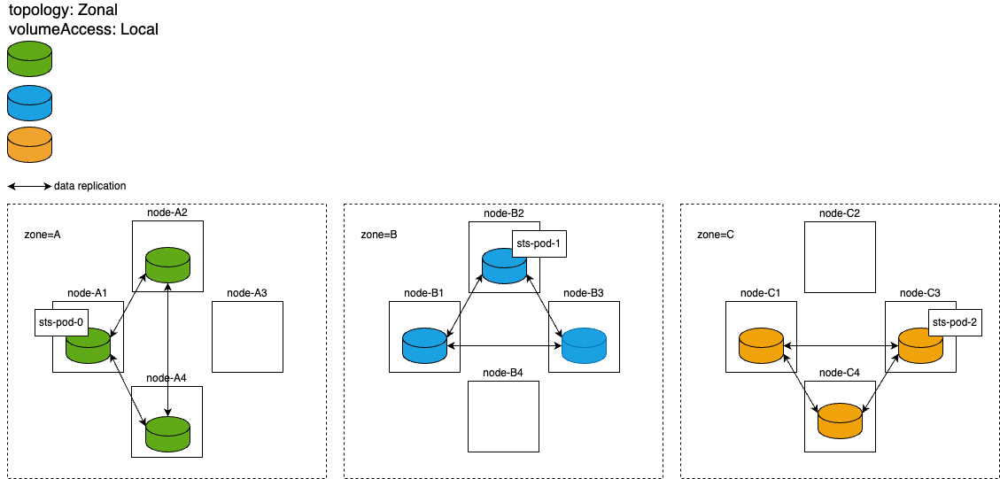
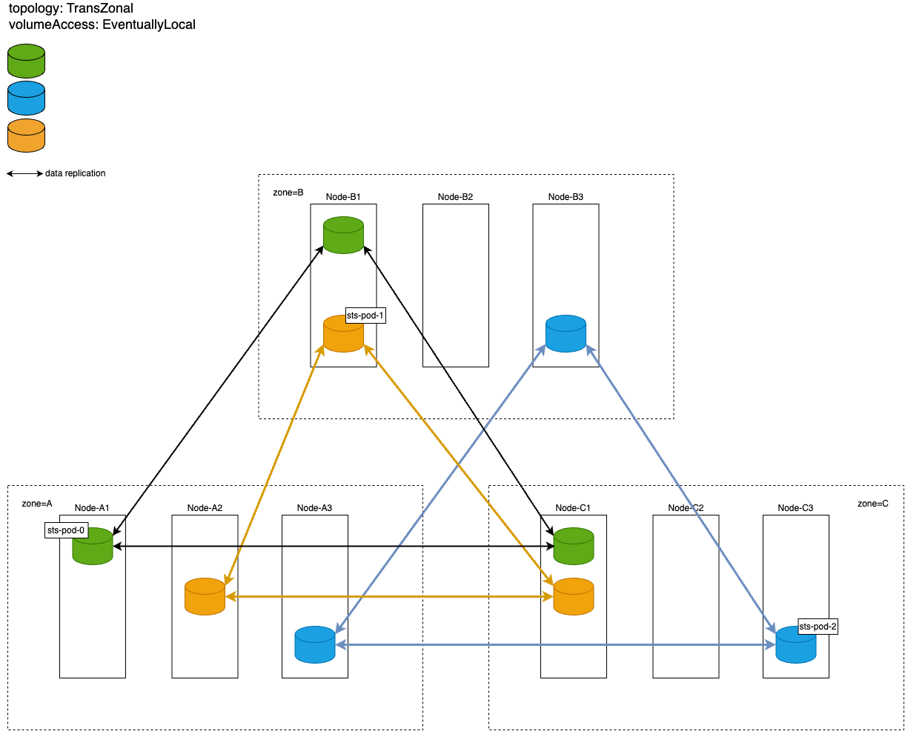


The module is guaranteed to work only in the following cases:
- if stock kernels shipped with the [supported distributions](https://deckhouse.io/documentation/v1/supported_versions.html#linux) are used;
- if a 10 Gbps network is used.

As for any other configurations, the module may work, but its smooth operation is not guaranteed.


## Zonal StorageClass with prohibited access to data over the network and high data redundancy

- An example of a `DRBDStorageClass` resource:
  
```yaml
apiVersion: storage.deckhouse.io/v1alpha1
kind: DRBDStorageClass
metadata:
  name: zonal-storage-class
spec:
  storagePool: storage-pool-name
  volumeAccess: Local
  reclaimPolicy: Delete
  topology: Zonal
```

- Parameters of the StorageClass to be created:

  - Number of data replicas per volume: 3.
  - All volume replicas are created in the same zone to which the scheduler has scheduled the pod that uses that volume.
  - No data can be accessed over the network: pods can only be created on the nodes where the data replica resides.

- Volume replica layout for a single `StatefulSet`:


- Recommendations on how to use a zonal StorageClass:

  - Use it for StatefulSets made up of multiple pods, where the unavailability of one pod along with all data does not cause performance degradation or loss of important data if a single zone crashes. An example would be database clusters with configured high-level replication at the database level.
  
  - For StatefulSets, it is recommended to use antiaffinity rules of the `requiredDuringSchedulingIgnoredDuringExecution` type and `topologyKey: topology.kubernetes.io/zone` so that pods are evenly distributed across zones (one pod per zone).
  
  - This StorageClass is suitable for cases where you want to minimize traffic between zones, especially when network latency is high and/or data rates are low. Setting the `topology` parameter to `Zonal` eliminates cross-zone replication, significantly reducing traffic between zones compared to the `TransZonal` topology.

  - This StorageClass is best suited for cases where high read speeds are essential, as the data is always on the local disk. This is achieved by the `volumeAccess` parameter set to `Local`, which prevents pods from being created on nodes with no local volume replica and data access over the network.

> **Caution!** Regardless of the StorageClass settings, pods cannot be moved to zones without data replicas. This restricts the use of a zonal StorageClass: a pod cannot be rescheduled to another zone (even in case of a crash) from the zone where it was originally created.

## Trans-zonal StorageClass with high data redundancy and gradual creation of local replicas

- An example of a `DRBDStorageClass` resource:

```yaml
apiVersion: storage.deckhouse.io/v1alpha1
kind: DRBDStorageClass
metadata:
  name: trans-zonal-storage-class
spec:
  storagePool: storage-pool-name
  volumeAccess: EventuallyLocal
  reclaimPolicy: Delete
  topology: TransZonal
  zones:
  - zone-a
  - zone-b
  - zone-c
```

- Parameters of the StorageClass to be created:

  - Number of data replicas per volume: 3.
  - Volume replicas are distributed across the specified cluster zones, with one replica per zone.
  - Access to data over the network is permitted: pods can be created on nodes that do not have a local volume replica. If this is the case, 30 minutes after creating a pod on such a node, the process of populating a local volume replica will commence, which involves copying all volume data from other replicas to this node over the network. This enables flexibility in pod distribution — if a node with a local replica crashes, the pod can be rescheduled to a worker node without local data, and after 30 minutes the data will start replicating to that node. However, this may result in a temporary increase in network traffic between zones (as the data will be retrieved from replicas in other zones) and a temporary decrease in read rates (since the data initially can only be accessed over the network).

- Volume replica layout:


- Recommendations on how to use a trans-zonal StorageClass:

  - A StatefulSet that consists of multiple pods, where the unavailability of one pod along with all its data may result in performance degradation and/or loss of important data. Critical services are an example of the perfect use case for such a StatefulSet. In these services, each pod stores its unique state locally, and there is no replication of this state between different pods.

  - For such a StatefulSet, it is recommended to use podAntiAffinity rules with the `preferredDuringSchedulingIgnoredDuringExecution` type and `topologyKey: topology.kubernetes.io/zone` type. In this case, if the cluster is stable and resources are sufficient in each zone, pods will be distributed to different zones — one per zone. If one of the zones is down, the pods will automatically migrate to a running zone where other pods of the same StatefulSet already exist. This helps prevent performance degradation and/or data loss. However, the disadvantage of such podAntiAffinity is that if only one node with a local replica fails in some zone, then the pod will most likely migrate to a node in another zone with an existing local replica rather than to a node without a local replica in the same zone and commence populating a local replica 30 minutes later.

  - This StorageClass is only recommended if there is a high bandwidth (10 Gbps) and low ping (less than 25 ms) network connection between zones, and if there is no need to minimize network traffic between zones. Setting the `topology` parameter to `TransZonal` activates trans-zonal replication, which results in a significant increase in traffic between zones as compared to the `Zonal` value for the same parameter.

  - This StorageClass is recommended if high write rates are not considered a priority. The synchronous replication protocol used in DRBD treats a read operation as completed only after receiving confirmation from all replicas of a successful write to the local disk. With three replicas distributed across different zones, the write latency will be higher than with a zonal StorageClass. The exception to this is when the network parameters within a zone and between the zones are similar.

> **Caution!** Regardless of the StorageClass settings, you cannot migrate pods to zones without data replicas. This imposes a restriction on the use of trans-zonal StorageClass: a pod cannot be moved to a zone that is not specified in the spec.zones of the trans-zonal StorageClass configuration.
