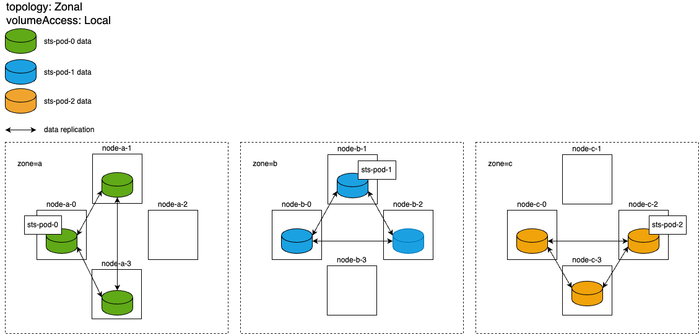
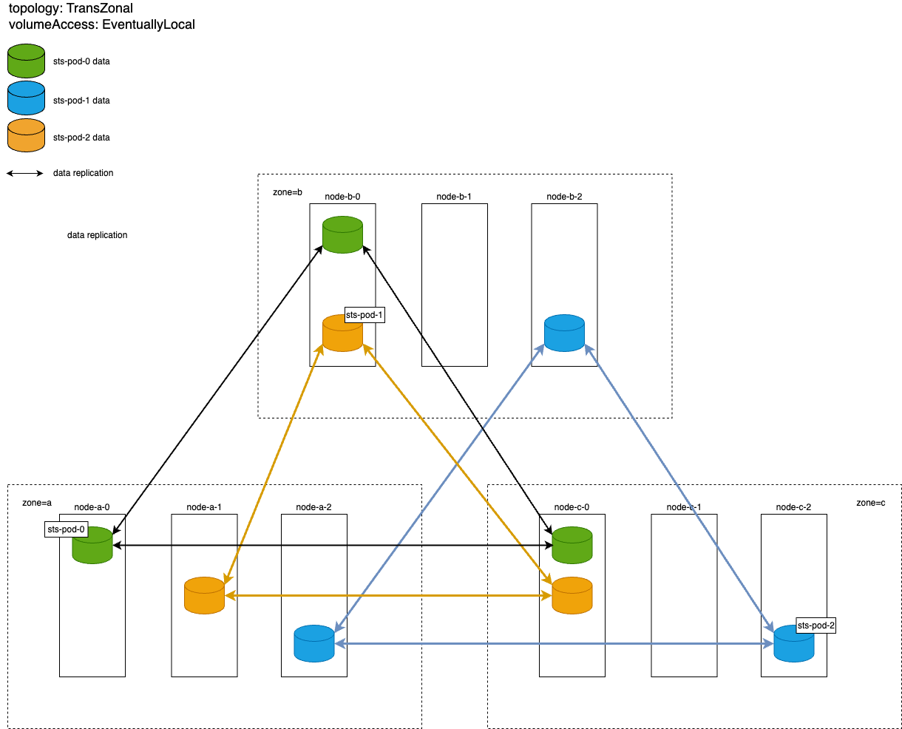


Переключитесь на использование модуля [sds-replicated-volume](https://deckhouse.ru/modules/sds-replicated-volume/stable/).



Работоспособность модуля гарантируется только в следующих случаях:
- при использовании стоковых ядер, поставляемых вместе с [поддерживаемыми дистрибутивами](https://deckhouse.ru/documentation/v1/supported_versions.html#linux);
- при использовании сети 10Gbps.

Работоспособность модуля в других условиях возможна, но не гарантируется.


## Зональный StorageClass с запретом доступа к данным по сети и высокой степенью резервирования данных

- Пример ресурса `DRBDStorageClass`:

```yaml
apiVersion: storage.deckhouse.io/v1alpha1
kind: DRBDStorageClass
metadata:
  name: zonal-storage-class
spec:
  storagePool: storage-pool-name
  volumeAccess: Local
  reclaimPolicy: Delete
  topology: Zonal
```

- Параметры создаваемого StorageClass:

  - Количество реплик с данными для одного тома: 3.
  - Все реплики тома создаются в той же зоне, которую планировщик выбрал для размещения пода, использующего данный том.
  - Доступ к данным по сети запрещен: поды могут создаваться только на тех узлах, где находится реплика с данными.

- Схема размещения реплик томов для одного `StatefulSet`:


- Рекомендации по использованию зонального StorageClass:

  - Используйте для StatefulSet, состоящего из нескольких подов, где недоступность одного пода вместе со всеми данными не вызывает деградацию производительности или потерю важных данных при аварии в одной зоне. Примером могут служить кластеры баз данных с настроенной высокоуровневой репликацией на уровне БД.
  
  - Для StatefulSet рекомендуется использовать правила antiaffinity с типом `requiredDuringSchedulingIgnoredDuringExecution` и `topologyKey: topology.kubernetes.io/zone`, чтобы поды были равномерно распределены по зонам (по одному поду на зону).
  
  - Этот StorageClass подходит для ситуаций, когда необходимо минимизировать трафик между зонами, особенно при высоких задержках в сети и/или низкой скорости передачи данных. Установка параметра `topology` в значение `Zonal` исключает межзональную репликацию, что существенно уменьшает трафик между зонами по сравнению с топологией `TransZonal`.

  - Оптимален для ситуаций, где требуется высокая скорость чтения, так как данные всегда находятся на локальном диске. Это достигается за счет параметра `volumeAccess`, установленного в `Local`, что предотвращает создание подов на узлах без локальной реплики тома и доступ к данным по сети.

> **Важно!** Независимо от настроек StorageClass, перемещать поды в зоны без реплик данных запрещено. Это ограничивает использование зонального StorageClass: под не может быть перемещен в другую зону (даже в случае аварии) из той, где он был первоначально создан.

## Межзональный StorageClass с высокой степенью резервирования данных и постепенным созданием локальных реплик

- Пример ресурса `DRBDStorageClass`:

```yaml
apiVersion: storage.deckhouse.io/v1alpha1
kind: DRBDStorageClass
metadata:
  name: trans-zonal-storage-class
spec:
  storagePool: storage-pool-name
  volumeAccess: EventuallyLocal
  reclaimPolicy: Delete
  topology: TransZonal
  zones:
  - zone-a
  - zone-b
  - zone-c
```

- Параметры создаваемого StorageClass:

  - Количество реплик с данными для одного тома: 3.
  - Реплики тома распределены по указанным зонам кластера, по одной реплике в каждой зоне.
  - Доступ к данным через сеть разрешен: поды могут быть созданы на узлах, где отсутствует локальная реплика тома. При этом через 30 минут после создания пода на таком узле начнется процесс создания локальной реплики тома, который включает в себя копирование всех данных тома с других реплик на этот узел по сети. Это обеспечивает гибкость в распределении подов - в случае аварии на узле с локальной репликой под может быть перемещен на рабочий узел даже без локальных данных, и через 30 минут данные начнут копироваться на этот узел. Однако это может привести к временному увеличению сетевого трафика между зонами (так как данные будут получены с реплик в других зонах) и временному снижению скорости чтения (пока данные доступны только через сеть).

- Схема размещения реплик томов:


- Рекомендации по использованию межзонального StorageClass:

  - StatefulSet, состоящий из нескольких подов, где недоступность одного пода вместе со всеми его данными может вызвать деградацию производительности и/или потерю важных данных. Примером подходящего использования такого StatefulSet являются критические сервисы, в которых каждый под сохраняет свое уникальное состояние (state) локально и где не происходит репликации этого состояния между разными подами.

  - Для StatefulSet рекомендуется использовать правила podAntiAffinity с типом `preferredDuringSchedulingIgnoredDuringExecution` и `topologyKey: topology.kubernetes.io/zone`. В таком случае, при стабильной работе кластера и достаточности ресурсов в каждой зоне, поды будут распределены по разным зонам, по одному в каждой зоне. В случае потери одной из зон поды автоматически переедут в работающую зону, где уже существуют другие поды этого же StatefulSet. Это помогает предотвратить деградацию производительности и/или потерю данных. Однако недостаток подобного podAntiAffinity заключается в том, что если в одной зоне выйдет из строя только один узел с локальной репликой, тогда под предпочтет переехать на узел в другой зоне с существующей локальной репликой, а не на узел без локальной реплики в той же зоне, где могло бы начаться создание локальной реплики спустя 30 минут.

  - Этот StorageClass рекомендуется использовать, только если сетевое соединение между зонами обладает высокой пропускной способностью (10 Gbps) и низким пингом (менее 25 мс), а также когда нет необходимости минимизировать сетевой трафик между зонами. Установка параметра `topology` в `TransZonal` активирует межзональную репликацию, что приводит к значительному увеличению трафика между зонами по сравнению с использованием значения `Zonal` для этого же параметра.

  - Данный StorageClass рекомендуется использовать, если высокая скорость записи не является приоритетной. Используемый в DRBD синхронный протокол репликации требует, чтобы операция чтения завершалась только после получения подтверждения от всех реплик о успешной записи на локальный диск. При наличии трех реплик, распределенных между разными зонами, задержка записи будет выше, чем при использовании зонального StorageClass. Исключением может быть ситуация, когда сетевые параметры внутри зоны и между зонами сопоставимы.

> **Важно!** Независимо от настроек StorageClass, перемещать поды в зоны без реплик данных запрещено. Это накладывает ограничение на использование межзонального StorageClass: под не сможет быть перемещен в зону, не указанную в spec.zones конфигурации межзонального StorageClass.
