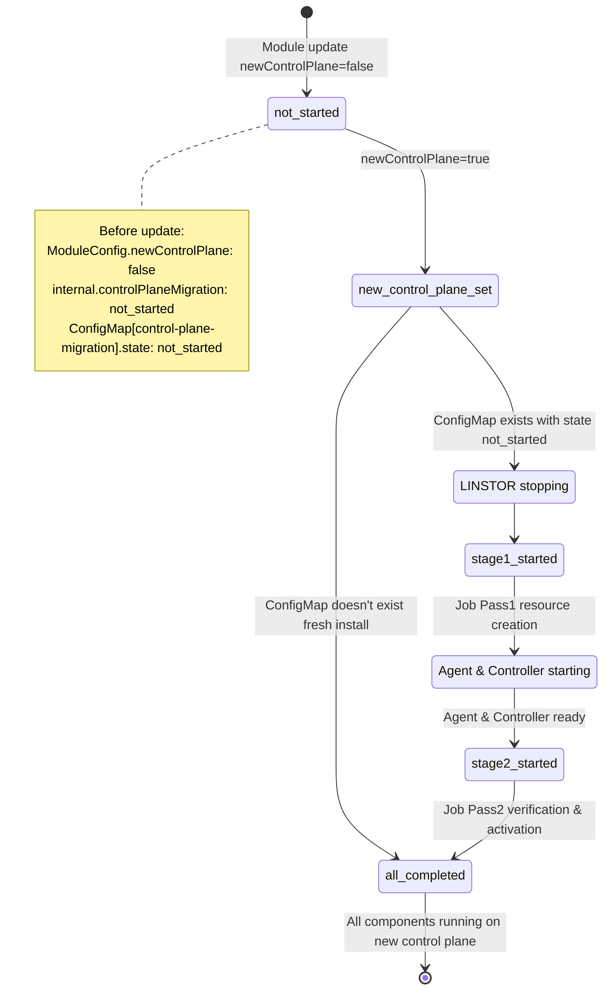
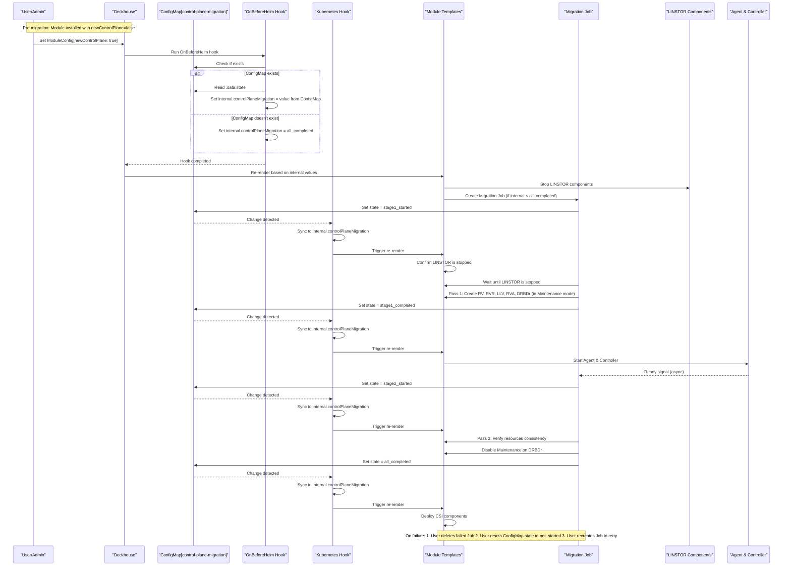

# Control-Plane Migration Process

## Overview

Migration from LINSTOR to the new control-plane in the sds-replicated-volume module. 

### High-level approach
- Control plane migration state is stored in ConfigMap
- OnBeforeHelm hook reads state from ConfigMap and writes to internal values
- Kubernetes hook watches ConfigMap and updates internal values to trigger module template re-renders
- Components deployment depends on the state of ModuleConfig[newControlPlane] and sdsReplicatedVolume.internal.controlPlaneMigration

## State Diagram (High-Level Migration Flow)




## Migration Job Sequence



## Summary Table

| Phase | ConfigMap.state | internal.controlPlaneMigration | LINSTOR | Agent/Controller | CSI | Migration Job | Notes |
|-------|-----------------|--------------------------------|---------|------------------|-----|---------------|-------|
| Initial (newControlPlane=false) | not_started | not_started | Running | Running | Running | Not created | Normal LINSTOR operation |
| Triggered (fresh install) | - | all_completed | Stopped | Running | Running | Not created | New install - no migration needed |
| Stage 1 Ready | not_started | stage1_started | N/A | N/A | N/A | Starting | LINSTOR to be stopped before Pass 1 |
| Stage 1 Started | stage1_started | stage1_started | Stopped | Waiting | Waiting | Running Pass 1 | Pass 1: Create resources in Maintenance |
| Stage 1 Completed | stage1_completed | stage1_completed | Stopped | Starting | Waiting | Waiting for readiness | Resources created, waiting for Agent/Controller |
| Stage 2 Started | stage2_started | stage2_started | Stopped | Running | Waiting | Running Pass 2 | Pass 2: Verify consistency |
| All Completed | all_completed | all_completed | Stopped | Running | Running | Completed | Migration finished, new control plane active |

## Recovery Procedure

If migration Job fails:

1. Delete failed Job:
   ```bash
   kubectl delete job <migration-job> -n d8-sds-replicated-volume
   ```

2. Reset ConfigMap state:
   ```bash
   kubectl patch configmap control-plane-migration \
     -n d8-sds-replicated-volume \
     -p '{"data":{"state":"not_started"}}'
   ```

3. Recreate Job to retry migration.