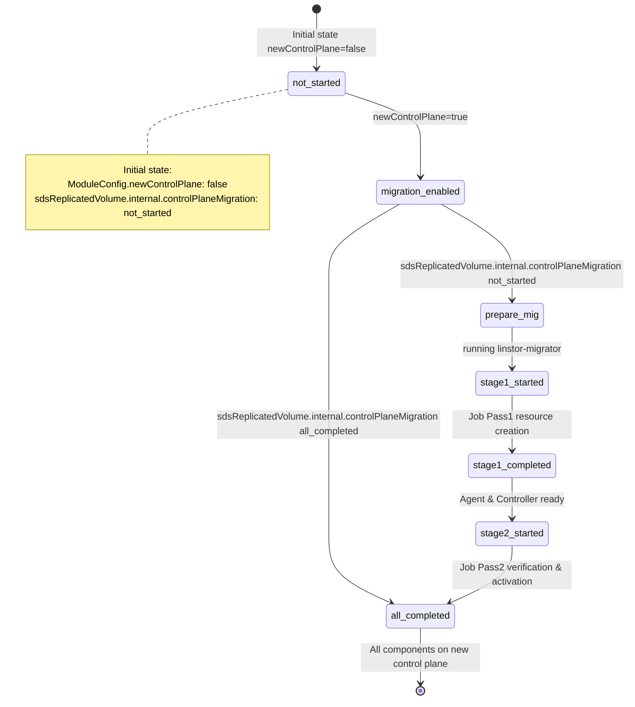
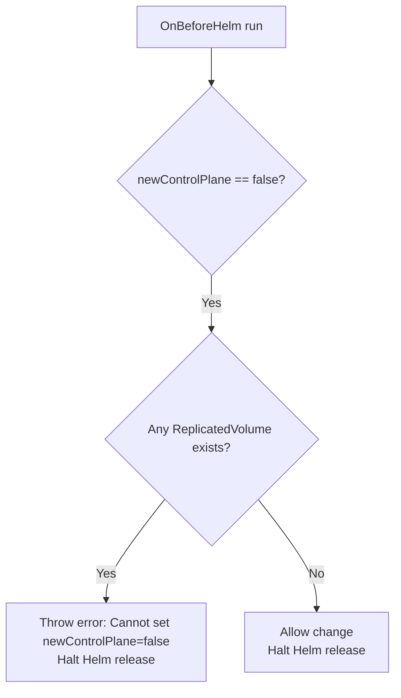
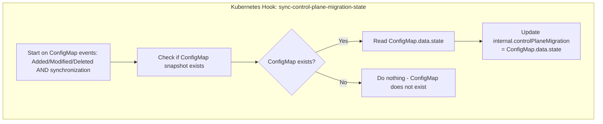

# Control-Plane Migration Process

## Overview

Migration from LINSTOR to the new control-plane in the sds-replicated-volume module. 

### High-level approach
- Control plane migration state is stored in ConfigMap
- OnBeforeHelm hook ('guard-against-reset-newControlPlane') prevents setting ModuleConfig[newControlPlane] to false if ReplicatedVolume resources exist
- Kubernetes hook ('sync-control-plane-migration-state') watches control-plane-migration ConfigMap and updates internal values to trigger module template re-renders (runs on every module reconciliation)
- Components deployment depends on the state of ModuleConfig[newControlPlane] and sdsReplicatedVolume.internal.controlPlaneMigration

## State Diagram (High-Level Migration Flow)


```mermaid
stateDiagram-v2
    [*] --> not_started : Initial state newControlPlane=false
    not_started --> migration_enabled : newControlPlane=true
    migration_enabled --> all_completed : sdsReplicatedVolume.internal.controlPlaneMigration all_completed
    migration_enabled --> prepare_mig : sdsReplicatedVolume.internal.controlPlaneMigration not_started
    prepare_mig --> stage1_started : running linstor-migrator
    stage1_started --> stage1_completed : Job Pass1 resource creation
    stage1_completed --> stage2_started : Agent & Controller ready
    stage2_started --> all_completed : Job Pass2 verification & activation
    all_completed --> [*] : All components on new control plane

    note right of not_started
      Initial state:
        ModuleConfig.newControlPlane: false
        sdsReplicatedVolume.internal.controlPlaneMigration: not_started
    end note
```

## Hooks Implementation

### OnBeforeHelm Hook ('guard-against-reset-newControlPlane')

The OnBeforeHelm hook serves as a protection mechanism that prevents accidentally reverting to the old control-plane:


```mermaid
flowchart TD
    A[OnBeforeHelm run] --> B{newControlPlane == false?}
    B -->|Yes| C{Any ReplicatedVolume exists?}
    C -->|Yes| D[Throw error: Cannot set newControlPlane=false\nHalt Helm release]
    C -->|No| E[Allow change\nHalt Helm release]
```

### Kubernetes Hook ('sync-control-plane-migration-state')

The Kubernetes hook handles synchronization of the migration state:


```mermaid
flowchart TB
    subgraph "Kubernetes Hook: sync-control-plane-migration-state"
        start["Start on ConfigMap events: Added/Modified/Deleted AND synchronization"]
        has_snapshot["Check if ConfigMap snapshot exists"]
        decision1{"ConfigMap exists?"}
        read_state["Read ConfigMap.data.state"]
        update_internal["Update internal.controlPlaneMigration\n= ConfigMap.data.state"]
        do_nothing["Do nothing - ConfigMap does not exist"]
        
        start --> has_snapshot --> decision1
        decision1 -->|Yes| read_state --> update_internal
        decision1 -->|No| do_nothing
    end
```


## Summary Table

| Phase | ConfigMap.state | internal.controlPlaneMigration | LINSTOR/CSI | Agent/Controller | CSI | Migration Job | Notes |
|-------|-----------------|--------------------------------|---------|------------------|-----|---------------|-------|
| Initial (newControlPlane=false) | not_started | not_started | Running | Stopped | Running | Not created | Normal LINSTOR operation |
| Fresh Install (newControlPlane=true, already completed) | all_completed | all_completed | Stopped | Running | Running | Not created | New install - no migration needed |
| Stage 1 Started | stage1_started | stage1_started | Stopped | Waiting | Waiting | Running Pass 1 | Pass 1: Create resources in Maintenance |
| Stage 1 Completed | stage1_completed | stage1_completed | Stopped | Starting | Waiting | Waiting for readiness | Resources created, waiting for Agent/Controller |
| Stage 2 Started | stage2_started | stage2_started | Stopped | Running | Waiting | Running Pass 2 | Pass 2: Verify consistency |
| All Completed | all_completed | all_completed | Stopped | Running | Running | Completed | Migration finished, new control plane active |

## Recovery Procedure

If migration Job fails:

1. Delete the failed Job:
   ```bash
   kubectl delete job <migration-job> -n d8-sds-replicated-volume
   ```

2. Delete the existing ConfigMap (if it exists):
   ```bash
   kubectl delete configmap control-plane-migration -n d8-sds-replicated-volume
   ```

3. Recreate the ConfigMap with the desired state:
   ```bash
   cat <<EOF | kubectl apply -f -
   apiVersion: v1
   kind: ConfigMap
   metadata:
     name: control-plane-migration
     namespace: d8-sds-replicated-volume
   data:
     state: not_started
   EOF
   ```

4. The hook will detect the new ConfigMap state and allow the module templates to recreate the Job to retry migration.

## Important Notes

- The Kubernetes hook does NOT automatically recreate the ConfigMap when it is deleted.
- If the ConfigMap is deleted, the internal state value remains unchanged until a new ConfigMap is created manually.
- The ExecuteHookOnSynchronization is enabled (set to true), ensuring the hook runs during initial synchronization and captures the ConfigMap state properly.
