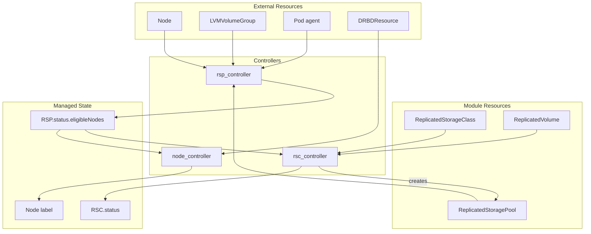
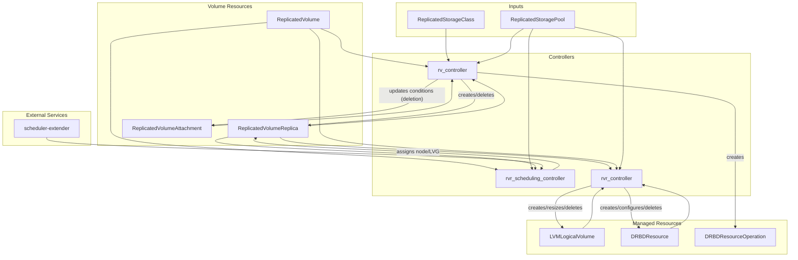

# sds-replicated-volume-controller

This binary contains controllers for managing replicated storage resources.

## Controllers

### Storage Infrastructure Controllers

These controllers are tightly coupled and manage storage class configuration and node eligibility.

| Controller | Primary Resource | Purpose |
|------------|------------------|---------|
| [rsp_controller](internal/controllers/rsp_controller/README.md) | ReplicatedStoragePool | Calculates eligible nodes from LVGs, Nodes, and agent Pods |
| [rsc_controller](internal/controllers/rsc_controller/README.md) | ReplicatedStorageClass | Manages RSP, validates configuration, aggregates volume stats |
| [node_controller](internal/controllers/node_controller/README.md) | Node | Manages agent node labels based on RSP eligibility and DRBDResources |

### Volume Lifecycle Controllers

These controllers manage the full volume lifecycle — from datamesh formation to individual replica management.

| Controller | Primary Resource | Purpose |
|------------|------------------|---------|
| [rv_controller](internal/controllers/rv_controller/README.md) | ReplicatedVolume | Orchestrates datamesh formation, manages configuration, deletion |
| [rvr_scheduling_controller](internal/controllers/rvr_scheduling_controller/README.md) | ReplicatedVolume | Assigns nodes/LVGs to unscheduled replicas based on topology and storage capacity |
| [rvr_controller](internal/controllers/rvr_controller/README.md) | ReplicatedVolumeReplica | Manages backing volumes (LLV), DRBD resources, and reports replica status |

## Architecture

### Storage Infrastructure



### Volume Lifecycle



## Dependency Chains

### Storage Infrastructure Chain

Controllers have a logical dependency order:

1. **rsp_controller** — runs first, aggregates external resources into `RSP.status.eligibleNodes`
2. **rsc_controller** — depends on RSP status for configuration validation
3. **node_controller** — depends on RSP status for node label decisions

Each controller reconciles independently, reacting to changes in its watched resources.

### Volume Lifecycle Chain

The volume lifecycle controllers form a chain that connects storage infrastructure to physical DRBD resources:

```
(RSC + RSP) → RV (rv_controller) → RVR (rvr_scheduling_controller) → RVR (rvr_controller) → (LLV, DRBDResource)
```

1. **rv_controller** — reads RSC configuration and RSP eligible nodes; orchestrates datamesh formation (3-phase: preconfigure, establish connectivity, bootstrap data); manages RVR creation/deletion and RV status
2. **rvr_scheduling_controller** — assigns nodes and LVGs to unscheduled RVRs using topology-aware placement and scheduler-extender capacity scoring
3. **rvr_controller** — manages backing volumes (LVMLogicalVolume) and DRBD resources (DRBDResource) for each replica; reports replica conditions and status

Each controller reconciles independently, reacting to changes in its watched resources.
