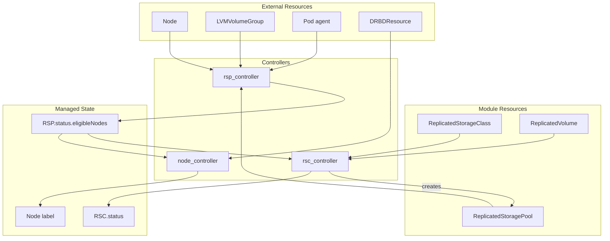
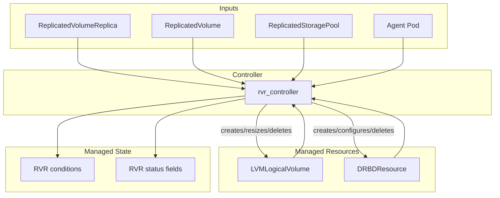

# sds-replicated-volume-controller

This binary contains controllers for managing replicated storage resources.

## Controllers

### Storage Infrastructure Controllers

These controllers are tightly coupled and manage storage class configuration and node eligibility.

| Controller | Primary Resource | Purpose |
|------------|------------------|---------|
| [rsp_controller](internal/controllers/rsp_controller/README.md) | ReplicatedStoragePool | Calculates eligible nodes from LVGs, Nodes, and agent Pods |
| [rsc_controller](internal/controllers/rsc_controller/README.md) | ReplicatedStorageClass | Manages RSP, validates configuration, aggregates volume stats |
| [node_controller](internal/controllers/node_controller/README.md) | Node | Manages agent node labels based on RSP eligibility and DRBDResources |

### Volume Replica Controller

This controller operates separately from the infrastructure controllers, managing individual volume replicas and their backing storage.

| Controller | Primary Resource | Purpose |
|------------|------------------|---------|
| [rvr_controller](internal/controllers/rvr_controller/README.md) | ReplicatedVolumeReplica | Manages backing volumes (LLV), DRBD resources, and reports replica status |

## Architecture

### Storage Infrastructure



### Volume Replica



## Dependency Chains

### Storage Infrastructure Chain

Controllers have a logical dependency order:

1. **rsp_controller** — runs first, aggregates external resources into `RSP.status.eligibleNodes`
2. **rsc_controller** — depends on RSP status for configuration validation
3. **node_controller** — depends on RSP status for node label decisions

Each controller reconciles independently, reacting to changes in its watched resources.

### Volume Replica Chain

Currently, `rvr_controller` operates as a standalone controller, managing:

- **LVMLogicalVolume** — backing storage for diskful replicas
- **DRBDResource** — DRBD configuration and lifecycle management
- **RVR status** — conditions (BackingVolumeReady, Configured, Attached, BackingVolumeUpToDate, FullyConnected, Ready, SatisfyEligibleNodes) and status fields (peers, quorum, device state)

### Future Architecture

When `rv_controller` is fully implemented, the complete dependency chain will be:

```
(RSC + RSP) → RV → RVR → (LLV, DRBDResource)
```

This will connect the storage infrastructure layer with the volume replica layer through ReplicatedVolume.
