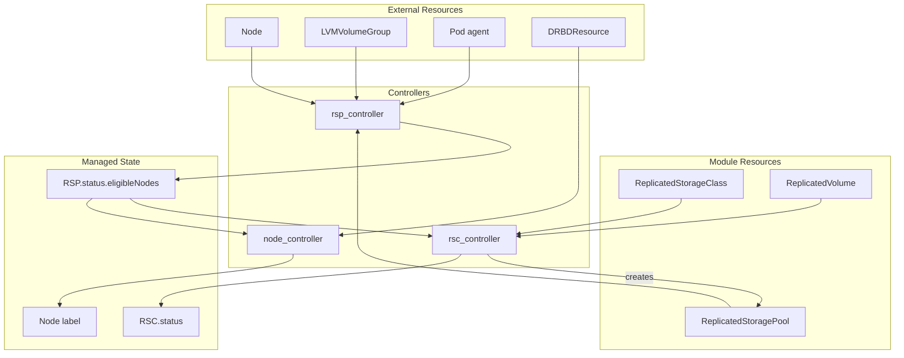

# sds-replicated-volume-controller

This binary contains controllers for managing replicated storage resources.

## Controllers

| Controller | Primary Resource | Purpose |
|------------|------------------|---------|
| [rsp_controller](internal/controllers/rsp_controller/README.md) | ReplicatedStoragePool | Calculates eligible nodes from LVGs, Nodes, and agent Pods |
| [rsc_controller](internal/controllers/rsc_controller/README.md) | ReplicatedStorageClass | Manages RSP, validates configuration, aggregates volume stats |
| [node_controller](internal/controllers/node_controller/README.md) | Node | Manages agent node labels based on RSP eligibility and DRBDResources |

## Architecture

## Dependency Chain

Controllers have a logical dependency order:

1. **rsp_controller** — runs first, aggregates external resources into `RSP.status.eligibleNodes`
2. **rsc_controller** — depends on RSP status for configuration validation
3. **node_controller** — depends on RSP status for node label decisions

Each controller reconciles independently, reacting to changes in its watched resources.
