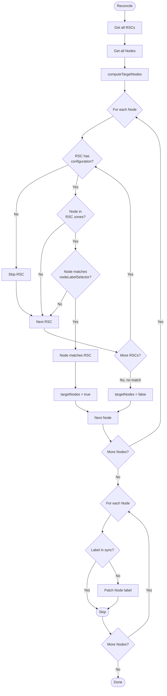
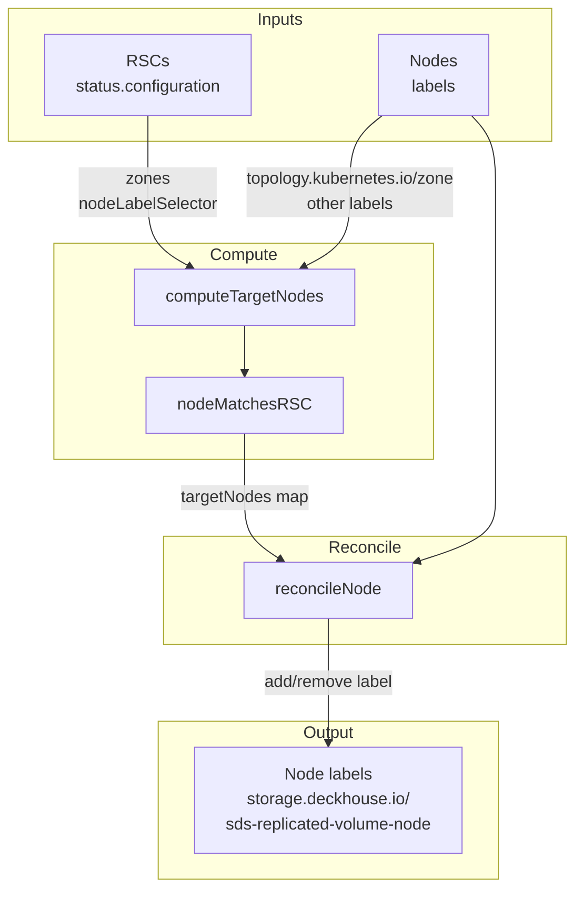

# node_controller

This controller manages the `storage.deckhouse.io/sds-replicated-volume-node` label on cluster nodes.

## Purpose

The `storage.deckhouse.io/sds-replicated-volume-node` label determines which nodes should run the sds-replicated-volume agent.
The controller automatically adds this label to nodes that match at least one `ReplicatedStorageClass` (RSC),
and removes it from nodes that do not match any RSC.

## Reconciliation Structure

```
Reconcile (root)
├── getRSCs             — fetch all RSCs
├── getNodes            — fetch all Nodes
├── computeTargetNodes  — compute which nodes should have the label
└── reconcileNode       — per-node label reconciliation (loop)
```

## Algorithm

The controller uses the **resolved configuration** from `rsc.status.configuration` (not `rsc.spec`).
RSCs that do not yet have a configuration are skipped.

A node is considered matching an RSC if **both** conditions are met (AND):

1. **Zones**: if the RSC configuration has `zones` specified — the node's `topology.kubernetes.io/zone` label must be in that list;
   if `zones` is not specified — the condition is satisfied for any node.

2. **NodeLabelSelector**: if the RSC configuration has `nodeLabelSelector` specified — the node must match this selector;
   if `nodeLabelSelector` is not specified — the condition is satisfied for any node.

An RSC configuration without `zones` and without `nodeLabelSelector` matches all cluster nodes.

A node receives the label if it matches at least one RSC (OR between RSCs).

## Algorithm Flow



## Data Flow


