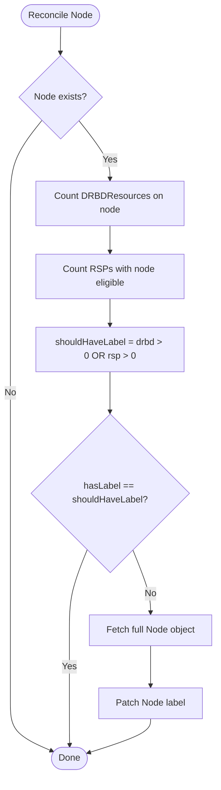
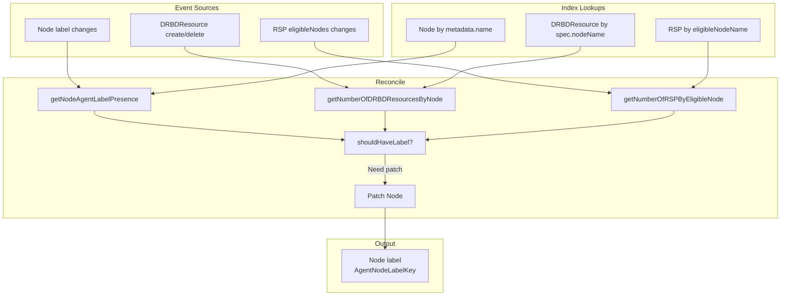

# node_controller

This controller manages the `storage.deckhouse.io/sds-replicated-volume-node` label on cluster nodes.

## Purpose

The `storage.deckhouse.io/sds-replicated-volume-node` label determines which nodes should run the sds-replicated-volume agent.
The controller automatically adds this label to nodes that are in at least one `ReplicatedStoragePool` (RSP) `eligibleNodes` list,
and removes it from nodes that are not in any RSP's `eligibleNodes`.

**Important**: The label is also preserved on nodes that have at least one `DRBDResource`,
even if the node is not in any RSP's `eligibleNodes`. This prevents orphaning DRBD resources when RSP configuration changes.

## Interactions

| Direction | Resource/Controller | Relationship |
|-----------|---------------------|--------------|
| ← input | rsp_controller | Reads `RSP.Status.EligibleNodes` to decide node labels |
| ← input | DRBDResource | Reads presence of DRBDResources to preserve labels |
| → output | Node | Manages `AgentNodeLabelKey` label |

## Algorithm

A node receives the label if **at least one** of the following conditions is met (OR):

1. **RSP Eligibility**: The node is in at least one `ReplicatedStoragePool`'s `status.eligibleNodes` list.
2. **DRBDResource Presence**: The node has at least one `DRBDResource` (`spec.nodeName == node.Name`).

```
shouldHaveLabel = (rspCount > 0) OR (drbdCount > 0)
```

## Reconciliation Structure

The controller reconciles individual nodes (not a singleton):

```
Reconcile(nodeName)
├── getNodeAgentLabelPresence  — check if node exists and has label (index lookup)
├── getNumberOfDRBDResourcesByNode — count DRBDResources on node (index lookup)
├── getNumberOfRSPByEligibleNode — count RSPs with this node eligible (index lookup)
├── if hasLabel == shouldHaveLabel → Done (no patch needed)
├── getNode — fetch full node object
└── Patch node label (add or remove)
```

## Algorithm Flow



## Managed Metadata

| Type | Key | Managed On | Purpose |
|------|-----|------------|---------|
| Label | `storage.deckhouse.io/sds-replicated-volume-node` | Node | Mark nodes that should run the agent |

## Watches

The controller watches three event sources:

| Resource | Events | Handler |
|----------|--------|---------|
| Node | Create, Update | Reacts to `AgentNodeLabelKey` presence changes |
| ReplicatedStoragePool | Create, Update, Delete | Reacts to `eligibleNodes` changes (delta computation) |
| DRBDResource | Create, Delete | Maps to node via `spec.nodeName` |

### RSP Delta Computation

When an RSP's `eligibleNodes` changes, the controller computes the delta (added/removed nodes)
and enqueues reconcile requests only for affected nodes, not for all nodes in the cluster.

## Indexes

| Index | Field | Purpose |
|-------|-------|---------|
| Node by metadata.name | `metadata.name` | Efficient node existence and label check |
| DRBDResource by node | `spec.nodeName` | Count DRBDResources per node |
| RSP by eligible node | `status.eligibleNodes[].nodeName` | Count RSPs where node is eligible |

## Data Flow


