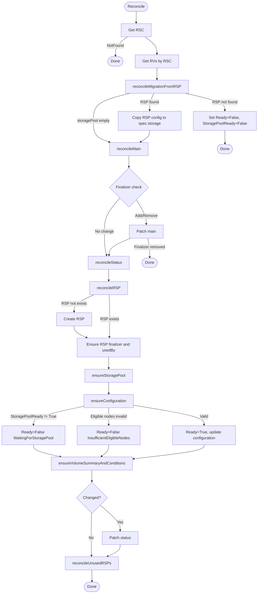
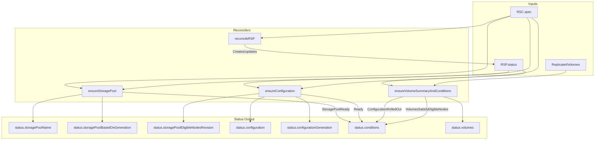

# rsc_controller

This controller manages `ReplicatedStorageClass` (RSC) resources by aggregating status from associated `ReplicatedStoragePool` (RSP) and `ReplicatedVolume` (RV) resources.

## Purpose

The controller reconciles `ReplicatedStorageClass` status with:

1. **Storage pool management** — auto-generates and manages an RSP based on `spec.storage` configuration
2. **Configuration snapshot** — resolved configuration from spec, stored in `status.configuration`
3. **Generations/Revisions** — for quick change detection between RSC and RSP
4. **Conditions** — 4 conditions describing the current state
5. **Volume statistics** — counts of total, aligned, stale, and conflict volumes

> **Note:** RSC does not calculate eligible nodes directly. It uses `RSP.Status.EligibleNodes` from the associated storage pool and validates them against topology/replication requirements.

## Interactions

| Direction | Resource/Controller | Relationship |
|-----------|---------------------|--------------|
| ← input | rsp_controller | Reads `RSP.Status.EligibleNodes` for validation |
| ← input | ReplicatedVolume | Reads RVs for volume statistics |
| → manages | ReplicatedStoragePool | Creates/updates auto-generated RSP |

## Algorithm

The controller creates/updates an RSP from `spec.storage`, validates eligible nodes against topology/replication requirements, and aggregates volume statistics:

```
readiness = storagePoolReady AND eligibleNodesValid
configuration = resolved(spec) if readiness else previous
volumeStats = aggregate(RVs) if allObserved else partial
```

## Reconciliation Structure

```
Reconcile (root) [Pure orchestration]
├── getRSC
├── getSortedRVsByRSC
├── reconcileMigrationFromRSP [Target-state driven]
│   └── migrate spec.storagePool → spec.storage (deprecated field)
├── reconcileMain [Target-state driven]
│   └── finalizer management
├── reconcileStatus [In-place reconciliation]
│   ├── reconcileRSP [Conditional desired evaluation]
│   │   └── create/update auto-generated RSP
│   ├── ensureStoragePool
│   │   └── status.storagePoolName + StoragePoolReady condition
│   ├── ensureConfiguration
│   │   └── status.configuration + Ready condition
│   └── ensureVolumeSummaryAndConditions
│       └── status.volumes + ConfigurationRolledOut/VolumesSatisfyEligibleNodes conditions
└── reconcileUnusedRSPs [Pure orchestration]
    └── reconcileRSPRelease [Conditional desired evaluation]
        └── release RSPs no longer referenced by this RSC
```

## Algorithm Flow



## Conditions

### Ready

Indicates overall readiness of the storage class configuration.

| Status | Reason | When |
|--------|--------|------|
| True | Ready | Configuration accepted and validated |
| False | InvalidConfiguration | Configuration validation failed |
| False | InsufficientEligibleNodes | RSP eligible nodes do not meet topology/replication requirements |
| False | WaitingForStoragePool | Waiting for RSP to become ready |

### StoragePoolReady

Indicates whether the associated storage pool exists and is ready.

| Status | Reason | When |
|--------|--------|------|
| True | Ready | RSP exists and has Ready=True |
| False | StoragePoolNotFound | RSP does not exist (migration from deprecated storagePool field failed) |
| False | Pending | RSP has no Ready condition yet |
| False | (from RSP) | Propagated from RSP.Ready condition |

### ConfigurationRolledOut

Indicates whether all volumes' configuration matches the storage class.

| Status | Reason | When |
|--------|--------|------|
| True | RolledOutToAllVolumes | All RVs have `ConfigurationReady=True` |
| False | ConfigurationRolloutInProgress | Rolling update in progress |
| False | ConfigurationRolloutDisabled | `ConfigurationRolloutStrategy.type=NewVolumesOnly` AND `staleConfiguration > 0` |
| Unknown | NewConfigurationNotYetObserved | Some volumes haven't observed the new configuration yet |

### VolumesSatisfyEligibleNodes

Indicates whether all volumes' replicas are placed on eligible nodes.

| Status | Reason | When |
|--------|--------|------|
| True | AllVolumesSatisfy | All RVs have `SatisfyEligibleNodes=True` |
| False | ConflictResolutionInProgress | Resolution in progress |
| False | ManualConflictResolution | `EligibleNodesConflictResolutionStrategy.type=Manual` AND `inConflictWithEligibleNodes > 0` |
| Unknown | UpdatedEligibleNodesNotYetObserved | Some volumes haven't observed the updated eligible nodes yet |

## Eligible Nodes Validation

RSC does not calculate eligible nodes. The `rsp_controller` calculates them and stores in `RSP.Status.EligibleNodes`.

RSC validates that the eligible nodes from RSP meet replication and topology requirements:

| Replication | Topology | Requirement |
|-------------|----------|-------------|
| None | any | ≥1 node |
| Availability | Ignored/default | ≥3 nodes, ≥2 with disks |
| Availability | TransZonal | ≥3 zones, ≥2 with disks |
| Availability | Zonal | per zone: ≥3 nodes, ≥2 with disks |
| Consistency | Ignored/default | ≥2 nodes with disks |
| Consistency | TransZonal | ≥2 zones with disks |
| Consistency | Zonal | per zone: ≥2 nodes with disks |
| ConsistencyAndAvailability | Ignored/default | ≥3 nodes with disks |
| ConsistencyAndAvailability | TransZonal | ≥3 zones with disks |
| ConsistencyAndAvailability | Zonal | per zone: ≥3 nodes with disks |

If validation fails, RSC sets `Ready=False` with reason `InsufficientEligibleNodes`.

## Volume Statistics

The controller aggregates statistics from all `ReplicatedVolume` resources referencing this RSC:

- **Total** — count of all volumes
- **Aligned** — volumes where both `ConfigurationReady` and `SatisfyEligibleNodes` conditions are `True`
- **StaleConfiguration** — volumes where `ConfigurationReady` is `False`
- **InConflictWithEligibleNodes** — volumes where `SatisfyEligibleNodes` is `False`
- **PendingObservation** — volumes that haven't observed current RSC configuration/eligible nodes
- **UsedStoragePoolNames** — sorted list of storage pool names referenced by volumes

> **Note:** Counters other than `Total` and `PendingObservation` are only computed when all volumes have observed the current configuration.

## Managed Metadata

| Type | Key | Managed On | Purpose |
|------|-----|------------|---------|
| Finalizer | `storage.deckhouse.io/rsc-controller` | RSC | Prevent deletion while RSP exists |
| Finalizer | `storage.deckhouse.io/rsc-controller` | RSP | Prevent deletion while RSC references it |
| Label | `storage.deckhouse.io/rsc-managed-rsp` | RSP | Mark RSP as auto-generated by RSC |
| Annotation | `storage.deckhouse.io/used-by-rsc` | RSP | Track which RSC uses this RSP |

## Watches

| Resource | Events | Handler |
|----------|--------|---------|
| RSC | For() (primary) | — |
| RSP | Generation change, EligibleNodesRevision change, Ready condition change | mapRSPToRSC |
| RV | spec.replicatedStorageClassName change, status.ConfigurationObservedGeneration change, ConfigurationReady/SatisfyEligibleNodes condition changes | rvEventHandler |

## Indexes

| Index | Field | Purpose |
|-------|-------|---------|
| `IndexFieldRSCByStoragePool` | `spec.storagePool` | Find RSCs referencing an RSP (migration from deprecated field) |
| `IndexFieldRSCByStatusStoragePoolName` | `status.storagePoolName` | Find RSCs using an RSP |
| `IndexFieldRVByRSC` | `spec.replicatedStorageClassName` | Find RVs referencing an RSC |

## Data Flow


