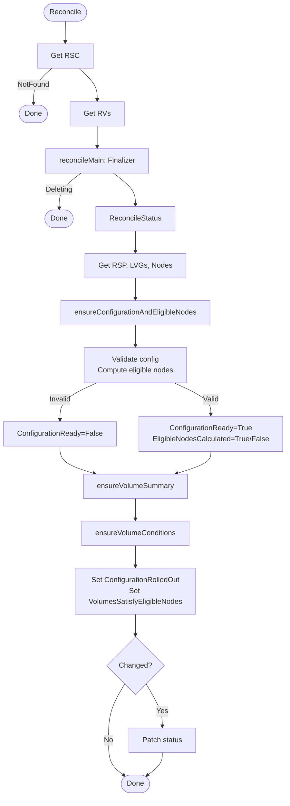
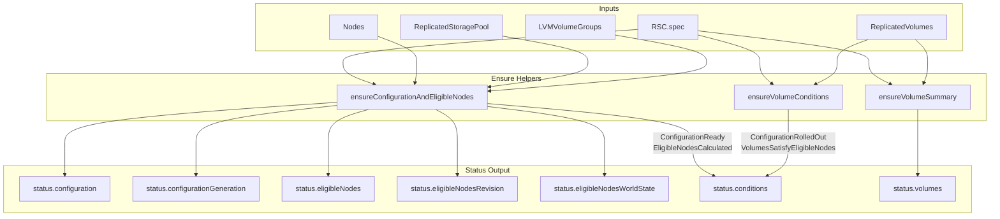

# rsc_controller

This controller manages the `ReplicatedStorageClass` status fields by aggregating information from cluster topology and associated `ReplicatedVolume` resources.

## Purpose

The controller reconciles `ReplicatedStorageClass` status with:

1. **Configuration** — resolved configuration snapshot from spec
2. **Eligible nodes** — nodes that can host volumes of this storage class
3. **Generations/Revisions** — for quick change detection
4. **Conditions** — 4 conditions describing the current state
5. **Volume statistics** — counts of total, aligned, stale, and conflict volumes

## Reconciliation Structure

```
Reconcile (root)
├── reconcileMain      — finalizer management
└── reconcileStatus    — status fields update
    ├── ensureConfigurationAndEligibleNodes
    ├── ensureVolumeSummary
    └── ensureVolumeConditions
```

## Algorithm Flow



## Conditions

### ConfigurationReady

Indicates whether the storage class configuration has been accepted and validated.

| Status | Reason | When |
|--------|--------|------|
| True | Ready | Configuration accepted and saved |
| False | InvalidConfiguration | Configuration validation failed |
| False | EligibleNodesCalculationFailed | Cannot calculate eligible nodes |

### EligibleNodesCalculated

Indicates whether eligible nodes have been calculated for the storage class.

| Status | Reason | When |
|--------|--------|------|
| True | Calculated | Successfully calculated |
| False | InsufficientEligibleNodes | Not enough eligible nodes for replication/topology |
| False | InvalidConfiguration | Configuration is invalid (e.g., bad NodeLabelSelector) |
| False | LVMVolumeGroupNotFound | Referenced LVG not found |
| False | ReplicatedStoragePoolNotFound | RSP not found |
| False | InvalidStoragePoolOrLVG | RSP phase is not Completed or thin pool not found |

### ConfigurationRolledOut

Indicates whether all volumes' configuration matches the storage class.

| Status | Reason | When |
|--------|--------|------|
| True | RolledOutToAllVolumes | All RVs have `ConfigurationReady=True` |
| False | ConfigurationRolloutInProgress | Rolling update in progress |
| False | ConfigurationRolloutDisabled | `ConfigurationRolloutStrategy.type=NewVolumesOnly` AND `staleConfiguration > 0` |
| Unknown | NewConfigurationNotYetObserved | Some volumes haven't observed the new configuration yet |

### VolumesSatisfyEligibleNodes

Indicates whether all volumes' replicas are placed on eligible nodes.

| Status | Reason | When |
|--------|--------|------|
| True | AllVolumesSatisfy | All RVs have `SatisfyEligibleNodes=True` |
| False | ConflictResolutionInProgress | Resolution in progress |
| False | ManualConflictResolution | `EligibleNodesConflictResolutionStrategy.type=Manual` AND `inConflictWithEligibleNodes > 0` |
| Unknown | UpdatedEligibleNodesNotYetObserved | Some volumes haven't observed the updated eligible nodes yet |

## Eligible Nodes Algorithm

A node is considered eligible for an RSC if **all** conditions are met (AND):

1. **Zones** — if the RSC has `zones` specified, the node's `topology.kubernetes.io/zone` label must be in that list; if `zones` is not specified, the condition is satisfied for any node

2. **NodeLabelSelector** — if the RSC has `nodeLabelSelector` specified, the node must match this selector; if not specified, the condition is satisfied for any node

3. **Ready status** — if the node has been `NotReady` longer than `spec.eligibleNodesPolicy.notReadyGracePeriod`, it is excluded from the eligible nodes list

> **Note:** A node does **not** need to have an LVMVolumeGroup to be eligible. Nodes without LVGs can serve as client-only nodes or tiebreaker nodes.

For each eligible node, the controller also records:

- **Unschedulable** flag — from `node.spec.unschedulable`
- **Ready** flag — current node readiness status
- **LVMVolumeGroups** — list of matching LVGs with their unschedulable status (from `storage.deckhouse.io/lvmVolumeGroupUnschedulable` annotation)

### Eligible Nodes Validation

The controller validates that eligible nodes meet replication and topology requirements:

| Replication | Topology | Requirement |
|-------------|----------|-------------|
| None | any | ≥1 node |
| Availability | Ignored/default | ≥3 nodes, ≥2 with disks |
| Availability | TransZonal | ≥3 zones, ≥2 with disks |
| Availability | Zonal | per zone: ≥3 nodes, ≥2 with disks |
| Consistency | Ignored/default | ≥2 nodes with disks |
| Consistency | TransZonal | ≥2 zones with disks |
| Consistency | Zonal | per zone: ≥2 nodes with disks |
| ConsistencyAndAvailability | Ignored/default | ≥3 nodes with disks |
| ConsistencyAndAvailability | TransZonal | ≥3 zones with disks |
| ConsistencyAndAvailability | Zonal | per zone: ≥3 nodes with disks |

## Volume Statistics Algorithm

The controller aggregates statistics from all `ReplicatedVolume` resources referencing this RSC:

- **Total** — count of all volumes
- **Aligned** — volumes where both `ConfigurationReady` and `SatisfyEligibleNodes` conditions are `True`
- **StaleConfiguration** — volumes where `ConfigurationReady` is `False`
- **InConflictWithEligibleNodes** — volumes where `SatisfyEligibleNodes` is `False`
- **PendingObservation** — volumes that haven't observed current RSC configuration/eligible nodes

> **Note:** Counters other than `Total` and `PendingObservation` are only computed when all volumes have observed the current configuration.

## Data Flow


