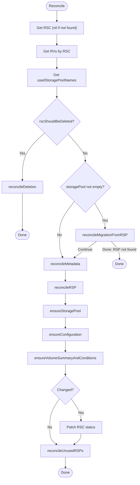
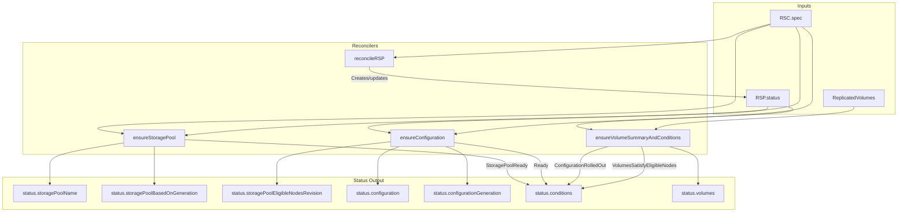
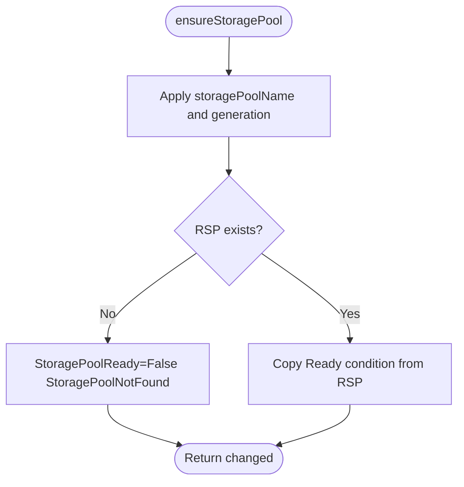
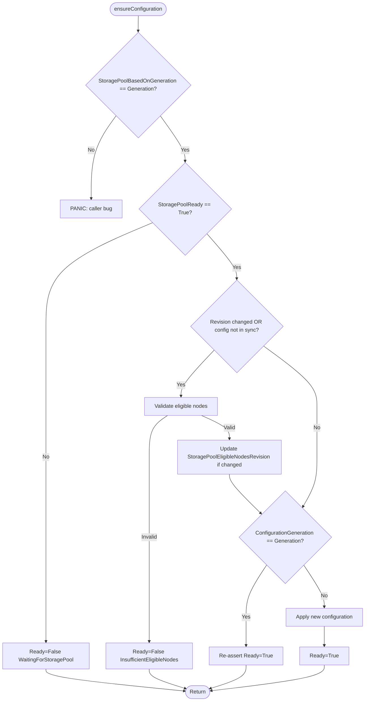
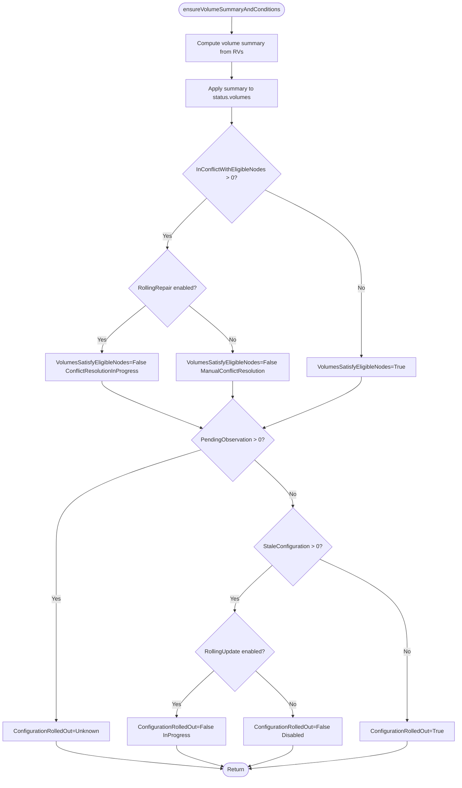
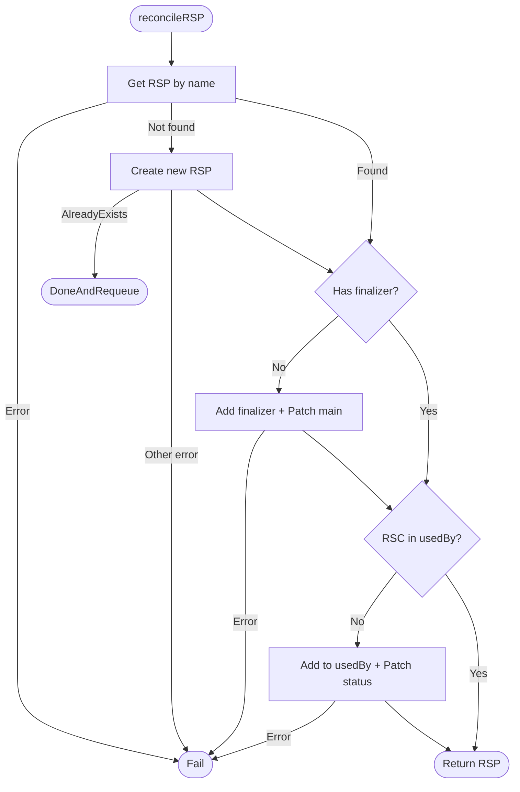
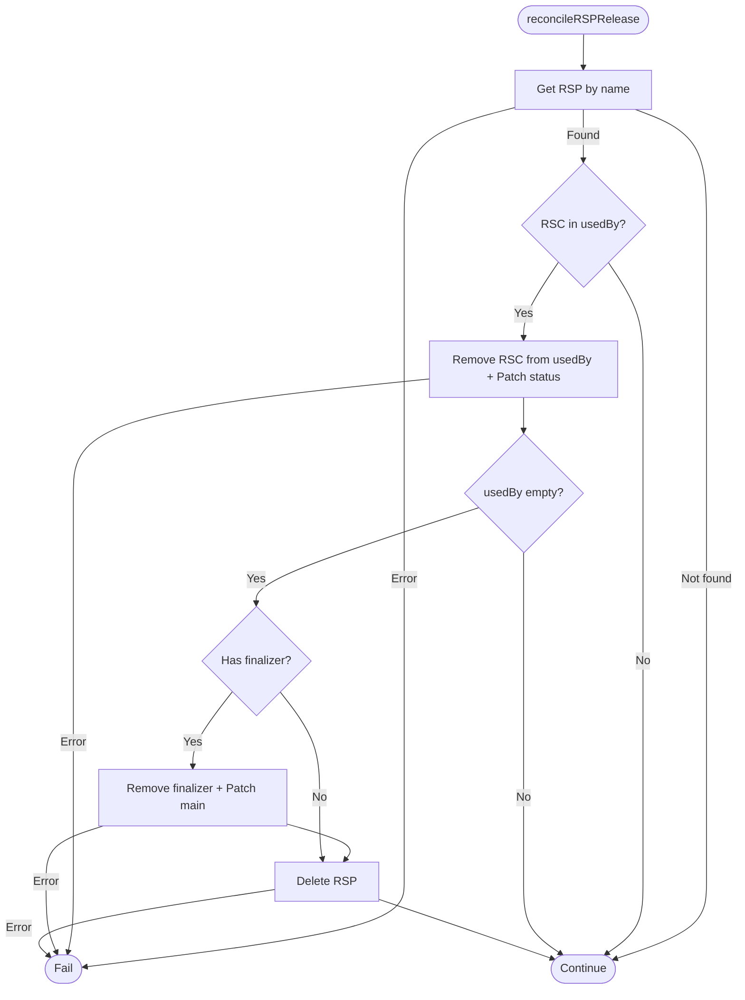

# rsc_controller

This controller manages `ReplicatedStorageClass` (RSC) resources by aggregating status from associated `ReplicatedStoragePool` (RSP) and `ReplicatedVolume` (RV) resources.

## Purpose

The controller reconciles `ReplicatedStorageClass` status with:

1. **Storage pool management** — auto-generates and manages an RSP based on `spec.storage` configuration
2. **Configuration snapshot** — resolved configuration from spec, stored in `status.configuration`
3. **Generations/Revisions** — for quick change detection between RSC and RSP
4. **Conditions** — 4 conditions describing the current state
5. **Volume statistics** — counts of total, aligned, stale, and conflict volumes
6. **Deletion cleanup** — releases RSP `usedBy` entries and removes finalizer on RSC deletion

> **Note:** RSC does not calculate eligible nodes directly. It uses `RSP.Status.EligibleNodes` from the associated storage pool and validates them against topology and FTT/GMDR requirements.

## Interactions

| Direction | Resource/Controller | Relationship |
|-----------|---------------------|--------------|
| ← input | rsp_controller | Reads `RSP.Status.EligibleNodes` for validation |
| ← input | ReplicatedVolume | Reads RVs for volume statistics |
| → manages | ReplicatedStoragePool | Creates/updates auto-generated RSP |

## Algorithm

The controller creates/updates an RSP from `spec.storage`, validates eligible nodes against topology and FTT/GMDR requirements, and aggregates volume statistics:

```
readiness = storagePoolReady AND eligibleNodesValid
configuration = resolved(spec) if readiness else previous
volumeStats = aggregate(RVs) if allObserved else partial
```

## Reconciliation Structure

```
Reconcile (root) [Pure orchestration]
├── getRSC (nil if not found)
├── getSortedRVsByRSC
├── getUsedStoragePoolNames
├── rscShouldBeDeleted?
│   └── reconcileDeletion [Pure orchestration]
│       ├── reconcileRSPRelease × N (release all RSPs from usedBy)
│       └── remove finalizer from RSC (if RSC still exists)
├── reconcileMigrationFromRSP [Target-state driven]
│   └── migrate spec.storagePool → spec.storage (deprecated field)
├── reconcileMetadata [Conditional target evaluation]
│   └── add finalizer (if not present)
├── reconcileRSP [Conditional target evaluation]
│   └── ensure auto-generated RSP exists with finalizer and usedBy
├── ensureStoragePool
│   └── status.storagePoolName + StoragePoolReady condition
├── ensureConfiguration
│   └── status.configuration + Ready condition
├── ensureVolumeSummaryAndConditions
│   └── status.volumes + ConfigurationRolledOut/VolumesSatisfyEligibleNodes conditions
├── patchRSCStatus (if changed)
└── reconcileUnusedRSPs [Pure orchestration]
    └── reconcileRSPRelease [Conditional target evaluation]
        └── release RSPs no longer referenced by this RSC
```

Links to detailed algorithms: [`reconcileRSP`](#reconcilersp-details), [`ensureStoragePool`](#ensurestoragepool-details), [`ensureConfiguration`](#ensureconfiguration-details), [`ensureVolumeSummaryAndConditions`](#ensurevolumesummaryandconditions-details), [`reconcileRSPRelease`](#reconcilersp-release-details)

## Algorithm Flow

High-level overview of the reconciliation flow. See [Detailed Algorithms](#detailed-algorithms) for method-specific diagrams.



## Conditions

### Ready

Indicates overall readiness of the storage class configuration.

| Status | Reason | When |
|--------|--------|------|
| True | Ready | Configuration accepted and validated |
| False | InsufficientEligibleNodes | RSP eligible nodes do not meet topology and FTT/GMDR requirements |
| False | WaitingForStoragePool | Waiting for RSP to become ready |

### StoragePoolReady

Indicates whether the associated storage pool exists and is ready.

| Status | Reason | When |
|--------|--------|------|
| True | (from RSP) | RSP exists and has Ready=True |
| False | StoragePoolNotFound | RSP does not exist |
| Unknown | Pending | RSP has no Ready condition yet |
| False | (from RSP) | Propagated from RSP.Ready condition |

### ConfigurationRolledOut

Indicates whether all volumes' configuration matches the storage class.

| Status | Reason | When |
|--------|--------|------|
| True | RolledOutToAllVolumes | All RVs have `ConfigurationReady=True` |
| False | ConfigurationRolloutInProgress | Rolling update in progress |
| False | ConfigurationRolloutDisabled | `ConfigurationRolloutStrategy.type=NewVolumesOnly` AND `staleConfiguration > 0` |
| Unknown | NewConfigurationNotYetObserved | Some volumes haven't observed the new configuration yet |

### VolumesSatisfyEligibleNodes

Indicates whether all volumes' replicas are placed on eligible nodes.

| Status | Reason | When |
|--------|--------|------|
| True | AllVolumesSatisfy | All RVs have `SatisfyEligibleNodes=True` |
| False | ConflictResolutionInProgress | Resolution in progress |
| False | ManualConflictResolution | `EligibleNodesConflictResolutionStrategy.type=Manual` AND `inConflictWithEligibleNodes > 0` |

## Eligible Nodes Validation

RSC does not calculate eligible nodes. The `rsp_controller` calculates them and stores in `RSP.Status.EligibleNodes`.

RSC validates that the eligible nodes from RSP meet the FTT/GMDR and topology requirements.

Layout formulas: `D = FTT + GMDR + 1` (diskful replicas), `TB = 1` if D is even and `FTT = D/2` (else 0), `totalReplicas = D + TB`.

**Ignored/default topology** — global node counts:

| FTT | GMDR | D | TB | Min nodes | Min nodes with disks |
|-----|------|---|----|-----------|---------------------|
| 0 | 0 | 1 | 0 | 1 | 1 |
| 0 | 1 | 2 | 0 | 2 | 2 |
| 1 | 0 | 2 | 1 | 3 | 2 |
| 1 | 1 | 3 | 0 | 3 | 3 |
| 1 | 2 | 4 | 1 | 5 | 4 |
| 2 | 1 | 4 | 0 | 4 | 4 |
| 2 | 2 | 5 | 0 | 5 | 5 |

**TransZonal topology** — zone counts (composite mode allows fewer zones for some layouts):

| FTT | GMDR | Min zones | Min zones with disks |
|-----|------|-----------|---------------------|
| 0 | 1 | 2 | 2 |
| 1 | 0 | 3 | 2 |
| 1 | 1 | 3 | 3 |
| 1 | 2 | 3 | 3 |
| 2 | 1 | 4 | 4 |
| 2 | 2 | 3 | 3 |

**Zonal topology** — per-zone requirements (each zone must independently meet the Ignored/default requirements).

If validation fails, RSC sets `Ready=False` with reason `InsufficientEligibleNodes`.

## Volume Statistics

The controller aggregates statistics from all `ReplicatedVolume` resources referencing this RSC:

- **Total** — count of all volumes
- **Aligned** — volumes where both `ConfigurationReady` and `SatisfyEligibleNodes` conditions are `True`
- **StaleConfiguration** — volumes where `ConfigurationReady` condition is present and `False` (missing condition is not counted)
- **InConflictWithEligibleNodes** — volumes where `SatisfyEligibleNodes` condition is present and `False` (missing condition is not counted)
- **PendingObservation** — volumes with non-zero `ConfigurationObservedGeneration` that doesn't match RSC's `ConfigurationGeneration`. Volumes with unset (0) `ConfigurationObservedGeneration` are treated as acknowledged to avoid status churn on newly created volumes.
- **UsedStoragePoolNames** — sorted list of storage pool names referenced by volumes

> **Note:** `Aligned` and `StaleConfiguration` are nil when any volumes have pending observations. `Total`, `PendingObservation`, `InConflictWithEligibleNodes`, and `UsedStoragePoolNames` are always computed.

## Managed Metadata

| Type | Key | Managed On | Purpose |
|------|-----|------------|---------|
| Finalizer | `sds-replicated-volume.deckhouse.io/rsc-controller` | RSC | Prevent deletion while RVs exist or RSPs reference this RSC in usedBy |
| Finalizer | `sds-replicated-volume.deckhouse.io/rsc-controller` | RSP | Prevent RSP deletion while any RSC references it |

## Watches

| Resource | Events | Handler |
|----------|--------|---------|
| RSC | For() (primary) | — |
| RSP | Generation change, EligibleNodesRevision change, Ready condition change | mapRSPToRSC (includes usedBy names for orphan cleanup) |
| RV | spec.replicatedStorageClassName change, status.ConfigurationObservedGeneration change, ConfigurationReady/SatisfyEligibleNodes condition changes | rvEventHandler |

## Indexes

| Index | Field | Purpose |
|-------|-------|---------|
| `IndexFieldRSCByStoragePool` | `spec.storagePool` | Find RSCs referencing an RSP (migration from deprecated field) |
| `IndexFieldRSCByStatusStoragePoolName` | `status.storagePoolName` | Find RSCs using an RSP (auto-generated) |
| `IndexFieldRVByReplicatedStorageClassName` | `spec.replicatedStorageClassName` | Find RVs referencing an RSC |
| `IndexFieldRSPByUsedByRSCName` | `status.usedBy.replicatedStorageClassNames` | Find RSPs referencing an RSC (for cleanup) |

## Data Flow



---

## Detailed Algorithms

### ensureStoragePool Details

**Purpose:** Updates `status.storagePoolName`, `status.storagePoolBasedOnGeneration`, and the `StoragePoolReady` condition.

**Algorithm:**



**Data Flow:**

| Input | Output |
|-------|--------|
| `targetStoragePoolName` | `status.storagePoolName` |
| `rsc.Generation` | `status.storagePoolBasedOnGeneration` |
| `rsp.Ready` condition | `StoragePoolReady` condition |

### ensureConfiguration Details

**Purpose:** Validates eligible nodes against topology and FTT/GMDR requirements, updates `status.configuration`, `status.configurationGeneration`, `status.storagePoolEligibleNodesRevision`, and the `Ready` condition.

**Algorithm:**



**Data Flow:**

| Input | Output |
|-------|--------|
| `rsp.Status.EligibleNodes` | Validated against topology and FTT/GMDR |
| `rsp.Status.EligibleNodesRevision` | `status.storagePoolEligibleNodesRevision` |
| `rsc.Spec` (topology, FTT/GMDR, etc.) | `status.configuration` |
| `rsc.Generation` | `status.configurationGeneration` |
| Validation result | `Ready` condition |

### ensureVolumeSummaryAndConditions Details

**Purpose:** Computes volume statistics from RVs and sets `ConfigurationRolledOut` and `VolumesSatisfyEligibleNodes` conditions.

**Algorithm:**



**Data Flow:**

| Input | Output |
|-------|--------|
| RV list | `status.volumes.total` |
| RV conditions | `status.volumes.aligned`, `staleConfiguration`, `inConflictWithEligibleNodes` |
| RV acknowledgment state | `status.volumes.pendingObservation` |
| RV storage pool names | `status.volumes.usedStoragePoolNames` |
| Volume counters + strategy | `ConfigurationRolledOut` condition |
| Conflict counters + strategy | `VolumesSatisfyEligibleNodes` condition |

### reconcileRSP Details

**Purpose:** Ensures the auto-generated RSP exists with proper finalizer and usedBy tracking.

**Algorithm:**



**Data Flow:**

| Input | Output |
|-------|--------|
| `targetStoragePoolName` | RSP lookup/creation |
| `rsc.Spec.Storage` | RSP spec (type, lvmVolumeGroups) |
| `rsc.Spec.Zones`, `NodeLabelSelector`, `SystemNetworkNames` | RSP spec |
| `rsc.Spec.EligibleNodesPolicy` | RSP spec (eligibleNodesPolicy) |
| `rsc.Name` | `status.usedBy` |

### reconcileRSP Release Details

**Purpose:** Releases an RSP that is no longer used by this RSC. Removes RSC from usedBy and deletes the RSP if no more users.

**Algorithm:**



**Data Flow:**

| Input | Action |
|-------|--------|
| `rspName` | RSP lookup |
| `rscName` | Remove from `status.usedBy.replicatedStorageClassNames` |
| Empty usedBy | Triggers RSP deletion |
