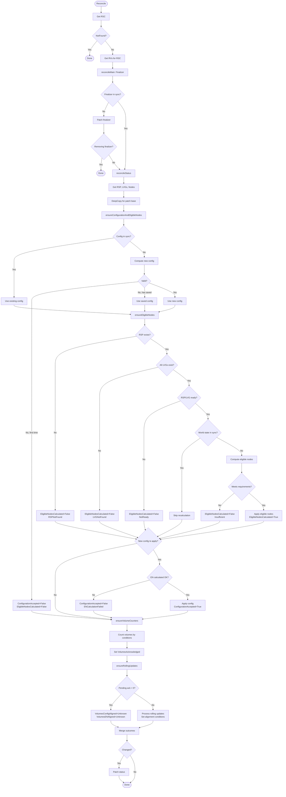
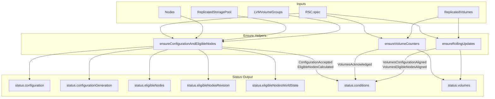

# rsc_controller

This controller manages the `ReplicatedStorageClass` status fields by aggregating information from cluster topology and associated `ReplicatedVolume` resources.

## Purpose

The controller reconciles `ReplicatedStorageClass` status with:

1. **Configuration** — resolved configuration snapshot from spec
2. **Eligible nodes** — nodes that can host volumes of this storage class based on zones, node labels, and LVMVolumeGroup availability
3. **Generations/Revisions** — for quick change detection (`configurationGeneration`, `eligibleNodesRevision`)
4. **Conditions** — 5 conditions describing the current state
5. **Volume statistics** — counts of total, aligned, stale, and violation volumes
6. **Rolling updates tracking**  (NOT IMPLEMENTED) — volumes currently undergoing configuration rollout or eligible nodes violation resolution

## Reconciliation Structure

```
Reconcile (root)
├── reconcileMain      — finalizer management (Target-state driven)
└── reconcileStatus    — status fields update (In-place reconciliation)
    ├── ensureConfigurationAndEligibleNodes
    │   └── ensureEligibleNodes
    ├── ensureVolumeCounters
    └── ensureRollingUpdates
```

## Algorithm Flow



## Conditions

### ConfigurationAccepted

Indicates whether the storage class configuration has been accepted and validated.

| Status | Reason | When |
|--------|--------|------|
| True | Accepted | Configuration accepted and saved |
| False | InvalidConfiguration | Configuration validation failed |
| False | EligibleNodesCalculationFailed | Cannot calculate eligible nodes |

### EligibleNodesCalculated

Indicates whether eligible nodes have been calculated for the storage class.

| Status | Reason | When |
|--------|--------|------|
| True | Calculated | Successfully calculated |
| False | InsufficientEligibleNodes | Not enough eligible nodes for replication/topology |
| False | InvalidConfiguration | Configuration is invalid (e.g., bad NodeLabelSelector) |
| False | LVMVolumeGroupNotFound | Referenced LVG not found |
| False | ReplicatedStoragePoolNotFound | RSP not found |
| False | StoragePoolOrLVGNotReady | RSP phase is not Completed or thin pool not found |

### VolumesAcknowledged

Indicates whether all volumes have acknowledged the storage class configuration and eligible nodes.

| Status | Reason | When |
|--------|--------|------|
| True | AllAcknowledged | All RVs: `ObservedConfigurationGeneration == configurationGeneration` AND `ObservedEligibleNodesRevision == eligibleNodesRevision` |
| False | Pending | Any RV has not acknowledged current configuration |

### VolumesConfigurationAligned

Indicates whether all volumes' configuration matches the storage class.

| Status | Reason | When |
|--------|--------|------|
| True | AllAligned | All RVs have `StorageClassConfigurationAligned=True` |
| False | InProgress | Rolling update in progress |
| False | RolloutDisabled | `RolloutStrategy=NewOnly` AND `staleConfiguration > 0` |
| Unknown | PendingAcknowledgment | Some volumes haven't acknowledged configuration yet |

### VolumesEligibleNodesAligned

Indicates whether all volumes' replicas are placed on eligible nodes.

| Status | Reason | When |
|--------|--------|------|
| True | AllAligned | All RVs have `StorageClassEligibleNodesAligned=True` |
| False | InProgress | Resolution in progress |
| False | ResolutionDisabled | `DriftPolicy=Ignore` AND `eligibleNodesViolation > 0` |
| Unknown | PendingAcknowledgment | Some volumes haven't acknowledged configuration yet |

## Eligible Nodes Algorithm

A node is considered eligible for an RSC if **all** conditions are met (AND):

1. **Zones** — if the RSC has `zones` specified, the node's `topology.kubernetes.io/zone` label must be in that list; if `zones` is not specified, the condition is satisfied for any node

2. **NodeLabelSelector** — if the RSC has `nodeLabelSelector` specified, the node must match this selector; if not specified, the condition is satisfied for any node

3. **Ready status** — if the node has been `NotReady` longer than `spec.eligibleNodesPolicy.notReadyGracePeriod`, it is excluded from the eligible nodes list

> **Note:** A node does **not** need to have an LVMVolumeGroup to be eligible. Nodes without LVGs can serve as client-only nodes or tiebreaker nodes.

For each eligible node, the controller also records:

- **Unschedulable** flag — from `node.spec.unschedulable`
- **Ready** flag — current node readiness status
- **LVMVolumeGroups** — list of matching LVGs with their unschedulable status (from `storage.deckhouse.io/lvmVolumeGroupUnschedulable` annotation)

### Eligible Nodes Validation

The controller validates that eligible nodes meet replication and topology requirements:

| Replication | Topology | Requirement |
|-------------|----------|-------------|
| None | any | ≥1 node |
| Availability | Ignored/default | ≥3 nodes, ≥2 with disks |
| Availability | TransZonal | ≥3 zones, ≥2 with disks |
| Availability | Zonal | per zone: ≥3 nodes, ≥2 with disks |
| Consistency | Ignored/default | ≥2 nodes with disks |
| Consistency | TransZonal | ≥2 zones with disks |
| Consistency | Zonal | per zone: ≥2 nodes with disks |
| ConsistencyAndAvailability | Ignored/default | ≥3 nodes with disks |
| ConsistencyAndAvailability | TransZonal | ≥3 zones with disks |
| ConsistencyAndAvailability | Zonal | per zone: ≥3 nodes with disks |

## Volume Statistics Algorithm

The controller aggregates statistics from all `ReplicatedVolume` resources referencing this RSC:

- **Total** — count of all volumes
- **Aligned** — volumes where both `StorageClassConfigurationAligned` and `StorageClassEligibleNodesAligned` conditions are `True`
- **StaleConfiguration** — volumes where `StorageClassConfigurationAligned` is `False`
- **EligibleNodesViolation** — volumes where `StorageClassEligibleNodesAligned` is `False`
- **PendingAcknowledgment** — volumes that haven't acknowledged current RSC configuration/eligible nodes

> **Note:** Counters other than `Total` and `PendingAcknowledgment` are only computed when all volumes have acknowledged the current configuration.

## Rolling Updates Management (NOT IMPLEMENTED)

When `rolloutStrategy.type=RollingUpdate` or `eligibleNodesDriftPolicy.type=RollingUpdate` is configured, the controller tracks volumes undergoing updates in `status.volumes.rollingUpdatesInProgress`:

1. **Operations**:
   - `FullAlignment` — full configuration rollout (handles both config and eligible nodes)
   - `OnlyEligibleNodesViolationResolution` — only resolves eligible nodes violations

2. **Policy filtering**:
   - If `rolloutStrategy.type=NewOnly`, configuration rollout is disabled
   - If `eligibleNodesDriftPolicy.type=Ignore`, drift resolution is disabled

3. **Limits**:
   - `maxParallel` from enabled policy configuration (minimum: 1)
   - Hard API limit: 200 entries maximum

4. **Optimistic locking**: Status patches use optimistic locking to prevent race conditions.

## Data Flow


