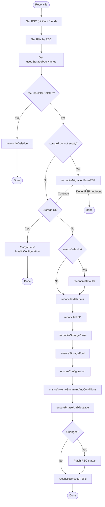
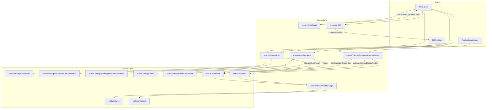
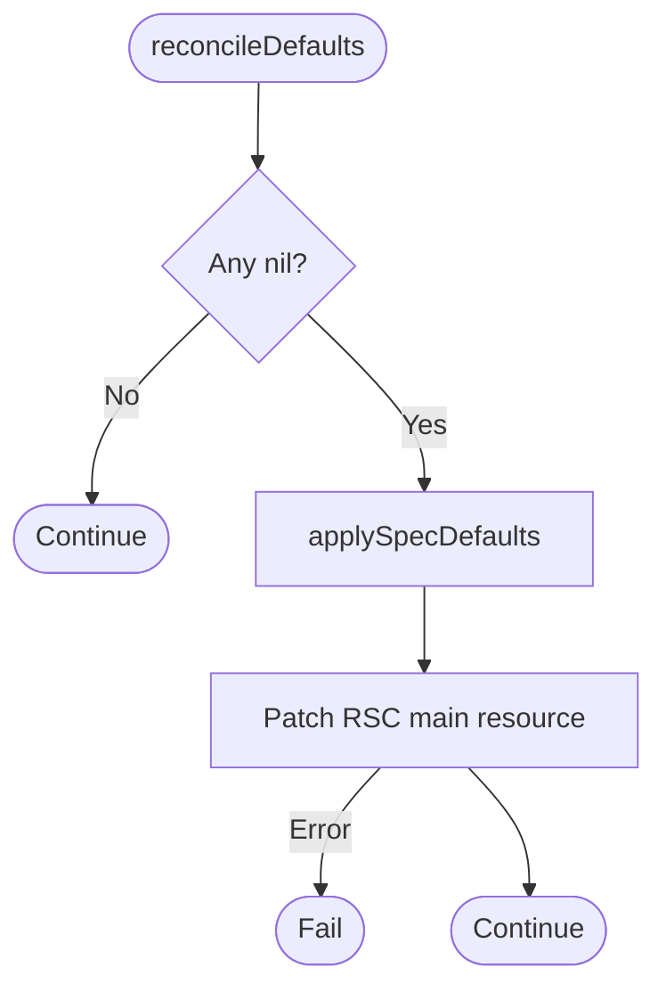
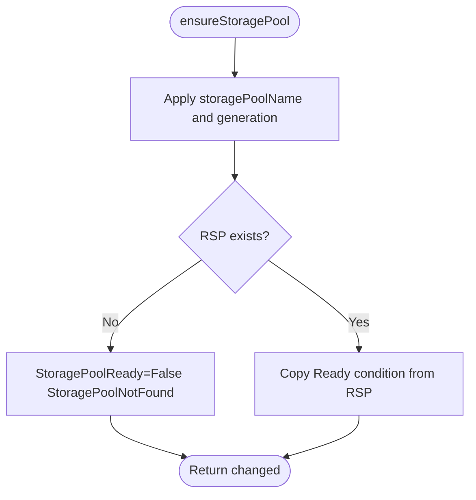
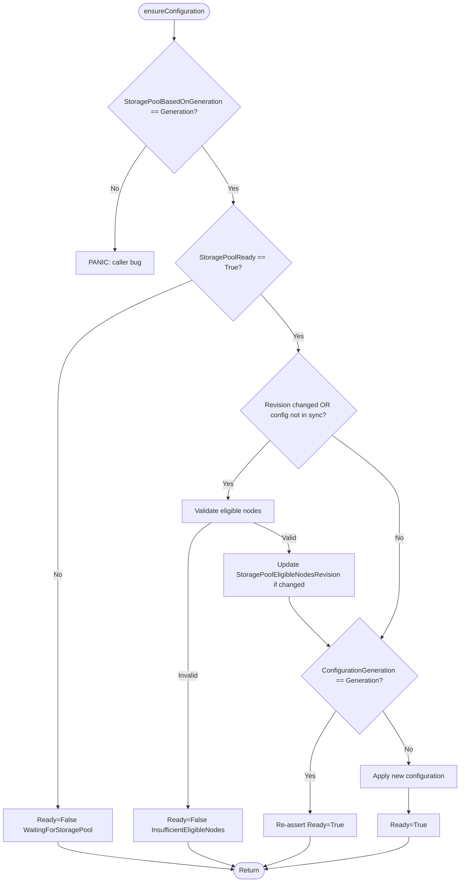
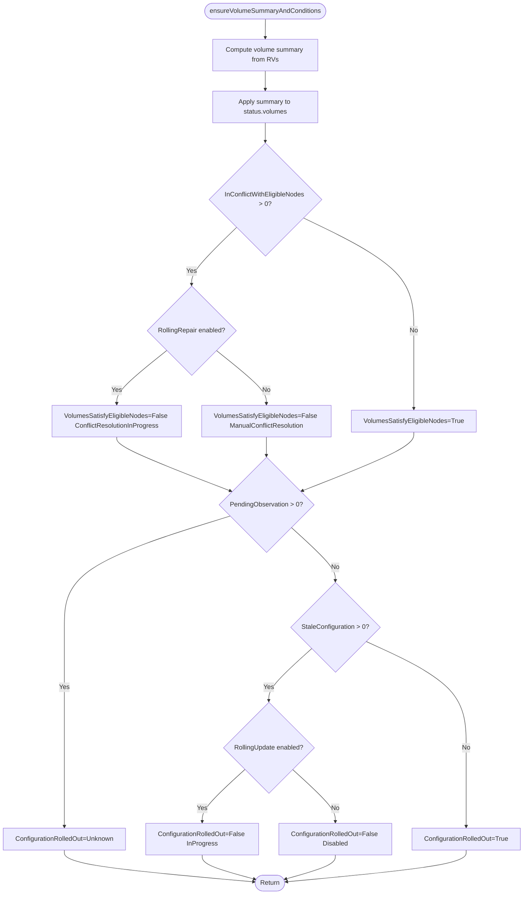
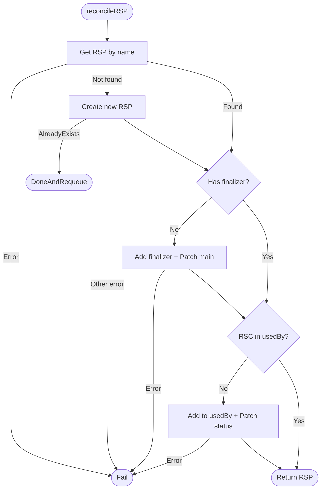
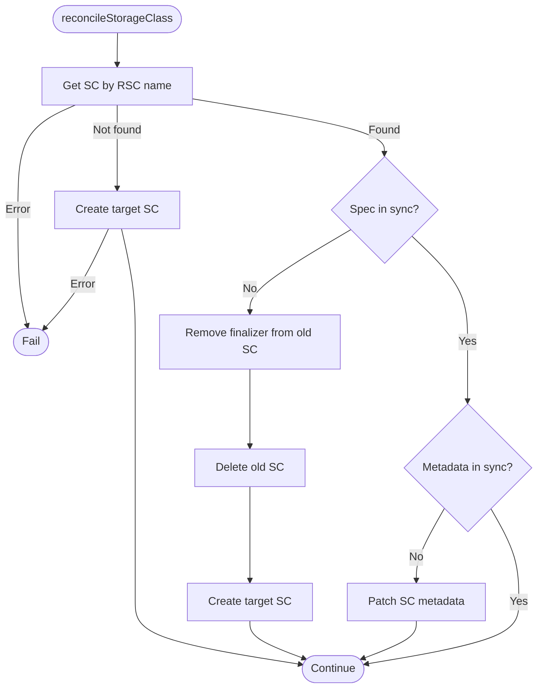
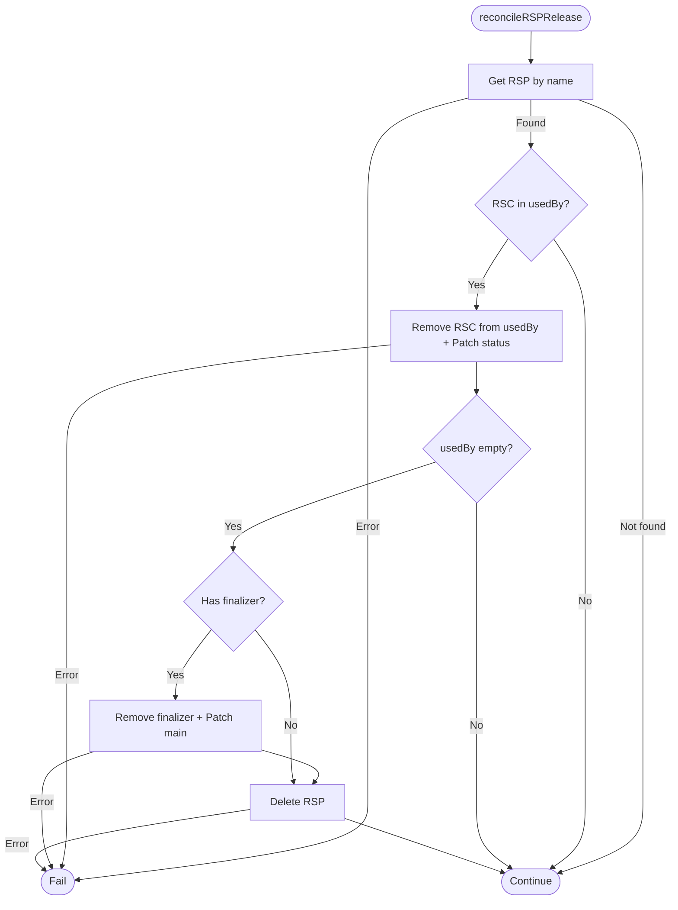

# rsc_controller

This controller manages `ReplicatedStorageClass` (RSC) resources by aggregating status from associated `ReplicatedStoragePool` (RSP) and `ReplicatedVolume` (RV) resources.

## Purpose

The controller reconciles `ReplicatedStorageClass` status with:

1. **Spec defaulting** — fills controller-managed optional spec fields (`systemNetworkNames`, `configurationRolloutStrategy`, `eligibleNodesConflictResolutionStrategy`, `eligibleNodesPolicy`) with defaults when not set by the user
2. **Storage pool management** — auto-generates and manages an RSP based on `spec.storage` configuration
3. **StorageClass management** — creates and manages a Kubernetes `StorageClass` with the same name as the RSC; deletes and recreates the SC when immutable spec fields change
4. **Configuration snapshot** — resolved configuration from spec, stored in `status.configuration`
5. **Generations/Revisions** — for quick change detection between RSC and RSP
6. **Conditions** — 4 conditions describing the current state
7. **Phase and message** — operational state summary derived from conditions, deletion state, and rollout strategy state
8. **Volume statistics** — counts of total, aligned, stale, and conflict volumes
9. **Deletion cleanup** — releases RSP `usedBy` entries, deletes managed StorageClass, and removes finalizer on RSC deletion

> **Note:** RSC does not calculate eligible nodes directly. It uses `RSP.Status.EligibleNodes` from the associated storage pool and validates them against topology and FTT/GMDR requirements.

## Interactions

| Direction | Resource/Controller | Relationship |
|-----------|---------------------|--------------|
| ← input | rsp_controller | Reads `RSP.Status.EligibleNodes` for validation |
| ← input | ReplicatedVolume | Reads RVs for volume statistics |
| → manages | ReplicatedStoragePool | Creates/updates auto-generated RSP |
| → manages | StorageClass | Creates/updates/deletes Kubernetes StorageClass |

## Algorithm

The controller fills optional spec fields with defaults (if not set by the user), creates/updates an RSP from `spec.storage`, validates eligible nodes against topology and FTT/GMDR requirements, and aggregates volume statistics:

```
readiness = storagePoolReady AND eligibleNodesValid
configuration = resolved(spec) if readiness else previous
volumeStats = classify(trackedRVs) into pending | stale | aligned (mutually exclusive)
```

## Reconciliation Structure

```
Reconcile (root) [Pure orchestration]
├── getRSC (nil if not found)
├── getSortedRVsByRSC
├── getUsedStoragePoolNames
├── rscShouldBeDeleted?
│   └── reconcileDeletion [Pure orchestration]
│       ├── delete managed StorageClass (remove finalizer, delete SC)
│       ├── reconcileRSPRelease × N (release all RSPs from usedBy)
│       └── remove finalizer from RSC (if RSC still exists)
├── reconcileMigrationFromRSP [Target-state driven]
│   └── migrate spec.storagePool → spec.storage (deprecated field)
├── Storage nil check → Ready=False InvalidConfiguration, Done
├── reconcileDefaults [Conditional target evaluation]
│   └── fill nil optional spec fields (systemNetworkNames, strategies, policy) and patch
├── reconcileMigrationConfigurationFormat [Conditional target evaluation]
│   └── nil out old-format status.configuration
├── reconcileMetadata [Conditional target evaluation]
│   └── add finalizer (if not present)
├── reconcileRSP [Conditional target evaluation]
│   └── ensure auto-generated RSP exists with finalizer and usedBy
├── reconcileStorageClass [Conditional target evaluation]
│   └── ensure Kubernetes StorageClass exists; delete+recreate on immutable spec change
├── ensureStoragePool
│   └── status.storagePoolName + StoragePoolReady condition
├── ensureConfiguration
│   └── status.configuration + Ready condition
├── ensureVolumeSummaryAndConditions
│   └── status.volumes + ConfigurationRolledOut/VolumesSatisfyEligibleNodes conditions
├── ensurePhaseAndMessage
│   └── status.phase + status.message (derived from conditions + deletion + rollout strategy)
├── patchRSCStatus (if changed)
└── reconcileUnusedRSPs [Pure orchestration]
    └── reconcileRSPRelease [Conditional target evaluation]
        └── release RSPs no longer referenced by this RSC
```

Links to detailed algorithms: [`reconcileDefaults`](#reconciledefaults-details), [`reconcileRSP`](#reconcilersp-details), [`reconcileStorageClass`](#reconcilestorageclass-details), [`ensureStoragePool`](#ensurestoragepool-details), [`ensureConfiguration`](#ensureconfiguration-details), [`ensureVolumeSummaryAndConditions`](#ensurevolumesummaryandconditions-details), [`reconcileRSPRelease`](#reconcilersp-release-details)

## Algorithm Flow

High-level overview of the reconciliation flow. See [Detailed Algorithms](#detailed-algorithms) for method-specific diagrams.


```mermaid
flowchart TD
    Start([Reconcile]) --> GetRSC["Get RSC (nil if not found)"]
    GetRSC --> GetRVs[Get RVs by RSC]
    GetRVs --> GetUsedPools[Get usedStoragePoolNames]

    GetUsedPools --> ShouldDelete{rscShouldBeDeleted?}
    ShouldDelete -->|Yes| Deletion[reconcileDeletion]
    Deletion --> DeletionDone([Done])

    ShouldDelete -->|No| Migration{storagePool not empty?}
    Migration -->|Yes| MigrationStep[reconcileMigrationFromRSP]
    Migration -->|No| CheckStorage
    MigrationStep -->|Done: RSP not found| MigrationDone([Done])
    MigrationStep -->|Continue| CheckStorage

    CheckStorage{Storage nil?}
    CheckStorage -->|Yes| StorageInvalid["Ready=False InvalidConfiguration"]
    StorageInvalid --> StorageInvalidDone([Done])
    CheckStorage -->|No| NeedsDefaults{needsDefaults?}

    NeedsDefaults -->|Yes| Defaults[reconcileDefaults]
    NeedsDefaults -->|No| Metadata
    Defaults --> Metadata[reconcileMetadata]

    Metadata --> ReconcileRSP[reconcileRSP]
    ReconcileRSP --> ReconcileSC[reconcileStorageClass]
    ReconcileSC --> EnsureStoragePool[ensureStoragePool]
    EnsureStoragePool --> EnsureConfig[ensureConfiguration]
    EnsureConfig --> EnsureVolumes[ensureVolumeSummaryAndConditions]
    EnsureVolumes --> EnsurePhase[ensurePhaseAndMessage]
    EnsurePhase --> PatchDecision{Changed?}
    PatchDecision -->|Yes| PatchStatus[Patch RSC status]
    PatchDecision -->|No| ReleaseRSPs
    PatchStatus --> ReleaseRSPs

    ReleaseRSPs[reconcileUnusedRSPs] --> EndNode([Done])
```

## Conditions

### Ready

Indicates overall readiness of the storage class configuration.

| Status | Reason | When |
|--------|--------|------|
| True | Ready | Configuration accepted and validated |
| False | InvalidConfiguration | `spec.storage` is missing (not yet set or webhook not deployed) |
| False | InsufficientEligibleNodes | RSP eligible nodes do not meet topology and FTT/GMDR requirements |
| False | WaitingForStoragePool | Waiting for RSP to become ready |

### StoragePoolReady

Indicates whether the associated storage pool exists and is ready.

| Status | Reason | When |
|--------|--------|------|
| True | (from RSP) | RSP exists and has Ready=True |
| False | StoragePoolNotFound | RSP does not exist |
| Unknown | Pending | RSP has no Ready condition yet |
| False | (from RSP) | Propagated from RSP.Ready condition |

### ConfigurationRolledOut

Indicates whether all tracked volumes are aligned with the storage class (current configuration
applied and layout converged). It is derived from the mutually exclusive volume categories
described in [Volume Statistics](#volume-statistics), evaluated in this precedence order:

| # | Status | Reason | When | Message |
|---|--------|--------|------|---------|
| 1 | Unknown | NewConfigurationNotYetObserved | `pendingObservation > 0` — at least one volume owes a verdict | `N volume(s) pending observation` |
| 2 | False | ConfigurationRolloutInProgress | `staleConfiguration > 0` AND `ConfigurationRolloutStrategy.type=RollingUpdate` (a nil strategy counts as RollingUpdate) | `N volume(s) not yet aligned with the storage class configuration` |
| 2 | False | ConfigurationRolloutDisabled | `staleConfiguration > 0` AND `ConfigurationRolloutStrategy.type=NewVolumesOnly` | `N volume(s) not yet aligned with the storage class configuration; automatic rollout is disabled` |
| 3 | True | RolledOutToAllVolumes | no pending and no stale volumes, i.e. `aligned == tracked volumes` | All volumes have configuration matching the storage class |

> **Note:** the `maxParallel`/rollout-throttling semantics are not implemented, so the messages
> report the honest stale count rather than active rollout progress, and the reason is chosen by
> the strategy **type** alone.

Under `NewVolumesOnly` a volume that already has a configuration keeps it and reports
`ConfigurationReady=False/NewerConfigurationHeld` (see `rv_controller`). Such a held volume is
stale on both axes at once — it runs an older configuration generation *and* reports
`ConfigurationReady=False` — and is still counted exactly once, because the classification is
mutually exclusive.

### VolumesSatisfyEligibleNodes

Indicates whether all volumes' replicas are placed on eligible nodes.

| Status | Reason | When |
|--------|--------|------|
| True | AllVolumesSatisfy | No RV is known to be in conflict |
| False | ConflictResolutionInProgress | `inConflictWithEligibleNodes > 0` AND `EligibleNodesConflictResolutionStrategy.type=RollingRepair` (a nil strategy counts as RollingRepair) |
| False | ManualConflictResolution | `inConflictWithEligibleNodes > 0` AND `EligibleNodesConflictResolutionStrategy.type=Manual` |

> **Note:** like the configuration rollout, conflict resolution is read by strategy **type** only —
> its `maxParallel` throttling is not implemented either.

## Phase

The `status.phase` field is an operational state summary derived from conditions, deletion state, and rollout strategy state. The `status.message` field provides a human-readable description.

Phase derivation (evaluation order):

| # | Phase | When | Operator action |
|---|-------|------|-----------------|
| 1 | **Terminating** | DeletionTimestamp set | Wait for cleanup |
| 2 | **WaitingForStoragePool** | StoragePoolReady != True | Check RSP, LVGs, node health |
| 3 | **InsufficientNodes** | Ready=False/InsufficientEligibleNodes | Add nodes or adjust FTT/GMDR |
| 4 | **InvalidConfiguration** | Ready=False (other reasons) | Fix RSC spec |
| 5 | **RollingOut** | Ready=True, divergence exists, at least one auto-fix active | Wait, system is working |
| 6 | **PartiallyAligned** | Ready=True, divergence exists, all auto-fixes disabled | Enable rollout or fix manually |
| 7 | **Ready** | Ready=True, all aligned (or no volumes) | Nothing |

**RollingOut vs PartiallyAligned:** The two rollout strategies (ConfigurationRolloutStrategy, EligibleNodesConflictResolutionStrategy) are independently enabled/disabled. If at least one auto-fix is active for a divergent concern, the phase is RollingOut. If all divergent concerns have their auto-fix disabled, the phase is PartiallyAligned. The message explains which concerns are active and which are disabled.

## Eligible Nodes Validation

RSC does not calculate eligible nodes. The `rsp_controller` calculates them and stores in `RSP.Status.EligibleNodes`.

RSC validates that the eligible nodes from RSP meet the FTT/GMDR and topology requirements.

Layout formulas: `D = FTT + GMDR + 1` (diskful replicas), `TB = 1` if D is even and `FTT = D/2` (else 0), `totalReplicas = D + TB`.

**Ignored/default topology** — global node counts:

| FTT | GMDR | D | TB | Min nodes | Min nodes with disks |
|-----|------|---|----|-----------|---------------------|
| 0 | 0 | 1 | 0 | 1 | 1 |
| 0 | 1 | 2 | 0 | 2 | 2 |
| 1 | 0 | 2 | 1 | 3 | 2 |
| 1 | 1 | 3 | 0 | 3 | 3 |
| 1 | 2 | 4 | 1 | 5 | 4 |
| 2 | 1 | 4 | 0 | 4 | 4 |
| 2 | 2 | 5 | 0 | 5 | 5 |

**TransZonal topology** — zone counts (composite mode allows fewer zones for some layouts):

| FTT | GMDR | Min zones | Min zones with disks |
|-----|------|-----------|---------------------|
| 0 | 1 | 2 | 2 |
| 1 | 0 | 3 | 2 |
| 1 | 1 | 3 | 3 |
| 1 | 2 | 3 | 3 |
| 2 | 1 | 4 | 4 |
| 2 | 2 | 3 | 3 |

**Zonal topology** — per-zone requirements (each zone must independently meet the Ignored/default requirements).

If validation fails, RSC sets `Ready=False` with reason `InsufficientEligibleNodes`.

## Volume Statistics

The controller aggregates statistics from all `ReplicatedVolume` resources referencing this RSC.

**Tracked volumes.** Only Auto-mode volumes take part in the rollout: a Manual-mode volume carries
its configuration in its own spec, so the class neither rolls anything out to it nor waits for it.
Manual volumes are excluded explicitly by `spec.configurationMode` (they are still counted in
`Total` and in `InConflictWithEligibleNodes`).

**Rollout categories.** Every tracked volume is classified into exactly one category by a
short-circuit ladder — **pending → stale → aligned**, first match wins. The order is normative:
there are two tracked conditions, so a volume with one `Unknown` and one `False` would otherwise
match two categories, and "we do not know yet" is weaker than any verdict. Hence the invariant:

```text
pendingObservation + staleConfiguration + aligned == tracked volumes
```

The tracked conditions form the *configuration axis* only: `ConfigurationReady` and
`MembershipLayoutConverged`. `SatisfyEligibleNodes` is deliberately not part of it — a volume can run the
current configuration perfectly while sitting on a node that is no longer eligible.

| Category | Counter | Rule |
|----------|---------|------|
| pending | `PendingObservation` | `ConfigurationObservedGeneration != RSC.ConfigurationGeneration` (an unset `0` is **not** acknowledgment), **or** a tracked condition carries no verdict: absent, `Unknown` (e.g. `MembershipLayoutConverged=Unknown/VolumeDeleting`), or written for an older `metadata.generation` of the volume |
| stale | `StaleConfiguration` | otherwise: `ConfigurationGeneration != RSC.ConfigurationGeneration` (an older configuration is applied — for example held by `NewVolumesOnly`), **or** a tracked condition is `False` |
| aligned | `Aligned` | otherwise: the current configuration generation is applied and both tracked conditions are `True` for the volume's current generation |

Adding a category (for example a maintenance "suspended" one) means adding a rung at its
precedence position; the counters and the invariant follow automatically.

Other counters:

- **Total** — count of all volumes (tracked or not)
- **InConflictWithEligibleNodes** — volumes where the `SatisfyEligibleNodes` condition is present and not `True` (a missing condition is not counted — the volume has not been evaluated yet)
- **UsedStoragePoolNames** — sorted list of storage pool names referenced by volumes

> **Note:** all counters are always computed. The rollout counters are never nil: the categories
> are exhaustive, so "we do not know" is expressed as `pendingObservation`, not as a missing value.

## Managed Metadata

| Type | Key | Managed On | Purpose |
|------|-----|------------|---------|
| Finalizer | `sds-replicated-volume.deckhouse.io/rsc-controller` | RSC | Prevent deletion while RVs exist or RSPs reference this RSC in usedBy |
| Finalizer | `sds-replicated-volume.deckhouse.io/rsc-controller` | RSP | Prevent RSP deletion while any RSC references it |
| Finalizer | `storage.deckhouse.io/sds-replicated-volume` | StorageClass | Prevent SC deletion by external actors while RSC exists |
| Label | `storage.deckhouse.io/managed-by=sds-replicated-volume` | StorageClass | Mark SC as managed by this controller |
| Status field | `status.phase` | RSC | Operational state summary |
| Status field | `status.message` | RSC | Human-readable description of the current phase |

## Watches

| Resource | Events | Handler |
|----------|--------|---------|
| RSC | For() (primary) | — |
| RSP | Generation change, EligibleNodesRevision change, Ready condition change | mapRSPToRSC (includes usedBy names for orphan cleanup) |
| RV | metadata.generation change (condition freshness is generation-relative), spec.replicatedStorageClassName change, status.ConfigurationGeneration / status.ConfigurationObservedGeneration change, ConfigurationReady/SatisfyEligibleNodes/MembershipLayoutConverged condition changes | rvEventHandler |

## Indexes

| Index | Field | Purpose |
|-------|-------|---------|
| `IndexFieldRSCByStoragePool` | `spec.storagePool` | Find RSCs referencing an RSP (migration from deprecated field) |
| `IndexFieldRSCByStatusStoragePoolName` | `status.storagePoolName` | Find RSCs using an RSP (auto-generated) |
| `IndexFieldRVByReplicatedStorageClassName` | `spec.replicatedStorageClassName` | Find RVs referencing an RSC |
| `IndexFieldRSPByUsedByRSCName` | `status.usedBy.replicatedStorageClassNames` | Find RSPs referencing an RSC (for cleanup) |

## Data Flow


```mermaid
flowchart TD
    subgraph inputs [Inputs]
        RSCSpec[RSC.spec]
        RSP[RSP.status]
        RVs[ReplicatedVolumes]
    end

    subgraph reconcilers [Reconcilers]
        ReconcileDefaults[reconcileDefaults]
        ReconcileRSP[reconcileRSP]
        EnsureStoragePool[ensureStoragePool]
        EnsureConfig[ensureConfiguration]
        EnsureVols[ensureVolumeSummaryAndConditions]
        EnsurePhaseMsg[ensurePhaseAndMessage]
    end

    subgraph status [Status Output]
        StoragePoolName[status.storagePoolName]
        StoragePoolGen[status.storagePoolBasedOnGeneration]
        EligibleRev[status.storagePoolEligibleNodesRevision]
        Config[status.configuration]
        ConfigGen[status.configurationGeneration]
        Conds[status.conditions]
        Vol[status.volumes]
        PhaseField[status.phase]
        MessageField[status.message]
    end

    RSCSpec --> ReconcileDefaults
    ReconcileDefaults -->|"Fills nil fields, patches spec"| RSCSpec

    RSCSpec --> ReconcileRSP
    ReconcileRSP -->|Creates/updates| RSP

    RSCSpec --> EnsureStoragePool
    RSP --> EnsureStoragePool
    EnsureStoragePool --> StoragePoolName
    EnsureStoragePool --> StoragePoolGen
    EnsureStoragePool -->|StoragePoolReady| Conds

    RSCSpec --> EnsureConfig
    RSP --> EnsureConfig
    EnsureConfig --> Config
    EnsureConfig --> ConfigGen
    EnsureConfig --> EligibleRev
    EnsureConfig -->|Ready| Conds

    RSCSpec --> EnsureVols
    RVs --> EnsureVols
    EnsureVols --> Vol
    EnsureVols -->|ConfigurationRolledOut| Conds
    EnsureVols -->|VolumesSatisfyEligibleNodes| Conds

    Conds --> EnsurePhaseMsg
    Vol --> EnsurePhaseMsg
    EnsurePhaseMsg --> PhaseField
    EnsurePhaseMsg --> MessageField
```

---

## Detailed Algorithms

### reconcileDefaults Details

**Purpose:** Fills controller-managed optional spec fields with default values when they are nil. This handles both old RSCs created before these fields existed and new RSCs that omit them. After this step, `systemNetworkNames`, `configurationRolloutStrategy`, `eligibleNodesConflictResolutionStrategy`, and `eligibleNodesPolicy` are guaranteed non-nil.

**Algorithm:**


```mermaid
flowchart TD
    Start([reconcileDefaults]) --> Check{Any nil?}
    Check -->|No| Skip([Continue])
    Check -->|Yes| FillDefaults[applySpecDefaults]
    FillDefaults --> PatchSpec[Patch RSC main resource]
    PatchSpec -->|Error| Fail([Fail])
    PatchSpec --> End([Continue])
```

**Default values:**

| Field | Default |
|-------|---------|
| `systemNetworkNames` | `["Internal"]` |
| `configurationRolloutStrategy` | `{type: RollingUpdate, rollingUpdate: {maxParallel: 5}}` |
| `eligibleNodesConflictResolutionStrategy` | `{type: RollingRepair, rollingRepair: {maxParallel: 5}}` |
| `eligibleNodesPolicy` | `{notReadyGracePeriod: 10m}` |

### ensureStoragePool Details

**Purpose:** Updates `status.storagePoolName`, `status.storagePoolBasedOnGeneration`, and the `StoragePoolReady` condition.

**Algorithm:**


```mermaid
flowchart TD
    Start([ensureStoragePool]) --> ApplyPool[Apply storagePoolName and generation]
    ApplyPool --> CheckRSP{RSP exists?}
    CheckRSP -->|No| SetNotFound[StoragePoolReady=False StoragePoolNotFound]
    CheckRSP -->|Yes| CopyCondition[Copy Ready condition from RSP]
    SetNotFound --> End([Return changed])
    CopyCondition --> End
```

**Data Flow:**

| Input | Output |
|-------|--------|
| `targetStoragePoolName` | `status.storagePoolName` |
| `rsc.Generation` | `status.storagePoolBasedOnGeneration` |
| `rsp.Ready` condition | `StoragePoolReady` condition |

### ensureConfiguration Details

**Purpose:** Validates eligible nodes against topology and FTT/GMDR requirements, updates `status.configuration`, `status.configurationGeneration`, `status.storagePoolEligibleNodesRevision`, and the `Ready` condition.

**Algorithm:**


```mermaid
flowchart TD
    Start([ensureConfiguration]) --> CheckGen{StoragePoolBasedOnGeneration == Generation?}
    CheckGen -->|No| Panic[PANIC: caller bug]
    CheckGen -->|Yes| CheckSPReady{StoragePoolReady == True?}
    CheckSPReady -->|No| SetWaiting[Ready=False WaitingForStoragePool]
    SetWaiting --> End([Return])
    CheckSPReady -->|Yes| NeedsValidation{Revision changed OR config not in sync?}
    NeedsValidation -->|Yes| Validate[Validate eligible nodes]
    NeedsValidation -->|No| CheckConfigSync
    Validate -->|Invalid| SetInvalid[Ready=False InsufficientEligibleNodes]
    SetInvalid --> End
    Validate -->|Valid| UpdateRevision[Update StoragePoolEligibleNodesRevision if changed]
    UpdateRevision --> CheckConfigSync{ConfigurationGeneration == Generation?}
    CheckConfigSync -->|Yes| ReAssertReady[Re-assert Ready=True]
    ReAssertReady --> End
    CheckConfigSync -->|No| ApplyConfig[Apply new configuration]
    ApplyConfig --> SetReady[Ready=True]
    SetReady --> End
```

**Data Flow:**

| Input | Output |
|-------|--------|
| `rsp.Status.EligibleNodes` | Validated against topology and FTT/GMDR |
| `rsp.Status.EligibleNodesRevision` | `status.storagePoolEligibleNodesRevision` |
| `rsc.Spec` (topology, FTT/GMDR, etc.) | `status.configuration` |
| `rsc.Generation` | `status.configurationGeneration` |
| Validation result | `Ready` condition |

### ensureVolumeSummaryAndConditions Details

**Purpose:** Computes volume statistics from RVs and sets `ConfigurationRolledOut` and `VolumesSatisfyEligibleNodes` conditions.

**Algorithm:**


```mermaid
flowchart TD
    Start([ensureVolumeSummaryAndConditions]) --> ComputeSummary[Compute volume summary from RVs]
    ComputeSummary --> ApplySummary[Apply summary to status.volumes]

    ApplySummary --> CheckConflicts{InConflictWithEligibleNodes > 0?}
    CheckConflicts -->|Yes| CheckResolutionStrategy{RollingRepair enabled?}
    CheckResolutionStrategy -->|Yes| SetConflictInProgress[VolumesSatisfyEligibleNodes=False ConflictResolutionInProgress]
    CheckResolutionStrategy -->|No| SetManualResolution[VolumesSatisfyEligibleNodes=False ManualConflictResolution]
    CheckConflicts -->|No| SetAllSatisfy[VolumesSatisfyEligibleNodes=True]

    SetConflictInProgress --> CheckPending
    SetManualResolution --> CheckPending
    SetAllSatisfy --> CheckPending

    CheckPending{PendingObservation > 0?}
    CheckPending -->|Yes| SetNotObserved[ConfigurationRolledOut=Unknown]
    SetNotObserved --> End([Return])
    CheckPending -->|No| CheckStale{StaleConfiguration > 0?}

    CheckStale -->|Yes| CheckRolloutStrategy{RollingUpdate enabled?}
    CheckRolloutStrategy -->|Yes| SetRolloutInProgress[ConfigurationRolledOut=False InProgress]
    CheckRolloutStrategy -->|No| SetRolloutDisabled[ConfigurationRolledOut=False Disabled]
    CheckStale -->|No| SetRolledOut[ConfigurationRolledOut=True]

    SetRolloutInProgress --> End
    SetRolloutDisabled --> End
    SetRolledOut --> End
```

**Data Flow:**

| Input | Output |
|-------|--------|
| RV list | `status.volumes.total` |
| RV configuration generations + tracked conditions | `status.volumes.aligned`, `staleConfiguration`, `pendingObservation` (mutually exclusive) |
| RV `SatisfyEligibleNodes` condition | `status.volumes.inConflictWithEligibleNodes` |
| RV storage pool names | `status.volumes.usedStoragePoolNames` |
| Volume counters + strategy | `ConfigurationRolledOut` condition |
| Conflict counters + strategy | `VolumesSatisfyEligibleNodes` condition |

### reconcileRSP Details

**Purpose:** Ensures the auto-generated RSP exists with proper finalizer and usedBy tracking.

**Algorithm:**


```mermaid
flowchart TD
    Start([reconcileRSP]) --> GetRSP[Get RSP by name]
    GetRSP -->|Error| Fail([Fail])
    GetRSP -->|Not found| CreateRSP[Create new RSP]
    CreateRSP -->|AlreadyExists| Requeue([DoneAndRequeue])
    CreateRSP -->|Other error| Fail
    CreateRSP --> CheckFinalizer
    GetRSP -->|Found| CheckFinalizer{Has finalizer?}

    CheckFinalizer -->|No| AddFinalizer[Add finalizer + Patch main]
    AddFinalizer -->|Error| Fail
    AddFinalizer --> CheckUsedBy
    CheckFinalizer -->|Yes| CheckUsedBy{RSC in usedBy?}

    CheckUsedBy -->|No| AddUsedBy[Add to usedBy + Patch status]
    AddUsedBy -->|Error| Fail
    AddUsedBy --> End([Return RSP])
    CheckUsedBy -->|Yes| End
```

**Data Flow:**

| Input | Output |
|-------|--------|
| `targetStoragePoolName` | RSP lookup/creation |
| `rsc.Spec.Storage` | RSP spec (type, lvmVolumeGroups) |
| `rsc.Spec.Zones`, `NodeLabelSelector`, `SystemNetworkNames` | RSP spec |
| `rsc.Spec.EligibleNodesPolicy` | RSP spec (eligibleNodesPolicy) |
| `rsc.Name` | `status.usedBy` |

### reconcileStorageClass Details

**Purpose:** Creates or updates the Kubernetes StorageClass that corresponds to this RSC. SC name equals RSC name. When immutable spec fields differ (parameters, provisioner, reclaimPolicy, volumeBindingMode), the SC is deleted and recreated.

**Algorithm:**


```mermaid
flowchart TD
    Start([reconcileStorageClass]) --> GetSC[Get SC by RSC name]
    GetSC -->|Error| Fail([Fail])
    GetSC -->|Not found| Create[Create target SC]
    Create -->|Error| Fail
    Create --> End([Continue])

    GetSC -->|Found| CheckSpec{Spec in sync?}
    CheckSpec -->|No| RemoveFin1[Remove finalizer from old SC]
    RemoveFin1 --> DeleteOld[Delete old SC]
    DeleteOld --> Recreate[Create target SC]
    Recreate --> End

    CheckSpec -->|Yes| CheckMeta{Metadata in sync?}
    CheckMeta -->|No| PatchMeta[Patch SC metadata]
    PatchMeta --> End
    CheckMeta -->|Yes| End
```

**Data Flow:**

| Input | Output |
|-------|--------|
| `rsc.Name` | SC name |
| `rsc.Spec.ReclaimPolicy` | `sc.ReclaimPolicy` |
| `rsc.Spec.VolumeAccess` | `sc.VolumeBindingMode` (Local/EventuallyLocal/PreferablyLocal → WaitForFirstConsumer; Any → Immediate) |
| CSI provisioner constant | `sc.Provisioner` |
| `rsc.Name` | `sc.Parameters[replicated.csi.storage.deckhouse.io/replicatedStorageClassName]` |
| Managed-by label + finalizer | SC metadata |

### reconcileRSP Release Details

**Purpose:** Releases an RSP that is no longer used by this RSC. Removes RSC from usedBy and deletes the RSP if no more users.

**Algorithm:**


```mermaid
flowchart TD
    Start([reconcileRSPRelease]) --> GetRSP[Get RSP by name]
    GetRSP -->|Error| Fail([Fail])
    GetRSP -->|Not found| End([Continue])
    GetRSP -->|Found| CheckUsedBy{RSC in usedBy?}

    CheckUsedBy -->|No| End
    CheckUsedBy -->|Yes| RemoveUsedBy[Remove RSC from usedBy + Patch status]
    RemoveUsedBy -->|Error| Fail

    RemoveUsedBy --> CheckEmpty{usedBy empty?}
    CheckEmpty -->|No| End
    CheckEmpty -->|Yes| CheckFinalizer{Has finalizer?}

    CheckFinalizer -->|Yes| RemoveFinalizer[Remove finalizer + Patch main]
    RemoveFinalizer -->|Error| Fail
    RemoveFinalizer --> DeleteRSP[Delete RSP]
    CheckFinalizer -->|No| DeleteRSP

    DeleteRSP -->|Error| Fail
    DeleteRSP --> End
```

**Data Flow:**

| Input | Action |
|-------|--------|
| `rspName` | RSP lookup |
| `rscName` | Remove from `status.usedBy.replicatedStorageClassNames` |
| Empty usedBy | Triggers RSP deletion |
