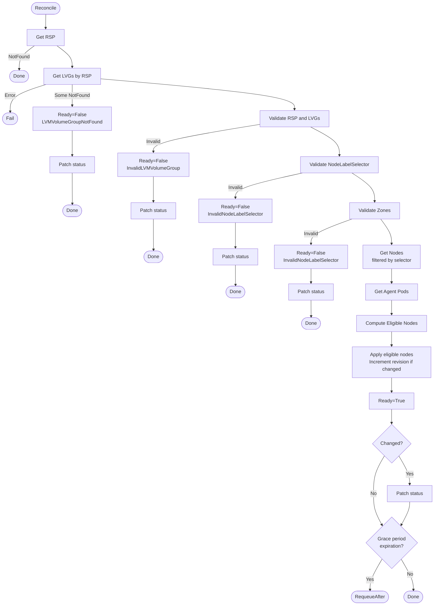
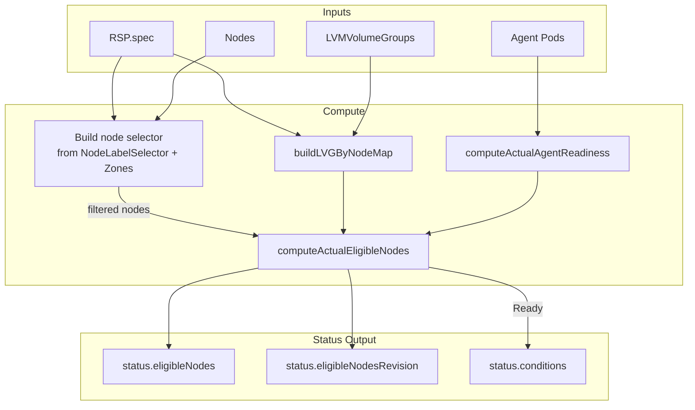

# rsp_controller

> **TODO(systemnetwork): IMPORTANT!** This controller does not yet support custom SystemNetworkNames.
> Currently only "Internal" (default node network) is allowed by API validation.
> When systemnetwork feature stabilizes, the controller must:
> - Watch NetworkNode resources
> - Filter eligible nodes based on configured networks availability
> - Add NetworkNode predicates for Ready condition changes
>
> See `controller.go` for detailed TODO comments.

This controller manages the `ReplicatedStoragePool` status fields by aggregating information from LVMVolumeGroups, Nodes, and agent Pods.

## Purpose

The controller reconciles `ReplicatedStoragePool` status with:

1. **Eligible nodes** — nodes that can host volumes of this storage pool
2. **Eligible nodes revision** — for quick change detection
3. **Ready condition** — describing the current state

## Reconciliation Structure

```
Reconcile (root)
├── getRSP                                    — fetch the RSP
├── getSortedLVGsByRSP                        — fetch LVGs referenced by RSP
├── validateRSPAndLVGs                        — validate RSP/LVG configuration
├── getSortedNodes                            — fetch nodes (filtered by selector)
├── getAgentPods                              — fetch agent pods
├── computeActualEligibleNodes                — compute eligible nodes list
├── applyEligibleNodesAndIncrementRevisionIfChanged
├── applyReadyCondTrue/applyReadyCondFalse    — set Ready condition
└── patchRSPStatus                            — persist status changes
```

## Algorithm Flow



## Conditions

### Ready

Indicates whether the storage pool eligible nodes have been calculated successfully.

| Status | Reason | When |
|--------|--------|------|
| True | Ready | Eligible nodes calculated successfully |
| False | LVMVolumeGroupNotFound | Some LVMVolumeGroups not found |
| False | InvalidLVMVolumeGroup | RSP/LVG validation failed (e.g., thin pool not found) |
| False | InvalidNodeLabelSelector | NodeLabelSelector or Zones parsing failed |

## Eligible Nodes Algorithm

A node is considered eligible for an RSP if **all** conditions are met (AND):

1. **NodeLabelSelector** — if the RSP has `nodeLabelSelector` specified, the node must match this selector; if not specified, the condition is satisfied for any node

2. **Zones** — if the RSP has `zones` specified, the node's `topology.kubernetes.io/zone` label must be in that list; if `zones` is not specified, the condition is satisfied for any node

3. **Ready status** — if the node has been `NotReady` longer than `spec.eligibleNodesPolicy.notReadyGracePeriod`, it is excluded from the eligible nodes list

> **Note:** Nodes are filtered by NodeLabelSelector and Zones before being passed to the eligible nodes computation. Nodes without matching LVMVolumeGroups are still included as they can serve as client-only or tiebreaker nodes.

For each eligible node, the controller records:

- **NodeName** — Kubernetes node name
- **ZoneName** — from `topology.kubernetes.io/zone` label
- **NodeReady** — current node readiness status
- **Unschedulable** — from `node.spec.unschedulable`
- **AgentReady** — whether the sds-replicated-volume agent pod on this node is ready
- **LVMVolumeGroups** — list of matching LVGs with:
  - **Name** — LVMVolumeGroup resource name
  - **ThinPoolName** — thin pool name (for LVMThin storage pools)
  - **Unschedulable** — from `storage.deckhouse.io/lvmVolumeGroupUnschedulable` annotation
  - **Ready** — LVG Ready condition status (and thin pool ready status for LVMThin)

## Data Flow



## Watches and Predicates

The controller watches the following resources:

| Resource | Predicates | Mapping |
|----------|------------|---------|
| ReplicatedStoragePool | Generation changes | Direct (primary) |
| Node | Label changes, Ready condition, spec.unschedulable | Index + selector matching |
| LVMVolumeGroup | Generation, unschedulable annotation, Ready condition, ThinPools[].Ready | Index by LVG name |
| Pod (agent) | Ready condition changes, namespace + label filter | Index by node name |
