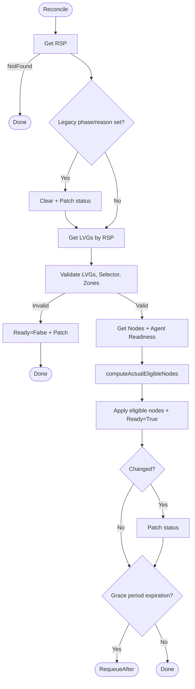
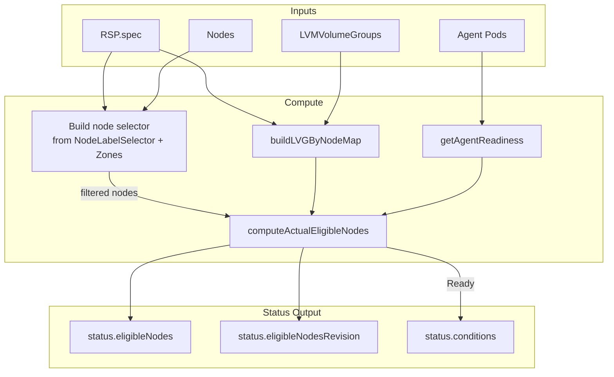
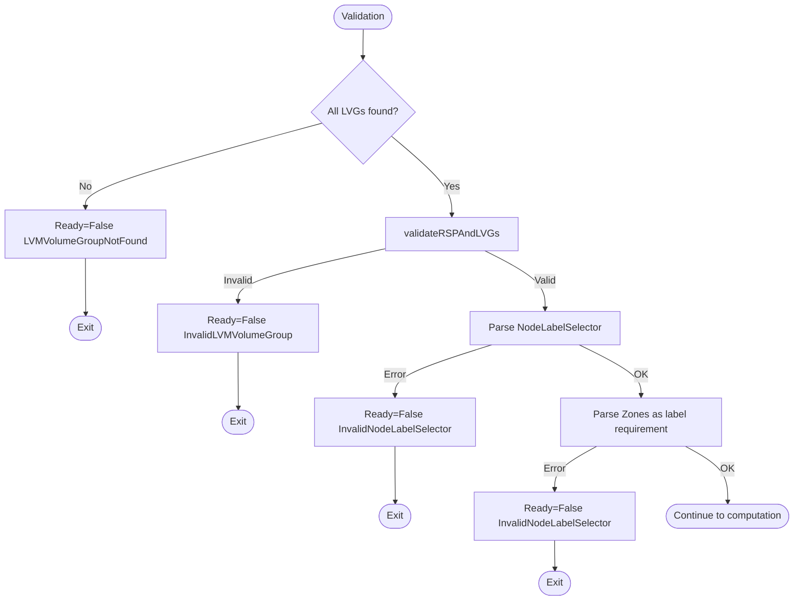
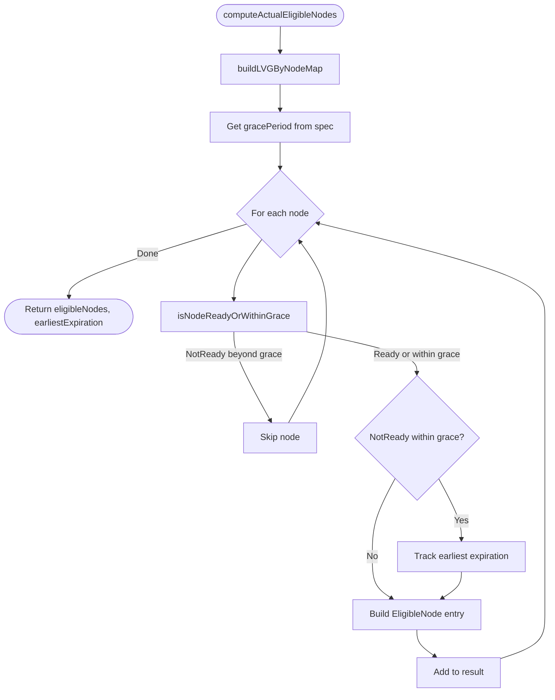
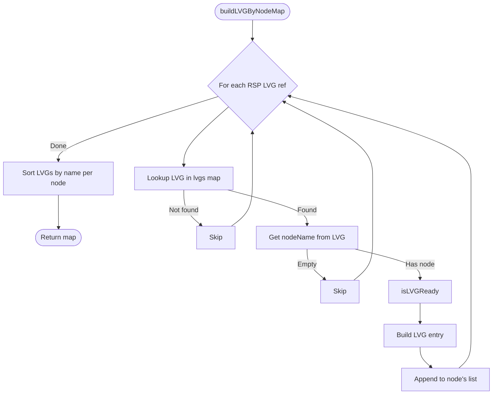
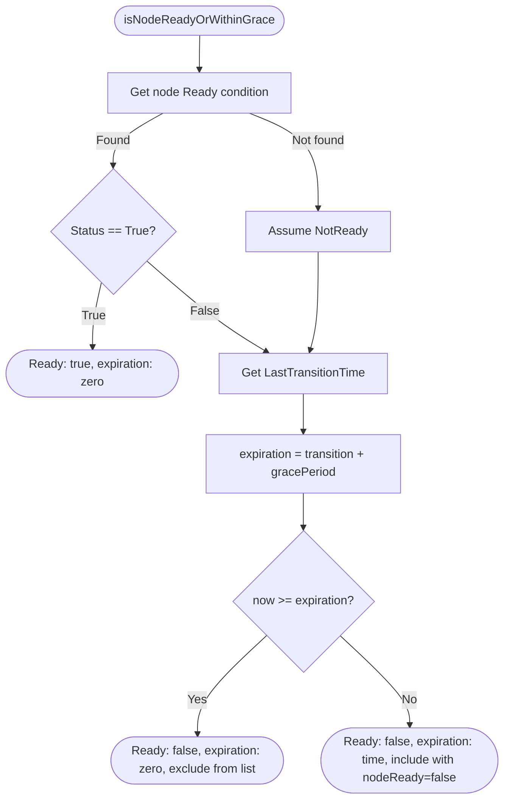

# rsp_controller

> **TODO(systemnetwork): IMPORTANT!** This controller does not yet support custom SystemNetworkNames.
> Currently only "Internal" (default node network) is allowed by API validation.
> When systemnetwork feature stabilizes, the controller must:
> - Watch NetworkNode resources
> - Filter eligible nodes based on configured networks availability
> - Add NetworkNode predicates for Ready condition changes
>
> See `controller.go` for detailed TODO comments.

This controller manages the `ReplicatedStoragePool` status fields by aggregating information from LVMVolumeGroups, Nodes, and agent Pods.

## Purpose

The controller reconciles `ReplicatedStoragePool` status with:

1. **Eligible nodes** — nodes that can host volumes of this storage pool
2. **Eligible nodes revision** — for quick change detection
3. **Ready condition** — describing the current state

## Interactions

| Direction | Resource/Controller | Relationship |
|-----------|---------------------|--------------|
| ← input | LVMVolumeGroup | Reads LVGs referenced by RSP spec |
| ← input | Node | Reads nodes matching selector |
| ← input | Pod (agent) | Reads agent pod readiness |
| → used by | rsc_controller | RSC uses `RSP.Status.EligibleNodes` for validation |
| → used by | node_controller | Reads `RSP.Status.EligibleNodes` to manage node labels |

## Algorithm

A node is eligible if **all** conditions are met:

```
eligible = matchesNodeLabelSelector
       AND matchesZones
       AND (nodeReady OR withinGracePeriod)
```

For each eligible node, the controller also records LVG readiness and agent readiness.

## Reconciliation Structure

```
Reconcile (root) [In-place reconciliation]
├── getRSP                                    — fetch the RSP
├── applyLegacyFieldsCleared + patchRSPStatus — clear old controller phase/reason (one-time migration)
├── getLVGsByRSP                              — fetch LVGs referenced by RSP
├── Validation step (details)
│   ├── validateRSPAndLVGs                    — validate RSP/LVG configuration
│   ├── NodeLabelSelector parsing             — build node selector
│   └── Zones validation                      — add zone requirement
├── getSortedNodes                            — fetch nodes (filtered by selector)
├── getAgentReadiness                         — fetch agent pods and compute readiness
├── computeActualEligibleNodes (details)      — compute eligible nodes list
│   ├── buildLVGByNodeMap (details)           — map LVGs to nodes
│   └── Grace period logic (details)          — handle NotReady nodes
├── applyEligibleNodesAndIncrementRevisionIfChanged
├── applyReadyCondTrue/applyReadyCondFalse    — set Ready condition
└── patchRSPStatus                            — persist status changes
```

Links to detailed algorithms: [`Validation`](#validation-details), [`computeActualEligibleNodes`](#computeactualeligiblenodes-details), [`buildLVGByNodeMap`](#buildlvgbynodemap-details), [`Grace Period Logic`](#grace-period-logic-details)

## Algorithm Flow

High-level overview of the reconciliation flow. See [Detailed Algorithms](#detailed-algorithms) for step-specific diagrams.



## Conditions

### Ready

Indicates whether the storage pool eligible nodes have been calculated successfully.

| Status | Reason | When |
|--------|--------|------|
| True | Ready | Eligible nodes calculated successfully |
| False | LVMVolumeGroupNotFound | Some LVMVolumeGroups not found |
| False | InvalidLVMVolumeGroup | RSP/LVG validation failed (e.g., thin pool not found) |
| False | InvalidNodeLabelSelector | NodeLabelSelector or Zones parsing failed |

## Eligible Nodes Details

A node is considered eligible for an RSP if **all** conditions are met (AND):

1. **NodeLabelSelector** — if the RSP has `nodeLabelSelector` specified, the node must match this selector; if not specified, the condition is satisfied for any node

2. **Zones** — if the RSP has `zones` specified, the node's `topology.kubernetes.io/zone` label must be in that list; if `zones` is not specified, the condition is satisfied for any node

3. **Ready status** — if the node has been `NotReady` longer than `spec.eligibleNodesPolicy.notReadyGracePeriod`, it is excluded from the eligible nodes list

> **Note:** Nodes are filtered by NodeLabelSelector and Zones before being passed to the eligible nodes computation. Nodes without matching LVMVolumeGroups are still included as they can serve as client-only or tiebreaker nodes.

For each eligible node, the controller records:

- **NodeName** — Kubernetes node name
- **ZoneName** — from `topology.kubernetes.io/zone` label
- **NodeReady** — current node readiness status
- **Unschedulable** — from `node.spec.unschedulable`
- **AgentReady** — whether the sds-replicated-volume agent pod on this node is ready
- **LVMVolumeGroups** — list of matching LVGs with:
  - **Name** — LVMVolumeGroup resource name
  - **ThinPoolName** — thin pool name (for LVMThin storage pools)
  - **Unschedulable** — from `storage.deckhouse.io/lvmVolumeGroupUnschedulable` annotation
  - **Ready** — LVG Ready condition status (and thin pool ready status for LVMThin)

## Managed Metadata

This controller manages `RSP.Status` fields only and does not create external labels, annotations, or finalizers.

| Type | Key | Managed On | Purpose |
|------|-----|------------|---------|
| Status field | `status.eligibleNodes` | RSP | List of eligible nodes |
| Status field | `status.eligibleNodesRevision` | RSP | Change detection counter |
| Status field | `status.conditions[Ready]` | RSP | Controller health condition |

## Watches

| Resource | Events | Handler |
|----------|--------|---------|
| ReplicatedStoragePool | Generation changes | Direct (primary) |
| Node | Label changes, Ready condition, spec.unschedulable | Index + selector matching |
| LVMVolumeGroup | Generation, unschedulable annotation, Ready condition, ThinPools[].Ready | Index by LVG name |
| Pod (agent) | Ready condition changes, namespace + label filter | Index by node name |

## Indexes

| Index | Field | Purpose |
|-------|-------|---------|
| RSP by eligible node name | `status.eligibleNodes[].nodeName` | Find RSPs where a node is eligible |
| RSP by LVMVolumeGroup name | `spec.lvmVolumeGroups[].name` | Find RSPs referencing a specific LVG |

## Data Flow



---

## Detailed Algorithms

### Validation Details

**Purpose:** Validates RSP configuration before computing eligible nodes. Sets `Ready=False` and exits early on any validation failure.

**Algorithm:**



**Validation checks:**

| Check | Condition | Reason |
|-------|-----------|--------|
| LVG existence | All `spec.lvmVolumeGroups[].name` must exist | `LVMVolumeGroupNotFound` |
| ThinPool reference | For LVMThin: `thinPoolName` must exist in LVG spec | `InvalidLVMVolumeGroup` |
| NodeLabelSelector | Must be valid `metav1.LabelSelector` | `InvalidNodeLabelSelector` |
| Zones | Must be valid values for `topology.kubernetes.io/zone` | `InvalidNodeLabelSelector` |

### computeActualEligibleNodes Details

**Purpose:** Computes the list of eligible nodes for an RSP. Also returns the earliest grace period expiration time for requeue scheduling.

**Precondition:** Input `nodes` are already pre-filtered by NodeLabelSelector and Zones.

**Algorithm:**



**Data Flow:**

| Input | Output |
|-------|--------|
| `rsp.Spec.EligibleNodesPolicy.NotReadyGracePeriod` | Grace period duration |
| `nodes[]` (pre-filtered) | Candidate nodes |
| `lvgs` map | LVG readiness per node |
| `agentReadyByNode` map | Agent readiness per node |
| — | `eligibleNodes[]` |
| — | `worldStateExpiresAt` (for requeue) |

**EligibleNode entry fields:**

| Field | Source |
|-------|--------|
| `NodeName` | `node.name` |
| `ZoneName` | `node.labels[topology.kubernetes.io/zone]` |
| `NodeReady` | From grace period check |
| `Unschedulable` | `node.spec.unschedulable` |
| `AgentReady` | `agentReadyByNode[nodeName]` |
| `LVMVolumeGroups` | From `buildLVGByNodeMap` |

### buildLVGByNodeMap Details

**Purpose:** Builds a map from node name to list of LVMVolumeGroup entries for the RSP. Used to populate `eligibleNode.LVMVolumeGroups`.

**Algorithm:**



**LVG Readiness Logic (`isLVGReady`):**

| RSP Type | Ready Condition |
|----------|-----------------|
| LVM | `lvg.Ready == True` |
| LVMThin | `lvg.Ready == True` AND `lvg.Status.ThinPools[name].Ready == True` |

**Data Flow:**

| Input | Output |
|-------|--------|
| `lvgs` map (name → lvgView) | — |
| `rsp.Spec.LVMVolumeGroups[]` | — |
| `rsp.Spec.Type` | Determines readiness check |
| — | `map[nodeName][]EligibleNodeLVMVolumeGroup` |

**EligibleNodeLVMVolumeGroup fields:**

| Field | Source |
|-------|--------|
| `Name` | `lvg.Name` |
| `ThinPoolName` | `rsp.Spec.LVMVolumeGroups[].ThinPoolName` |
| `Unschedulable` | `lvg.Annotations[storage.deckhouse.io/lvmVolumeGroupUnschedulable]` |
| `Ready` | From `isLVGReady` |

### Grace Period Logic Details

**Purpose:** Implements the `spec.eligibleNodesPolicy.notReadyGracePeriod` behavior. Nodes that became `NotReady` recently are kept in the eligible list for a grace period to avoid disruption during temporary node issues.

**Algorithm:**



**Key behaviors:**

| Node State | Action | `nodeReady` field | Requeue |
|------------|--------|-------------------|---------|
| Ready | Include | `true` | No |
| NotReady < gracePeriod | Include | `false` | Yes, at expiration time |
| NotReady >= gracePeriod | Exclude | — | No |

**Requeue logic:**

When any node is within grace period, the controller calculates the earliest expiration time and returns `RequeueAfter` to re-reconcile when the grace period expires. This ensures nodes are removed from eligible list promptly when their grace period ends.

**Data Flow:**

| Input | Output |
|-------|--------|
| `node.Status.Conditions[Ready]` | — |
| `rsp.Spec.EligibleNodesPolicy.NotReadyGracePeriod` | — |
| `now` | — |
| — | `nodeReady` (bool) |
| — | `expiration` (time, zero if Ready or expired) |
