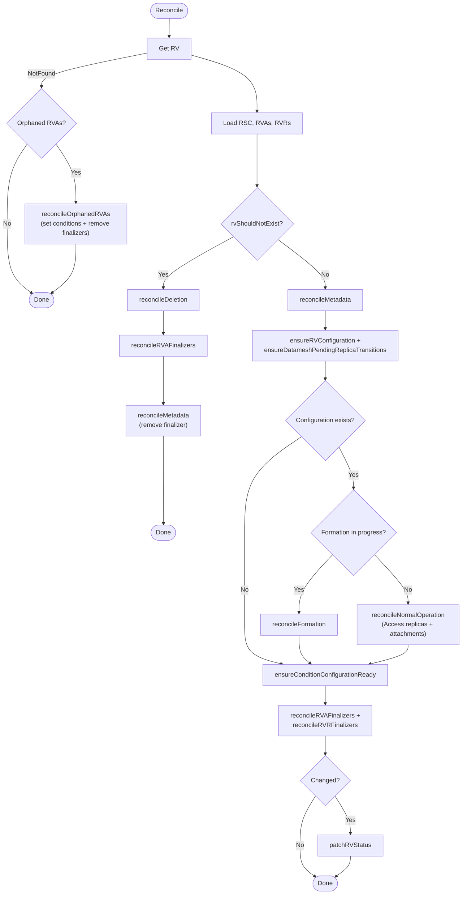
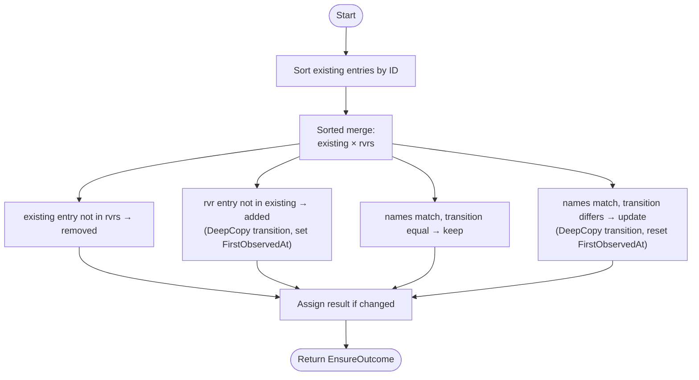
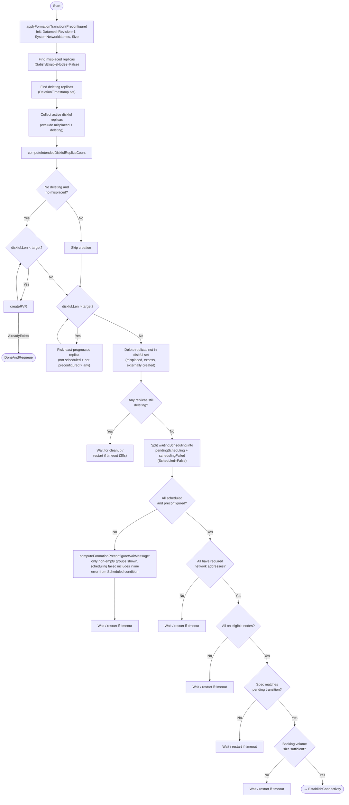
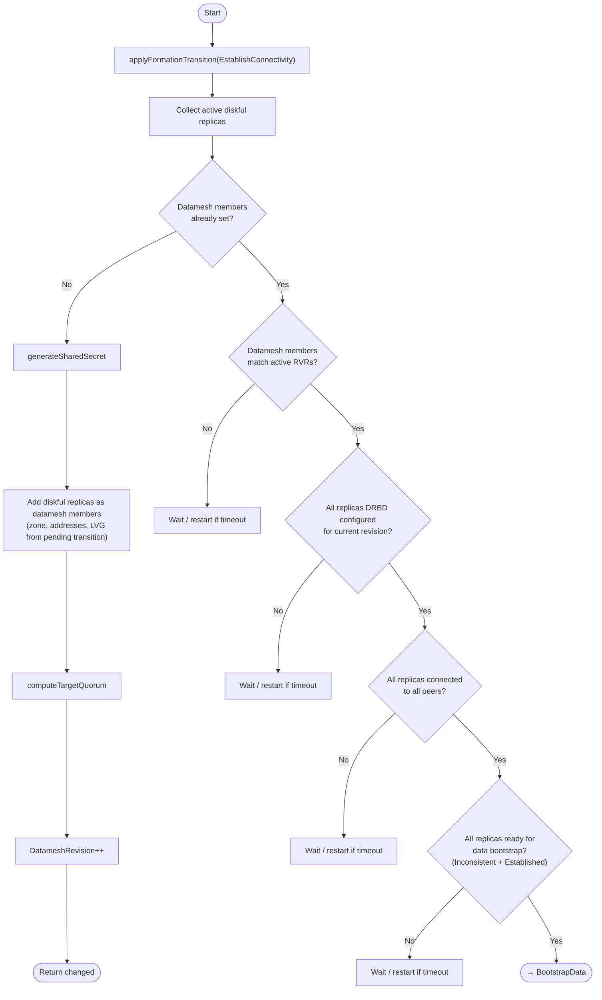
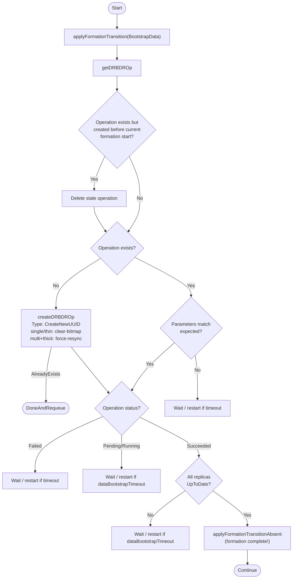
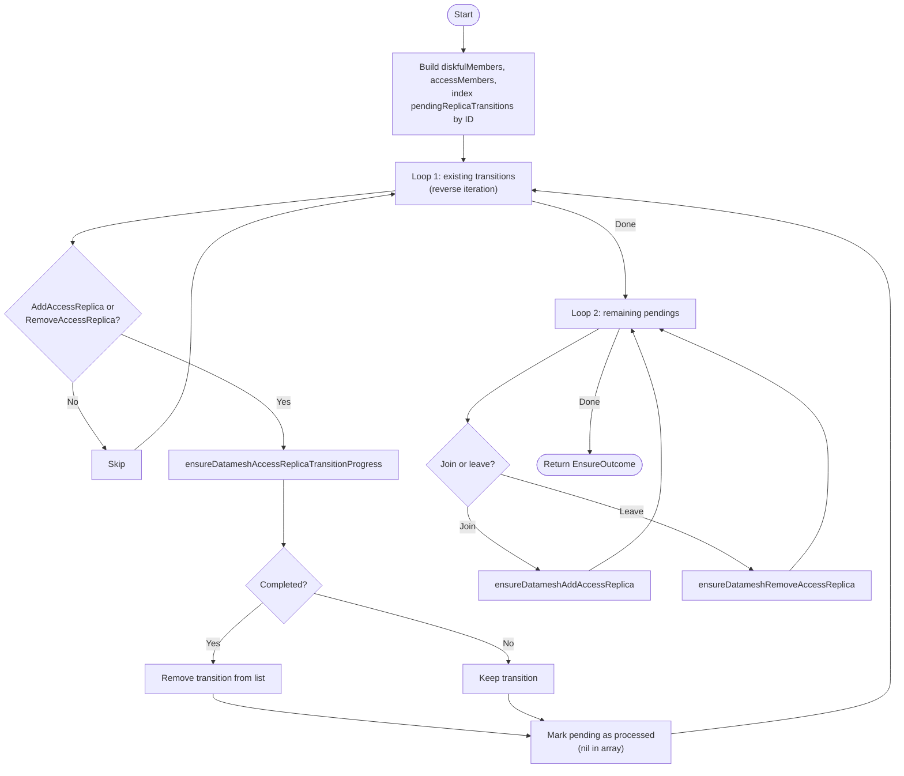
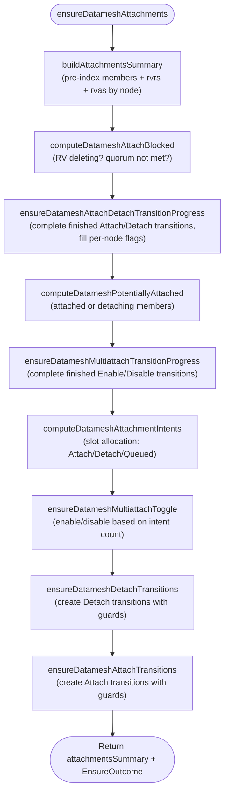
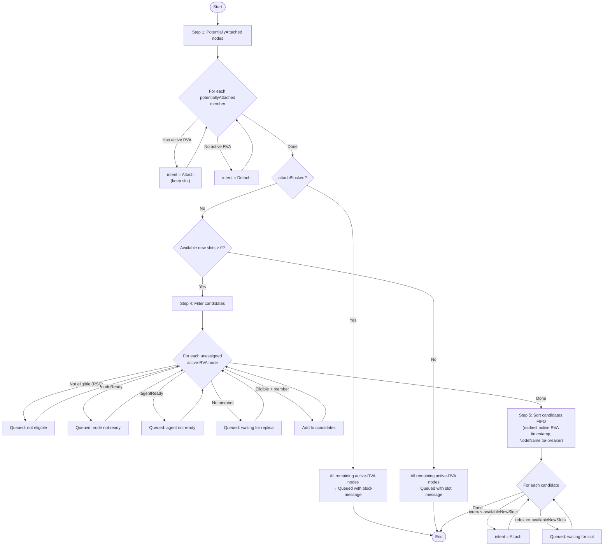

# rv_controller

This controller manages `ReplicatedVolume` (RV) resources by orchestrating datamesh formation, normal operation, and deletion.

## Purpose

The controller reconciles `ReplicatedVolume` with:

1. **Configuration initialization** — copies resolved configuration from `ReplicatedStorageClass` (RSC) into RV status
2. **Datamesh formation** — creates replicas, establishes DRBD connectivity, bootstraps data synchronization
3. **Normal operation** — steady-state datamesh lifecycle: Access replica create/delete/join/leave, attach/detach transitions, multiattach management *(WIP: missing diskful join/leave, tiebreaker, role changes)*
4. **Deletion** — cleans up child resources (RVRs, RVAs) and datamesh state

## Interactions

| Direction | Resource/Controller | Relationship |
|-----------|---------------------|--------------|
| ← input | ReplicatedStorageClass | Reads configuration (replication, topology, storage pool) |
| ← input | ReplicatedStoragePool | Reads eligible nodes, system networks, zones for formation and attach eligibility |
| ← input | ReplicatedVolumeReplica | Reads replica status (scheduling, preconfiguration, connectivity, data sync, quorum, attachment) |
| ← input | ReplicatedVolumeAttachment | Reads attachment intent (determines which nodes should be attached) |
| → manages | ReplicatedVolumeReplica | Creates/deletes during formation, normal operation (Access replicas), and deletion |
| → manages | ReplicatedVolumeAttachment | Manages finalizers; updates conditions during deletion |
| → manages | DRBDResourceOperation | Creates for data bootstrap during formation |

## Algorithm

The controller reconciles individual ReplicatedVolumes:

```
if rv deleted (NotFound):
    if orphaned RVAs exist:
        reconcileOrphanedRVAs (set conditions + remove finalizers) → Done
    else → Done

if shouldDelete (DeletionTimestamp + no attached members + no Detach transitions):
    reconcileDeletion (update RVA conditions → force-delete RVRs → clear datamesh members)
    reconcileRVAFinalizers (remove RVA finalizers — after conditions are set)
    reconcileMetadata (remove finalizer if no children left) → Done

ensure metadata (finalizer + labels)

ensure configuration from RSC
ensure datamesh pending replica transitions (sync from RVR statuses)

if configuration exists:
    if formation in progress (DatameshRevision == 0 or Formation transition active):
        reconcile formation (3-phase process)
    else:
        reconcile normal operation (WIP):
            create Access RVRs for Active RVAs on nodes without any RVR
            process Access replica datamesh membership (join/leave)
            process attach/detach transitions (slot allocation, multiattach, guards)
            delete unnecessary Access RVRs (redundant or unused)

ensure ConfigurationReady condition
reconcileRVAFinalizers (add/remove RVA finalizers)
reconcileRVRFinalizers (add/remove RVR finalizers)
patch status if changed
```

## Reconciliation Structure

```
Reconcile (root) [Pure orchestration]
├── getRV
├── rv == nil → getRVAs → reconcileOrphanedRVAs (set conditions + remove finalizers)
├── getRSC, getRVAs, getRVRsSorted
├── rvShouldNotExist (DeletionTimestamp + no attached + no Detach transitions) →
│   ├── reconcileDeletion [In-place reconciliation] ← details
│   │   ├── isRVAWaitingForRVConditionsInSync / applyRVAWaitingForRVConditions
│   │   ├── deleteRVRWithForcedFinalizerRemoval (loop)
│   │   └── clear datamesh members + patchRVStatus
│   ├── reconcileRVAFinalizers [Target-state driven]
│   │   ├── add RVControllerFinalizer to non-deleting RVAs
│   │   └── remove RVControllerFinalizer from deleting RVAs (when safe)
│   │       ├── hasOtherNonDeletingRVAOnNode (duplicate check)
│   │       └── isNodeAttachedOrDetaching (datamesh state check)
│   └── reconcileMetadata [Target-state driven] (remove finalizer)
├── reconcileMetadata [Target-state driven]
│   ├── isRVMetadataInSync
│   ├── applyRVMetadata (finalizer + labels)
│   └── patchRV
├── ensureRVConfiguration
├── ensureDatameshPendingReplicaTransitions ← details
├── reconcileFormation [Pure orchestration]
│   ├── reconcileFormationPhasePreconfigure [Pure orchestration] ← details
│   │   ├── applyFormationTransition
│   │   ├── create/delete RVRs (guards for deleting/misplaced, replica count management)
│   │   ├── wait for deleting replicas cleanup
│   │   ├── safety checks (addresses, eligible nodes, spec mismatch, backing volume size)
│   │   └── reconcileFormationRestartIfTimeoutPassed
│   ├── reconcileFormationPhaseEstablishConnectivity [Pure orchestration] ← details
│   │   ├── generateSharedSecret + applyDatameshMember
│   │   ├── computeTargetQuorum
│   │   ├── verify configured, connected, ready for data bootstrap
│   │   └── reconcileFormationRestartIfTimeoutPassed
│   └── reconcileFormationPhaseBootstrapData [Pure orchestration] ← details
│       ├── createDRBDROp (new-current-uuid)
│       ├── verify operation status + UpToDate replicas
│       ├── reconcileFormationRestartIfTimeoutPassed
│       └── applyFormationTransitionAbsent (formation complete)
├── reconcileNormalOperation [Pure orchestration] (WIP)
│   ├── reconcileCreateAccessReplicas [Pure orchestration] ← details
│   ├── ensureDatameshAccessReplicas ← details
│   │   ├── ensureDatameshAccessReplicaTransitionProgress (loop: active transitions)
│   │   ├── ensureDatameshAddAccessReplica (loop: pending joins)
│   │   └── ensureDatameshRemoveAccessReplica (loop: pending leaves)
│   ├── ensureDatameshAttachments ← details
│   │   ├── buildAttachmentsSummary ← details
│   │   ├── computeDatameshAttachBlocked
│   │   ├── ensureDatameshAttachDetachTransitionProgress
│   │   ├── computeDatameshPotentiallyAttached
│   │   ├── ensureDatameshMultiattachTransitionProgress
│   │   ├── computeDatameshAttachmentIntents ← details
│   │   ├── ensureDatameshMultiattachToggle
│   │   ├── ensureDatameshDetachTransitions ← details
│   │   └── ensureDatameshAttachTransitions ← details
│   └── reconcileDeleteAccessReplicas [Pure orchestration] ← details
├── ensureConditionConfigurationReady ← details
├── reconcileRVAFinalizers [Target-state driven] (same as deletion branch)
├── reconcileRVRFinalizers [Target-state driven]
│   ├── add RVControllerFinalizer to non-deleting RVRs
│   └── remove RVControllerFinalizer from deleting RVRs (when safe)
│       └── isRVRMemberOrLeavingDatamesh (member + RemoveAccessReplica check)
└── patchRVStatus
```

Links to detailed algorithms: [`reconcileDeletion`](#reconciledeletion-details), [`ensureDatameshPendingReplicaTransitions`](#ensuredatameshpendingreplicatransitions-details), [`reconcileFormationPhasePreconfigure`](#reconcileformationphasepreconfigure-details), [`reconcileFormationPhaseEstablishConnectivity`](#reconcileformationphaseestablishconnectivity-details), [`reconcileFormationPhaseBootstrapData`](#reconcileformationphasebootstrapdata-details), [`reconcileCreateAccessReplicas`](#reconcilecreateaccessreplicas-details), [`reconcileDeleteAccessReplicas`](#reconciledeleteaccessreplicas-details), [`ensureDatameshAccessReplicas`](#ensuredatameshaccessreplicas-details), [`ensureDatameshAttachments`](#ensuredatameshattachments-details), [`buildAttachmentsSummary`](#buildattachmentssummary-details), [`computeDatameshAttachmentIntents`](#computedatameshattachmentintents-details), [`ensureDatameshDetachTransitions`](#ensuredatameshdetachtransitions-details), [`ensureDatameshAttachTransitions`](#ensuredatameshattachtransitions-details), [`ensureConditionConfigurationReady`](#ensureconditionconfigurationready-details)

## Algorithm Flow



## Conditions

### ConfigurationReady

Indicates whether the RV configuration is initialized and matches the storage class.

| Status | Reason | When |
|--------|--------|------|
| True | Ready | Configuration matches storage class generation |
| False | WaitingForStorageClass | RSC not found or RSC configuration not ready |
| False | ConfigurationRolloutInProgress | ConfigurationGeneration not yet set (initial rollout) |
| False | StaleConfiguration | RV configuration generation does not match RSC generation |

## Formation Phases

Datamesh formation is a 3-phase process that creates and configures DRBD replicas. Each phase has a timeout; if progress stalls, formation restarts from scratch.

### Phase 1: Preconfigure

Creates diskful replicas and waits for them to become preconfigured (DRBD setup complete, ready for datamesh membership).

**Steps:**
1. Initialize datamesh configuration (SystemNetworkNames, Size, DatameshRevision=1)
2. Identify misplaced replicas (SatisfyEligibleNodes=False) and deleting replicas (DeletionTimestamp set)
3. Collect active diskful replicas (excluding misplaced and deleting)
4. Create missing diskful replicas only when no deleting or misplaced replicas exist (prevents zombie accumulation)
5. Remove excess/misplaced replicas
6. Wait for all deleting replicas to be fully removed (restart formation if timeout)
7. Wait for scheduling and preconfiguration (replicas split into pending scheduling / scheduling failed / preconfiguring; scheduling failure messages from RVR Scheduled=False conditions are shown inline)
8. Safety checks: addresses, eligible nodes, spec consistency, backing volume size

### Phase 2: Establish Connectivity

Adds preconfigured replicas to the datamesh and waits for DRBD peer connections.

**Steps:**
1. Generate shared secret for DRBD peer authentication
2. Add diskful replicas as datamesh members (with zone, addresses, LVG info)
3. Set quorum parameters
4. Wait for all replicas to apply DRBD configuration (DRBDConfigured=True)
5. Wait for all replicas to connect to each other (ConnectionState=Connected)
6. Wait for data bootstrap readiness (BackingVolume=Inconsistent + Replication=Established)

### Phase 3: Bootstrap Data

Triggers initial data synchronization via DRBDResourceOperation and waits for completion.

**Steps:**
1. Create DRBDResourceOperation (type: CreateNewUUID)
   - Single replica (any pool type): clear-bitmap (no peers to synchronize with)
   - Multiple replicas, thin provisioning: clear-bitmap (no full resync needed)
   - Multiple replicas, thick provisioning: force-resync (full data synchronization)
2. Wait for operation to succeed
3. Wait for all replicas to reach UpToDate state
4. Remove Formation transition (formation complete)

**Timeout calculation:**
- Base: 1 minute
- Force-resync (multi-replica thick provisioning): + volume size / 100 Mbit/s (worst-case bandwidth estimate)
- Clear-bitmap (single replica or thin provisioning): base only

### Formation Restart

When formation stalls (any safety check fails or progress timeout is exceeded), formation restarts:

1. Wait for timeout since formation started (to avoid thrashing)
2. Log error (formation timed out)
3. Delete formation DRBDResourceOperation if exists
4. Delete all replicas (with finalizer removal)
5. Reset all status fields (Configuration, DatameshRevision, Datamesh, transitions)
6. Re-initialize configuration from RSC (to avoid intermediate nil state that would trigger unnecessary RSC reconciliation)
7. Requeue for fresh start

## Attachment Lifecycle

Attachment is the process of making a datamesh volume accessible (Primary in DRBD terms) on a specific node. The attachment pipeline runs during normal operation and is orchestrated by `ensureDatameshAttachments`.

### Concepts

- **Slot**: an attachment slot controlled by `rv.Spec.MaxAttachments`. Nodes compete for slots to become attached.
- **PotentiallyAttached**: a member that is attached (`member.Attached=true`) or has an active Detach transition (may still be Primary until confirmed). These always occupy a slot.
- **Intent**: each node gets an attachment intent — `Attach` (has slot), `Detach` (should detach), `Queued` (waiting for slot or blocked), or no intent (not processed).
- **Multiattach**: when more than one node needs to be attached simultaneously, DRBD must be configured for multiattach before any second Attach transition can proceed. Controlled by `rv.Status.Datamesh.Multiattach` and Enable/Disable Multiattach transitions.

### Slot allocation

1. PotentiallyAttached nodes with active RVA keep their slot (intent=Attach); without active RVA get intent=Detach
2. Already-attached nodes NEVER lose their slot when `maxAttachments` decreases
3. If attach is globally blocked (RV deleting, quorum not satisfied) — all remaining nodes are Queued
4. Remaining candidates (eligible RSP node + has datamesh member) compete in FIFO order (by earliest RVA creation timestamp)
5. Nodes without a datamesh member, on ineligible nodes, or with node/agent not ready are Queued with a specific message

### Multiattach lifecycle

- **EnableMultiattach**: triggered when `intendedAttachments > 1` and not already enabled. Bumps revision, creates EnableMultiattach transition. Must be confirmed by all Diskful + potentiallyAttached members before Attach transitions can proceed.
- **DisableMultiattach**: triggered when `intendedAttachments <= 1` AND `potentiallyAttached <= 1`. Bumps revision, creates DisableMultiattach transition.
- Enable and Disable are mutually exclusive — no concurrent multiattach transitions.

### Transition confirmation

All Attach/Detach/EnableMultiattach/DisableMultiattach transitions are confirmed when the target replicas report `DatameshRevision >= transition.DatameshRevision`. The transition is then removed from `rv.Status.DatameshTransitions`.

## Managed Metadata

| Type | Key | Managed On | Purpose |
|------|-----|------------|---------|
| Finalizer | `sds-replicated-volume.deckhouse.io/rv-controller` | RV | Prevent deletion while child resources exist |
| Label | `sds-replicated-volume.deckhouse.io/replicated-storage-class` | RV | Link to ReplicatedStorageClass |
| Finalizer | `sds-replicated-volume.deckhouse.io/rv-controller` | RVA | Prevent deletion while node is attached or detaching |
| Finalizer | `sds-replicated-volume.deckhouse.io/rv-controller` | RVR | Prevent deletion while RVR is a datamesh member or leaving datamesh; force-removed during formation restart / RV deletion |
| OwnerRef | controller reference | DRBDResourceOperation | Owner reference to RV |

## Watches

| Resource | Events | Handler |
|----------|--------|---------|
| ReplicatedVolume | Generation, DeletionTimestamp, ReplicatedStorageClass label, Finalizers changes | For() (primary) |
| ReplicatedStorageClass | ConfigurationGeneration changes | mapRSCToRVs (index lookup) |
| ReplicatedVolumeAttachment | DeletionTimestamp, Finalizers, Attached condition status changes | mapRVAToRV |
| ReplicatedVolumeReplica | Conditions (Scheduled, DRBDConfigured, SatisfyEligibleNodes), DatameshPendingTransition, DatameshRevision, Addresses, BackingVolume, Peers, DeletionTimestamp, Finalizers changes | mapRVRToRV |
| DRBDResourceOperation | Create/Delete of *-formation ops, Phase changes, Generation changes | Owns() |

## Indexes

| Index | Field | Purpose |
|-------|-------|---------|
| `IndexFieldRVByReplicatedStorageClassName` | `spec.replicatedStorageClassName` | Map RSC events to RVs |
| `IndexFieldRVAByReplicatedVolumeName` | `spec.replicatedVolumeName` | List RVAs for an RV |
| `IndexFieldRVRByReplicatedVolumeName` | `spec.replicatedVolumeName` | List RVRs for an RV |

## Data Flow

```mermaid
flowchart TD
    subgraph inputs [Inputs]
        RSCStatus[RSC.status.configuration]
        RSP[RSP.status]
        RVRStatus[RVR.status]
        RVAStatus[RVA.status]
    end

    subgraph reconcilers [Reconcilers]
        ReconcileMeta[reconcileMetadata]
        ReconcileFormation[reconcileFormation]
        ReconcileNormalOp[reconcileNormalOperation]
        ReconcileDeletion[reconcileDeletion]
    end

    subgraph ensures [Ensure Helpers]
        EnsureConfig[ensureRVConfiguration]
        EnsurePending[ensureDatameshPendingReplicaTransitions]
        EnsureAttachments[ensureDatameshAttachments]
        EnsureCondConfig[ensureConditionConfigurationReady]
    end

    subgraph outputs [Outputs]
        RVMeta[RV metadata]
        RVStatus[RV.status]
        RVRManaged[RVR create/delete]
        DRBDROp[DRBDResourceOperation]
        RVAConditions[RVA conditions]
    end

    RSCStatus --> EnsureConfig
    RSCStatus --> EnsureCondConfig
    RVRStatus --> EnsurePending
    RVRStatus --> ReconcileFormation
    RSP --> ReconcileFormation
    RVRStatus --> ReconcileNormalOp
    RSP --> ReconcileNormalOp
    RVAStatus --> ReconcileNormalOp
    RVAStatus --> ReconcileDeletion
    RVRStatus --> EnsureAttachments
    RVAStatus --> EnsureAttachments
    RSP --> EnsureAttachments

    ReconcileMeta --> RVMeta
    EnsureConfig --> RVStatus
    EnsurePending --> RVStatus
    EnsureAttachments --> RVStatus
    EnsureCondConfig --> RVStatus
    ReconcileFormation --> RVStatus
    ReconcileFormation --> RVRManaged
    ReconcileFormation --> DRBDROp
    ReconcileNormalOp --> RVStatus
    ReconcileNormalOp --> RVRManaged
    ReconcileDeletion --> RVAConditions
    ReconcileDeletion --> RVRManaged
    ReconcileDeletion --> RVStatus
```



---

## Detailed Algorithms

### reconcileDeletion Details

**Purpose:** Handles RV deletion — updates RVA conditions, removes RVR finalizers and deletes RVRs, clears datamesh members.

**Algorithm:**


**Data Flow:**

| Input | Output |
|-------|--------|
| `rvas` | Patched RVA conditions (Attached=False, Ready=False) |
| `rvrs` | All RVRs deleted (finalizers removed first) |
| `rv.Status.Datamesh.Members` | Cleared to nil |

---

### ensureDatameshPendingReplicaTransitions Details

**Purpose:** Synchronizes `rv.Status.DatameshPendingReplicaTransitions` with the current `DatameshPendingTransition` from each RVR. Uses a sorted merge algorithm for determinism.

**Algorithm:**



**Data Flow:**

| Input | Description |
|-------|-------------|
| `rv.Status.DatameshPendingReplicaTransitions` | Existing pending transitions |
| `rvrs[].Status.DatameshPendingTransition` | Current pending transition per RVR |

| Output | Description |
|--------|-------------|
| `rv.Status.DatameshPendingReplicaTransitions` | Synchronized list (sorted by ID) |

---

### reconcileFormationPhasePreconfigure Details

**Purpose:** Creates diskful replicas and waits for them to become preconfigured (DRBD setup complete, ready for datamesh membership). Performs safety checks before advancing.

**Algorithm:**



**Data Flow:**

| Input | Description |
|-------|-------------|
| `rv.Spec.Size` | Target volume size |
| `rv.Status.Configuration.Replication` | Replication mode (determines replica count) |
| `rsp` | Storage pool view (eligible nodes, system network names) |
| `rvrs` | Current replicas (status: scheduled, preconfigured, addresses, backing volume) |

| Output | Description |
|--------|-------------|
| `rv.Status.DatameshRevision` | Set to 1 on first entry |
| `rv.Status.Datamesh.SystemNetworkNames` | Copied from RSP |
| `rv.Status.Datamesh.Size` | Copied from RV spec |
| RVR create/delete | Replica count adjusted |
| Formation transition messages | Progress/error reporting |

---

### reconcileFormationPhaseEstablishConnectivity Details

**Purpose:** Adds preconfigured replicas to the datamesh (with shared secret and quorum), then waits for DRBD configuration, peer connections, and replication establishment.

**Algorithm:**



**Data Flow:**

| Input | Description |
|-------|-------------|
| `rvrs` | Replica status (DRBDConfigured, peers, backing volume state) |
| `rsp.EligibleNodes` | Zone information for datamesh members |

| Output | Description |
|--------|-------------|
| `rv.Status.Datamesh.SharedSecret` | Generated DRBD shared secret |
| `rv.Status.Datamesh.Members` | Datamesh member list |
| `rv.Status.Datamesh.Quorum` | Quorum threshold |
| `rv.Status.DatameshRevision` | Incremented revision |

---

### reconcileFormationPhaseBootstrapData Details

**Purpose:** Creates a DRBDResourceOperation to trigger initial data synchronization, waits for completion, and finalizes formation.

**Algorithm:**



**Data Flow:**

| Input | Description |
|-------|-------------|
| `rv.Status.Datamesh.Members` | Diskful members (target for operation, count determines single/multi-replica) |
| `rsp.Type` | LVM or LVMThin (together with replica count determines sync mode) |
| `rv.Status.Datamesh.Size` | Volume size (for force-resync timeout calculation) |

| Output | Description |
|--------|-------------|
| `DRBDResourceOperation` | Created/verified data bootstrap operation |
| `rv.Status.DatameshTransitions` | Formation transition removed on success |

---

### ensureConditionConfigurationReady Details

**Purpose:** Sets the `ConfigurationReady` condition based on RSC availability and configuration generation matching.

**Algorithm:**


**Data Flow:**

| Input | Description |
|-------|-------------|
| `rsc` | ReplicatedStorageClass (may be nil) |
| `rsc.Status.Configuration` | RSC configuration availability |
| `rsc.Status.ConfigurationGeneration` | RSC generation for comparison |
| `rv.Status.ConfigurationGeneration` | RV's stored generation |

| Output | Description |
|--------|-------------|
| `ConfigurationReady` condition | Reports configuration state |

---

### reconcileCreateAccessReplicas Details

**Purpose:** Creates Access RVRs for active (non-deleting) RVAs on nodes that do not yet have any RVR. Called from `reconcileNormalOperation` before `ensureDatameshAccessReplicas`.

**File:** `reconciler_access_replicas.go`

#### Creation guards

| # | Guard | Outcome |
|---|-------|---------|
| 1 | RV deleting | No creation (detach-only mode) |
| 2 | VolumeAccess=Local | No creation |
| 3 | RSP nil | No creation |
| 4 | RVR already exists on node (any type, including deleting) | Skip node |
| 5 | Node not in eligible nodes, or !nodeReady, or !agentReady | Skip node |
| 6 | Duplicate RVA on same node | Deduplicate (one creation per node) |

All guards passed: create Access RVR via `createAccessRVR` (sets `spec.type=Access`, `spec.nodeName`). On `AlreadyExists`: requeue.

**Data Flow:**

| Input | Description |
|-------|-------------|
| `rv.DeletionTimestamp` | Detach-only mode check |
| `rv.Status.Configuration.VolumeAccess` | Local blocks Access creation |
| `rvas` | Active RVAs determine which nodes need Access replicas |
| `rvrs` | Existing replicas (any type on node blocks creation) |
| `rsp.EligibleNodes` | Node readiness check |

| Output | Description |
|--------|-------------|
| RVR create | Access RVRs created for eligible nodes |

---

### reconcileDeleteAccessReplicas Details

**Purpose:** Deletes Access RVRs that are redundant (another datamesh member on the same node) or unused (no active RVA on the node). Called from `reconcileNormalOperation` after `ensureDatameshAccessReplicas`.

**File:** `reconciler_access_replicas.go`

#### Deletion guards

| # | Guard | Outcome |
|---|-------|---------|
| 1 | Not Access type | Skip |
| 2 | Already deleting (DeletionTimestamp set) | Skip |
| 3 | Attached (datamesh member with attached=true) | Skip (hard invariant) |
| 4 | Active Detach or AddAccessReplica transition for this replica | Skip (avoid churn) |
| 5 | Another datamesh member on same node | **Delete** (redundant, even if RVA exists) |
| 6 | No active (non-deleting) RVA on node | **Delete** (unused) |

Deletion via `deleteRVR` (sets DeletionTimestamp). The existing pipeline handles the rest:
- If datamesh member: rvr_controller forms leave pending, `ensureDatameshRemoveAccessReplica` creates RemoveAccessReplica transition, `reconcileRVRFinalizers` removes finalizer after completion.
- If not datamesh member: `reconcileRVRFinalizers` removes finalizer directly.

**Data Flow:**

| Input | Description |
|-------|-------------|
| `rv.Status.Datamesh.Members` | Attached check, redundancy check (other member on same node) |
| `rv.Status.DatameshTransitions` | Active Detach/AddAccessReplica check |
| `rvrs` | Access RVRs to evaluate |
| `rvas` | Active RVAs determine which nodes still need Access replicas |

| Output | Description |
|--------|-------------|
| RVR delete | Unneeded Access RVRs deleted (DeletionTimestamp set) |

---

### ensureDatameshAccessReplicas Details

**Purpose:** Coordinates Access replica datamesh membership: completes finished transitions, processes join requests, and processes leave requests. Called from `reconcileNormalOperation`.

**Algorithm:**



#### ensureDatameshAddAccessReplica (join guards)

| # | Guard | Outcome |
|---|-------|---------|
| 1 | Already a datamesh member | Skip (transient state) |
| 2 | RV deleting | Message: "Will not join datamesh: volume is being deleted" |
| 3 | VolumeAccess=Local | Message: "Will not join datamesh: volumeAccess is Local" |
| 4 | RVR not found | Skip silently |
| 5 | Addresses empty | Message: "Waiting for replica addresses to be populated" |
| 6 | Member already on same node | Message: member info |
| 7 | RSP nil | Message: "Waiting for ReplicatedStoragePool to be available" |
| 8 | Node not in eligible nodes | Message: node name |

All guards passed: add member to datamesh, increment revision, create AddAccessReplica transition.

#### ensureDatameshRemoveAccessReplica (leave guards)

| # | Guard | Outcome |
|---|-------|---------|
| 1 | Not a datamesh member | Skip (transient state) |
| 2 | Member type is not Access | Skip (defensive) |
| 3 | Member is attached | Message: "Cannot leave datamesh: replica is attached, detach required first" |

All guards passed: remove member from datamesh, increment revision, create RemoveAccessReplica transition.

#### ensureDatameshAccessReplicaTransitionProgress

Checks confirmation progress for a single AddAccessReplica or RemoveAccessReplica transition:

- **Confirmation**: a replica is confirmed when `DatameshRevision >= transition.DatameshRevision`.
- **RemoveAccessReplica special case**: the leaving replica also counts as confirmed when `DatameshRevision == 0` (it left the datamesh and reset its revision).
- **Error reporting**: waiting replicas with `Configured=False` are reported as errors in the transition message. For AddAccessReplica, the subject replica's `Configured=False` with reason `PendingJoin` is expected and skipped (it has not joined the datamesh yet).

**Data Flow:**

| Input | Description |
|-------|-------------|
| `rv.Status.DatameshPendingReplicaTransitions` | Pending join/leave requests from RVRs |
| `rv.Status.DatameshTransitions` | Active transitions |
| `rv.Status.Datamesh.Members` | Current datamesh members |
| `rv.Status.Configuration.VolumeAccess` | Volume access mode (Local blocks join) |
| `rvrs[].Status.DatameshRevision` | Replica confirmation progress |
| `rvrs[].Status.Addresses` | Replica addresses (required for join) |
| `rvrs[].Status.Conditions` | Configured condition (for error reporting) |
| `rsp.EligibleNodes` | Eligible nodes with zones (for join) |

| Output | Description |
|--------|-------------|
| `rv.Status.Datamesh.Members` | Members added/removed |
| `rv.Status.DatameshRevision` | Incremented on join/leave |
| `rv.Status.DatameshTransitions` | Transitions created/completed/removed |
| `rv.Status.DatameshPendingReplicaTransitions[].Message` | Progress/error messages |

---

### ensureDatameshAttachments Details

**Purpose:** Coordinates datamesh attach/detach transitions: builds a pre-indexed attachment summary, determines which nodes should be attached/detached, manages multiattach state, and creates Attach/Detach transitions with guard rules. Returns an `attachmentsSummary` for downstream consumers (e.g., RVA condition reconciliation).

**File:** `reconciler_dm_attachments.go`

**Pipeline:**



**Ordering constraints between sub-functions:**

| Step | Depends on | Reason |
|------|-----------|--------|
| `computeDatameshAttachBlocked` | `buildAttachmentsSummary` | Needs members indexed |
| `ensureDatameshAttachDetachTransitionProgress` | `buildAttachmentsSummary` | Needs `attachmentStateByReplicaID` index |
| `computeDatameshPotentiallyAttached` | `ensureDatameshAttachDetachTransitionProgress` | Needs `hasActiveDetachTransition` flags |
| `ensureDatameshMultiattachTransitionProgress` | `computeDatameshPotentiallyAttached` | Needs `potentiallyAttached` for mustConfirm set |
| `computeDatameshAttachmentIntents` | `computeDatameshPotentiallyAttached` | Needs `potentiallyAttached` for slot allocation |
| `ensureDatameshMultiattachToggle` | `computeDatameshAttachmentIntents` | Needs `intendedAttachments` count |
| `ensureDatameshDetachTransitions` | `computeDatameshAttachmentIntents` | Needs intent=Detach |
| `ensureDatameshAttachTransitions` | `ensureDatameshDetachTransitions` | Detach transitions may set flags read by Attach guards |

**Key types:**

- `attachmentsSummary`: pre-indexed summary of all attachment data. Contains `attachmentStates` sorted by NodeName (binary search via `findAttachmentStateByNodeName`), `attachmentStateByReplicaID` for O(1) lookup, global flags (`attachBlocked`, `hasActiveEnableMultiattachTransition`, etc.), and the `intendedAttachments` / `potentiallyAttached` ID sets.
- `attachmentState`: per-node data. Contains `nodeName`, `intent` (Attach/Detach/Queued/""), pointers to `member`, `rvr`, `rvas`, per-node transition flags, and `progressMessage`.

**Data Flow:**

| Input | Description |
|-------|-------------|
| `rv.Status.Datamesh.Members` | Current datamesh members (Attached flag, NodeName, Type) |
| `rv.Status.DatameshTransitions` | Active transitions |
| `rv.Status.Datamesh.Multiattach` | Current multiattach state |
| `rv.Status.Datamesh.QuorumMinimumRedundancy` | Quorum threshold for attach block |
| `rv.Spec.MaxAttachments` | Maximum allowed simultaneous attachments |
| `rvrs[].Status.DatameshRevision` | Transition confirmation progress |
| `rvrs[].Status.Quorum` | Per-replica quorum flag (for attach block check) |
| `rvrs[].Status.Attachment.InUse` | Device in-use flag (blocks detach) |
| `rvrs[].Status.Conditions.Ready` | RVR Ready condition (required for attach) |
| `rvas` | Attachment intent: active RVAs determine which nodes should be attached |
| `rsp.EligibleNodes` | Node eligibility for attach candidates |

| Output | Description |
|--------|-------------|
| `rv.Status.Datamesh.Members[].Attached` | Updated attached flag on members |
| `rv.Status.Datamesh.Multiattach` | Toggled on/off |
| `rv.Status.DatameshRevision` | Incremented per transition |
| `rv.Status.DatameshTransitions` | Transitions created/completed/removed |
| `attachmentsSummary` | Returned for downstream use |

---

### buildAttachmentsSummary Details

**Purpose:** Builds the pre-indexed `attachmentsSummary` from rv, rvrs, and rvas. Populates `attachmentStates` (sorted by NodeName) with member/rvr/rvas pointers and the `attachmentStateByReplicaID` index. Does NOT fill intent, transition flags, or counts.

**File:** `reconciler_dm_attachments.go`

**Algorithm:**


**Pre-conditions:**
- `rvas` MUST be sorted by NodeName (primary), CreationTimestamp (secondary) — as returned by `getRVAsSorted`
- `rv.Status.Datamesh.Members` are sorted in-place (stack-allocated `[32]*member` array avoids heap allocation)

**What is NOT filled** (populated by subsequent pipeline steps):
- `intent` on each `attachmentState`
- `hasActiveAttachTransition`, `hasActiveDetachTransition`, `hasActiveAddAccessTransition` flags
- `progressMessage`
- Global: `attachBlocked`, `intendedAttachments`, `potentiallyAttached`, multiattach flags

**Data Flow:**

| Input | Description |
|-------|-------------|
| `rv.Status.Datamesh.Members` | Datamesh members (pointer into rv, sorted by NodeName) |
| `rvrs` | Replicas (sorted by ID, used for `findRVRByID` and NodeName fallback) |
| `rvas` | Attachments (sorted by NodeName, sub-sliced per node — zero alloc) |

| Output | Description |
|--------|-------------|
| `attachmentsSummary.attachmentStates` | Per-node states sorted by NodeName |
| `attachmentsSummary.attachmentStateByReplicaID` | O(1) index by member ID |

---

### computeDatameshAttachmentIntents Details

**Purpose:** Computes the attachment intent (Attach/Detach/Queued) for each node in the attachments summary. Determines which nodes get attachment slots, respecting already-attached nodes, global blocks, slot limits, and node eligibility.

**File:** `reconciler_dm_attachments.go`

Must be called AFTER `computeDatameshPotentiallyAttached` (needs `atts.potentiallyAttached`).

**Algorithm:**



**Key invariant:** Already-attached nodes (potentiallyAttached) NEVER lose their slot when `maxAttachments` decreases. `occupiedSlots` may exceed `maxAttachments` — this is a normal transient state (no forced detach).

**Queued node message examples:**
- `"Volume is being deleted"` (global block)
- `"Quorum not satisfied (N/M replicas with quorum)"` (global block)
- `"Waiting for attachment slot (slots occupied N/M)"` (no slot available)
- `"Node is not eligible for storage class X (pool Y)"` (RSP check)
- `"Node is not ready"` / `"Agent is not ready on node"` (node health)
- `"Waiting for replica on node"` (no RVR on node)
- `"Waiting for replica [#N] to join datamesh: ..."` (RVR exists but not a member yet, with pending transition message or Ready condition details)

**Data Flow:**

| Input | Description |
|-------|-------------|
| `atts.potentiallyAttached` | Pre-computed set of attached/detaching member IDs |
| `atts.attachBlocked` / `atts.attachBlockedMessage` | Global block state |
| `rv.Spec.MaxAttachments` | Slot limit |
| `rsp.EligibleNodes` | Node eligibility (nodeReady, agentReady) |

| Output | Description |
|--------|-------------|
| `atts.attachmentStates[].intent` | Attach / Detach / Queued per node |
| `atts.attachmentStates[].progressMessage` | Blocker reason for Queued nodes |
| `atts.intendedAttachments` | Set of member IDs with intent=Attach |

---

### ensureDatameshDetachTransitions Details

**Purpose:** Creates Detach transitions for nodes with intent=Detach, respecting guard rules. Sets progress messages on blocked nodes. Returns true if rv was changed.

**File:** `reconciler_dm_attachments.go`

#### Detach guards

| # | Guard | Outcome |
|---|-------|---------|
| 1 | Already fully detached (member.Attached=false, no active Detach transition) | Skip (settled) |
| 2 | Active Detach transition already exists | Skip |
| 3 | Active Attach transition on same replica | Block: "Detach pending, waiting for attach to complete first" |
| 4 | Device in use (`rvr.Status.Attachment.InUse`) | Block: "Device in use, detach blocked" |

All guards passed: set `member.Attached=false`, increment `DatameshRevision`, create Detach transition with progress message. Set `hasActiveDetachTransition=true` on the node.

**Note:** RVR existence and Ready condition are NOT checked for detach — detach proceeds regardless. If the RVR is missing, no one will confirm the revision, but that is handled separately.

---

### ensureDatameshAttachTransitions Details

**Purpose:** Creates Attach transitions for nodes with intent=Attach, respecting guard rules and multiattach constraints. Sets progress messages on blocked nodes. Returns true if rv was changed.

**File:** `reconciler_dm_attachments.go`

#### Global block

If `atts.attachBlocked` is true, all nodes with intent=Attach that don't already have a progress message get the global block message. No transitions are created.

#### Attach guards (per-node)

| # | Guard | Outcome |
|---|-------|---------|
| 1 | Already fully attached (member.Attached=true, no active Attach transition) | Skip (settled) |
| 2 | Active Attach transition already exists | Skip |
| 3 | Active Detach transition on same replica | Block: "Attach pending, waiting for detach to complete first" |
| 4 | Active AddAccessReplica transition for same replica | Block: "Waiting for replica to join datamesh" |
| 5 | No datamesh member (defensive) | Block: "Waiting for datamesh member" |
| 6 | No RVR (defensive) | Block: "Waiting for replica" |
| 7 | RVR Ready condition not True | Block: "Waiting for replica to become Ready" |
| 8 | potentiallyAttached non-empty + multiattach not enabled or EnableMultiattach in progress | Block: "Waiting for multiattach to be enabled" (with transition progress) |
| 9 | potentiallyAttached non-empty + DisableMultiattach in progress (defensive) | Block: "Waiting for multiattach to be enabled, but disable is in progress" |

All guards passed: set `member.Attached=true`, increment `DatameshRevision`, create Attach transition with progress message. Add member to `potentiallyAttached`. Set `hasActiveAttachTransition=true` on the node.

**Note on multiattach guards (8-9):** When `potentiallyAttached` is empty, multiattach guards are skipped entirely — the first attach on an empty datamesh does not require multiattach. When `potentiallyAttached` is non-empty, multiattach must be fully enabled (confirmed by all required members) before a new Attach can proceed. Guards 8 and 9 use `break` (not `continue`) — they block ALL remaining Attach-intent nodes, not just the current one.

**Data Flow:**

| Input | Description |
|-------|-------------|
| `atts.attachmentStates[].intent` | Must be `attachmentIntentAttach` |
| `atts.attachBlocked` | Global block check |
| `atts.potentiallyAttached` | Multiattach guard input |
| `rv.Status.Datamesh.Multiattach` | Current multiattach state |
| `atts.hasActiveEnableMultiattachTransition` | Multiattach guard |
| `atts.hasActiveDisableMultiattachTransition` | Multiattach guard |
| Per-node: `member`, `rvr`, transition flags | Guard inputs |

| Output | Description |
|--------|-------------|
| `rv.Status.Datamesh.Members[].Attached` | Set to true |
| `rv.Status.DatameshRevision` | Incremented |
| `rv.Status.DatameshTransitions` | Attach transition appended |
| `atts.potentiallyAttached` | Updated (member added) |
| `atts.attachmentStates[].progressMessage` | Set for blocked nodes |
