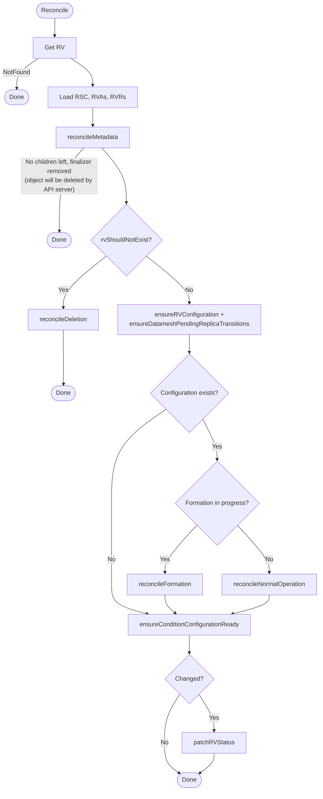
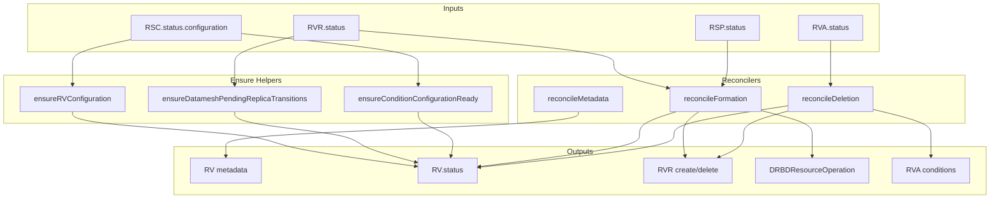
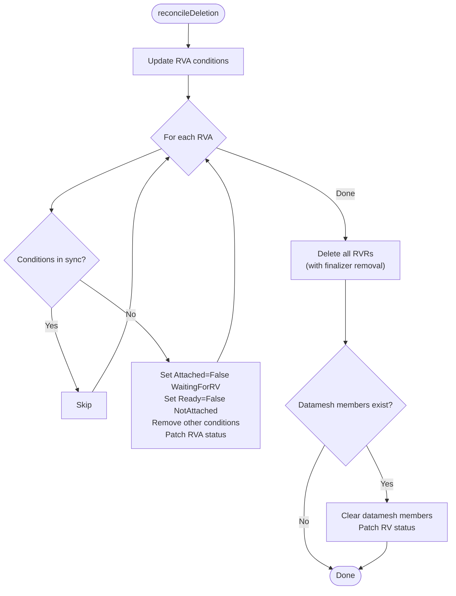
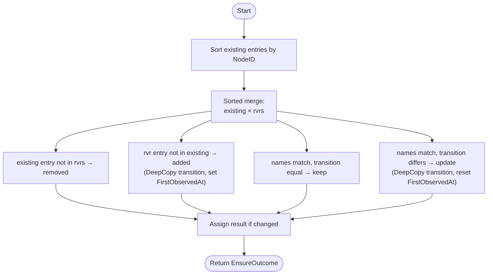
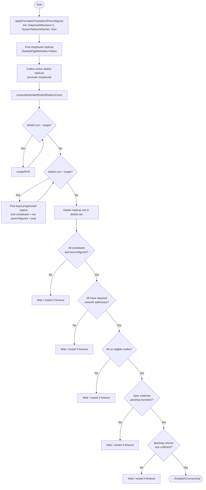
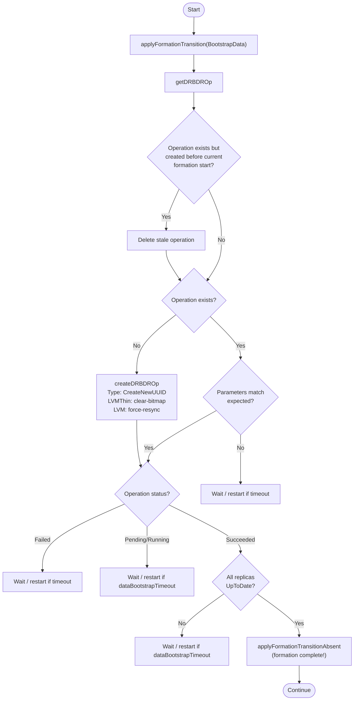
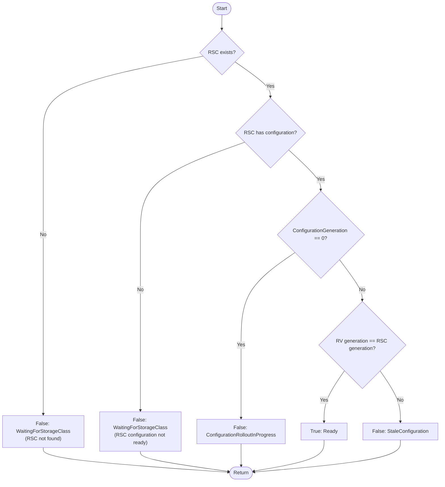

# rv_controller

This controller manages `ReplicatedVolume` (RV) resources by orchestrating datamesh formation, normal operation, and deletion.

## Purpose

The controller reconciles `ReplicatedVolume` with:

1. **Configuration initialization** — copies resolved configuration from `ReplicatedStorageClass` (RSC) into RV status
2. **Datamesh formation** — creates replicas, establishes DRBD connectivity, bootstraps data synchronization
3. **Normal operation** — steady-state datamesh lifecycle (attach handling, scaling, etc.) *(TODO)*
4. **Deletion** — cleans up child resources (RVRs, RVAs) and datamesh state

## Interactions

| Direction | Resource/Controller | Relationship |
|-----------|---------------------|--------------|
| ← input | ReplicatedStorageClass | Reads configuration (replication, topology, storage pool) |
| ← input | ReplicatedStoragePool | Reads eligible nodes, system networks, zones for formation |
| ← input | ReplicatedVolumeReplica | Reads replica status (scheduling, preconfiguration, connectivity, data sync) |
| ← input | ReplicatedVolumeAttachment | Reads attachment status (for deletion decisions) |
| → manages | ReplicatedVolumeReplica | Creates/deletes during formation and deletion |
| → manages | ReplicatedVolumeAttachment | Updates conditions during deletion |
| → manages | DRBDResourceOperation | Creates for data bootstrap during formation |

## Algorithm

The controller reconciles individual ReplicatedVolumes:

```
ensure metadata (finalizer + labels)

if shouldDelete:
    update RVA conditions → delete RVRs → clear datamesh members → Done

ensure configuration from RSC
ensure datamesh pending replica transitions (sync from RVR statuses)

if configuration exists:
    if formation in progress (DatameshRevision == 0 or Formation transition active):
        reconcile formation (3-phase process)
    else:
        reconcile normal operation (TODO)

ensure ConfigurationReady condition
patch status if changed
```

## Reconciliation Structure

```
Reconcile (root) [Pure orchestration]
├── getRV, getRSC, getRVAs, getRVRsSorted
├── reconcileMetadata [Target-state driven]
│   ├── isRVMetadataInSync
│   ├── applyRVMetadata (finalizer + labels)
│   └── patchRV
├── rvShouldNotExist → reconcileDeletion [In-place reconciliation] ← details
│   ├── isRVADeletionConditionsInSync / applyRVADeletionConditions
│   ├── deleteRVRWithFinalizerRemoval (loop)
│   └── clear datamesh members + patchRVStatus
├── ensureRVConfiguration
├── ensureDatameshPendingReplicaTransitions ← details
├── reconcileFormation [Pure orchestration]
│   ├── reconcileFormationPhasePreconfigure [Pure orchestration] ← details
│   │   ├── applyFormationTransition
│   │   ├── create/delete RVRs (replica count management)
│   │   ├── safety checks (addresses, eligible nodes, spec mismatch, backing volume size)
│   │   └── reconcileFormationRestartIfTimeoutPassed
│   ├── reconcileFormationPhaseEstablishConnectivity [Pure orchestration] ← details
│   │   ├── generateSharedSecret + applyDatameshMember
│   │   ├── computeTargetQuorum
│   │   ├── verify configured, connected, ready for data bootstrap
│   │   └── reconcileFormationRestartIfTimeoutPassed
│   └── reconcileFormationPhaseBootstrapData [Pure orchestration] ← details
│       ├── createDRBDROp (new-current-uuid)
│       ├── verify operation status + UpToDate replicas
│       ├── reconcileFormationRestartIfTimeoutPassed
│       └── applyFormationTransitionAbsent (formation complete)
├── reconcileNormalOperation [Pure orchestration] (TODO)
├── ensureConditionConfigurationReady ← details
└── patchRVStatus
```

Links to detailed algorithms: [`reconcileDeletion`](#reconciledeletion-details), [`ensureDatameshPendingReplicaTransitions`](#ensuredatameshpendingreplicatransitions-details), [`reconcileFormationPhasePreconfigure`](#reconcileformationphasepreconfigure-details), [`reconcileFormationPhaseEstablishConnectivity`](#reconcileformationphaseestablishconnectivity-details), [`reconcileFormationPhaseBootstrapData`](#reconcileformationphasebootstrapdata-details), [`ensureConditionConfigurationReady`](#ensureconditionconfigurationready-details)

## Algorithm Flow



## Conditions

### ConfigurationReady

Indicates whether the RV configuration is initialized and matches the storage class.

| Status | Reason | When |
|--------|--------|------|
| True | Ready | Configuration matches storage class generation |
| False | WaitingForStorageClass | RSC not found or RSC configuration not ready |
| False | ConfigurationRolloutInProgress | ConfigurationGeneration not yet set (initial rollout) |
| False | StaleConfiguration | RV configuration generation does not match RSC generation |

## Formation Phases

Datamesh formation is a 3-phase process that creates and configures DRBD replicas. Each phase has a timeout; if progress stalls, formation restarts from scratch.

### Phase 1: Preconfigure

Creates diskful replicas and waits for them to become preconfigured (DRBD setup complete, ready for datamesh membership).

**Steps:**
1. Initialize datamesh configuration (SystemNetworkNames, Size, DatameshRevision=1)
2. Create missing diskful replicas (count based on replication mode)
3. Remove misplaced/excess replicas
4. Wait for scheduling and preconfiguration
5. Safety checks: addresses, eligible nodes, spec consistency, backing volume size

### Phase 2: Establish Connectivity

Adds preconfigured replicas to the datamesh and waits for DRBD peer connections.

**Steps:**
1. Generate shared secret for DRBD peer authentication
2. Add diskful replicas as datamesh members (with zone, addresses, LVG info)
3. Set quorum parameters
4. Wait for all replicas to apply DRBD configuration (DRBDConfigured=True)
5. Wait for all replicas to connect to each other (ConnectionState=Connected)
6. Wait for data bootstrap readiness (BackingVolume=Inconsistent + Replication=Established)

### Phase 3: Bootstrap Data

Triggers initial data synchronization via DRBDResourceOperation and waits for completion.

**Steps:**
1. Create DRBDResourceOperation (type: CreateNewUUID)
   - LVMThin: clear-bitmap (fast, no full resync needed)
   - LVM: force-resync (full data synchronization)
2. Wait for operation to succeed
3. Wait for all replicas to reach UpToDate state
4. Remove Formation transition (formation complete)

**Timeout calculation:**
- Base: 1 minute
- LVM (force-resync): + volume size / 100 Mbit/s (worst-case bandwidth estimate)

### Formation Restart

When formation stalls (any safety check fails or progress timeout is exceeded), formation restarts:

1. Wait for timeout since formation started (to avoid thrashing)
2. Delete formation DRBDResourceOperation if exists
3. Delete all replicas (with finalizer removal)
4. Reset all status fields (Configuration, DatameshRevision, Datamesh, transitions)
5. Requeue for fresh start

## Managed Metadata

| Type | Key | Managed On | Purpose |
|------|-----|------------|---------|
| Finalizer | `storage.deckhouse.io/rv-controller` | RV | Prevent deletion while child resources exist |
| Label | `storage.deckhouse.io/replicated-storage-class` | RV | Link to ReplicatedStorageClass |
| Finalizer | `storage.deckhouse.io/rv-controller` | RVR | Removed during formation restart / deletion |
| OwnerRef | controller reference | DRBDResourceOperation | Owner reference to RV |

## Watches

| Resource | Events | Handler |
|----------|--------|---------|
| ReplicatedVolume | Generation, DeletionTimestamp, ReplicatedStorageClass label, Finalizers changes | For() (primary) |
| ReplicatedStorageClass | ConfigurationGeneration changes | mapRSCToRVs (index lookup) |
| ReplicatedVolumeAttachment | Attached condition status changes | mapRVAToRV |
| ReplicatedVolumeReplica | DatameshRevision, DeletionTimestamp, Finalizers changes | mapRVRToRV |
| DRBDResourceOperation | Create/Delete of *-formation ops, Phase changes, Generation changes | Owns() |

## Indexes

| Index | Field | Purpose |
|-------|-------|---------|
| `IndexFieldRVByReplicatedStorageClassName` | `spec.replicatedStorageClassName` | Map RSC events to RVs |
| `IndexFieldRVAByReplicatedVolumeName` | `spec.replicatedVolumeName` | List RVAs for an RV |
| `IndexFieldRVRByReplicatedVolumeName` | `spec.replicatedVolumeName` | List RVRs for an RV |

## Data Flow



---

## Detailed Algorithms

### reconcileDeletion Details

**Purpose:** Handles RV deletion — updates RVA conditions, removes RVR finalizers and deletes RVRs, clears datamesh members.

**Algorithm:**



**Data Flow:**

| Input | Output |
|-------|--------|
| `rvas` | Patched RVA conditions (Attached=False, Ready=False) |
| `rvrs` | All RVRs deleted (finalizers removed first) |
| `rv.Status.Datamesh.Members` | Cleared to nil |

---

### ensureDatameshPendingReplicaTransitions Details

**Purpose:** Synchronizes `rv.Status.DatameshPendingReplicaTransitions` with the current `DatameshPendingTransition` from each RVR. Uses a sorted merge algorithm for determinism.

**Algorithm:**



**Data Flow:**

| Input | Description |
|-------|-------------|
| `rv.Status.DatameshPendingReplicaTransitions` | Existing pending transitions |
| `rvrs[].Status.DatameshPendingTransition` | Current pending transition per RVR |

| Output | Description |
|--------|-------------|
| `rv.Status.DatameshPendingReplicaTransitions` | Synchronized list (sorted by NodeID) |

---

### reconcileFormationPhasePreconfigure Details

**Purpose:** Creates diskful replicas and waits for them to become preconfigured (DRBD setup complete, ready for datamesh membership). Performs safety checks before advancing.

**Algorithm:**



**Data Flow:**

| Input | Description |
|-------|-------------|
| `rv.Spec.Size` | Target volume size |
| `rv.Status.Configuration.Replication` | Replication mode (determines replica count) |
| `rsp` | Storage pool view (eligible nodes, system network names) |
| `rvrs` | Current replicas (status: scheduled, preconfigured, addresses, backing volume) |

| Output | Description |
|--------|-------------|
| `rv.Status.DatameshRevision` | Set to 1 on first entry |
| `rv.Status.Datamesh.SystemNetworkNames` | Copied from RSP |
| `rv.Status.Datamesh.Size` | Copied from RV spec |
| RVR create/delete | Replica count adjusted |
| Formation transition messages | Progress/error reporting |

---

### reconcileFormationPhaseEstablishConnectivity Details

**Purpose:** Adds preconfigured replicas to the datamesh (with shared secret and quorum), then waits for DRBD configuration, peer connections, and replication establishment.

**Algorithm:**


**Data Flow:**

| Input | Description |
|-------|-------------|
| `rvrs` | Replica status (DRBDConfigured, peers, backing volume state) |
| `rsp.EligibleNodes` | Zone information for datamesh members |

| Output | Description |
|--------|-------------|
| `rv.Status.Datamesh.SharedSecret` | Generated DRBD shared secret |
| `rv.Status.Datamesh.Members` | Datamesh member list |
| `rv.Status.Datamesh.Quorum` | Quorum threshold |
| `rv.Status.DatameshRevision` | Incremented revision |

---

### reconcileFormationPhaseBootstrapData Details

**Purpose:** Creates a DRBDResourceOperation to trigger initial data synchronization, waits for completion, and finalizes formation.

**Algorithm:**



**Data Flow:**

| Input | Description |
|-------|-------------|
| `rv.Status.Datamesh.Members` | Diskful members (target for operation) |
| `rsp.Type` | LVM or LVMThin (determines sync mode) |
| `rv.Status.Datamesh.Size` | Volume size (for LVM timeout calculation) |

| Output | Description |
|--------|-------------|
| `DRBDResourceOperation` | Created/verified data bootstrap operation |
| `rv.Status.DatameshTransitions` | Formation transition removed on success |

---

### ensureConditionConfigurationReady Details

**Purpose:** Sets the `ConfigurationReady` condition based on RSC availability and configuration generation matching.

**Algorithm:**



**Data Flow:**

| Input | Description |
|-------|-------------|
| `rsc` | ReplicatedStorageClass (may be nil) |
| `rsc.Status.Configuration` | RSC configuration availability |
| `rsc.Status.ConfigurationGeneration` | RSC generation for comparison |
| `rv.Status.ConfigurationGeneration` | RV's stored generation |

| Output | Description |
|--------|-------------|
| `ConfigurationReady` condition | Reports configuration state |
