# rv_controller

This controller manages `ReplicatedVolume` (RV) resources by orchestrating datamesh formation, normal operation, and deletion.

## Purpose

The controller reconciles `ReplicatedVolume` with:

1. **Configuration initialization** — derives configuration from `ReplicatedStorageClass` (RSC) in Auto mode or from `ManualConfiguration` in Manual mode into RV status
2. **Datamesh formation** — creates replicas, establishes DRBD connectivity, bootstraps data synchronization
3. **Normal operation** — steady-state datamesh lifecycle managed by the datamesh transition engine (membership, attachment, quorum, network transitions); see [datamesh/README.md](datamesh/README.md)
4. **Deletion** — cleans up child resources (RVRs, RVAs) and datamesh state

## Interactions

| Direction | Resource/Controller | Relationship |
|-----------|---------------------|--------------|
| ← input | ReplicatedStorageClass | Reads configuration (FTT, GMDR, topology, storage pool); Auto mode only |
| ← input | ReplicatedVolume.Spec.ManualConfiguration | Reads manual configuration directly; Manual mode only |
| ← input | ReplicatedStoragePool | Reads eligible nodes, system networks, zones for formation and attach eligibility |
| ← input | ReplicatedVolumeReplica | Reads replica status (scheduling, preconfiguration, connectivity, data sync, quorum, attachment) |
| ← input | ReplicatedVolumeAttachment | Reads attachment intent (determines which nodes should be attached) |
| → manages | ReplicatedVolumeReplica | Creates/deletes during formation, normal operation (Access replicas), and deletion |
| → manages | ReplicatedVolumeAttachment | Manages finalizers; updates conditions (Attached, ReplicaReady, Ready), phase, and message during normal operation and deletion |
| → manages | DRBDResourceOperation | Creates for data bootstrap during formation |

## Algorithm

The controller reconciles individual ReplicatedVolumes:

```
if rv deleted (NotFound):
    if orphaned RVAs exist:
        reconcileRVAWaiting (set waiting conditions) + reconcileRVAMetadata (rv=nil) → Done
    else → Done

if shouldDelete (DeletionTimestamp + no other finalizers + no attached members + no Detach transitions):
    reconcileDeletion (reconcileRVAWaiting → force-delete RVRs → clear datamesh members)
    reconcileRVAMetadata (remove RVA finalizers — after conditions are set)
    reconcileMetadata (remove finalizer if no children left) → Done

ensure metadata (finalizer + labels)

if config nil: reconcileRVConfiguration (initial set from RSC or ManualConfiguration)
ensure datamesh replica membership requests (sync from RVR statuses)
ensure status size (min usable size from diskful member RVRs)

if configuration exists:
    if formation in progress (DatameshRevision == 0 or Formation transition active):
        reconcile formation (3-step process; create: config frozen; adopt: accepts replicas as-is)
        reconcileRVAWaiting (datamesh forming)
    else:
        reconcileRVConfiguration (check for config updates + set ConfigurationReady condition)
        reconcile normal operation:
            create Access RVRs for Active RVAs on nodes without any RVR
            datamesh.ProcessTransitions (membership, quorum, attachment, network)
            update RVA conditions from datamesh replica contexts
            delete unnecessary Access RVRs (redundant or unused)

reconcileRVAMetadata (add/remove RVA finalizers + labels)
reconcileRVRFinalizers (add/remove RVR finalizers)
patch status if changed
```

## Reconciliation Structure

```
Reconcile (root) [Pure orchestration]
├── getRV
├── rv == nil → getRVAs → reconcileOrphanedRVAs (reconcileRVAWaiting + reconcileRVAMetadata)
├── getRSC, getRVAs, getRVRsSorted
├── rvShouldNotExist (DeletionTimestamp + no other finalizers + no attached + no Detach transitions) →
│   ├── reconcileDeletion [In-place reconciliation] ← details
│   │   ├── reconcileRVAWaiting ("ReplicatedVolume is terminating")
│   │   ├── deleteRVRWithForcedFinalizerRemoval (loop)
│   │   └── clear datamesh members + patchRVStatus
│   ├── reconcileRVAMetadata [Target-state driven]
│   │   ├── add RVControllerFinalizer + labels to non-deleting RVAs
│   │   └── remove RVControllerFinalizer from deleting RVAs (when safe)
│   │       ├── hasOtherNonDeletingRVAOnNode (duplicate check)
│   │       └── isNodeAttachedOrDetaching (datamesh state check)
│   └── reconcileMetadata [Target-state driven] (remove finalizer)
├── reconcileMetadata [Target-state driven]
│   ├── isRVMetadataInSync
│   ├── applyRVMetadata (finalizer + labels)
│   └── patchRV
├── if config nil: reconcileRVConfiguration [In-place reconciliation] ← details
├── ensureDatameshReplicaRequests ← details
├── ensureStatusSize (min usable size from diskful member RVRs)
├── reconcileFormation [Pure orchestration]
│   │   ensureFormationTransition (find or create Formation transition with all steps)
│   ├── (create/v1)
│   │   ├── reconcileFormationStepPreconfigure [Pure orchestration] ← details
│   │   │   ├── create/delete RVRs (guards for deleting/misplaced, replica count management)
│   │   │   ├── wait for deleting replicas cleanup
│   │   │   ├── safety checks (addresses, eligible nodes, spec mismatch, backing volume size)
│   │   │   └── reconcileFormationRestartIfTimeoutPassed
│   │   ├── reconcileFormationStepEstablishConnectivity [Pure orchestration] ← details
│   │   │   ├── generateSharedSecret + applyDatameshMember
│   │   │   ├── computeTargetQuorum
│   │   │   ├── verify configured, connected, ready for data bootstrap
│   │   │   └── reconcileFormationRestartIfTimeoutPassed
│   │   └── reconcileFormationStepBootstrapData [Pure orchestration] ← details
│   │       ├── createDRBDROp (new-current-uuid)
│   │       ├── verify operation status + UpToDate replicas
│   │       ├── reconcileFormationRestartIfTimeoutPassed
│   │       └── advanceFormationStep / remove transition (formation complete)
│   ├── (adopt/v1)
│   │   ├── reconcileAdoptStepVerifyPrerequisites [Pure orchestration] ← details
│   │   │   ├── collect non-deleting replicas by type (diskful, tiebreaker, access)
│   │   │   ├── gates: all scheduled, all in maintenance
│   │   │   ├── safety: addresses, backing volume size
│   │   │   └── advance → PopulateAndVerifyDatamesh
│   │   ├── reconcileAdoptStepPopulateAndVerifyDatamesh [Pure orchestration] ← details
│   │   │   ├── generateSharedSecret + applyDatameshMember (from RVR spec, all types, multiattach)
│   │   │   ├── computeTargetQuorum (lowest GMDR/QMR)
│   │   │   ├── gate: DatameshRevisionObservedByAgent >= DatameshRevision
│   │   │   ├── gate: members match active RVRs
│   │   │   └── advance → ExitMaintenance
│   │   └── reconcileAdoptStepExitMaintenance [Pure orchestration] ← details
│   │       ├── ensureDatameshMemberAddresses (sync addresses from RVR, bump revision)
│   │       ├── wait for maintenance exit (DRBDConfigured reason != InMaintenance)
│   │       └── formation complete (accepts replicas as-is, even if degraded)
│   └── reconcileRVAWaiting ("Datamesh formation is in progress")
├── reconcileRVConfiguration [In-place reconciliation] (config updates + ConfigurationReady condition)
├── reconcileNormalOperation [Pure orchestration]
│   ├── reconcileCreateAccessReplicas [Pure orchestration] ← details
│   ├── datamesh.ProcessTransitions (membership, quorum, attachment, network)
│   │   └── see datamesh/README.md
│   ├── reconcileRVAConditionsFromDatameshReplicaContext [In-place reconciliation] ← details
│   │   ├── computeRVAAttachedCondition
│   │   ├── computeRVAReplicaReadyCondition
│   │   ├── computeRVAReadyCondition
│   │   ├── computeRVAPhaseAndMessage
│   │   ├── isRVAAttachmentFieldsInSync + applyRVAAttachmentFields
│   │   └── patchRVAStatus
│   └── reconcileDeleteAccessReplicas [Pure orchestration] ← details
├── reconcileRVAMetadata [Target-state driven] (same as deletion branch)
├── reconcileRVRFinalizers [Target-state driven]
│   ├── add RVControllerFinalizer to non-deleting RVRs
│   └── remove RVControllerFinalizer from deleting RVRs (when safe)
│       └── isRVRMemberOrLeavingDatamesh (member + RemoveReplica check)
└── patchRVStatus
```

Links to detailed algorithms: [`reconcileDeletion`](#reconciledeletion-details), [`ensureDatameshReplicaRequests`](#ensuredatameshreplicarequests-details), [`reconcileRVConfiguration`](#reconcilervconfiguration-details), [`reconcileFormationStepPreconfigure`](#reconcileformationsteppreconfigure-details), [`reconcileFormationStepEstablishConnectivity`](#reconcileformationstepestablishconnectivity-details), [`reconcileFormationStepBootstrapData`](#reconcileformationstepbootstrapdata-details), [`reconcileAdoptStepVerifyPrerequisites`](#reconcileadoptstepverifyprerequisites-details), [`reconcileAdoptStepPopulateAndVerifyDatamesh`](#reconcileadoptsteppopulateandverifydatamesh-details), [`reconcileAdoptStepExitMaintenance`](#reconcileadoptstepexitmaintenance-details), [`reconcileCreateAccessReplicas`](#reconcilecreateaccessreplicas-details), [`reconcileDeleteAccessReplicas`](#reconciledeleteaccessreplicas-details), [`reconcileRVAConditionsFromDatameshReplicaContext`](#reconcilervaconditionsfromdatameshreplicacontext-details)

## Algorithm Flow

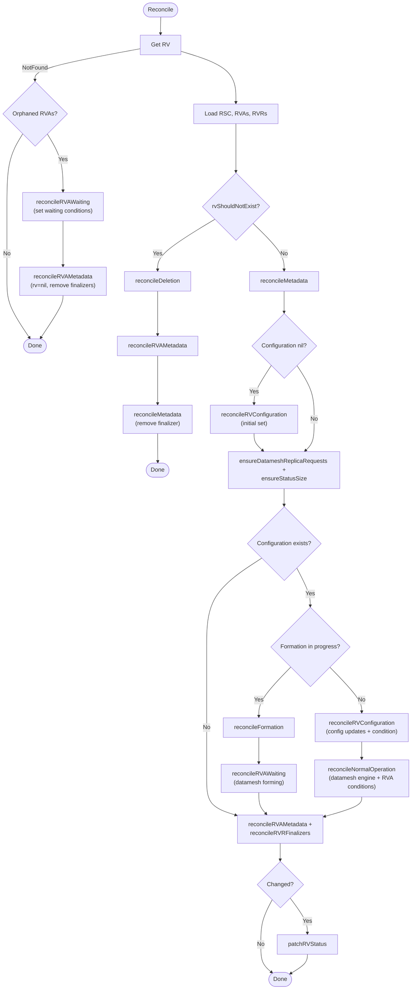
```mermaid
flowchart TD
    Start([Reconcile]) --> GetRV[Get RV]
    GetRV -->|NotFound| CheckOrphanedRVAs{Orphaned RVAs?}
    CheckOrphanedRVAs -->|No| Done1([Done])
    CheckOrphanedRVAs -->|Yes| OrphanedWaiting["reconcileRVAWaiting<br/>(set waiting conditions)"]
    OrphanedWaiting --> OrphanedFinalizers["reconcileRVAMetadata<br/>(rv=nil, remove finalizers)"]
    OrphanedFinalizers --> Done1
    GetRV --> LoadDeps[Load RSC, RVAs, RVRs]

    LoadDeps --> CheckDelete{rvShouldNotExist?}
    CheckDelete -->|Yes| Deletion[reconcileDeletion]
    Deletion --> RVAFinDel[reconcileRVAMetadata]
    RVAFinDel --> MetaDel["reconcileMetadata<br/>(remove finalizer)"]
    MetaDel --> Done3([Done])

    CheckDelete -->|No| Meta[reconcileMetadata]
    Meta --> CheckConfigNil{Configuration nil?}
    CheckConfigNil -->|Yes| InitConfig["reconcileRVConfiguration<br/>(initial set)"]
    InitConfig --> EnsurePending
    CheckConfigNil -->|No| EnsurePending
    EnsurePending["ensureDatameshReplicaRequests +<br/>ensureStatusSize"]
    EnsurePending --> CheckConfig{Configuration exists?}
    CheckConfig -->|No| Finalizers

    CheckConfig -->|Yes| CheckForming{Formation in progress?}
    CheckForming -->|Yes| Formation[reconcileFormation]
    Formation --> FormingRVAWaiting["reconcileRVAWaiting<br/>(datamesh forming)"]
    FormingRVAWaiting --> Finalizers
    CheckForming -->|No| UpdateConfig["reconcileRVConfiguration<br/>(config updates + condition)"]
    UpdateConfig --> NormalOp["reconcileNormalOperation<br/>(datamesh engine + RVA conditions)"]
    NormalOp --> Finalizers

    Finalizers["reconcileRVAMetadata +<br/>reconcileRVRFinalizers"]
    Finalizers --> PatchDecision{Changed?}
    PatchDecision -->|Yes| Patch[patchRVStatus]
    PatchDecision -->|No| EndNode([Done])
    Patch --> EndNode
```

## Conditions

### ConfigurationReady

Indicates whether the RV configuration is valid and derived from the appropriate source. Set by `reconcileRVConfiguration`.

| Status | Reason | When |
|--------|--------|------|
| True | Ready | Configuration is valid and matches the source |
| False | WaitingForStorageClass | RSC not found or RSC configuration not ready (Auto mode only) |
| False | InvalidConfiguration | Configuration is invalid: RSP not found or TransZonal zone count mismatch |

### Attached (on RVA)

Set by `reconcileRVAConditionsFromDatameshReplicaContext` during normal operation, or by `reconcileRVAWaiting` when the RV is unavailable.

| Status | Reason | When |
|--------|--------|------|
| True | Attached | Volume is attached and ready to serve I/O on the node (if RV is deleting: with pending-deletion note) |
| False | Attaching | Attach transition in progress |
| False | Detaching | Detach transition in progress |
| False | Detached | Volume has been detached from the node |
| False | Pending | Waiting for slot, quorum, node readiness, etc. |
| False | WaitingForReplica | Replica not yet joined datamesh or not Ready |
| False | WaitingForReplicatedVolume | RV deleted, not found, or datamesh forming |
| False | NodeNotEligible | Node not in RSP eligible nodes |
| False | ReplicatedVolumeTerminating | RV is being deleted; node is not yet attached (new attachments blocked) |
| False | VolumeAccessLocalityNotSatisfied | No Diskful replica on node (VolumeAccess=Local) |

### ReplicaReady (on RVA)

Mirrors the RVR Ready condition for the replica on this node. Set by `reconcileRVAConditionsFromDatameshReplicaContext`. Removed by `reconcileRVAWaiting` when the RV is unavailable.

| Status | Reason | When |
|--------|--------|------|
| True/False/Unknown | *(mirrored from RVR Ready)* | RVR exists and has Ready condition |
| Unknown | WaitingForReplica | No RVR or no Ready condition on RVR |

### Ready (on RVA)

Aggregate condition: Ready=True iff Attached=True AND ReplicaReady=True AND not deleting.

| Status | Reason | When |
|--------|--------|------|
| True | Ready | Attached and replica is ready |
| False | NotAttached | Attached condition is not True |
| False | ReplicaNotReady | ReplicaReady is False |
| False | Terminating | RVA has DeletionTimestamp |
| Unknown | ReplicaNotReady | ReplicaReady is Unknown |

### Phase (on RVA)

Quick operational state summary. Derived from DeletionTimestamp and Attached condition reason. Set alongside conditions by `reconcileRVAConditionsFromDatameshReplicaContext` and `reconcileRVAWaiting`.

| Phase | When |
|-------|------|
| Terminating | DeletionTimestamp is set |
| Attached | Attached=True |
| Attaching | Attached=False, Reason=Attaching |
| Detaching | Attached=False, Reason=Detaching |
| Pending | Everything else (waiting for prerequisites) |

Message is passthrough from the Attached condition, except when Phase=Attached and ReplicaReady != True — the ReplicaReady message is shown to surface degradation.

## Formation Steps

Datamesh formation uses one of two plans depending on whether pre-existing replicas need to be adopted. Each plan is a 3-step process tracked in `rv.Status.DatameshTransitions[].Steps`.

- **create/v1** — creates fresh DRBD replicas, bootstraps connectivity and data.
- **adopt/v1** — adopts pre-existing DRBD replicas (in maintenance mode) into the datamesh.

### create/v1 Formation

Each step has a timeout; if progress stalls, formation restarts from scratch.

#### Step 1: Preconfigure

Creates diskful replicas and waits for them to become preconfigured (DRBD setup complete, ready for datamesh membership).

**Actions:**
1. Initialize datamesh configuration (SystemNetworkNames, Size, DatameshRevision=1)
2. Identify misplaced replicas (SatisfyEligibleNodes=False) and deleting replicas (DeletionTimestamp set)
3. Collect active diskful replicas (excluding misplaced and deleting)
4. Create missing diskful replicas only when no deleting or misplaced replicas exist (prevents zombie accumulation)
5. Remove excess/misplaced replicas
6. Wait for all deleting replicas to be fully removed (restart formation if timeout)
7. Wait for scheduling and preconfiguration (replicas split into pending scheduling / scheduling failed / preconfiguring; scheduling failure messages from RVR Scheduled=False conditions are shown inline)
8. Safety checks: addresses, eligible nodes, spec consistency, backing volume size

#### Step 2: Establish Connectivity

Adds preconfigured replicas to the datamesh and waits for DRBD peer connections.

**Actions:**
1. Generate shared secret for DRBD peer authentication
2. Add diskful replicas as datamesh members (with zone, addresses, LVG info)
3. Set effective layout (FTT/GMDR from configuration) and quorum parameters
4. Wait for all replicas to apply DRBD configuration (DRBDConfigured=True)
5. Wait for all replicas to connect to each other (ConnectionState=Connected)
6. Wait for data bootstrap readiness (BackingVolume=Inconsistent + Replication=Established)

#### Step 3: Bootstrap Data

Triggers initial data synchronization via DRBDResourceOperation and waits for completion.

**Actions:**
1. Create DRBDResourceOperation (type: CreateNewUUID)
   - Single replica (any pool type): clear-bitmap (no peers to synchronize with)
   - Multiple replicas, thin provisioning: clear-bitmap (no full resync needed)
   - Multiple replicas, thick provisioning: force-resync (full data synchronization)
2. Wait for operation to succeed
3. Wait for all replicas to reach UpToDate state
4. Remove Formation transition (formation complete); requeue to enter normal-operation path

**Timeout calculation:**
- Base: 1 minute
- Force-resync (multi-replica thick provisioning): + volume size / 100 Mbit/s (worst-case bandwidth estimate)
- Clear-bitmap (single replica or thin provisioning): base only

#### Formation Restart

When formation stalls (any safety check fails or progress timeout is exceeded), formation restarts:

1. Wait for timeout since formation started (to avoid thrashing)
2. Log error (formation timed out)
3. Delete formation DRBDResourceOperation if exists
4. Delete all replicas (with finalizer removal)
5. Reset all status fields (Configuration, ConfigurationGeneration, ConfigurationObservedGeneration, DatameshRevision, Datamesh, BaselineGuaranteedMinimumDataRedundancy, transitions, DatameshReplicaRequests)
6. Re-derive configuration via `reconcileRVConfiguration` (to avoid ConfigurationReady condition flicker)
7. Requeue for fresh start

### adopt/v1 Formation

Unlike create/v1, the adopt plan never creates or deletes RVRs. It expects pre-existing RVRs (created externally) to be in maintenance mode. The adopt plan handles all replica types: Diskful, TieBreaker, and Access. Adopt accepts replicas as-is — it does not validate replica counts, backing volume states, eligible nodes, or spec consistency against the RSC configuration. Any discrepancies are resolved by normal operation after formation completes.

#### Step 1: Verify Prerequisites

Waits for pre-existing RVRs to satisfy minimal prerequisites before populating the datamesh.

**Gates (in order):**
1. All replicas (D+TB+A) are scheduled
2. All replicas are in maintenance mode
3. All replicas have addresses for required system networks
4. Backing volume size is sufficient (diskful only)

#### Step 2: Populate and Verify Datamesh

Populates the datamesh from pre-existing replicas. Member fields are taken directly from RVR spec (not from DatameshRequest), because adopt accepts the pre-existing replica configuration as-is.

**Actions (populate):**
1. Resolve shared secret for DRBD peer authentication: if the `adopt-shared-secret` annotation is set, its value is used (must be non-empty, max 64 chars); otherwise a random secret is generated
2. Add all replicas as datamesh members (from RVR spec: type, zone, addresses, LVG; tracks multiattach from attachment status)
3. Set lowest possible GMDR/QMR (GMDR=0, QMR=1) so that replicas with degraded backing volumes can still be adopted; quorum is computed from actual member composition
4. Increment DatameshRevision

**Gates (verify, in order):**
1. All replicas have observed the datamesh revision (`DatameshRevisionObservedByAgent >= DatameshRevision`)
2. Datamesh members match active RVRs

#### Step 3: Exit Maintenance

Syncs addresses and waits for all datamesh member replicas to exit maintenance mode. Adopt accepts replicas as-is — even degraded replicas complete formation; normal operation handles recovery afterward.

**Actions:**
1. `ensureDatameshMemberAddresses`: if any RVR address changed since populate, update the member and bump DatameshRevision so agents re-converge

**Gates (in order):**
1. No replicas are in maintenance (`DRBDConfigured` reason != `InMaintenance`)

On success: removes the Formation transition (formation complete).

## Attachment Lifecycle

Attachment (making a datamesh volume Primary on a node) is managed by the datamesh transition engine during normal operation. The engine handles slot allocation, multiattach toggling, attach/detach guards, quorum checks, and transition confirmation. See [datamesh/README.md](datamesh/README.md) for the engine's architecture and transition plans.

Key concepts:

- **Slot**: controlled by `rv.Spec.MaxAttachments`
- **Multiattach**: managed automatically when multiple nodes need attachment
- **Transition confirmation**: replicas confirm via `DatameshRevision`

## Managed Metadata

| Type | Key | Managed On | Purpose |
|------|-----|------------|---------|
| Finalizer | `sds-replicated-volume.deckhouse.io/rv-controller` | RV | Prevent deletion while child resources exist |
| Label | `sds-replicated-volume.deckhouse.io/replicated-storage-class` | RV | Link to ReplicatedStorageClass |
| Finalizer | `sds-replicated-volume.deckhouse.io/rv-controller` | RVA | Prevent deletion while node is attached or detaching; safe to remove if another non-deleting RVA exists on the same node (duplicate) |
| Label | `sds-replicated-volume.deckhouse.io/replicated-volume` | RVA | Link to parent ReplicatedVolume |
| Label | `sds-replicated-volume.deckhouse.io/replicated-storage-class` | RVA | Link to ReplicatedStorageClass |
| Finalizer | `sds-replicated-volume.deckhouse.io/rv-controller` | RVR | Prevent deletion while RVR is a datamesh member or leaving datamesh; force-removed during formation restart / RV deletion |
| OwnerRef | controller reference | DRBDResourceOperation | Owner reference to RV |

## Watches

| Resource | Events | Handler |
|----------|--------|---------|
| ReplicatedVolume | Generation, DeletionTimestamp, ReplicatedStorageClass label, Finalizers changes | For() (primary) |
| ReplicatedStorageClass | ConfigurationGeneration changes | mapRSCToRVs (index lookup) |
| ReplicatedVolumeAttachment | DeletionTimestamp, Finalizers, Attached condition status changes | mapRVAToRV |
| ReplicatedVolumeReplica | Conditions (Scheduled, DRBDConfigured, SatisfyEligibleNodes, Ready), DatameshRequest, DatameshRevision, DatameshRevisionObservedByAgent, Addresses, Quorum, Attachment, BackingVolume, Peers (incl. BackingVolumeState, ConnectionEstablishedOn), DeletionTimestamp, Finalizers changes | mapRVRToRV |
| DRBDResourceOperation | Create/Delete of *-formation ops, Phase changes, Generation changes | Owns() |

## Indexes

| Index | Field | Purpose |
|-------|-------|---------|
| `IndexFieldRVByReplicatedStorageClassName` | `spec.replicatedStorageClassName` | Map RSC events to RVs |
| `IndexFieldRVAByReplicatedVolumeName` | `spec.replicatedVolumeName` | List RVAs for an RV |
| `IndexFieldRVRByReplicatedVolumeName` | `spec.replicatedVolumeName` | List RVRs for an RV |

## Data Flow


```mermaid
flowchart TD
    subgraph inputs [Inputs]
        RSCStatus[RSC.status.configuration]
        RSP[RSP.status]
        RVRStatus[RVR.status]
        RVAStatus[RVA.status]
    end

    subgraph reconcilers [Reconcilers]
        ReconcileMeta[reconcileMetadata]
        ReconcileFormation[reconcileFormation]
        ReconcileNormalOp[reconcileNormalOperation]
        ReconcileDeletion[reconcileDeletion]
    end

    subgraph ensures [Ensure Helpers]
        EnsurePending[ensureDatameshReplicaRequests]
        EnsureSize[ensureStatusSize]
        DMEngine["datamesh.ProcessTransitions"]
    end

    subgraph configReconciler [Configuration]
        ReconcileConfig["reconcileRVConfiguration<br/>(Auto: RSC, Manual: spec)"]
    end

    subgraph outputs [Outputs]
        RVMeta[RV metadata]
        RVStatus[RV.status]
        RVRManaged[RVR create/delete]
        DRBDROp[DRBDResourceOperation]
        RVAConditions["RVA conditions + phase/message"]
    end

    RSCStatus --> ReconcileConfig
    RVRStatus --> EnsurePending
    RVRStatus --> EnsureSize
    RVRStatus --> ReconcileFormation
    RSP --> ReconcileFormation
    RVRStatus --> ReconcileNormalOp
    RSP --> ReconcileNormalOp
    RVAStatus --> ReconcileNormalOp
    RVAStatus --> ReconcileDeletion
    RVRStatus --> DMEngine
    RVAStatus --> DMEngine
    RSP --> DMEngine

    ReconcileMeta --> RVMeta
    ReconcileConfig --> RVStatus
    EnsurePending --> RVStatus
    EnsureSize --> RVStatus
    DMEngine --> RVStatus
    ReconcileFormation --> RVStatus
    ReconcileFormation --> RVRManaged
    ReconcileFormation --> DRBDROp
    ReconcileNormalOp --> RVStatus
    ReconcileNormalOp --> RVRManaged
    ReconcileNormalOp --> RVAConditions
    ReconcileDeletion --> RVAConditions
    ReconcileDeletion --> RVRManaged
    ReconcileDeletion --> RVStatus
```

---

## Detailed Algorithms

### reconcileDeletion Details

**Purpose:** Handles RV deletion — updates RVA conditions, removes RVR finalizers and deletes RVRs, clears datamesh members.

**Algorithm:**

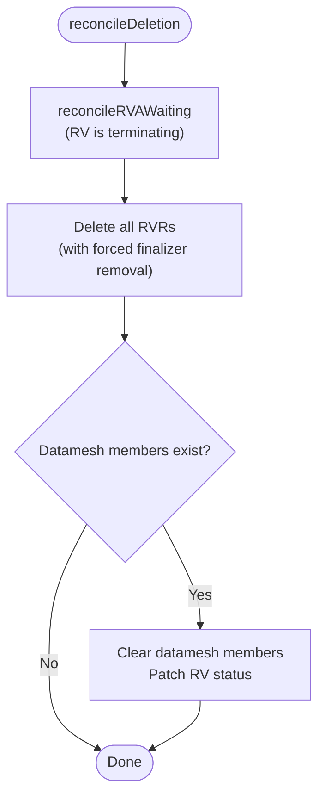
```mermaid
flowchart TD
    Start([reconcileDeletion]) --> UpdateRVAs["reconcileRVAWaiting<br/>(RV is terminating)"]

    UpdateRVAs --> DeleteRVRs["Delete all RVRs<br/>(with forced finalizer removal)"]
    DeleteRVRs --> CheckMembers{Datamesh members exist?}
    CheckMembers -->|Yes| ClearMembers["Clear datamesh members<br/>Patch RV status"]
    CheckMembers -->|No| End([Done])
    ClearMembers --> End
```

**Data Flow:**

| Input | Output |
|-------|--------|
| `rvas` | Patched RVA conditions (Attached=False, Ready=False) |
| `rvrs` | All RVRs deleted (finalizers removed first) |
| `rv.Status.Datamesh.Members` | Cleared to nil |

---

### ensureDatameshReplicaRequests Details

**Purpose:** Synchronizes `rv.Status.DatameshReplicaRequests` with the current `DatameshRequest` from each RVR. Uses a sorted merge algorithm for determinism.

**Algorithm:**

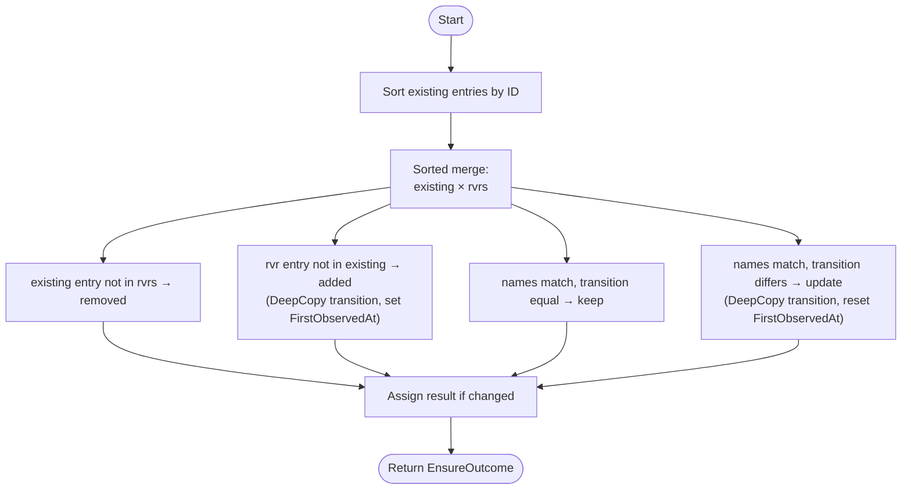
```mermaid
flowchart TD
    Start([Start]) --> SortExisting[Sort existing entries by ID]
    SortExisting --> Merge["Sorted merge:<br/>existing × rvrs"]

    Merge --> CaseRemoved["existing entry not in rvrs → removed"]
    Merge --> CaseAdded["rvr entry not in existing → added<br/>(DeepCopy transition, set FirstObservedAt)"]
    Merge --> CaseEqual["names match, transition equal → keep"]
    Merge --> CaseUpdated["names match, transition differs → update<br/>(DeepCopy transition, reset FirstObservedAt)"]

    CaseRemoved --> Result
    CaseAdded --> Result
    CaseEqual --> Result
    CaseUpdated --> Result

    Result[Assign result if changed] --> End([Return EnsureOutcome])
```

**Data Flow:**

| Input | Description |
|-------|-------------|
| `rv.Status.DatameshReplicaRequests` | Existing membership requests |
| `rvrs[].Status.DatameshRequest` | Current membership request per RVR |

| Output | Description |
|--------|-------------|
| `rv.Status.DatameshReplicaRequests` | Synchronized list (sorted by ID) |

---

### reconcileFormationStepPreconfigure Details

**Purpose:** Creates diskful replicas and waits for them to become preconfigured (DRBD setup complete, ready for datamesh membership). Performs safety checks before advancing.

**File:** `reconciler_formation.go`

**Algorithm:**

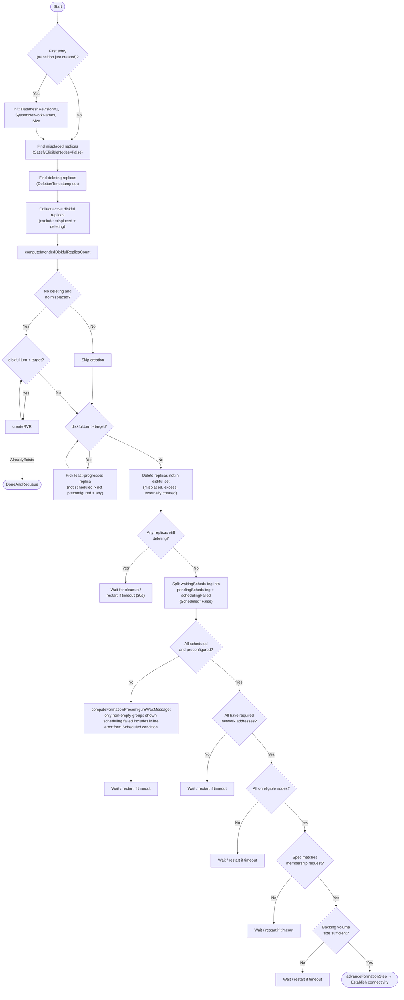
```mermaid
flowchart TD
    Start([Start]) --> Init{"First entry<br/>(transition just created)?"}
    Init -->|Yes| InitConfig["Init: DatameshRevision=1,<br/>SystemNetworkNames, Size"]
    Init -->|No| FindMisplaced
    InitConfig --> FindMisplaced["Find misplaced replicas<br/>(SatisfyEligibleNodes=False)"]
    FindMisplaced --> FindDeleting["Find deleting replicas<br/>(DeletionTimestamp set)"]
    FindDeleting --> CollectDiskful["Collect active diskful replicas<br/>(exclude misplaced + deleting)"]
    CollectDiskful --> ComputeCount[computeIntendedDiskfulReplicaCount]

    ComputeCount --> CheckClean{"No deleting and<br/>no misplaced?"}
    CheckClean -->|Yes| CreateLoop{"diskful.Len < target?"}
    CreateLoop -->|Yes| CreateRVR[createRVR]
    CreateRVR -->|AlreadyExists| Requeue1([DoneAndRequeue])
    CreateRVR --> CreateLoop
    CheckClean -->|No| SkipCreate[Skip creation]
    SkipCreate --> RemoveExcess

    CreateLoop -->|No| RemoveExcess{"diskful.Len > target?"}

    RemoveExcess -->|Yes| PickCandidate["Pick least-progressed replica<br/>(not scheduled > not preconfigured > any)"]
    PickCandidate --> RemoveExcess
    RemoveExcess -->|No| DeleteUnwanted["Delete replicas not in diskful set<br/>(misplaced, excess, externally created)"]

    DeleteUnwanted --> CheckDeleting{"Any replicas still<br/>deleting?"}
    CheckDeleting -->|Yes| WaitDeleting["Wait for cleanup /<br/>restart if timeout (30s)"]

    CheckDeleting -->|No| SplitScheduling["Split waitingScheduling into<br/>pendingScheduling + schedulingFailed<br/>(Scheduled=False)"]
    SplitScheduling --> WaitReady{"All scheduled<br/>and preconfigured?"}
    WaitReady -->|No| BuildMsg["computeFormationPreconfigureWaitMessage:<br/>only non-empty groups shown,<br/>scheduling failed includes inline<br/>error from Scheduled condition"]
    BuildMsg --> WaitTimeout1[Wait / restart if timeout]

    WaitReady -->|Yes| CheckAddresses{"All have required<br/>network addresses?"}
    CheckAddresses -->|No| WaitTimeout2[Wait / restart if timeout]

    CheckAddresses -->|Yes| CheckEligible{"All on eligible nodes?"}
    CheckEligible -->|No| WaitTimeout3[Wait / restart if timeout]

    CheckEligible -->|Yes| CheckSpec{"Spec matches<br/>membership request?"}
    CheckSpec -->|No| WaitTimeout4[Wait / restart if timeout]

    CheckSpec -->|Yes| CheckBVSize{"Backing volume<br/>size sufficient?"}
    CheckBVSize -->|No| WaitTimeout5[Wait / restart if timeout]

    CheckBVSize -->|Yes| NextStep(["advanceFormationStep → Establish connectivity"])
```

**Data Flow:**

| Input | Description |
|-------|-------------|
| `rv.Spec.Size` | Target volume size |
| `rv.Status.Configuration` (FTT, GMDR) | Determines diskful replica count: D = FTT + GMDR + 1 |
| `rsp` | Storage pool view (eligible nodes, system network names) |
| `rvrs` | Current replicas (status: scheduled, preconfigured, addresses, backing volume) |

| Output | Description |
|--------|-------------|
| `rv.Status.DatameshRevision` | Set to 1 on first entry |
| `rv.Status.Datamesh.SystemNetworkNames` | Copied from RSP |
| `rv.Status.Datamesh.Size` | RV spec size rounded up to 4Ki (4096 bytes) |
| RVR create/delete | Replica count adjusted |
| Formation transition messages | Progress/error reporting |

---

### reconcileFormationStepEstablishConnectivity Details

**Purpose:** Adds preconfigured replicas to the datamesh (with shared secret and quorum), then waits for DRBD configuration, peer connections, and replication establishment.

**File:** `reconciler_formation.go`

**Algorithm:**

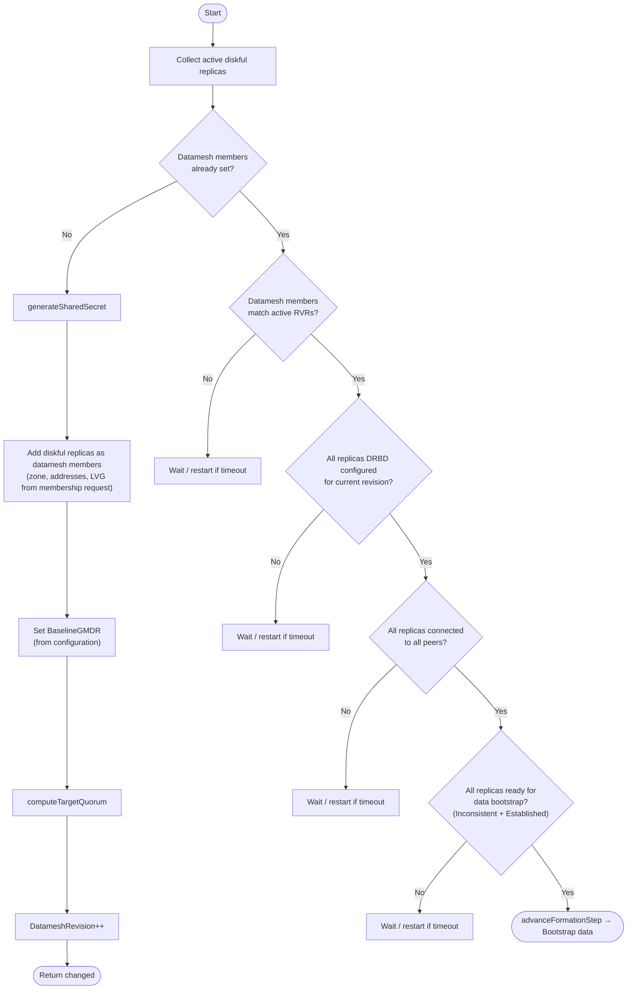
```mermaid
flowchart TD
    Start([Start]) --> CollectDiskful[Collect active diskful replicas]

    CollectDiskful --> CheckMembers{Datamesh members<br/>already set?}
    CheckMembers -->|No| GenSecret[generateSharedSecret]
    GenSecret --> AddMembers["Add diskful replicas as datamesh members<br/>(zone, addresses, LVG from membership request)"]
    AddMembers --> SetBaseline["Set BaselineGMDR<br/>(from configuration)"]
    SetBaseline --> SetQuorum[computeTargetQuorum]
    SetQuorum --> IncrRevision["DatameshRevision++"]
    IncrRevision --> ReturnChanged([Return changed])

    CheckMembers -->|Yes| VerifyMembers{"Datamesh members<br/>match active RVRs?"}
    VerifyMembers -->|No| WaitRestart1[Wait / restart if timeout]

    VerifyMembers -->|Yes| CheckConfigured{"All replicas DRBD configured<br/>for current revision?"}
    CheckConfigured -->|No| WaitRestart2[Wait / restart if timeout]

    CheckConfigured -->|Yes| CheckConnected{"All replicas connected<br/>to all peers?"}
    CheckConnected -->|No| WaitRestart3[Wait / restart if timeout]

    CheckConnected -->|Yes| CheckBootstrapReady{"All replicas ready for<br/>data bootstrap?<br/>(Inconsistent + Established)"}
    CheckBootstrapReady -->|No| WaitRestart4[Wait / restart if timeout]

    CheckBootstrapReady -->|Yes| NextStep(["advanceFormationStep → Bootstrap data"])
```

**Data Flow:**

| Input | Description |
|-------|-------------|
| `rvrs` | Replica status (DRBDConfigured, peers, backing volume state) |
| `rsp.EligibleNodes` | Zone information for datamesh members |

| Output | Description |
|--------|-------------|
| `rv.Status.Datamesh.SharedSecret` | Generated DRBD shared secret |
| `rv.Status.Datamesh.Members` | Datamesh member list |
| `rv.Status.BaselineGuaranteedMinimumDataRedundancy` | Set from Configuration GMDR |
| `rv.Status.Datamesh.Quorum` | Quorum threshold (derived from configuration) |
| `rv.Status.DatameshRevision` | Incremented revision |

---

### reconcileFormationStepBootstrapData Details

**Purpose:** Creates a DRBDResourceOperation to trigger initial data synchronization, waits for completion, and finalizes formation.

**File:** `reconciler_formation.go`

**Algorithm:**

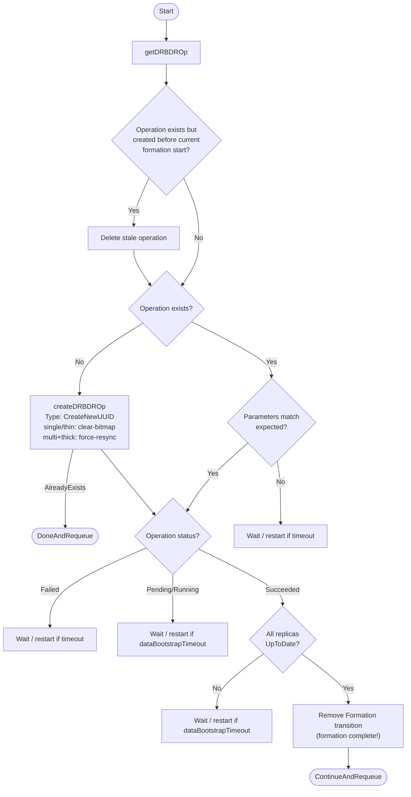
```mermaid
flowchart TD
    Start([Start]) --> GetOp[getDRBDROp]
    GetOp --> CheckStale{"Operation exists but<br/>created before current<br/>formation start?"}
    CheckStale -->|Yes| DeleteStale[Delete stale operation]
    DeleteStale --> CheckExists

    CheckStale -->|No| CheckExists{Operation exists?}
    CheckExists -->|No| CreateOp["createDRBDROp<br/>Type: CreateNewUUID<br/>single/thin: clear-bitmap<br/>multi+thick: force-resync"]
    CreateOp -->|AlreadyExists| Requeue([DoneAndRequeue])
    CreateOp --> CheckStatus

    CheckExists -->|Yes| VerifyParams{"Parameters match<br/>expected?"}
    VerifyParams -->|No| WaitRestart1[Wait / restart if timeout]
    VerifyParams -->|Yes| CheckStatus

    CheckStatus{"Operation status?"}
    CheckStatus -->|Failed| WaitRestart2[Wait / restart if timeout]
    CheckStatus -->|Pending/Running| WaitTimeout[Wait / restart if dataBootstrapTimeout]
    CheckStatus -->|Succeeded| CheckUpToDate{"All replicas<br/>UpToDate?"}

    CheckUpToDate -->|No| WaitSync[Wait / restart if dataBootstrapTimeout]
    CheckUpToDate -->|Yes| Complete["Remove Formation transition<br/>(formation complete!)"]
    Complete --> End([ContinueAndRequeue])
```

**Data Flow:**

| Input | Description |
|-------|-------------|
| `rv.Status.Datamesh.Members` | Diskful members (target for operation, count determines single/multi-replica) |
| `rsp.Type` | LVM or LVMThin (together with replica count determines sync mode) |
| `rv.Status.Datamesh.Size` | Volume size (for force-resync timeout calculation) |

| Output | Description |
|--------|-------------|
| `DRBDResourceOperation` | Created/verified data bootstrap operation |
| `rv.Status.DatameshTransitions` | Formation transition removed on success |

---

### reconcileAdoptStepVerifyPrerequisites Details

**Purpose:** Waits for pre-existing RVRs to satisfy minimal prerequisites before populating the datamesh. Unlike create/v1, this step never creates or deletes RVRs and does not validate replica counts or configuration consistency — adopt accepts replicas as-is.

**File:** `reconciler_formation.go`

**Algorithm:**

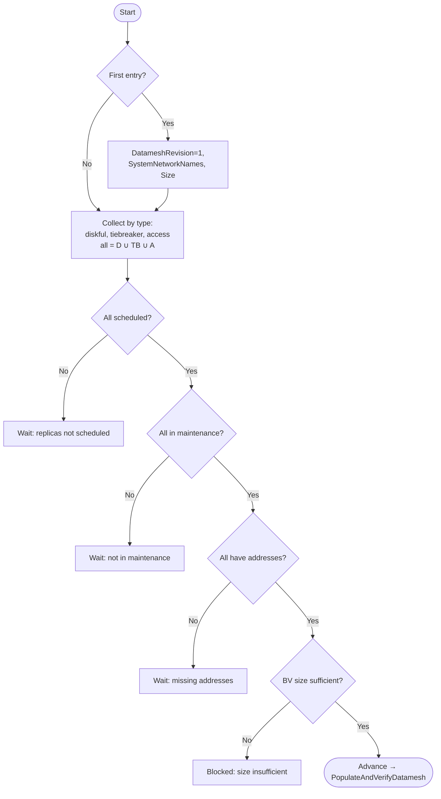
```mermaid
flowchart TD
    Start([Start]) --> Init{"First entry?"}
    Init -->|Yes| SetRev["DatameshRevision=1,<br/>SystemNetworkNames, Size"]
    Init -->|No| CollectReplicas
    SetRev --> CollectReplicas

    CollectReplicas["Collect by type:<br/>diskful, tiebreaker, access<br/>all = D ∪ TB ∪ A"]

    CollectReplicas --> CheckScheduled{All scheduled?}
    CheckScheduled -->|No| Wait1["Wait: replicas not scheduled"]

    CheckScheduled -->|Yes| CheckMaintenance{All in maintenance?}
    CheckMaintenance -->|No| Wait2["Wait: not in maintenance"]

    CheckMaintenance -->|Yes| CheckAddresses{All have addresses?}
    CheckAddresses -->|No| Wait3["Wait: missing addresses"]

    CheckAddresses -->|Yes| CheckSize{BV size sufficient?}
    CheckSize -->|No| Wait4["Blocked: size insufficient"]

    CheckSize -->|Yes| Advance(["Advance → PopulateAndVerifyDatamesh"])
```

**Data Flow:**

| Input | Description |
|-------|-------------|
| `rvrs` | Replica statuses (scheduling, maintenance, addresses, backing volume size) |
| `rsp` | System network names |

| Output | Description |
|--------|-------------|
| `rv.Status.DatameshRevision` | Set to 1 on first entry |
| `rv.Status.Datamesh.SystemNetworkNames` | Copied from RSP |
| `rv.Status.Datamesh.Size` | RV spec size rounded up to 4Ki (4096 bytes) |
| Formation transition step messages | Progress/error reporting |

---

### reconcileAdoptStepPopulateAndVerifyDatamesh Details

**Purpose:** Populates the datamesh (shared secret, members, quorum) from pre-existing replicas using RVR spec fields directly. Uses lowest possible GMDR/QMR so degraded replicas can be adopted. Verifies agents have observed the configuration before advancing.

**File:** `reconciler_formation.go`

**Algorithm:**

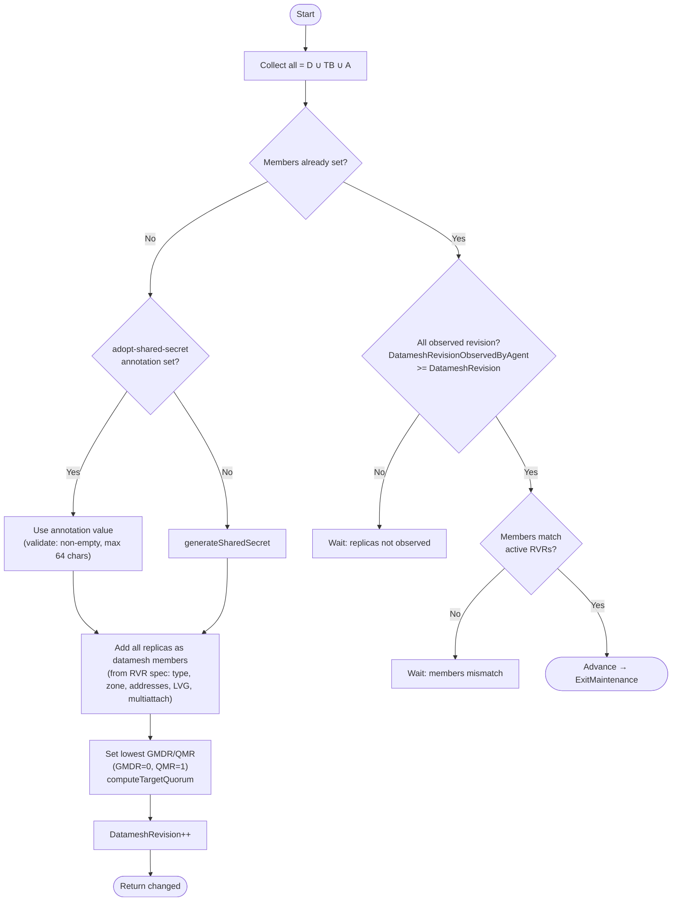
```mermaid
flowchart TD
    Start([Start]) --> CollectAll["Collect all = D ∪ TB ∪ A"]

    CollectAll --> CheckMembers{Members already set?}
    CheckMembers -->|No| CheckAnnotation{"adopt-shared-secret<br/>annotation set?"}
    CheckAnnotation -->|Yes| UseAnnotation["Use annotation value<br/>(validate: non-empty, max 64 chars)"]
    CheckAnnotation -->|No| GenSecret[generateSharedSecret]
    UseAnnotation --> AddMembers["Add all replicas as datamesh members<br/>(from RVR spec: type, zone, addresses, LVG, multiattach)"]
    GenSecret --> AddMembers
    AddMembers --> SetQuorum["Set lowest GMDR/QMR<br/>(GMDR=0, QMR=1)<br/>computeTargetQuorum"]
    SetQuorum --> IncrRevision["DatameshRevision++"]
    IncrRevision --> ReturnChanged([Return changed])

    CheckMembers -->|Yes| CheckObserved{"All observed revision?<br/>DatameshRevisionObservedByAgent<br/>>= DatameshRevision"}
    CheckObserved -->|No| WaitObserved["Wait: replicas not observed"]

    CheckObserved -->|Yes| CheckMembersMatch{Members match<br/>active RVRs?}
    CheckMembersMatch -->|No| WaitMismatch["Wait: members mismatch"]

    CheckMembersMatch -->|Yes| Advance(["Advance → ExitMaintenance"])
```

**Data Flow:**

| Input | Description |
|-------|-------------|
| `rvrs` | Replica spec (type, LVG, thinpool) and statuses (DatameshRevisionObservedByAgent, addresses, attachment) |
| `rsp.EligibleNodes` | Zone information for datamesh members |

| Output | Description |
|--------|-------------|
| `rv.Status.Datamesh.SharedSecret` | DRBD shared secret (from `adopt-shared-secret` annotation or generated) |
| `rv.Status.Datamesh.Members` | Datamesh member list (all types, from RVR spec) |
| `rv.Status.Datamesh.Multiattach` | Set if multiple members are attached |
| `rv.Status.BaselineGuaranteedMinimumDataRedundancy` | Set to 0 (lowest, for degraded replica adoption) |
| `rv.Status.Datamesh.Quorum` | Computed from actual member composition |
| `rv.Status.Datamesh.QuorumMinimumRedundancy` | Set to 1 (lowest) |
| `rv.Status.DatameshRevision` | Incremented revision |

---

### reconcileAdoptStepExitMaintenance Details

**Purpose:** Syncs addresses from RVRs and waits for all datamesh member replicas to exit maintenance mode, then completes formation. Adopt accepts replicas as-is — even degraded replicas (ConfigurationFailed, not Ready, etc.) complete formation; normal operation handles recovery afterward.

**File:** `reconciler_formation.go`

**Algorithm:**

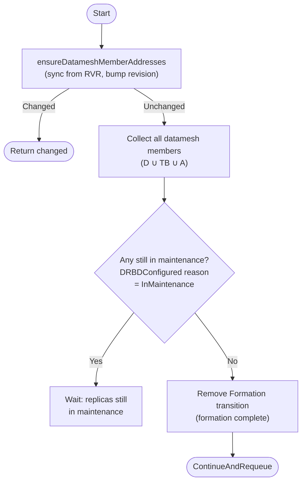
```mermaid
flowchart TD
    Start([Start]) --> SyncAddr["ensureDatameshMemberAddresses<br/>(sync from RVR, bump revision)"]
    SyncAddr -->|Changed| ReturnChanged([Return changed])
    SyncAddr -->|Unchanged| CollectAll["Collect all datamesh members<br/>(D ∪ TB ∪ A)"]

    CollectAll --> CheckMaintenance{"Any still in maintenance?<br/>DRBDConfigured reason<br/>= InMaintenance"}
    CheckMaintenance -->|Yes| WaitMaint["Wait: replicas still<br/>in maintenance"]

    CheckMaintenance -->|No| Complete["Remove Formation transition<br/>(formation complete)"]
    Complete --> End([ContinueAndRequeue])
```

**Data Flow:**

| Input | Description |
|-------|-------------|
| `rvrs` | Replica statuses (addresses, DRBDConfigured condition) |
| `rv.Status.Datamesh.Members` | Datamesh member list (for address sync and maintenance check) |

| Output | Description |
|--------|-------------|
| `rv.Status.Datamesh.Members[].Addresses` | Updated from RVR if changed |
| `rv.Status.DatameshRevision` | Bumped if addresses changed |
| `rv.Status.DatameshTransitions` | Formation transition removed on success |

---

### reconcileRVAConditionsFromDatameshReplicaContext Details

**Purpose:** Updates status conditions (Attached, ReplicaReady, Ready), phase, message, and attachment fields (devicePath, ioSuspended, inUse) on each RVA based on datamesh replica contexts returned by `datamesh.ProcessTransitions`. Called from `reconcileNormalOperation` after the datamesh engine runs.

**File:** `reconciler_rva.go`

**Algorithm:**

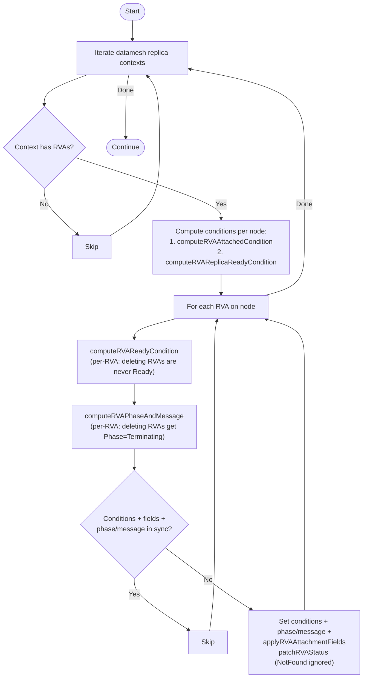
```mermaid
flowchart TD
    Start([Start]) --> IterContexts["Iterate datamesh replica contexts"]
    IterContexts --> CheckRVAs{"Context has RVAs?"}
    CheckRVAs -->|No| SkipNode[Skip]
    CheckRVAs -->|Yes| ComputeConds["Compute conditions per node:<br/>1. computeRVAAttachedCondition<br/>2. computeRVAReplicaReadyCondition"]
    ComputeConds --> IterRVAs["For each RVA on node"]
    IterRVAs --> ComputeReady["computeRVAReadyCondition<br/>(per-RVA: deleting RVAs are never Ready)"]
    ComputeReady --> ComputePhase["computeRVAPhaseAndMessage<br/>(per-RVA: deleting RVAs get Phase=Terminating)"]
    ComputePhase --> CheckSync{"Conditions + fields +<br/>phase/message in sync?"}
    CheckSync -->|Yes| SkipRVA[Skip]
    CheckSync -->|No| Patch["Set conditions + phase/message +<br/>applyRVAAttachmentFields<br/>patchRVAStatus (NotFound ignored)"]
    SkipRVA --> IterRVAs
    Patch --> IterRVAs
    IterRVAs -->|Done| IterContexts
    SkipNode --> IterContexts
    IterContexts -->|Done| End([Continue])
```

**Key behaviors:**
- Conditions are identical for all RVAs on the same node (Attached and ReplicaReady are per-node). Ready and Phase differ per RVA (deleting RVAs are always Ready=False/Terminating and Phase=Terminating).
- `AttachmentConditionReason()` and `AttachmentConditionMessage()` on each replica context are set by the datamesh engine (dispatchers, guards, slot status) — this reconciler is a pure mapper from those fields to RVA conditions.
- Phase is derived from DeletionTimestamp + Attached condition reason. Message is passthrough from the Attached condition, except when Phase=Attached and ReplicaReady != True — the ReplicaReady message is used to surface degradation (e.g., quorum loss).
- Attachment fields (devicePath, ioSuspended, inUse) are copied from `rvr.Status.Attachment` if available, cleared otherwise.

**Data Flow:**

| Input | Description |
|-------|-------------|
| `[]datamesh.ReplicaContext` | Per-node: attachment condition reason/message, RVR pointer, RVA pointers |

| Output | Description |
|--------|-------------|
| RVA conditions | Attached, ReplicaReady, Ready conditions set per RVA |
| RVA phase/message | Phase and Message set per RVA |
| RVA status fields | devicePath, ioSuspended, inUse copied from RVR |

---

### reconcileRVConfiguration Details

**Purpose:** Derives `rv.Status.Configuration` from the appropriate source (RSC in Auto mode, `ManualConfiguration` in Manual mode), validates TransZonal zone count via RSP, and sets the `ConfigurationReady` condition. Also updates `ConfigurationGeneration` and `ConfigurationObservedGeneration`.

**Caller control:** This function does NOT have an internal formation freeze guard. Instead, callers decide when to call it:
- **Root Reconcile:** when `Configuration` is nil (initial set)
- **Normal operation:** always (check for config updates)
- **Formation reset (create/v1):** after clearing `Configuration` to nil (re-derive)

During create formation, callers do NOT call this function (config is frozen). During adopt formation, this function is also NOT called — adopt accepts replicas as-is and any pending config change is picked up by normal operation after formation completes.

**Algorithm:**

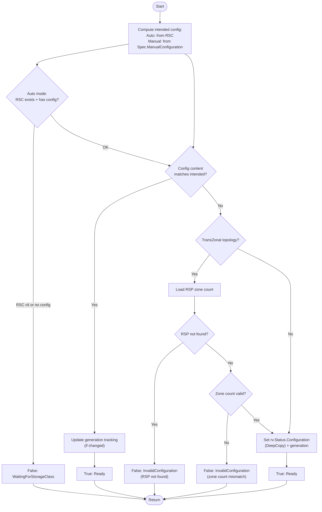
```mermaid
flowchart TD
    Start([Start]) --> ComputeIntended["Compute intended config:<br/>Auto: from RSC<br/>Manual: from Spec.ManualConfiguration"]

    ComputeIntended --> CheckAutoSource{"Auto mode:<br/>RSC exists + has config?"}
    CheckAutoSource -->|"RSC nil or no config"| SetWaiting["False: WaitingForStorageClass"]
    SetWaiting --> End([Return])
    CheckAutoSource -->|OK| ContentCheck

    ComputeIntended --> ContentCheck{"Config content<br/>matches intended?"}
    ContentCheck -->|Yes| UpdateGen["Update generation tracking<br/>(if changed)"]
    UpdateGen --> SetReady1["True: Ready"]
    SetReady1 --> End

    ContentCheck -->|No| CheckTransZonal{"TransZonal topology?"}
    CheckTransZonal -->|Yes| LoadRSP["Load RSP zone count"]
    LoadRSP --> RSPNotFound{"RSP not found?"}
    RSPNotFound -->|Yes| SetInvalid1["False: InvalidConfiguration<br/>(RSP not found)"]
    SetInvalid1 --> End
    RSPNotFound -->|No| ValidateZones{"Zone count valid?"}
    ValidateZones -->|No| SetInvalid2["False: InvalidConfiguration<br/>(zone count mismatch)"]
    SetInvalid2 --> End
    ValidateZones -->|Yes| SetConfig
    CheckTransZonal -->|No| SetConfig

    SetConfig["Set rv.Status.Configuration<br/>(DeepCopy) + generation"]
    SetConfig --> SetReady2["True: Ready"]
    SetReady2 --> End
```

**Generation tracking:**
- Auto mode: `ConfigurationGeneration` = RSC's `Status.ConfigurationGeneration` (used by rsc_controller for rollout tracking)
- Manual mode: `ConfigurationGeneration` = 0 (no RSC rollout tracking)

**Content-based fast path:** Instead of generation-based skipping, the function compares `*rv.Status.Configuration == *intended` (struct equality on 5 scalar fields). This avoids generation collision bugs when switching between Auto and Manual modes.

**Data Flow:**

| Input | Description |
|-------|-------------|
| `rv.Spec.ConfigurationMode` | Auto or Manual |
| `rv.Spec.ManualConfiguration` | Manual mode source (guaranteed present by CEL) |
| `rsc` | ReplicatedStorageClass (may be nil; Auto mode only) |
| `rsc.Status.Configuration` | RSC configuration (Auto mode source) |
| RSP (loaded via `getRSPZoneCount`) | Zone count for TransZonal validation |

| Output | Description |
|--------|-------------|
| `rv.Status.Configuration` | Set/updated configuration |
| `rv.Status.ConfigurationGeneration` | RSC generation (Auto) or 0 (Manual) |
| `rv.Status.ConfigurationObservedGeneration` | Same as ConfigurationGeneration |
| `ConfigurationReady` condition | Reports configuration state |

---

### reconcileCreateAccessReplicas Details

**Purpose:** Creates Access RVRs for active (non-deleting) RVAs on nodes that do not yet have any RVR. Called from `reconcileNormalOperation` before `datamesh.ProcessTransitions`.

**File:** `reconciler_access_replicas.go`

#### Creation guards

| # | Guard | Outcome |
|---|-------|---------|
| 1 | RV deleting | No creation (detach-only mode) |
| 2 | VolumeAccess=Local | No creation |
| 3 | RSP nil | No creation |
| 4 | RVR already exists on node (any type, including deleting) | Skip node |
| 5 | Node not in eligible nodes, or !nodeReady, or !agentReady | Skip node |
| 6 | Replica limit reached (32 RVRs) | Stop creation (break loop) |
| 7 | Duplicate RVA on same node | Deduplicate (one creation per node) |

All guards passed: create Access RVR via `createAccessRVR` (sets `spec.type=Access`, `spec.nodeName`). On `AlreadyExists`: requeue.

**Data Flow:**

| Input | Description |
|-------|-------------|
| `rv.DeletionTimestamp` | Detach-only mode check |
| `rv.Status.Configuration.VolumeAccess` | Local blocks Access creation |
| `rvas` | Active RVAs determine which nodes need Access replicas |
| `rvrs` | Existing replicas (any type on node blocks creation) |
| `rsp.EligibleNodes` | Node readiness check |

| Output | Description |
|--------|-------------|
| RVR create | Access RVRs created for eligible nodes |

---

### reconcileDeleteAccessReplicas Details

**Purpose:** Deletes Access RVRs that are redundant (another datamesh member on the same node) or unused (no active RVA on the node). Called from `reconcileNormalOperation` after `datamesh.ProcessTransitions`.

**File:** `reconciler_access_replicas.go`

#### Deletion guards

| # | Guard | Outcome |
|---|-------|---------|
| 1 | Not Access type | Skip |
| 2 | Already deleting (DeletionTimestamp set) | Skip |
| 3 | Attached (datamesh member with attached=true) | Skip (hard invariant) |
| 4 | Active Detach or AddReplica transition for this replica | Skip (avoid churn) |
| 5 | Another datamesh member on same node | **Delete** (redundant, even if RVA exists) |
| 6 | No active (non-deleting) RVA on node | **Delete** (unused) |

Deletion via `deleteRVR` (sets DeletionTimestamp). The existing pipeline handles the rest:
- If datamesh member: rvr_controller forms leave request, the datamesh engine's membership dispatcher creates RemoveReplica transition, `reconcileRVRFinalizers` removes finalizer after completion.
- If not datamesh member: `reconcileRVRFinalizers` removes finalizer directly.

**Data Flow:**

| Input | Description |
|-------|-------------|
| `rv.Status.Datamesh.Members` | Attached check, redundancy check (other member on same node) |
| `rv.Status.DatameshTransitions` | Active Detach/AddReplica check |
| `rvrs` | Access RVRs to evaluate |
| `rvas` | Active RVAs determine which nodes still need Access replicas |

| Output | Description |
|--------|-------------|
| RVR delete | Unneeded Access RVRs deleted (DeletionTimestamp set) |
