# rv_controller

This controller manages `ReplicatedVolume` (RV) resources by orchestrating datamesh formation, normal operation, and deletion.

## Purpose

The controller reconciles `ReplicatedVolume` with:

1. **Configuration initialization** — derives configuration from `ReplicatedStorageClass` (RSC) in Auto mode or from `ManualConfiguration` in Manual mode into RV status
2. **Datamesh formation** — creates replicas, establishes DRBD connectivity, bootstraps data synchronization
3. **Normal operation** — steady-state datamesh lifecycle managed by the datamesh transition engine (membership, attachment, quorum, network transitions); see [datamesh/README.md](datamesh/README.md)
4. **Deletion** — cleans up child resources (RVRs, RVAs) and datamesh state

## Interactions

| Direction | Resource/Controller | Relationship |
|-----------|---------------------|--------------|
| ← input | ReplicatedStorageClass | Reads configuration (FTT, GMDR, topology, storage pool); Auto mode only |
| ← input | ReplicatedVolume.Spec.ManualConfiguration | Reads manual configuration directly; Manual mode only |
| ← input | ReplicatedStoragePool | Reads eligible nodes, system networks, zones for formation and attach eligibility |
| ← input | ReplicatedVolumeReplica | Reads replica status (scheduling, preconfiguration, connectivity, data sync, quorum, attachment) |
| ← input | ReplicatedVolumeAttachment | Reads attachment intent (determines which nodes should be attached) |
| → manages | ReplicatedVolumeReplica | Creates/deletes during formation, normal operation (Access replicas), and deletion |
| → manages | ReplicatedVolumeAttachment | Manages finalizers; updates conditions (Attached, ReplicaReady, Ready), phase, and message during normal operation and deletion |
| → manages | DRBDResourceOperation | Creates for data bootstrap during formation |

## Algorithm

The controller reconciles individual ReplicatedVolumes:

```
if rv deleted (NotFound):
    if orphaned RVAs exist:
        reconcileRVAWaiting (set waiting conditions) + reconcileRVAMetadata (rv=nil) → Done
    else → Done

if shouldDelete (DeletionTimestamp + no other finalizers + no attached members + no Detach transitions):
    reconcileDeletion (reconcileRVAWaiting → force-delete RVRs → clear datamesh members)
    reconcileRVAMetadata (remove RVA finalizers — after conditions are set)
    reconcileMetadata (remove finalizer if no children left) → Done

ensure metadata (finalizer + labels)

if config nil: reconcileRVConfiguration (initial set from RSC or ManualConfiguration)
ensure datamesh replica membership requests (sync from RVR statuses)
ensure status size (min usable size from diskful member RVRs)

if configuration exists:
    if formation in progress (DatameshRevision == 0 or Formation transition active):
        reconcile formation (3-step process; create: config frozen; adopt: accepts replicas as-is)
        reconcileRVAWaiting (datamesh forming)
    else:
        reconcileRVConfiguration (check for config updates + set ConfigurationReady condition)
        reconcile normal operation:
            create Access RVRs for Active RVAs on nodes without any RVR
            datamesh.ProcessTransitions (membership, quorum, attachment, network)
            update RVA conditions from datamesh replica contexts
            delete unnecessary Access RVRs (redundant or unused)

reconcileRVAMetadata (add/remove RVA finalizers + labels)
reconcileRVRFinalizers (add/remove RVR finalizers)
patch status if changed
```

## Reconciliation Structure

```
Reconcile (root) [Pure orchestration]
├── getRV
├── rv == nil → getRVAs → reconcileOrphanedRVAs (reconcileRVAWaiting + reconcileRVAMetadata)
├── getRSC, getRVAs, getRVRsSorted
├── rvShouldNotExist (DeletionTimestamp + no other finalizers + no attached + no Detach transitions) →
│   ├── reconcileDeletion [In-place reconciliation] ← details
│   │   ├── reconcileRVAWaiting ("ReplicatedVolume is terminating")
│   │   ├── deleteRVRWithForcedFinalizerRemoval (loop)
│   │   └── clear datamesh members + patchRVStatus
│   ├── reconcileRVAMetadata [Target-state driven]
│   │   ├── add RVControllerFinalizer + labels to non-deleting RVAs
│   │   └── remove RVControllerFinalizer from deleting RVAs (when safe)
│   │       ├── hasOtherNonDeletingRVAOnNode (duplicate check)
│   │       └── isNodeAttachedOrDetaching (datamesh state check)
│   └── reconcileMetadata [Target-state driven] (remove finalizer)
├── reconcileMetadata [Target-state driven]
│   ├── isRVMetadataInSync
│   ├── applyRVMetadata (finalizer + labels)
│   └── patchRV
├── if config nil: reconcileRVConfiguration [In-place reconciliation] ← details
├── ensureDatameshReplicaRequests ← details
├── ensureStatusSize (min usable size from diskful member RVRs)
├── reconcileFormation [Pure orchestration]
│   │   ensureFormationTransition (find or create Formation transition with all steps)
│   ├── (create/v1)
│   │   ├── reconcileFormationStepPreconfigure [In-place reconciliation] ← details
│   │   │   ├── create/delete RVRs (guards for deleting/misplaced, replica count management)
│   │   │   ├── wait for deleting replicas cleanup
│   │   │   ├── safety checks (addresses, eligible nodes, spec mismatch, backing volume size)
│   │   │   └── reconcileFormationRestartIfTimeoutPassed
│   │   ├── reconcileFormationStepEstablishConnectivity [Pure orchestration] ← details
│   │   │   ├── generateSharedSecret + applyDatameshMember
│   │   │   ├── computeTargetQuorum
│   │   │   ├── verify configured, connected, ready for data bootstrap
│   │   │   └── reconcileFormationRestartIfTimeoutPassed
│   │   └── reconcileFormationStepBootstrapData [Pure orchestration] ← details
│   │       ├── createDRBDROp (new-current-uuid)
│   │       ├── verify operation status + UpToDate replicas
│   │       ├── reconcileFormationRestartIfTimeoutPassed
│   │       └── advanceFormationStep / remove transition (formation complete)
│   ├── (adopt/v1)
│   │   ├── reconcileAdoptStepVerifyPrerequisites [Pure orchestration] ← details
│   │   │   ├── collect non-deleting replicas by type (diskful, tiebreaker, access)
│   │   │   ├── gates: all scheduled, all in maintenance
│   │   │   ├── safety: addresses, backing volume size
│   │   │   └── advance → PopulateAndVerifyDatamesh
│   │   ├── reconcileAdoptStepPopulateAndVerifyDatamesh [Pure orchestration] ← details
│   │   │   ├── generateSharedSecret + applyDatameshMember (from RVR spec, all types, multiattach)
│   │   │   ├── computeTargetQuorum (lowest GMDR/QMR)
│   │   │   ├── gate: DatameshRevisionObservedByAgent >= DatameshRevision
│   │   │   ├── gate: members match active RVRs
│   │   │   └── advance → ExitMaintenance
│   │   └── reconcileAdoptStepExitMaintenance [Pure orchestration] ← details
│   │       ├── ensureDatameshMemberAddresses (sync addresses from RVR, bump revision)
│   │       ├── wait for maintenance exit (DRBDConfigured reason != InMaintenance)
│   │       └── formation complete (accepts replicas as-is, even if degraded)
│   └── reconcileRVAWaiting ("Datamesh formation is in progress")
├── reconcileRVConfiguration [In-place reconciliation] (config updates + ConfigurationReady condition)
├── reconcileNormalOperation [Pure orchestration]
│   ├── reconcileCreateAccessReplicas [In-place reconciliation] ← details
│   ├── datamesh.ProcessTransitions (membership, quorum, attachment, network)
│   │   └── see datamesh/README.md
│   ├── reconcileRVAConditionsFromDatameshReplicaContext [In-place reconciliation] ← details
│   │   ├── computeRVAAttachedCondition
│   │   ├── computeRVAReplicaReadyCondition
│   │   ├── computeRVAReadyCondition
│   │   ├── computeRVAPhaseAndMessage
│   │   ├── isRVAAttachmentFieldsInSync + applyRVAAttachmentFields
│   │   └── patchRVAStatus
│   ├── reconcileDeleteAccessReplicas [Pure orchestration] ← details
│   └── reconcileLayoutConvergence [Target-state driven] (≤1 whitelisted action/pass; ContinueAndRequeue after acting)
│       ├── computeTargetLayoutAction (pure decision: P1 retype D→TB / P2 create TB / none; also drives the condition)
│       │   ├── hasLayoutChangingTransition (classified by the transition's replica types, not by Group)
│       │   ├── selectRetypeCandidate (exclude attached + gain-side zone placement + lose-side zone quorum; lexicographically last name)
│       │   │   └── isRetypeToTieBreakerZoneQuorumSafe (mirrors guardZoneFTTPreservedForRetypeToTieBreaker)
│       │   ├── pendingRetypeToTieBreakerMemberNames (any pending retype → Converging; also names it) / countPendingTieBreakerCreations
│       │   ├── computeActualPendingTieBreakerSchedulingFailure (current Scheduled=False → CannotConverge)
│       │   └── isMemberAttached
│       ├── P1: base := rvr.DeepCopy(); applyRVRRetypeToTieBreaker (type=TieBreaker + clear LVG/ThinPool); patchRVR  (ChangeRole → DMTE drives it)
│       └── P2: newRVR(..., TieBreaker, "") → SetControllerRef → createRVR → insertRVRSorted; AlreadyExists → Info + requeue
├── reconcileLayoutStatus [In-place reconciliation] (status.layout + LayoutConverged condition; SINGLE writer)
│   ├── computeActualLayout (Diskful+LiminalDiskful = D, TieBreaker = TB; Access/ShadowDiskful ignored)
│   ├── computeLayoutReport → computeTargetLayoutAction (report reuses the convergence decision)
│   ├── applyLayout + applyLayoutConvergedCondTrue/False/Unknown
│   └── (not called during formation → LayoutConverged absent while forming)
├── reconcileRVAMetadata [Target-state driven] (same as deletion branch)
├── reconcileRVRFinalizers [Target-state driven]
│   ├── add RVControllerFinalizer to non-deleting RVRs
│   └── remove RVControllerFinalizer from deleting RVRs (when safe)
│       └── isRVRMemberOrLeavingDatamesh (member + RemoveReplica check)
└── patchRVStatus
```

Links to detailed algorithms: [`reconcileDeletion`](#reconciledeletion-details), [`ensureDatameshReplicaRequests`](#ensuredatameshreplicarequests-details), [`reconcileRVConfiguration`](#reconcilervconfiguration-details), [`reconcileFormationStepPreconfigure`](#reconcileformationsteppreconfigure-details), [`reconcileFormationStepEstablishConnectivity`](#reconcileformationstepestablishconnectivity-details), [`reconcileFormationStepBootstrapData`](#reconcileformationstepbootstrapdata-details), [`reconcileAdoptStepVerifyPrerequisites`](#reconcileadoptstepverifyprerequisites-details), [`reconcileAdoptStepPopulateAndVerifyDatamesh`](#reconcileadoptsteppopulateandverifydatamesh-details), [`reconcileAdoptStepExitMaintenance`](#reconcileadoptstepexitmaintenance-details), [`reconcileCreateAccessReplicas`](#reconcilecreateaccessreplicas-details), [`reconcileDeleteAccessReplicas`](#reconciledeleteaccessreplicas-details), [`reconcileRVAConditionsFromDatameshReplicaContext`](#reconcilervaconditionsfromdatameshreplicacontext-details)

## Algorithm Flow

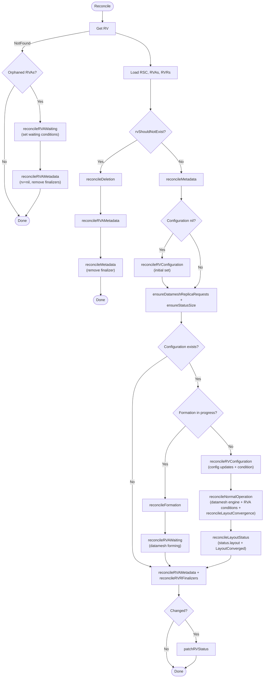
```mermaid
flowchart TD
    Start([Reconcile]) --> GetRV[Get RV]
    GetRV -->|NotFound| CheckOrphanedRVAs{Orphaned RVAs?}
    CheckOrphanedRVAs -->|No| Done1([Done])
    CheckOrphanedRVAs -->|Yes| OrphanedWaiting["reconcileRVAWaiting<br/>(set waiting conditions)"]
    OrphanedWaiting --> OrphanedFinalizers["reconcileRVAMetadata<br/>(rv=nil, remove finalizers)"]
    OrphanedFinalizers --> Done1
    GetRV --> LoadDeps[Load RSC, RVAs, RVRs]

    LoadDeps --> CheckDelete{rvShouldNotExist?}
    CheckDelete -->|Yes| Deletion[reconcileDeletion]
    Deletion --> RVAFinDel[reconcileRVAMetadata]
    RVAFinDel --> MetaDel["reconcileMetadata<br/>(remove finalizer)"]
    MetaDel --> Done3([Done])

    CheckDelete -->|No| Meta[reconcileMetadata]
    Meta --> CheckConfigNil{Configuration nil?}
    CheckConfigNil -->|Yes| InitConfig["reconcileRVConfiguration<br/>(initial set)"]
    InitConfig --> EnsurePending
    CheckConfigNil -->|No| EnsurePending
    EnsurePending["ensureDatameshReplicaRequests +<br/>ensureStatusSize"]
    EnsurePending --> CheckConfig{Configuration exists?}
    CheckConfig -->|No| Finalizers

    CheckConfig -->|Yes| CheckForming{Formation in progress?}
    CheckForming -->|Yes| Formation[reconcileFormation]
    Formation --> FormingRVAWaiting["reconcileRVAWaiting<br/>(datamesh forming)"]
    FormingRVAWaiting --> Finalizers
    CheckForming -->|No| UpdateConfig["reconcileRVConfiguration<br/>(config updates + condition)"]
    UpdateConfig --> NormalOp["reconcileNormalOperation<br/>(datamesh engine + RVA conditions +<br/>reconcileLayoutConvergence)"]
    NormalOp --> LayoutStatus["reconcileLayoutStatus<br/>(status.layout + LayoutConverged)"]
    LayoutStatus --> Finalizers

    Finalizers["reconcileRVAMetadata +<br/>reconcileRVRFinalizers"]
    Finalizers --> PatchDecision{Changed?}
    PatchDecision -->|Yes| Patch[patchRVStatus]
    PatchDecision -->|No| EndNode([Done])
    Patch --> EndNode
```

## Layout formula

The intended datamesh layout is derived from the configuration's FTT/GMDR:

```
D  (diskful voters) = FailuresToTolerate + GuaranteedMinimumDataRedundancy + 1
TB (tie-breakers)   = 1  if D is even and FailuresToTolerate == D/2, else 0
```

This is provided by `ReplicatedVolumeConfiguration.IntendedLayout()` in `api/v1alpha1/rv_types.go`,
with the tie-breaker sub-formula exposed as `v1alpha1.TieBreakersForDiskful(diskful, ftt)`. It is
the source of truth for the **layout comparison** (the `LayoutConverged` condition and the
tie-breaker guard reuse it). Placement decision: `IntendedLayout` is a pure, deterministic,
context-free get-helper (no I/O, no cluster-state interpretation), so per `api-file-structure.mdc`
it lives in `rv_types.go` (not `rv_custom_logic_that_should_not_be_here.go`).

The datamesh package reuses the same formula: `guardTBSufficient` computes its required tie-breaker
count via `v1alpha1.TieBreakersForDiskful`. Note that the guard passes the **actual** current voter
count (not the intended diskful count), so it stays correct during transitions where the two differ.

The controller now derives both the diskful and tie-breaker counts from `IntendedLayout()`:
formation (`reconcileFormationStepPreconfigure`), `computeTargetQuorum` (`minD`), and
`rsc_controller`'s `validateEligibleNodes` all call it (the latter through a config built from
FTT/GMDR), so the D/TB formula lives in exactly one place for controller code. The e2e helper
`pkg/framework/t_layout.go` also calls `IntendedLayout()` now (via a config built from its
`TestLayout` FTT/GMDR), so no production/framework copy of the formula remains. The one deliberate
re-derivation left is the independent cross-check in the e2e selftest
(`pkg/framework/selftest/layout_test.go`), which recomputes the expected layout by hand to validate
the real cluster state against `ExpectedReplicas()` rather than to reuse the formula.

## Conditions

### ConfigurationReady

Indicates whether the RV configuration is valid and derived from the appropriate source. Set by `reconcileRVConfiguration`.

| Status | Reason | When |
|--------|--------|------|
| True | Ready | Configuration is valid and matches the source |
| False | WaitingForStorageClass | RSC not found, RSC configuration not ready, or RSC has not published a configuration for its current `metadata.generation` yet (Auto mode only) |
| False | NewerConfigurationHeld | The RSC has a newer configuration, but `configurationRolloutStrategy.type=NewVolumesOnly` keeps this volume on the one it already has (Auto mode only) |
| False | InvalidConfiguration | Configuration is invalid: RSP not found or TransZonal zone count mismatch |

`NewerConfigurationHeld` is a reporting state, not a block: nothing gates on `ConfigurationReady`,
so the volume keeps operating on its own configuration. The class-level aggregate counts such a
volume as `staleConfiguration` (see `rsc_controller`).

### LayoutConverged

Indicates whether the actual datamesh layout (diskful voters + tie-breakers) matches the layout
intended by the configuration. Set by `reconcileLayoutStatus`, which is the **single writer** of
this condition. It is evaluated only post-formation (never written while a volume is forming) and
after the configuration has been acknowledged (`status.configuration` is set).

`reconcileLayoutStatus` only reports — the convergence actions live in the separate
`reconcileLayoutConvergence` step (below). Both share one pure decision function,
`computeTargetLayoutAction`, so the reported reason always agrees with what convergence does this
pass, and this remains the only writer of the condition.

The intended layout comes from `ReplicatedVolumeConfiguration.IntendedLayout()` (the source of
truth for the layout comparison — see [Layout formula](#layout-formula)); the actual layout is
counted from `status.datamesh.members` (Diskful + LiminalDiskful = diskful voters, TieBreaker =
tie-breakers; Access and ShadowDiskful are not part of the layout).

Only **layout-changing** transitions count as convergence progress — see
`hasLayoutChangingTransition`. Two conditions must hold: the transition type is a membership one
(`AddReplica`/`RemoveReplica`/`ForceRemoveReplica`/`ChangeReplicaType`), **and** the replica types
recorded in the transition touch the layout (`Diskful` or `TieBreaker`; for `ChangeReplicaType`,
either end). Other transition types (Attach/Detach, ResizeVolume, ChangeQuorum, network,
multiattach) and membership transitions confined to `Access`/`ShadowDiskful` leave the layout
unchanged and do not gate convergence. The classification deliberately goes by the record's fields
and **not** by `Group`: `ForceRemoveReplica` lives in the `Emergency` group, so a
`Group == VotingMembership` filter would silently drop it.

**Decision order in `computeTargetLayoutAction`** (fixed; each earlier step wins):

1. RV deletion → `Unknown`/`VolumeDeleting`, no action.
2. An active layout-changing transition → `Converging`, no action.
3. **Any** retype requested in an earlier pass (spec flipped, DMTE not dispatched yet) →
   `Converging`. The step deliberately ignores the tie-breaker deficit: see below.
4. A tie-breaker replacement deficit (a tie-breaker member whose RVR is being deleted) → create the
   replacement (strict create-first, see below).
5. Comparison of actual against intended: equal → `Converged`; otherwise the whitelist below.

Steps 2, 3 and 4 precede the actual/intended comparison **on purpose**. Mid-flight D→TB makes the
counted layout equal the intended one for one step (the member is already a `TieBreaker` while the
transition is still running), and reporting `Converged` there would flip the condition True and
straight back; a flipped `spec.type` is a layout change in flight even when the intended layout no
longer asks for it (see [Configuration flip-flop](#configuration-flip-flop-known-limitation));
likewise, a terminating tie-breaker is still counted by the raw layout, so the comparison alone
would report `Converged` while the volume's only tie-breaker is leaving. Step 5 still absorbs
unrelated activity, so the condition does not flap on attach/resize or Access churn.

Step 3 also wins over step 4, so a tie-breaker replacement waits until a pending retype resolves.
Convergence never produces that combination itself (at most one action per pass), and the report
stays honest while it lasts.

| Status | Reason | When |
|--------|--------|------|
| True | Converged | Actual layout matches the intended layout, no layout-changing transition is running and no retype is pending (unrelated transitions do not affect this) |
| False | Converging | A layout change is in flight: a layout-changing transition is running, a retype is pending (requested in this or an earlier pass), or a tie-breaker creation is pending |
| False | CannotConverge | A whitelist pattern applies but no admissible candidate exists (all diskful replicas are attached, no zone can host a tie-breaker, the retype would break zone quorum, or the pending tie-breaker — including a replacement for a terminating one — has a current `Scheduled=False`) |
| False | TransitionUnsupported | Layout mismatches outside the whitelist; no supported automatic transition (manual intervention required) |
| Unknown | VolumeDeleting | The volume is being deleted; convergence is no longer evaluated |

The unsupported message uses the exact layout arithmetic, e.g.
`layout mismatch: have 3D, want 2D+1TB; automatic transition is not supported, manual intervention required`.
`status.layout` holds the actual layout string (e.g. `3D`, `2D+1TB`; the `+NTB` suffix is omitted
when there are no tie-breakers) and is exposed as a priority-1 print column. The field is an
optional scalar (`*string`): it stays **absent** until `reconcileLayoutStatus` first runs (i.e.
throughout formation), and an empty string is never published — absent means "not computed yet".

`Unknown`/`VolumeDeleting` is published on **both** deletion paths: by `reconcileLayoutStatus` for a
volume that still goes through normal operation (deleting but attached), and by `reconcileDeletion`
for a volume that enters the early deletion branch directly (unattached) and never reaches normal
operation. In the latter the condition is written in the same status patch that clears the datamesh
members. Leaving the previous `Converging`/`CannotConverge` message in place would promise an action
the deletion path never performs.

### Layout convergence (`reconcileLayoutConvergence`)

A normal-operation step that performs **at most one** whitelisted action per reconcile pass to move
the actual layout toward the intended one, then returns `ContinueAndRequeue` (the split-client cache
may be stale relative to our own write, so we requeue rather than rely on the watch). The outcome is
deliberately **non-terminal**: the root `Reconcile` checks `ShouldReturn()` before `patchRVStatus`,
so a terminal outcome here would drop every status change computed in the acting pass — including
the `LayoutConverged` report describing that very action (`controller-reconciliation-flow.mdc`,
`Continue*` vs `Done*` with requeue). Preconditions: configuration acknowledged, formation complete
(guaranteed by the caller), RV not deleting, and no active layout-changing transition.

Two whitelisted patterns (nothing else is ever acted upon):

- **P1 retype (r3→r2 migration)** — `actualD > intendedD && actualTB < intendedTB`: convert one
  Diskful replica into the missing tie-breaker by patching its `spec.type` to `TieBreaker`. The
  same patch clears `spec.lvmVolumeGroupName` and `spec.lvmVolumeGroupThinPoolName`: the API
  rejects backing-volume fields on a non-Diskful replica (`lvmVolumeGroupName can only be set for
  Diskful type`), so a patch that only flips the type is refused by the apiserver and the
  migration retries forever. Clearing them is safe for the data: while the member is still
  Diskful/LiminalDiskful its backing volume (and LLV name) is derived from the datamesh member
  record, not from the RVR spec, so the LLV lives until the member actually leaves. The
  existing ChangeRole → DMTE machinery drives the membership transition (no resync, no data
  movement). Candidate selection (`selectRetypeCandidate`) is deterministic and mirrors **both**
  sides of the DMTE guard set, because a candidate the DMTE would reject would have its spec flipped
  to TieBreaker while the ChangeRole transition never runs, wedging the volume in a misleading
  `Converging` state:
  - attached replicas are excluded (`member.Attached` or an active RVA on the node);
  - **gain side** (tie-breaker placement): for TransZonal, replicas whose zone holds more than one
    diskful voter are excluded (`guardTransZonalTBPlacement`); for Zonal, replicas outside the
    primary zone, i.e. not in a zone with the maximum diskful-voter count (`guardZonalSameZone`);
  - **lose side** (zone quorum, TransZonal only): the retype must keep quorum survivable for the
    loss of any zone — `isRetypeToTieBreakerZoneQuorumSafe`, mirroring
    `guardZoneFTTPreservedForRetypeToTieBreaker`. Without this mirror a legitimately
    non-convergible layout (e.g. two zones holding 2D and 1D — losing the 2D zone breaks quorum
    whichever replica is retyped) would pick a candidate whose dispatch stays blocked forever.

  Among the remaining candidates it picks the lexicographically last RVR name. No admissible
  candidate → `CannotConverge`, with a reason distinguishing "violates zone placement" (gain side)
  from "losing a zone would lose quorum" (lose side).
- **P2 heal** — `actualD == intendedD && actualTB < intendedTB`: create the missing tie-breaker
  (`newRVR(..., TieBreaker, "")` → `SetControllerRef` → `createRVR` → `insertRVRSorted`; the name is
  deterministic, so a stale-cache retry converges via `AlreadyExists`).
  The scheduler places it and it joins the datamesh via the standard
  `tiebreaker/v1` plan. This also closes the "new r2 volume lives at 2D until healed" window and
  restores a manually deleted tie-breaker. While the created tie-breaker is not yet a member the
  report distinguishes progress from a verdict: only a **current** `Scheduled=False` (its
  `ObservedGeneration` equals the RVR generation) is the scheduler's answer for this spec and yields
  `CannotConverge` with the scheduler's own message
  (`computeActualPendingTieBreakerSchedulingFailure`); a missing, `Unknown` or stale `Scheduled`
  means the scheduler has simply not (re-)evaluated the replica yet → `Converging`. Once it becomes
  `Scheduled=True` the report goes back to `Converging`.

Ordering / whitelist notes: convergence runs **after** `ProcessTransitions`, so a transition just
created this pass makes it a no-op. It fills only the tie-breaker deficit — a 4D volume at an r2
config becomes 3D+1TB after one retype and is then reported `TransitionUnsupported` (the extra
diskful voters are never removed).

#### Configuration flip-flop (known limitation)

The whitelist is one-directional: convergence retypes D→TB and creates a tie-breaker, and it never
flips a `spec.type` back. Reverting the class (r2 → r3) inside the retype window — between the
`spec.type` patch and the DMTE dispatch — therefore leaves the retype **stranded**, and it is not
rolled back automatically. The volume never reports `Converged` while this lasts (step 3 of the
decision order fires on any pending retype), and the `Converging` message names the flipped
replica. Two outcomes, depending on when the revert lands:

| Branch | What happened | Resulting state | Recovery |
|--------|---------------|-----------------|----------|
| **A — the DMTE dispatched under the r2 configuration** | The lose-side guards passed (`D_min = FTT+GMDR+1 = 2` at r2), so the ChangeRole transition runs to completion | The retype finishes: `2D+1TB` against an intended `3D` → `TransitionUnsupported` (the layout alert fires) | The usual manual upsize, in this order: create a Diskful RVR (`2D+1TB` → `3D+1TB`), then delete the tie-breaker RVR — with an odd diskful count no tie-breaker is required (`TB_min = 0`), so `guardTBSufficient` releases it. An automatic r2→r3 path does not exist |
| **B — the configuration was already r3 at dispatch time** | `guardFTTPreserved` blocks the transition permanently (`D_min = FTT+GMDR+1 = 3`, voters = 3, so `3 <= 3`); the retype never runs and **no data is lost** — the guard did its job | Raw layout stays `3D` and matches the intended one, but the volume reports `Converging` **forever** | Undo the flip: patch the RVR back to `spec.type: Diskful` **together with** the backing-volume fields the retype cleared (`spec.lvmVolumeGroupName`, plus `spec.lvmVolumeGroupThinPoolName` on a thin pool), copying the values from the volume's datamesh member record, which still carries them |

Both fields must go in the **same** patch as the type: the API rejects backing-volume fields on a
non-Diskful replica, and a Diskful replica without them counts as unscheduled, so the scheduler
would assign the storage itself (possibly a different LVG on that node). Deleting the flipped RVR
is **not** an escape in branch B: the Leave request hits the very same `guardFTTPreserved` and
hangs the same way, only with a terminating replica on top.

In both branches the class-level aggregate keeps the volume out of `aligned` (a present and False
`LayoutConverged` counts as `staleConfiguration`, see `rsc_controller`), so
`ConfigurationRolledOut` stays False until the replica is repaired.

Branch B is **not covered by the layout alert**, which fires on `TransitionUnsupported` and
`CannotConverge` only: a healthy cluster sits in an honest but permanent `Converging`. A proper way
out (revoking the retype decision and re-picking a candidate) needs the execution-record protocol
of the **RVR authorization design contract** — see the note at the end of this section.

**Tie-breaker replacement (strict create-first).** Deleting a live tie-breaker (node drain, manual
`kubectl delete rvr`) does not release it from the datamesh: the RV controller finalizer holds the
RVR, it keeps working as a DRBD peer, and the datamesh guard `guardTBSufficient` releases it only
once a replacement is **operational** (applied the current datamesh revision, `DRBDConfigured=True`
for its current spec, every connection to the data-bearing members confirmed `Connected` by a fresh
reporter). Tiebreak protection is therefore never lost, not even for a moment.

Convergence supplies the replacement (`computeTargetTieBreakerReplacement`, step 4 of the decision
order). Two properties matter:

- `computeActualLayout` is **not** touched: `status.layout` keeps reporting the raw member
  composition, so the replacement window is honestly shown as `2D+2TB`.
- the replacement deficit is computed **separately**, as `intendedTB` minus the tie-breaker members
  whose RVR is *not* being deleted (`deletingTieBreakerMemberNames`), with in-flight creations
  counted by `countPendingTieBreakerCreations` so no second replacement is ever created.

| State | Action / report |
|-------|-----------------|
| Old tie-breaker terminating, no replacement | Create it (P2 `newRVR` → `createRVR`); `Converging` |
| Replacement created, not a member yet | `Converging` |
| Replacement carries a **current** `Scheduled=False` (no free eligible node) | `CannotConverge` with the scheduler's message; the old tie-breaker keeps working, the replacement RVR stays pending and is placed as soon as a node frees up |
| Replacement joined the datamesh (operational or not) | `Converging`; releasing the old one is the guard's decision |
| Old tie-breaker gone | `2D+1TB`, `Converged` |

Out of scope on purpose: a member whose RVR is gone entirely is an **orphan**, force-removed by the
datamesh without tie-breaker guards, and the plain P2 deficit then heals the layout — creating a
replacement in parallel would race with that. A wrong diskful count or a genuine tie-breaker
surplus is likewise reported honestly instead of being papered over with a new tie-breaker.

If the cluster has no free eligible node the deletion simply waits (nothing else is blocked). To
finish it, remove the finalizer from the terminating RVR: it becomes an orphan, is force-removed,
and the replacement is scheduled onto the freed node — the step-by-step recipe lives in
`debug_and_problem_solving.md` (project knowledge base).

**volumeAccess=Local.** A retype under `volumeAccess=Local` is allowed as long as the candidate is
unattached. A TieBreaker serves no I/O in **any** access mode, so the blanket `guardVolumeAccessNotLocal`
(written for `Access` replicas, which do serve I/O) does not belong on the D→TB plans and is not
attached to them. The real Local invariant — "the attached node must keep its Diskful" — is enforced
by the DMTE guard `guardVolumeAccessLocalForDemotion`, and preselection additionally never picks an
attached replica. Note the two checks are not the same thing: preselection reads the cache at
decision time, while the guard is evaluated at dispatch time.

> **Known gap (tracked elsewhere).** An attachment appearing *between* the retype patch and the DMTE
> dispatch is a scheduling race that this step does not close: there is no dispatch-time
> workload/RVA guard, no execution-record revoke and no rollback/repick here. That protocol is
> specified in the **RVR authorization design contract** (project docs,
> `docs/rvr-authorization-design-contract.md` in the project workspace) and implemented separately;
> the branch is not merged or released before it lands. Do not add a partial preflight/rollback
> here — it would contradict the cache-only execution-record model of that contract.

**Safety invariants:** convergence **never creates a Diskful replica** and **never deletes a replica
or its data** (freeing the retyped replica's LLV is the ordered redundancy reduction, handled by the
generic backing-volume reconcile in rvr_controller once member *and* spec are TieBreaker). A race
with manual RVR operations (a user retyping/creating a replica in parallel) can push the layout
outside the whitelist (e.g. an extra tie-breaker) → `TransitionUnsupported`, and convergence safely
stops. The rollout applies to all volumes of a class at once; `configurationRolloutStrategy`
(maxParallel/NewVolumesOnly) is not yet honored — safe for r3→r2 (no resync), a blocker for future
resync-bearing transitions.

Migration monitoring:

```sh
# Per-volume layout and convergence reason (Layout is a priority-1 column, -o wide shows it):
kubectl get rv -o wide
kubectl get rv <name> -o jsonpath='{.status.layout}{"  "}{range .status.conditions[?(@.type=="LayoutConverged")]}{.status}/{.reason}: {.message}{end}{"\n"}'

# Class-wide rollout aggregate:
kubectl get rsc <name> -o jsonpath='{.status.volumes}{"\n"}'
```

### Attached (on RVA)

Set by `reconcileRVAConditionsFromDatameshReplicaContext` during normal operation, or by `reconcileRVAWaiting` when the RV is unavailable.

| Status | Reason | When |
|--------|--------|------|
| True | Attached | Volume is attached and ready to serve I/O on the node (if RV is deleting: with pending-deletion note) |
| False | Attaching | Attach transition in progress |
| False | Detaching | Detach transition in progress |
| False | Detached | Volume has been detached from the node |
| False | Pending | Waiting for slot, quorum, node readiness, etc. |
| False | WaitingForReplica | Replica not yet joined datamesh or not Ready |
| False | WaitingForReplicatedVolume | RV deleted, not found, or datamesh forming |
| False | NodeNotEligible | Node not in RSP eligible nodes |
| False | ReplicatedVolumeTerminating | RV is being deleted; node is not yet attached (new attachments blocked) |
| False | VolumeAccessLocalityNotSatisfied | No Diskful replica on node (VolumeAccess=Local) |

### ReplicaReady (on RVA)

Mirrors the RVR Ready condition for the replica on this node. Set by `reconcileRVAConditionsFromDatameshReplicaContext`. Removed by `reconcileRVAWaiting` when the RV is unavailable.

| Status | Reason | When |
|--------|--------|------|
| True/False/Unknown | *(mirrored from RVR Ready)* | RVR exists and has Ready condition |
| Unknown | WaitingForReplica | No RVR or no Ready condition on RVR |

### Ready (on RVA)

Aggregate condition: Ready=True iff Attached=True AND ReplicaReady=True AND not deleting.

| Status | Reason | When |
|--------|--------|------|
| True | Ready | Attached and replica is ready |
| False | NotAttached | Attached condition is not True |
| False | ReplicaNotReady | ReplicaReady is False |
| False | Terminating | RVA has DeletionTimestamp |
| Unknown | ReplicaNotReady | ReplicaReady is Unknown |

### Phase (on RVA)

Quick operational state summary. Derived from DeletionTimestamp and Attached condition reason. Set alongside conditions by `reconcileRVAConditionsFromDatameshReplicaContext` and `reconcileRVAWaiting`.

| Phase | When |
|-------|------|
| Terminating | DeletionTimestamp is set |
| Attached | Attached=True |
| Attaching | Attached=False, Reason=Attaching |
| Detaching | Attached=False, Reason=Detaching |
| Pending | Everything else (waiting for prerequisites) |

Message is passthrough from the Attached condition, except when Phase=Attached and ReplicaReady != True — the ReplicaReady message is shown to surface degradation.

## Formation Steps

Datamesh formation uses one of two plans depending on whether pre-existing replicas need to be adopted. Each plan is a 3-step process tracked in `rv.Status.DatameshTransitions[].Steps`.

- **create/v1** — creates fresh DRBD replicas, bootstraps connectivity and data.
- **adopt/v1** — adopts pre-existing DRBD replicas (in maintenance mode) into the datamesh.

### create/v1 Formation

Each step has a timeout; if progress stalls, formation restarts from scratch.

#### Step 1: Preconfigure

Creates diskful replicas and waits for them to become preconfigured (DRBD setup complete, ready for datamesh membership).

**Actions:**
1. Initialize datamesh configuration (SystemNetworkNames, Size, DatameshRevision=1)
2. Identify misplaced replicas (SatisfyEligibleNodes=False) and deleting replicas (DeletionTimestamp set)
3. Collect active diskful replicas (excluding misplaced and deleting)
4. Create missing diskful replicas only when no deleting or misplaced replicas exist (prevents zombie accumulation)
5. Remove excess/misplaced replicas
6. Wait for all deleting replicas to be fully removed (restart formation if timeout)
7. Wait for scheduling and preconfiguration (replicas split into pending scheduling / scheduling failed / preconfiguring; scheduling failure messages from RVR Scheduled=False conditions are shown inline)
8. Safety checks: addresses, eligible nodes, spec consistency, backing volume size

#### Step 2: Establish Connectivity

Adds preconfigured replicas to the datamesh and waits for DRBD peer connections.

**Actions:**
1. Generate shared secret for DRBD peer authentication
2. Add diskful replicas as datamesh members (with zone, addresses, LVG info)
3. Set effective layout (FTT/GMDR from configuration) and quorum parameters
4. Wait for all replicas to apply DRBD configuration (DRBDConfigured=True)
5. Wait for all replicas to connect to each other (ConnectionState=Connected)
6. Wait for the tie-breakers of the layout to become **operational** (see [Tie-breaker readiness](#tie-breaker-readiness-in-createv1-formation))
7. Wait for data bootstrap readiness (BackingVolume=Inconsistent + Replication=Established)

#### Step 3: Bootstrap Data

Triggers initial data synchronization via DRBDResourceOperation and waits for completion.

**Actions:**
1. Create DRBDResourceOperation (type: CreateNewUUID)
   - Single replica (any pool type): clear-bitmap (no peers to synchronize with)
   - Multiple replicas, thin provisioning: clear-bitmap (no full resync needed)
   - Multiple replicas, thick provisioning: force-resync (full data synchronization)
2. Wait for operation to succeed
3. Wait for all replicas to reach UpToDate state
4. Re-check tie-breaker readiness (see [Tie-breaker readiness](#tie-breaker-readiness-in-createv1-formation)); if it was lost during the bootstrap — wait, do not complete
5. Remove Formation transition (formation complete); requeue to enter normal-operation path

**Timeout calculation:**
- Base: 1 minute
- Force-resync (multi-replica thick provisioning): + volume size / 100 Mbit/s (worst-case bandwidth estimate)
- Clear-bitmap (single replica or thin provisioning): base only

#### Tie-breaker readiness in create/v1 formation

A tie-breaker that is a datamesh **member** is not yet a **working** tie-breaker: adding it to the datamesh only proves that the agents applied the configuration revision, not that DRBD established the connections that make the tie break real. Completing formation at that point publishes a 2D+1TB volume with the protection of a bare 2D — the first node failure costs quorum.

`computeActualTieBreakerReadiness` therefore gates formation on exactly four conditions:

1. the datamesh tie-breaker members are exactly the active (non-deleting) tie-breaker replicas;
2. every tie-breaker has applied the current `DatameshRevision` (`>=`: being ahead is cache skew, not staleness);
3. every tie-breaker has `DRBDConfigured=True` with a current `ObservedGeneration`;
4. every tie-breaker↔data-bearing-member connection is confirmed `Connected` by at least one side whose own report is fresh (agent ready and at the current revision).

Nothing else is required: a tie-breaker has no backing volume, no replication state and no quorum of its own, and demanding a fresh report from *both* sides would stall formation on a single lagging agent.

Gates 2-4 are `datamesh.IsTieBreakerOperational` — the very criterion the datamesh guard `guardTBSufficient` applies before releasing a leaving tie-breaker (see [datamesh/README.md](datamesh/README.md), "tie-breaker replacement"). Formation and convergence ask the same question and, by construction, cannot answer it differently.

The check runs twice on the create/v1 path: as a gate in **Establish Connectivity** (a stalled tie-breaker there restarts formation on the usual timeout, exactly like a stalled diskful replica) and as a final re-check in **Bootstrap Data**, immediately before the Formation transition is removed — a data bootstrap can take minutes, and connectivity can be lost in the meantime. The final re-check only **waits** (it does not restart formation): the diskful replicas are already bootstrapped and UpToDate, and the restart helper measures elapsed time from the *start* of formation, so a transient blip would otherwise destroy a fully synchronized layout. A tie-breaker that never recovers stays visible as an explicit wait message.

The **adopt/v1** path is deliberately NOT gated: adopt accepts pre-existing replicas as-is, even degraded ones, and normal operation heals them afterwards — gating it would keep such volumes in formation forever.

#### Formation Restart

When formation stalls (any safety check fails or progress timeout is exceeded), formation restarts:

1. Wait for timeout since formation started (to avoid thrashing)
2. Log error (formation timed out)
3. Delete formation DRBDResourceOperation if exists
4. Delete all replicas (with finalizer removal)
5. Reset the datamesh status fields (DatameshRevision, Datamesh, BaselineGuaranteedMinimumDataRedundancy, transitions, DatameshReplicaRequests)
6. Re-derive configuration via `reconcileRVConfiguration` (formation starts from scratch, so a pending configuration change is picked up here if the rollout strategy allows it)
7. Requeue for fresh start

**The configuration fields are deliberately NOT reset.** `Configuration == nil` is the marker of
"this volume never received a configuration", which the `NewVolumesOnly` rollout strategy uses to
tell new volumes from existing ones. Clearing it on restart would make a restarting volume look
brand new and let it silently adopt a configuration that was explicitly held back from it.

### adopt/v1 Formation

Unlike create/v1, the adopt plan never creates or deletes RVRs. It expects pre-existing RVRs (created externally) to be in maintenance mode. The adopt plan handles all replica types: Diskful, TieBreaker, and Access. Adopt accepts replicas as-is — it does not validate replica counts, backing volume states, eligible nodes, or spec consistency against the RSC configuration. Any discrepancies are resolved by normal operation after formation completes.

#### Step 1: Verify Prerequisites

Waits for pre-existing RVRs to satisfy minimal prerequisites before populating the datamesh.

**Gates (in order):**
1. All replicas (D+TB+A) are scheduled
2. All replicas are in maintenance mode
3. All replicas have addresses for required system networks
4. Backing volume size is sufficient (diskful only)

#### Step 2: Populate and Verify Datamesh

Populates the datamesh from pre-existing replicas. Member fields are taken directly from RVR spec (not from DatameshRequest), because adopt accepts the pre-existing replica configuration as-is.

**Actions (populate):**
1. Resolve shared secret for DRBD peer authentication: if the `adopt-shared-secret` annotation is set, its value is used (must be non-empty, max 64 chars); otherwise a random secret is generated
2. Add all replicas as datamesh members (from RVR spec: type, zone, addresses, LVG; tracks multiattach from attachment status)
3. Set lowest possible GMDR/QMR (GMDR=0, QMR=1) so that replicas with degraded backing volumes can still be adopted; quorum is computed from actual member composition
4. Increment DatameshRevision

**Gates (verify, in order):**
1. All replicas have observed the datamesh revision (`DatameshRevisionObservedByAgent >= DatameshRevision`)
2. Datamesh members match active RVRs

#### Step 3: Exit Maintenance

Syncs addresses and waits for all datamesh member replicas to exit maintenance mode. Adopt accepts replicas as-is — even degraded replicas complete formation; normal operation handles recovery afterward.

**Actions:**
1. `ensureDatameshMemberAddresses`: if any RVR address changed since populate, update the member and bump DatameshRevision so agents re-converge

**Gates (in order):**
1. No replicas are in maintenance (`DRBDConfigured` reason != `InMaintenance`)

On success: removes the Formation transition (formation complete).

## Attachment Lifecycle

Attachment (making a datamesh volume Primary on a node) is managed by the datamesh transition engine during normal operation. The engine handles slot allocation, multiattach toggling, attach/detach guards, quorum checks, and transition confirmation. See [datamesh/README.md](datamesh/README.md) for the engine's architecture and transition plans.

Key concepts:

- **Slot**: controlled by `rv.Spec.MaxAttachments`
- **Multiattach**: managed automatically when multiple nodes need attachment
- **Transition confirmation**: replicas confirm via `DatameshRevision`

## Managed Metadata

| Type | Key | Managed On | Purpose |
|------|-----|------------|---------|
| Finalizer | `sds-replicated-volume.deckhouse.io/rv-controller` | RV | Prevent deletion while child resources exist |
| Label | `sds-replicated-volume.deckhouse.io/replicated-storage-class` | RV | Link to ReplicatedStorageClass |
| Finalizer | `sds-replicated-volume.deckhouse.io/rv-controller` | RVA | Prevent deletion while node is attached or detaching; safe to remove if another non-deleting RVA exists on the same node (duplicate) |
| Label | `sds-replicated-volume.deckhouse.io/replicated-volume` | RVA | Link to parent ReplicatedVolume |
| Label | `sds-replicated-volume.deckhouse.io/replicated-storage-class` | RVA | Link to ReplicatedStorageClass |
| Finalizer | `sds-replicated-volume.deckhouse.io/rv-controller` | RVR | Prevent deletion while RVR is a datamesh member or leaving datamesh; force-removed during formation restart / RV deletion |
| OwnerRef | controller reference | DRBDResourceOperation | Owner reference to RV |

## Watches

| Resource | Events | Handler |
|----------|--------|---------|
| ReplicatedVolume | Generation, DeletionTimestamp, ReplicatedStorageClass label, Finalizers changes | For() (primary) |
| ReplicatedStorageClass | ConfigurationGeneration changes | mapRSCToRVs (index lookup) |
| ReplicatedVolumeAttachment | DeletionTimestamp, Finalizers, Attached condition status changes | mapRVAToRV |
| ReplicatedVolumeReplica | Conditions (Scheduled, DRBDConfigured, SatisfyEligibleNodes, Ready), DatameshRequest, DatameshRevision, DatameshRevisionObservedByAgent, Addresses, Quorum, Attachment, BackingVolume, Peers (incl. BackingVolumeState, ConnectionEstablishedOn), DeletionTimestamp, Finalizers changes | mapRVRToRV |
| DRBDResourceOperation | Create/Delete of *-formation ops, Phase changes, Generation changes | Owns() |

## Indexes

| Index | Field | Purpose |
|-------|-------|---------|
| `IndexFieldRVByReplicatedStorageClassName` | `spec.replicatedStorageClassName` | Map RSC events to RVs |
| `IndexFieldRVAByReplicatedVolumeName` | `spec.replicatedVolumeName` | List RVAs for an RV |
| `IndexFieldRVRByReplicatedVolumeName` | `spec.replicatedVolumeName` | List RVRs for an RV |

## Data Flow


```mermaid
flowchart TD
    subgraph inputs [Inputs]
        RSCStatus[RSC.status.configuration]
        RSP[RSP.status]
        RVRStatus[RVR.status]
        RVAStatus[RVA.status]
    end

    subgraph reconcilers [Reconcilers]
        ReconcileMeta[reconcileMetadata]
        ReconcileFormation[reconcileFormation]
        ReconcileNormalOp[reconcileNormalOperation]
        ReconcileDeletion[reconcileDeletion]
    end

    subgraph ensures [Ensure Helpers]
        EnsurePending[ensureDatameshReplicaRequests]
        EnsureSize[ensureStatusSize]
        DMEngine["datamesh.ProcessTransitions"]
    end

    subgraph configReconciler [Configuration]
        ReconcileConfig["reconcileRVConfiguration<br/>(Auto: RSC, Manual: spec)"]
    end

    subgraph outputs [Outputs]
        RVMeta[RV metadata]
        RVStatus[RV.status]
        RVRManaged[RVR create/delete]
        DRBDROp[DRBDResourceOperation]
        RVAConditions["RVA conditions + phase/message"]
    end

    RSCStatus --> ReconcileConfig
    RVRStatus --> EnsurePending
    RVRStatus --> EnsureSize
    RVRStatus --> ReconcileFormation
    RSP --> ReconcileFormation
    RVRStatus --> ReconcileNormalOp
    RSP --> ReconcileNormalOp
    RVAStatus --> ReconcileNormalOp
    RVAStatus --> ReconcileDeletion
    RVRStatus --> DMEngine
    RVAStatus --> DMEngine
    RSP --> DMEngine

    ReconcileMeta --> RVMeta
    ReconcileConfig --> RVStatus
    EnsurePending --> RVStatus
    EnsureSize --> RVStatus
    DMEngine --> RVStatus
    ReconcileFormation --> RVStatus
    ReconcileFormation --> RVRManaged
    ReconcileFormation --> DRBDROp
    ReconcileNormalOp --> RVStatus
    ReconcileNormalOp --> RVRManaged
    ReconcileNormalOp --> RVAConditions
    ReconcileDeletion --> RVAConditions
    ReconcileDeletion --> RVRManaged
    ReconcileDeletion --> RVStatus
```

---

## Detailed Algorithms

### reconcileDeletion Details

**Purpose:** Handles RV deletion — updates RVA conditions, removes RVR finalizers and deletes RVRs, clears datamesh members.

**Algorithm:**

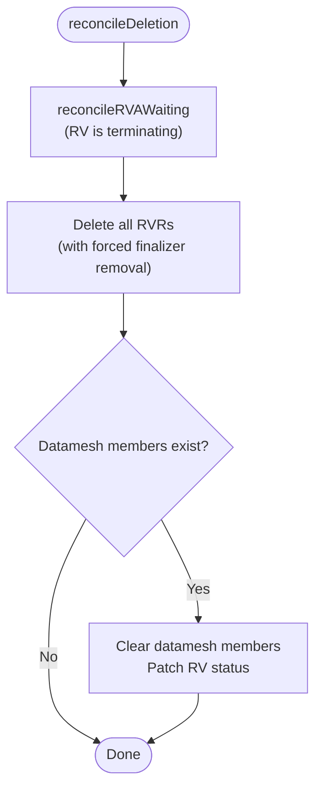
```mermaid
flowchart TD
    Start([reconcileDeletion]) --> UpdateRVAs["reconcileRVAWaiting<br/>(RV is terminating)"]

    UpdateRVAs --> DeleteRVRs["Delete all RVRs<br/>(with forced finalizer removal)"]
    DeleteRVRs --> CheckMembers{Datamesh members exist?}
    CheckMembers -->|Yes| ClearMembers["Clear datamesh members<br/>Patch RV status"]
    CheckMembers -->|No| End([Done])
    ClearMembers --> End
```

**Data Flow:**

| Input | Output |
|-------|--------|
| `rvas` | Patched RVA conditions (Attached=False, Ready=False) |
| `rvrs` | All RVRs deleted (finalizers removed first) |
| `rv.Status.Datamesh.Members` | Cleared to nil |

---

### ensureDatameshReplicaRequests Details

**Purpose:** Synchronizes `rv.Status.DatameshReplicaRequests` with the current `DatameshRequest` from each RVR. Uses a sorted merge algorithm for determinism.

**Algorithm:**

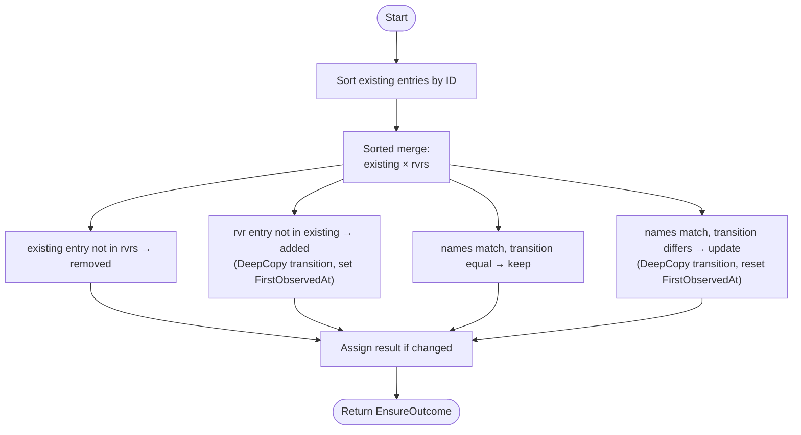
```mermaid
flowchart TD
    Start([Start]) --> SortExisting[Sort existing entries by ID]
    SortExisting --> Merge["Sorted merge:<br/>existing × rvrs"]

    Merge --> CaseRemoved["existing entry not in rvrs → removed"]
    Merge --> CaseAdded["rvr entry not in existing → added<br/>(DeepCopy transition, set FirstObservedAt)"]
    Merge --> CaseEqual["names match, transition equal → keep"]
    Merge --> CaseUpdated["names match, transition differs → update<br/>(DeepCopy transition, reset FirstObservedAt)"]

    CaseRemoved --> Result
    CaseAdded --> Result
    CaseEqual --> Result
    CaseUpdated --> Result

    Result[Assign result if changed] --> End([Return EnsureOutcome])
```

**Data Flow:**

| Input | Description |
|-------|-------------|
| `rv.Status.DatameshReplicaRequests` | Existing membership requests |
| `rvrs[].Status.DatameshRequest` | Current membership request per RVR |

| Output | Description |
|--------|-------------|
| `rv.Status.DatameshReplicaRequests` | Synchronized list (sorted by ID) |

---

### reconcileFormationStepPreconfigure Details

**Purpose:** Creates the replicas that make up the volume's target layout — diskful replicas **and**, for layouts with a tie-breaker (`TB > 0`, e.g. r2 = 2D+1TB), a diskless tie-breaker — and waits for all of them to become preconfigured (DRBD setup complete, ready for datamesh membership). Performs safety checks before advancing. Creating the tie-breaker here (rather than healing it afterwards via layout convergence) closes the window where a fresh r2 volume would live at 2D without a tie-breaker.

**Tie-breaker count** comes from `ReplicatedVolumeConfiguration.IntendedLayout()` (the single source of truth), not a second formula. Diskful and tie-breaker replicas are created through the same `newRVR` → `SetControllerRef` → `createRVR` → `insertRVRSorted` path with no DMTE and no Access stage, so the volume never passes through a diskless→diskful transition.

**Behavior when a tie-breaker cannot be placed:** the tie-breaker RVR is scheduled by `rvr_scheduling_controller` like any other replica. If no node/zone can host it (e.g. fewer than three nodes for `Ignored`, three zones for `TransZonal`, or three nodes in the volume's zone for `Zonal`, or the `guardTransZonalTBPlacement` precondition rejects every zone that already holds a diskful voter), the scheduler sets `Scheduled=False` on the tie-breaker RVR. Formation surfaces this in the same scheduling-wait gate as diskful replicas (`scheduling failed [#N]` with the scheduler's message) and keeps waiting — it does not silently hang, and it does not advance to a 2D-only datamesh.

This is a secondary safety net: `rsc_controller`'s `validateEligibleNodes` already accounts for the tie-breaker (it requires `D + TB` total nodes/zones, not just `D`) and marks the RSC `Ready=False` (`InsufficientEligibleNodes`) when the pool cannot host the full layout, so an under-provisioned class is rejected before any volume starts forming. The formation-time gate matters only for clusters that shrank (or whose nodes became ineligible) after the class was validated.

**File:** `reconciler_formation.go`

**Algorithm:**

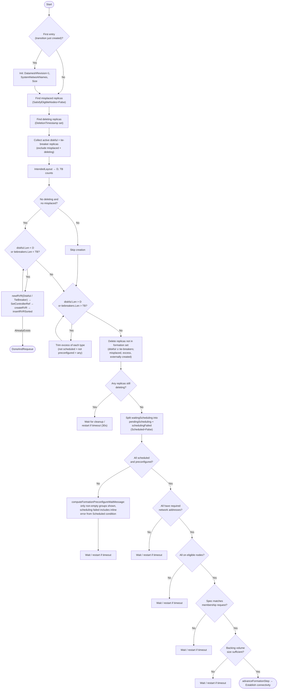
```mermaid
flowchart TD
    Start([Start]) --> Init{"First entry<br/>(transition just created)?"}
    Init -->|Yes| InitConfig["Init: DatameshRevision=1,<br/>SystemNetworkNames, Size"]
    Init -->|No| FindMisplaced
    InitConfig --> FindMisplaced["Find misplaced replicas<br/>(SatisfyEligibleNodes=False)"]
    FindMisplaced --> FindDeleting["Find deleting replicas<br/>(DeletionTimestamp set)"]
    FindDeleting --> CollectDiskful["Collect active diskful + tie-breaker replicas<br/>(exclude misplaced + deleting)"]
    CollectDiskful --> ComputeCount["IntendedLayout → D, TB counts"]

    ComputeCount --> CheckClean{"No deleting and<br/>no misplaced?"}
    CheckClean -->|Yes| CreateLoop{"diskful.Len < D<br/>or tiebreakers.Len < TB?"}
    CreateLoop -->|Yes| CreateRVR["newRVR(Diskful / TieBreaker) →<br/>SetControllerRef → createRVR →<br/>insertRVRSorted"]
    CreateRVR -->|AlreadyExists| Requeue1([DoneAndRequeue])
    CreateRVR --> CreateLoop
    CheckClean -->|No| SkipCreate[Skip creation]
    SkipCreate --> RemoveExcess

    CreateLoop -->|No| RemoveExcess{"diskful.Len > D<br/>or tiebreakers.Len > TB?"}

    RemoveExcess -->|Yes| PickCandidate["Trim excess of each type<br/>(not scheduled > not preconfigured > any)"]
    PickCandidate --> RemoveExcess
    RemoveExcess -->|No| DeleteUnwanted["Delete replicas not in formation set<br/>(diskful ∪ tie-breakers;<br/>misplaced, excess, externally created)"]

    DeleteUnwanted --> CheckDeleting{"Any replicas still<br/>deleting?"}
    CheckDeleting -->|Yes| WaitDeleting["Wait for cleanup /<br/>restart if timeout (30s)"]

    CheckDeleting -->|No| SplitScheduling["Split waitingScheduling into<br/>pendingScheduling + schedulingFailed<br/>(Scheduled=False)"]
    SplitScheduling --> WaitReady{"All scheduled<br/>and preconfigured?"}
    WaitReady -->|No| BuildMsg["computeFormationPreconfigureWaitMessage:<br/>only non-empty groups shown,<br/>scheduling failed includes inline<br/>error from Scheduled condition"]
    BuildMsg --> WaitTimeout1[Wait / restart if timeout]

    WaitReady -->|Yes| CheckAddresses{"All have required<br/>network addresses?"}
    CheckAddresses -->|No| WaitTimeout2[Wait / restart if timeout]

    CheckAddresses -->|Yes| CheckEligible{"All on eligible nodes?"}
    CheckEligible -->|No| WaitTimeout3[Wait / restart if timeout]

    CheckEligible -->|Yes| CheckSpec{"Spec matches<br/>membership request?"}
    CheckSpec -->|No| WaitTimeout4[Wait / restart if timeout]

    CheckSpec -->|Yes| CheckBVSize{"Backing volume<br/>size sufficient?"}
    CheckBVSize -->|No| WaitTimeout5[Wait / restart if timeout]

    CheckBVSize -->|Yes| NextStep(["advanceFormationStep → Establish connectivity"])
```

**Data Flow:**

| Input | Description |
|-------|-------------|
| `rv.Spec.Size` | Target volume size |
| `rv.Status.Configuration` (FTT, GMDR) | Determines the target layout via `IntendedLayout()`: D diskful + TB tie-breakers |
| `rsp` | Storage pool view (eligible nodes, system network names) |
| `rvrs` | Current replicas (status: scheduled, preconfigured, addresses, backing volume) |

| Output | Description |
|--------|-------------|
| `rv.Status.DatameshRevision` | Set to 1 on first entry |
| `rv.Status.Datamesh.SystemNetworkNames` | Copied from RSP |
| `rv.Status.Datamesh.Size` | RV spec size rounded up to 4Ki (4096 bytes) |
| RVR create/delete | Replica count adjusted |
| Formation transition messages | Progress/error reporting |

---

### reconcileFormationStepEstablishConnectivity Details

**Purpose:** Adds preconfigured replicas — diskful **and** tie-breakers — to the datamesh (with shared secret and quorum) in a single bulk-add, then waits for DRBD configuration, peer connections, and replication establishment among the **diskful** members, and finally for the tie-breakers to become operational ([Tie-breaker readiness](#tie-breaker-readiness-in-createv1-formation)). Tie-breakers are diskless, so they take no part in the *diskful* gates (backing volume, replication state) — but their own readiness is gated: the volume must leave formation at a target layout that actually works (e.g. 2D+1TB with a tie-breaker that is connected), not merely at one that is populated. Quorum is computed by `computeTargetQuorum`, which counts only diskful voters, so the tie-breaker does not change the threshold — but it does make DRBD see an odd node count, which is what `q = floor(D/2)+1` assumes for an even-D layout.

**File:** `reconciler_formation.go`

**Algorithm:**

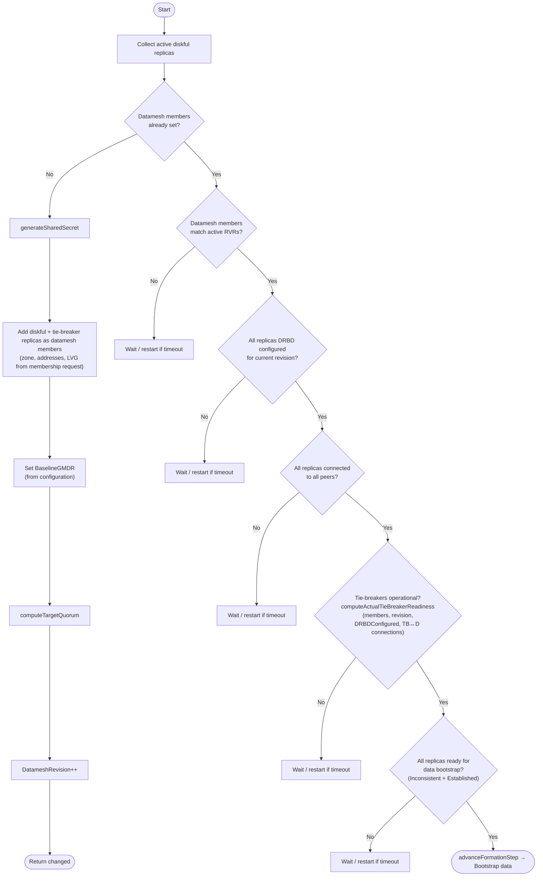
```mermaid
flowchart TD
    Start([Start]) --> CollectDiskful[Collect active diskful replicas]

    CollectDiskful --> CheckMembers{Datamesh members<br/>already set?}
    CheckMembers -->|No| GenSecret[generateSharedSecret]
    GenSecret --> AddMembers["Add diskful + tie-breaker replicas as datamesh members<br/>(zone, addresses, LVG from membership request)"]
    AddMembers --> SetBaseline["Set BaselineGMDR<br/>(from configuration)"]
    SetBaseline --> SetQuorum[computeTargetQuorum]
    SetQuorum --> IncrRevision["DatameshRevision++"]
    IncrRevision --> ReturnChanged([Return changed])

    CheckMembers -->|Yes| VerifyMembers{"Datamesh members<br/>match active RVRs?"}
    VerifyMembers -->|No| WaitRestart1[Wait / restart if timeout]

    VerifyMembers -->|Yes| CheckConfigured{"All replicas DRBD configured<br/>for current revision?"}
    CheckConfigured -->|No| WaitRestart2[Wait / restart if timeout]

    CheckConfigured -->|Yes| CheckConnected{"All replicas connected<br/>to all peers?"}
    CheckConnected -->|No| WaitRestart3[Wait / restart if timeout]

    CheckConnected -->|Yes| CheckTBReady{"Tie-breakers operational?<br/>computeActualTieBreakerReadiness<br/>(members, revision,<br/>DRBDConfigured, TB↔D connections)"}
    CheckTBReady -->|No| WaitRestart4[Wait / restart if timeout]

    CheckTBReady -->|Yes| CheckBootstrapReady{"All replicas ready for<br/>data bootstrap?<br/>(Inconsistent + Established)"}
    CheckBootstrapReady -->|No| WaitRestart5[Wait / restart if timeout]

    CheckBootstrapReady -->|Yes| NextStep(["advanceFormationStep → Bootstrap data"])
```

**Data Flow:**

| Input | Description |
|-------|-------------|
| `rvrs` | Replica status (DRBDConfigured, peers, backing volume state) |
| `rsp.EligibleNodes` | Zone information for datamesh members |

| Output | Description |
|--------|-------------|
| `rv.Status.Datamesh.SharedSecret` | Generated DRBD shared secret |
| `rv.Status.Datamesh.Members` | Datamesh member list |
| `rv.Status.BaselineGuaranteedMinimumDataRedundancy` | Set from Configuration GMDR |
| `rv.Status.Datamesh.Quorum` | Quorum threshold (derived from configuration) |
| `rv.Status.DatameshRevision` | Incremented revision |

---

### reconcileFormationStepBootstrapData Details

**Purpose:** Creates a DRBDResourceOperation to trigger initial data synchronization, waits for completion, re-checks that the tie-breakers are still operational, and finalizes formation.

**File:** `reconciler_formation.go`

**Algorithm:**

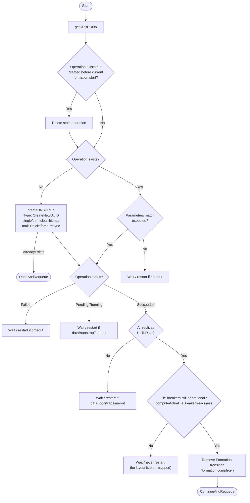
```mermaid
flowchart TD
    Start([Start]) --> GetOp[getDRBDROp]
    GetOp --> CheckStale{"Operation exists but<br/>created before current<br/>formation start?"}
    CheckStale -->|Yes| DeleteStale[Delete stale operation]
    DeleteStale --> CheckExists

    CheckStale -->|No| CheckExists{Operation exists?}
    CheckExists -->|No| CreateOp["createDRBDROp<br/>Type: CreateNewUUID<br/>single/thin: clear-bitmap<br/>multi+thick: force-resync"]
    CreateOp -->|AlreadyExists| Requeue([DoneAndRequeue])
    CreateOp --> CheckStatus

    CheckExists -->|Yes| VerifyParams{"Parameters match<br/>expected?"}
    VerifyParams -->|No| WaitRestart1[Wait / restart if timeout]
    VerifyParams -->|Yes| CheckStatus

    CheckStatus{"Operation status?"}
    CheckStatus -->|Failed| WaitRestart2[Wait / restart if timeout]
    CheckStatus -->|Pending/Running| WaitTimeout[Wait / restart if dataBootstrapTimeout]
    CheckStatus -->|Succeeded| CheckUpToDate{"All replicas<br/>UpToDate?"}

    CheckUpToDate -->|No| WaitSync[Wait / restart if dataBootstrapTimeout]
    CheckUpToDate -->|Yes| CheckTBReady{"Tie-breakers still operational?<br/>computeActualTieBreakerReadiness"}
    CheckTBReady -->|No| WaitTB["Wait (never restart:<br/>the layout is bootstrapped)"]
    CheckTBReady -->|Yes| Complete["Remove Formation transition<br/>(formation complete!)"]
    Complete --> End([ContinueAndRequeue])
```

**Data Flow:**

| Input | Description |
|-------|-------------|
| `rv.Status.Datamesh.Members` | Diskful members (target for operation, count determines single/multi-replica) |
| `rsp.Type` | LVM or LVMThin (together with replica count determines sync mode) |
| `rv.Status.Datamesh.Size` | Volume size (for force-resync timeout calculation) |

| Output | Description |
|--------|-------------|
| `DRBDResourceOperation` | Created/verified data bootstrap operation |
| `rv.Status.DatameshTransitions` | Formation transition removed on success |

---

### reconcileAdoptStepVerifyPrerequisites Details

**Purpose:** Waits for pre-existing RVRs to satisfy minimal prerequisites before populating the datamesh. Unlike create/v1, this step never creates or deletes RVRs and does not validate replica counts or configuration consistency — adopt accepts replicas as-is.

**File:** `reconciler_formation.go`

**Algorithm:**

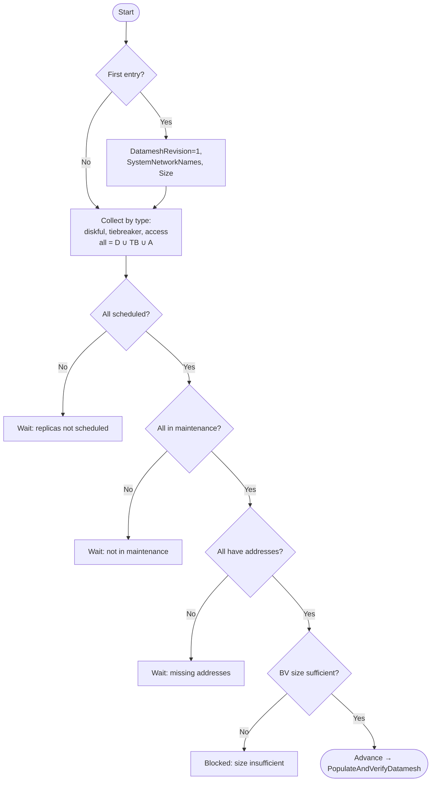
```mermaid
flowchart TD
    Start([Start]) --> Init{"First entry?"}
    Init -->|Yes| SetRev["DatameshRevision=1,<br/>SystemNetworkNames, Size"]
    Init -->|No| CollectReplicas
    SetRev --> CollectReplicas

    CollectReplicas["Collect by type:<br/>diskful, tiebreaker, access<br/>all = D ∪ TB ∪ A"]

    CollectReplicas --> CheckScheduled{All scheduled?}
    CheckScheduled -->|No| Wait1["Wait: replicas not scheduled"]

    CheckScheduled -->|Yes| CheckMaintenance{All in maintenance?}
    CheckMaintenance -->|No| Wait2["Wait: not in maintenance"]

    CheckMaintenance -->|Yes| CheckAddresses{All have addresses?}
    CheckAddresses -->|No| Wait3["Wait: missing addresses"]

    CheckAddresses -->|Yes| CheckSize{BV size sufficient?}
    CheckSize -->|No| Wait4["Blocked: size insufficient"]

    CheckSize -->|Yes| Advance(["Advance → PopulateAndVerifyDatamesh"])
```

**Data Flow:**

| Input | Description |
|-------|-------------|
| `rvrs` | Replica statuses (scheduling, maintenance, addresses, backing volume size) |
| `rsp` | System network names |

| Output | Description |
|--------|-------------|
| `rv.Status.DatameshRevision` | Set to 1 on first entry |
| `rv.Status.Datamesh.SystemNetworkNames` | Copied from RSP |
| `rv.Status.Datamesh.Size` | RV spec size rounded up to 4Ki (4096 bytes) |
| Formation transition step messages | Progress/error reporting |

---

### reconcileAdoptStepPopulateAndVerifyDatamesh Details

**Purpose:** Populates the datamesh (shared secret, members, quorum) from pre-existing replicas using RVR spec fields directly. Uses lowest possible GMDR/QMR so degraded replicas can be adopted. Verifies agents have observed the configuration before advancing.

**File:** `reconciler_formation.go`

**Algorithm:**

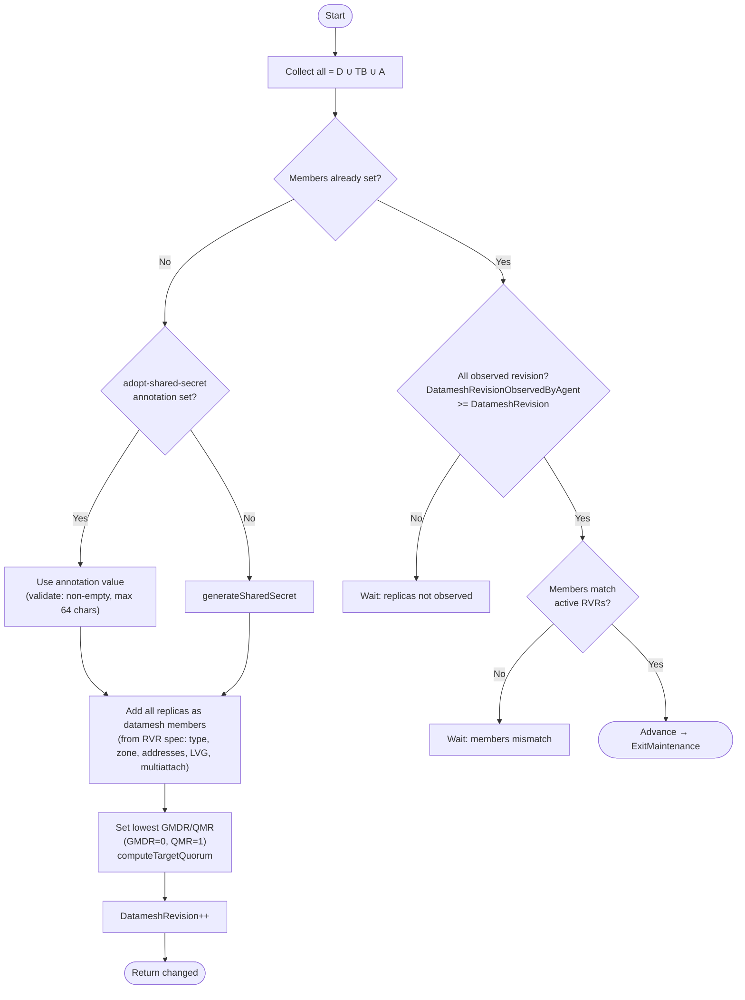
```mermaid
flowchart TD
    Start([Start]) --> CollectAll["Collect all = D ∪ TB ∪ A"]

    CollectAll --> CheckMembers{Members already set?}
    CheckMembers -->|No| CheckAnnotation{"adopt-shared-secret<br/>annotation set?"}
    CheckAnnotation -->|Yes| UseAnnotation["Use annotation value<br/>(validate: non-empty, max 64 chars)"]
    CheckAnnotation -->|No| GenSecret[generateSharedSecret]
    UseAnnotation --> AddMembers["Add all replicas as datamesh members<br/>(from RVR spec: type, zone, addresses, LVG, multiattach)"]
    GenSecret --> AddMembers
    AddMembers --> SetQuorum["Set lowest GMDR/QMR<br/>(GMDR=0, QMR=1)<br/>computeTargetQuorum"]
    SetQuorum --> IncrRevision["DatameshRevision++"]
    IncrRevision --> ReturnChanged([Return changed])

    CheckMembers -->|Yes| CheckObserved{"All observed revision?<br/>DatameshRevisionObservedByAgent<br/>>= DatameshRevision"}
    CheckObserved -->|No| WaitObserved["Wait: replicas not observed"]

    CheckObserved -->|Yes| CheckMembersMatch{Members match<br/>active RVRs?}
    CheckMembersMatch -->|No| WaitMismatch["Wait: members mismatch"]

    CheckMembersMatch -->|Yes| Advance(["Advance → ExitMaintenance"])
```

**Data Flow:**

| Input | Description |
|-------|-------------|
| `rvrs` | Replica spec (type, LVG, thinpool) and statuses (DatameshRevisionObservedByAgent, addresses, attachment) |
| `rsp.EligibleNodes` | Zone information for datamesh members |

| Output | Description |
|--------|-------------|
| `rv.Status.Datamesh.SharedSecret` | DRBD shared secret (from `adopt-shared-secret` annotation or generated) |
| `rv.Status.Datamesh.Members` | Datamesh member list (all types, from RVR spec) |
| `rv.Status.Datamesh.Multiattach` | Set if multiple members are attached |
| `rv.Status.BaselineGuaranteedMinimumDataRedundancy` | Set to 0 (lowest, for degraded replica adoption) |
| `rv.Status.Datamesh.Quorum` | Computed from actual member composition |
| `rv.Status.Datamesh.QuorumMinimumRedundancy` | Set to 1 (lowest) |
| `rv.Status.DatameshRevision` | Incremented revision |

---

### reconcileAdoptStepExitMaintenance Details

**Purpose:** Syncs addresses from RVRs and waits for all datamesh member replicas to exit maintenance mode, then completes formation. Adopt accepts replicas as-is — even degraded replicas (ConfigurationFailed, not Ready, etc.) complete formation; normal operation handles recovery afterward.

**File:** `reconciler_formation.go`

**Algorithm:**

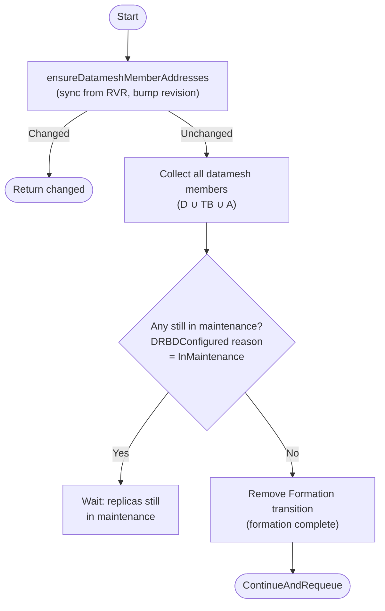
```mermaid
flowchart TD
    Start([Start]) --> SyncAddr["ensureDatameshMemberAddresses<br/>(sync from RVR, bump revision)"]
    SyncAddr -->|Changed| ReturnChanged([Return changed])
    SyncAddr -->|Unchanged| CollectAll["Collect all datamesh members<br/>(D ∪ TB ∪ A)"]

    CollectAll --> CheckMaintenance{"Any still in maintenance?<br/>DRBDConfigured reason<br/>= InMaintenance"}
    CheckMaintenance -->|Yes| WaitMaint["Wait: replicas still<br/>in maintenance"]

    CheckMaintenance -->|No| Complete["Remove Formation transition<br/>(formation complete)"]
    Complete --> End([ContinueAndRequeue])
```

**Data Flow:**

| Input | Description |
|-------|-------------|
| `rvrs` | Replica statuses (addresses, DRBDConfigured condition) |
| `rv.Status.Datamesh.Members` | Datamesh member list (for address sync and maintenance check) |

| Output | Description |
|--------|-------------|
| `rv.Status.Datamesh.Members[].Addresses` | Updated from RVR if changed |
| `rv.Status.DatameshRevision` | Bumped if addresses changed |
| `rv.Status.DatameshTransitions` | Formation transition removed on success |

---

### reconcileRVAConditionsFromDatameshReplicaContext Details

**Purpose:** Updates status conditions (Attached, ReplicaReady, Ready), phase, message, and attachment fields (devicePath, ioSuspended, inUse) on each RVA based on datamesh replica contexts returned by `datamesh.ProcessTransitions`. Called from `reconcileNormalOperation` after the datamesh engine runs.

**File:** `reconciler_rva.go`

**Algorithm:**

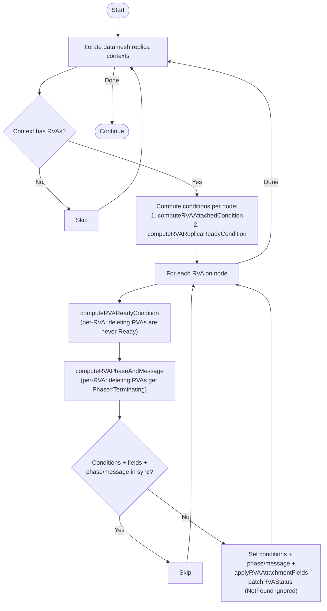
```mermaid
flowchart TD
    Start([Start]) --> IterContexts["Iterate datamesh replica contexts"]
    IterContexts --> CheckRVAs{"Context has RVAs?"}
    CheckRVAs -->|No| SkipNode[Skip]
    CheckRVAs -->|Yes| ComputeConds["Compute conditions per node:<br/>1. computeRVAAttachedCondition<br/>2. computeRVAReplicaReadyCondition"]
    ComputeConds --> IterRVAs["For each RVA on node"]
    IterRVAs --> ComputeReady["computeRVAReadyCondition<br/>(per-RVA: deleting RVAs are never Ready)"]
    ComputeReady --> ComputePhase["computeRVAPhaseAndMessage<br/>(per-RVA: deleting RVAs get Phase=Terminating)"]
    ComputePhase --> CheckSync{"Conditions + fields +<br/>phase/message in sync?"}
    CheckSync -->|Yes| SkipRVA[Skip]
    CheckSync -->|No| Patch["Set conditions + phase/message +<br/>applyRVAAttachmentFields<br/>patchRVAStatus (NotFound ignored)"]
    SkipRVA --> IterRVAs
    Patch --> IterRVAs
    IterRVAs -->|Done| IterContexts
    SkipNode --> IterContexts
    IterContexts -->|Done| End([Continue])
```

**Key behaviors:**
- Conditions are identical for all RVAs on the same node (Attached and ReplicaReady are per-node). Ready and Phase differ per RVA (deleting RVAs are always Ready=False/Terminating and Phase=Terminating).
- `AttachmentConditionReason()` and `AttachmentConditionMessage()` on each replica context are set by the datamesh engine (dispatchers, guards, slot status) — this reconciler is a pure mapper from those fields to RVA conditions.
- Phase is derived from DeletionTimestamp + Attached condition reason. Message is passthrough from the Attached condition, except when Phase=Attached and ReplicaReady != True — the ReplicaReady message is used to surface degradation (e.g., quorum loss).
- Attachment fields (devicePath, ioSuspended, inUse) are copied from `rvr.Status.Attachment` if available, cleared otherwise.

**Data Flow:**

| Input | Description |
|-------|-------------|
| `[]datamesh.ReplicaContext` | Per-node: attachment condition reason/message, RVR pointer, RVA pointers |

| Output | Description |
|--------|-------------|
| RVA conditions | Attached, ReplicaReady, Ready conditions set per RVA |
| RVA phase/message | Phase and Message set per RVA |
| RVA status fields | devicePath, ioSuspended, inUse copied from RVR |

---

### reconcileRVConfiguration Details

**Purpose:** Derives `rv.Status.Configuration` from the appropriate source (RSC in Auto mode, `ManualConfiguration` in Manual mode), validates TransZonal zone count via RSP, and sets the `ConfigurationReady` condition. Also updates `ConfigurationGeneration` and `ConfigurationObservedGeneration`.

**Caller control:** This function does NOT have an internal formation freeze guard. Instead, callers decide when to call it:
- **Root Reconcile:** when `Configuration` is nil (initial set)
- **Normal operation:** always (check for config updates)
- **Formation reset (create/v1):** after clearing `Configuration` to nil (re-derive)

During create formation, callers do NOT call this function (config is frozen). During adopt formation, this function is also NOT called — adopt accepts replicas as-is and any pending config change is picked up by normal operation after formation completes.

**Algorithm:**

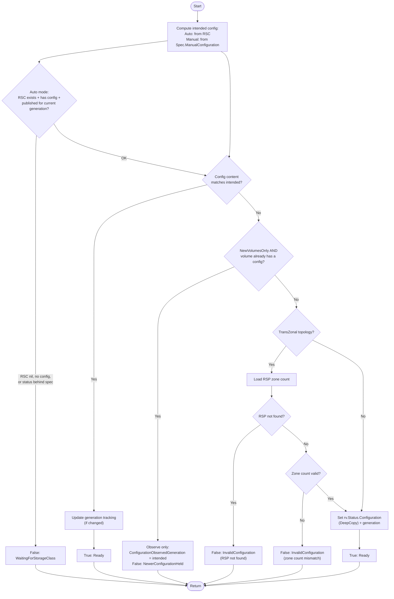
```mermaid
flowchart TD
    Start([Start]) --> ComputeIntended["Compute intended config:<br/>Auto: from RSC<br/>Manual: from Spec.ManualConfiguration"]

    ComputeIntended --> CheckAutoSource{"Auto mode:<br/>RSC exists + has config +<br/>published for current generation?"}
    CheckAutoSource -->|"RSC nil, no config,<br/>or status behind spec"| SetWaiting["False: WaitingForStorageClass"]
    SetWaiting --> End([Return])
    CheckAutoSource -->|OK| ContentCheck

    ComputeIntended --> ContentCheck{"Config content<br/>matches intended?"}
    ContentCheck -->|Yes| UpdateGen["Update generation tracking<br/>(if changed)"]
    UpdateGen --> SetReady1["True: Ready"]
    SetReady1 --> End

    ContentCheck -->|No| CheckHold{"NewVolumesOnly AND<br/>volume already has a config?"}
    CheckHold -->|Yes| Hold["Observe only:<br/>ConfigurationObservedGeneration = intended<br/>False: NewerConfigurationHeld"]
    Hold --> End
    CheckHold -->|No| CheckTransZonal{"TransZonal topology?"}
    CheckTransZonal -->|Yes| LoadRSP["Load RSP zone count"]
    LoadRSP --> RSPNotFound{"RSP not found?"}
    RSPNotFound -->|Yes| SetInvalid1["False: InvalidConfiguration<br/>(RSP not found)"]
    SetInvalid1 --> End
    RSPNotFound -->|No| ValidateZones{"Zone count valid?"}
    ValidateZones -->|No| SetInvalid2["False: InvalidConfiguration<br/>(zone count mismatch)"]
    SetInvalid2 --> End
    ValidateZones -->|Yes| SetConfig
    CheckTransZonal -->|No| SetConfig

    SetConfig["Set rv.Status.Configuration<br/>(DeepCopy) + generation"]
    SetConfig --> SetReady2["True: Ready"]
    SetReady2 --> End
```

**Generation tracking:**
- Auto mode: `ConfigurationGeneration` = the RSC configuration generation whose **content** is stored in `rv.Status.Configuration`; `ConfigurationObservedGeneration` = the newest RSC configuration generation the volume has seen. The two differ exactly while a newer configuration is held back by `NewVolumesOnly`.
- Manual mode: both are 0 (no RSC rollout tracking)

**RSC status freshness:** the RSC configuration is read only when `rsc.status.configurationGeneration == rsc.metadata.generation`. While the class controller has not accepted the latest spec edit, its status still carries the previous generation; applying it would hand a volume a configuration the user has already replaced — and under `NewVolumesOnly` the volume would hold that superseded configuration forever, because it stops being "new" the moment it gets one. The wait resolves itself: the RV watches RSC `status.configurationGeneration`, so the next publish triggers a reconcile. A spec edit the class controller never accepts (invalid configuration) keeps volumes waiting — deliberately, instead of silently provisioning from a stale configuration.

**NewVolumesOnly (observe, do not apply):** when the class rollout strategy is `NewVolumesOnly` and the volume already has a configuration whose content differs from the intended one, the volume keeps both its content and its `ConfigurationGeneration`, advances `ConfigurationObservedGeneration` (so the class aggregate does not hang in "pending observation"), and reports `ConfigurationReady=False/NewerConfigurationHeld`. A nil strategy — the class controller has not written the default yet — counts as `RollingUpdate`. Strategy transitions need no extra handling: `NewVolumesOnly → RollingUpdate` rolls held volumes out through the normal path, and `RollingUpdate → NewVolumesOnly` rolls nothing back. The hold applies even if the intended configuration is invalid: the volume is not "fixed" silently, the escape is a strategy switch or a volume recreation.

**Content-based fast path:** Instead of generation-based skipping, the function compares `*rv.Status.Configuration == *intended` (struct equality on 5 scalar fields). This avoids generation collision bugs when switching between Auto and Manual modes. It runs before the `NewVolumesOnly` hold on purpose: equal content means the volume is already aligned with the new generation, so there is nothing to hold back.

**Data Flow:**

| Input | Description |
|-------|-------------|
| `rv.Spec.ConfigurationMode` | Auto or Manual |
| `rv.Spec.ManualConfiguration` | Manual mode source (guaranteed present by CEL) |
| `rsc` | ReplicatedStorageClass (may be nil; Auto mode only) |
| `rsc.Generation` / `rsc.Status.ConfigurationGeneration` | Freshness gate: the published configuration must belong to the current spec generation |
| `rsc.Spec.ConfigurationRolloutStrategy` | Rollout strategy (nil = RollingUpdate) |
| `rsc.Status.Configuration` | RSC configuration (Auto mode source) |
| RSP (loaded via `getRSPZoneCount`) | Zone count for TransZonal validation |

| Output | Description |
|--------|-------------|
| `rv.Status.Configuration` | Set/updated configuration (unchanged while a newer one is held) |
| `rv.Status.ConfigurationGeneration` | RSC generation the stored content came from (Auto) or 0 (Manual) |
| `rv.Status.ConfigurationObservedGeneration` | Newest RSC generation seen; equal to ConfigurationGeneration unless a newer configuration is held |
| `ConfigurationReady` condition | Reports configuration state |

---

### reconcileCreateAccessReplicas Details

**Purpose:** Creates Access RVRs for active (non-deleting) RVAs on nodes that do not yet have any RVR. Called from `reconcileNormalOperation` before `datamesh.ProcessTransitions`.

**File:** `reconciler_access_replicas.go`

#### Creation guards

| # | Guard | Outcome |
|---|-------|---------|
| 1 | RV deleting | No creation (detach-only mode) |
| 2 | VolumeAccess=Local | No creation |
| 3 | RSP nil | No creation |
| 4 | RVR already exists on node (any type, including deleting) | Skip node |
| 5 | Node not in eligible nodes, or !nodeReady, or !agentReady | Skip node |
| 6 | Replica limit reached (32 RVRs) | Stop creation (break loop) |
| 7 | Duplicate RVA on same node | Deduplicate (one creation per node) |

All guards passed: create the Access RVR via `newRVR(..., Access, nodeName)` (sets `spec.type=Access`, `spec.nodeName`) → `SetControllerRef` → `createRVR` → `insertRVRSorted`. On `AlreadyExists`: requeue.

**Data Flow:**

| Input | Description |
|-------|-------------|
| `rv.DeletionTimestamp` | Detach-only mode check |
| `rv.Status.Configuration.VolumeAccess` | Local blocks Access creation |
| `rvas` | Active RVAs determine which nodes need Access replicas |
| `rvrs` | Existing replicas (any type on node blocks creation) |
| `rsp.EligibleNodes` | Node readiness check |

| Output | Description |
|--------|-------------|
| RVR create | Access RVRs created for eligible nodes |

---

### reconcileDeleteAccessReplicas Details

**Purpose:** Deletes Access RVRs that are redundant (another datamesh member on the same node) or unused (no active RVA on the node). Called from `reconcileNormalOperation` after `datamesh.ProcessTransitions`.

**File:** `reconciler_access_replicas.go`

#### Deletion guards

| # | Guard | Outcome |
|---|-------|---------|
| 1 | Not Access type | Skip |
| 2 | Already deleting (DeletionTimestamp set) | Skip |
| 3 | Attached (datamesh member with attached=true) | Skip (hard invariant) |
| 4 | Active Detach or AddReplica transition for this replica | Skip (avoid churn) |
| 5 | Another datamesh member on same node | **Delete** (redundant, even if RVA exists) |
| 6 | No active (non-deleting) RVA on node | **Delete** (unused) |

Deletion via `deleteRVR` (sets DeletionTimestamp). The existing pipeline handles the rest:
- If datamesh member: rvr_controller forms leave request, the datamesh engine's membership dispatcher creates RemoveReplica transition, `reconcileRVRFinalizers` removes finalizer after completion.
- If not datamesh member: `reconcileRVRFinalizers` removes finalizer directly.

**Data Flow:**

| Input | Description |
|-------|-------------|
| `rv.Status.Datamesh.Members` | Attached check, redundancy check (other member on same node) |
| `rv.Status.DatameshTransitions` | Active Detach/AddReplica check |
| `rvrs` | Access RVRs to evaluate |
| `rvas` | Active RVAs determine which nodes still need Access replicas |

| Output | Description |
|--------|-------------|
| RVR delete | Unneeded Access RVRs deleted (DeletionTimestamp set) |
