# rv_controller

This controller manages `ReplicatedVolume` (RV) resources by orchestrating datamesh formation, normal operation, and deletion.

## Purpose

The controller reconciles `ReplicatedVolume` with:

1. **Configuration initialization** — derives configuration from `ReplicatedStorageClass` (RSC) in Auto mode or from `ManualConfiguration` in Manual mode into RV status
2. **Datamesh formation** — creates replicas, establishes DRBD connectivity, bootstraps data synchronization
3. **Normal operation** — steady-state datamesh lifecycle: Access replica create/delete/join/leave, attach/detach transitions, multiattach management *(WIP: missing diskful join/leave, tiebreaker, role changes)*
4. **Deletion** — cleans up child resources (RVRs, RVAs) and datamesh state

## Interactions

| Direction | Resource/Controller | Relationship |
|-----------|---------------------|--------------|
| ← input | ReplicatedStorageClass | Reads configuration (FTT, GMDR, topology, storage pool); Auto mode only |
| ← input | ReplicatedVolume.Spec.ManualConfiguration | Reads manual configuration directly; Manual mode only |
| ← input | ReplicatedStoragePool | Reads eligible nodes, system networks, zones for formation and attach eligibility |
| ← input | ReplicatedVolumeReplica | Reads replica status (scheduling, preconfiguration, connectivity, data sync, quorum, attachment) |
| ← input | ReplicatedVolumeAttachment | Reads attachment intent (determines which nodes should be attached) |
| → manages | ReplicatedVolumeReplica | Creates/deletes during formation, normal operation (Access replicas), and deletion |
| → manages | ReplicatedVolumeAttachment | Manages finalizers; updates conditions during normal operation (Attached, ReplicaReady, Ready) and deletion |
| → manages | DRBDResourceOperation | Creates for data bootstrap during formation |

## Algorithm

The controller reconciles individual ReplicatedVolumes:

```
if rv deleted (NotFound):
    if orphaned RVAs exist:
        reconcileRVAWaiting (set waiting conditions) + reconcileRVAFinalizers (rv=nil) → Done
    else → Done

if shouldDelete (DeletionTimestamp + no other finalizers + no attached members + no Detach transitions):
    reconcileDeletion (reconcileRVAWaiting → force-delete RVRs → clear datamesh members)
    reconcileRVAFinalizers (remove RVA finalizers — after conditions are set)
    reconcileMetadata (remove finalizer if no children left) → Done

ensure metadata (finalizer + labels)

if config nil: reconcileRVConfiguration (initial set from RSC or ManualConfiguration)
ensure datamesh replica membership requests (sync from RVR statuses)

if configuration exists:
    if formation in progress (DatameshRevision == 0 or Formation transition active):
        reconcile formation (3-step process; config frozen)
        reconcileRVAWaiting (datamesh forming)
    else:
        reconcileRVConfiguration (check for config updates + set ConfigurationReady condition)
        reconcile normal operation (WIP):
            create Access RVRs for Active RVAs on nodes without any RVR
            process Access replica datamesh membership (join/leave)
            process attach/detach transitions (slot allocation, multiattach, guards)
            update RVA conditions and attachment fields from attachmentsSummary
            delete unnecessary Access RVRs (redundant or unused)

reconcileRVAFinalizers (add/remove RVA finalizers)
reconcileRVRFinalizers (add/remove RVR finalizers)
patch status if changed
```

## Reconciliation Structure

```
Reconcile (root) [Pure orchestration]
├── getRV
├── rv == nil → getRVAs → reconcileOrphanedRVAs (reconcileRVAWaiting + reconcileRVAFinalizers)
├── getRSC, getRVAs, getRVRsSorted
├── rvShouldNotExist (DeletionTimestamp + no other finalizers + no attached + no Detach transitions) →
│   ├── reconcileDeletion [In-place reconciliation] ← details
│   │   ├── reconcileRVAWaiting ("ReplicatedVolume is being deleted")
│   │   ├── deleteRVRWithForcedFinalizerRemoval (loop)
│   │   └── clear datamesh members + patchRVStatus
│   ├── reconcileRVAFinalizers [Target-state driven]
│   │   ├── add RVControllerFinalizer to non-deleting RVAs
│   │   └── remove RVControllerFinalizer from deleting RVAs (when safe)
│   │       ├── hasOtherNonDeletingRVAOnNode (duplicate check)
│   │       └── isNodeAttachedOrDetaching (datamesh state check)
│   └── reconcileMetadata [Target-state driven] (remove finalizer)
├── reconcileMetadata [Target-state driven]
│   ├── isRVMetadataInSync
│   ├── applyRVMetadata (finalizer + labels)
│   └── patchRV
├── if config nil: reconcileRVConfiguration [In-place reconciliation] ← details
├── ensureDatameshReplicaRequests ← details
├── reconcileFormation [Pure orchestration]
│   │   ensureFormationTransition (find or create Formation transition with all steps)
│   ├── reconcileFormationStepPreconfigure [Pure orchestration] ← details
│   │   ├── create/delete RVRs (guards for deleting/misplaced, replica count management)
│   │   ├── wait for deleting replicas cleanup
│   │   ├── safety checks (addresses, eligible nodes, spec mismatch, backing volume size)
│   │   └── reconcileFormationRestartIfTimeoutPassed
│   ├── reconcileFormationStepEstablishConnectivity [Pure orchestration] ← details
│   │   ├── generateSharedSecret + applyDatameshMember
│   │   ├── computeTargetQuorum
│   │   ├── verify configured, connected, ready for data bootstrap
│   │   └── reconcileFormationRestartIfTimeoutPassed
│   ├── reconcileFormationStepBootstrapData [Pure orchestration] ← details
│   │   ├── createDRBDROp (new-current-uuid)
│   │   ├── verify operation status + UpToDate replicas
│   │   ├── reconcileFormationRestartIfTimeoutPassed
│   │   └── advanceFormationStep / remove transition (formation complete)
│   └── reconcileRVAWaiting ("Datamesh formation is in progress")
├── reconcileRVConfiguration [In-place reconciliation] (config updates + ConfigurationReady condition)
├── reconcileNormalOperation [Pure orchestration] (WIP)
│   ├── reconcileCreateAccessReplicas [Pure orchestration] ← details
│   ├── (MergeEnsures)
│   │   ├── ensureDatameshAccessReplicas ← details
│   │   │   ├── ensureDatameshAccessReplicaTransitionProgress (loop: active transitions)
│   │   │   ├── ensureDatameshAddReplica (loop: pending joins)
│   │   │   └── ensureDatameshRemoveReplica (loop: pending leaves)
│   │   └── ensureDatameshAttachments ← details
│   │       ├── buildAttachmentsSummary ← details
│   │       ├── computeDatameshAttachBlocked (calls computeActualQuorum)
│   │       ├── ensureDatameshAttachDetachTransitionProgress
│   │       ├── computeDatameshPotentiallyAttached
│   │       ├── ensureDatameshMultiattachTransitionProgress
│   │       ├── computeDatameshAttachmentIntents ← details
│   │       ├── ensureDatameshMultiattachToggle
│   │       ├── ensureDatameshDetachTransitions ← details
│   │       └── ensureDatameshAttachTransitions ← details
│   ├── reconcileRVAConditionsFromAttachmentsSummary [In-place reconciliation] ← details
│   │   ├── computeRVAAttachedConditionFromAttachmentsSummary
│   │   ├── computeRVAReplicaReadyConditionFromAttachmentsSummary
│   │   ├── computeRVAReadyCondition
│   │   ├── isRVAAttachmentFieldsInSync + applyRVAAttachmentFields
│   │   └── patchRVAStatus
│   └── reconcileDeleteAccessReplicas [Pure orchestration] ← details
├── reconcileRVAFinalizers [Target-state driven] (same as deletion branch)
├── reconcileRVRFinalizers [Target-state driven]
│   ├── add RVControllerFinalizer to non-deleting RVRs
│   └── remove RVControllerFinalizer from deleting RVRs (when safe)
│       └── isRVRMemberOrLeavingDatamesh (member + RemoveReplica check)
└── patchRVStatus
```

Links to detailed algorithms: [`reconcileDeletion`](#reconciledeletion-details), [`ensureDatameshReplicaRequests`](#ensuredatameshreplicarequests-details), [`reconcileRVConfiguration`](#reconcilervconfiguration-details), [`reconcileFormationStepPreconfigure`](#reconcileformationsteppreconfigure-details), [`reconcileFormationStepEstablishConnectivity`](#reconcileformationstepestablishconnectivity-details), [`reconcileFormationStepBootstrapData`](#reconcileformationstepbootstrapdata-details), [`reconcileCreateAccessReplicas`](#reconcilecreateaccessreplicas-details), [`reconcileDeleteAccessReplicas`](#reconciledeleteaccessreplicas-details), [`ensureDatameshAccessReplicas`](#ensuredatameshaccessreplicas-details), [`ensureDatameshAttachments`](#ensuredatameshattachments-details), [`buildAttachmentsSummary`](#buildattachmentssummary-details), [`computeDatameshAttachmentIntents`](#computedatameshattachmentintents-details), [`ensureDatameshDetachTransitions`](#ensuredatameshdetachtransitions-details), [`ensureDatameshAttachTransitions`](#ensuredatameshattachtransitions-details), [`reconcileRVAConditionsFromAttachmentsSummary`](#reconcilervaconditionsfromattachmentssummary-details)

## Algorithm Flow


## Conditions

### ConfigurationReady

Indicates whether the RV configuration is valid and derived from the appropriate source. Set by `reconcileRVConfiguration`.

| Status | Reason | When |
|--------|--------|------|
| True | Ready | Configuration is valid and matches the source |
| False | WaitingForStorageClass | RSC not found or RSC configuration not ready (Auto mode only) |
| False | InvalidConfiguration | Configuration is invalid: RSP not found or TransZonal zone count mismatch |

### Attached (on RVA)

Set by `reconcileRVAConditionsFromAttachmentsSummary` during normal operation, or by `reconcileRVAWaiting` when the RV is unavailable.

| Status | Reason | When |
|--------|--------|------|
| True | Attached | Volume is attached and ready to serve I/O on the node (if RV is deleting: with pending-deletion note) |
| False | Attaching | Attach transition in progress |
| False | Detaching | Detach transition in progress |
| False | Detached | Volume has been detached from the node |
| False | Pending | Waiting for slot, quorum, node readiness, etc. |
| False | WaitingForReplica | Replica not yet joined datamesh or not Ready |
| False | WaitingForReplicatedVolume | RV deleted, not found, or datamesh forming |
| False | NodeNotEligible | Node not in RSP eligible nodes |
| False | ReplicatedVolumeDeleting | RV is being deleted; node is not yet attached (new attachments blocked) |
| False | VolumeAccessLocalityNotSatisfied | No Diskful replica on node (VolumeAccess=Local) |

### ReplicaReady (on RVA)

Mirrors the RVR Ready condition for the replica on this node. Set by `reconcileRVAConditionsFromAttachmentsSummary`. Removed by `reconcileRVAWaiting` when the RV is unavailable.

| Status | Reason | When |
|--------|--------|------|
| True/False/Unknown | *(mirrored from RVR Ready)* | RVR exists and has Ready condition |
| Unknown | WaitingForReplica | No RVR or no Ready condition on RVR |

### Ready (on RVA)

Aggregate condition: Ready=True iff Attached=True AND ReplicaReady=True AND not deleting.

| Status | Reason | When |
|--------|--------|------|
| True | Ready | Attached and replica is ready |
| False | NotAttached | Attached condition is not True |
| False | ReplicaNotReady | ReplicaReady is False |
| False | Deleting | RVA has DeletionTimestamp |
| Unknown | ReplicaNotReady | ReplicaReady is Unknown |

## Formation Steps

Datamesh formation is a 3-step process that creates and configures DRBD replicas. Each step has a timeout; if progress stalls, formation restarts from scratch. All steps are pre-declared in the Formation transition at creation time and tracked in `rv.Status.DatameshTransitions[].Steps`.

### Step 1: Preconfigure

Creates diskful replicas and waits for them to become preconfigured (DRBD setup complete, ready for datamesh membership).

**Actions:**
1. Initialize datamesh configuration (SystemNetworkNames, Size, DatameshRevision=1)
2. Identify misplaced replicas (SatisfyEligibleNodes=False) and deleting replicas (DeletionTimestamp set)
3. Collect active diskful replicas (excluding misplaced and deleting)
4. Create missing diskful replicas only when no deleting or misplaced replicas exist (prevents zombie accumulation)
5. Remove excess/misplaced replicas
6. Wait for all deleting replicas to be fully removed (restart formation if timeout)
7. Wait for scheduling and preconfiguration (replicas split into pending scheduling / scheduling failed / preconfiguring; scheduling failure messages from RVR Scheduled=False conditions are shown inline)
8. Safety checks: addresses, eligible nodes, spec consistency, backing volume size

### Step 2: Establish Connectivity

Adds preconfigured replicas to the datamesh and waits for DRBD peer connections.

**Actions:**
1. Generate shared secret for DRBD peer authentication
2. Add diskful replicas as datamesh members (with zone, addresses, LVG info)
3. Set effective layout (FTT/GMDR from configuration) and quorum parameters
4. Wait for all replicas to apply DRBD configuration (DRBDConfigured=True)
5. Wait for all replicas to connect to each other (ConnectionState=Connected)
6. Wait for data bootstrap readiness (BackingVolume=Inconsistent + Replication=Established)

### Step 3: Bootstrap Data

Triggers initial data synchronization via DRBDResourceOperation and waits for completion.

**Actions:**
1. Create DRBDResourceOperation (type: CreateNewUUID)
   - Single replica (any pool type): clear-bitmap (no peers to synchronize with)
   - Multiple replicas, thin provisioning: clear-bitmap (no full resync needed)
   - Multiple replicas, thick provisioning: force-resync (full data synchronization)
2. Wait for operation to succeed
3. Wait for all replicas to reach UpToDate state
4. Remove Formation transition (formation complete); requeue to enter normal-operation path

**Timeout calculation:**
- Base: 1 minute
- Force-resync (multi-replica thick provisioning): + volume size / 100 Mbit/s (worst-case bandwidth estimate)
- Clear-bitmap (single replica or thin provisioning): base only

### Formation Restart

When formation stalls (any safety check fails or progress timeout is exceeded), formation restarts:

1. Wait for timeout since formation started (to avoid thrashing)
2. Log error (formation timed out)
3. Delete formation DRBDResourceOperation if exists
4. Delete all replicas (with finalizer removal)
5. Reset all status fields (Configuration, DatameshRevision, Datamesh, EffectiveLayout, transitions)
6. Re-derive configuration via `reconcileRVConfiguration` (to avoid ConfigurationReady condition flicker)
7. Requeue for fresh start

## Attachment Lifecycle

Attachment is the process of making a datamesh volume accessible (Primary in DRBD terms) on a specific node. The attachment pipeline runs during normal operation and is orchestrated by `ensureDatameshAttachments`.

### Concepts

- **Slot**: an attachment slot controlled by `rv.Spec.MaxAttachments`. Nodes compete for slots to become attached.
- **PotentiallyAttached**: a member that is attached (`member.Attached=true`) or has an active Detach transition (may still be Primary until confirmed). These always occupy a slot.
- **Intent**: each node gets an attachment intent — `Attach` (has slot), `Detach` (should detach), `Pending` (waiting for slot or blocked), or no intent (not processed).
- **Multiattach**: when more than one node needs to be attached simultaneously, DRBD must be configured for multiattach before any second Attach transition can proceed. Controlled by `rv.Status.Datamesh.Multiattach` and Enable/Disable Multiattach transitions.

### Slot allocation

1. PotentiallyAttached nodes with active RVA keep their slot (intent=Attach); without active RVA get intent=Detach
2. Already-attached nodes NEVER lose their slot when `maxAttachments` decreases
3. If attach is globally blocked (RV deleting, quorum not satisfied / agent not ready) — active-RVA nodes are Pending; nodes with only deleting RVAs are Detached
4. Remaining candidates (eligible RSP node + has datamesh member) compete in FIFO order (by earliest RVA creation timestamp)
5. Nodes without a datamesh member, on ineligible nodes, or with node/agent not ready are Pending with a specific message

### Multiattach lifecycle

- **EnableMultiattach**: triggered when `intendedAttachments > 1` and not already enabled. Bumps revision, creates EnableMultiattach transition. Must be confirmed by all members with backing volume + potentiallyAttached members before Attach transitions can proceed.
- **DisableMultiattach**: triggered when `intendedAttachments <= 1` AND `potentiallyAttached <= 1`. Bumps revision, creates DisableMultiattach transition.
- Enable and Disable are mutually exclusive — no concurrent multiattach transitions.

### Transition confirmation

All transitions are confirmed when the target replicas report `DatameshRevision >= step.DatameshRevision` (on the active step). The transition is then removed from `rv.Status.DatameshTransitions`.

Special cases for Detach: also confirmed when the replica has no `attachmentState`, no RVR, or `DatameshRevision == 0` (replica left the datamesh or was deleted).

## Managed Metadata

| Type | Key | Managed On | Purpose |
|------|-----|------------|---------|
| Finalizer | `sds-replicated-volume.deckhouse.io/rv-controller` | RV | Prevent deletion while child resources exist |
| Label | `sds-replicated-volume.deckhouse.io/replicated-storage-class` | RV | Link to ReplicatedStorageClass |
| Finalizer | `sds-replicated-volume.deckhouse.io/rv-controller` | RVA | Prevent deletion while node is attached or detaching; safe to remove if another non-deleting RVA exists on the same node (duplicate) |
| Finalizer | `sds-replicated-volume.deckhouse.io/rv-controller` | RVR | Prevent deletion while RVR is a datamesh member or leaving datamesh; force-removed during formation restart / RV deletion |
| OwnerRef | controller reference | DRBDResourceOperation | Owner reference to RV |

## Watches

| Resource | Events | Handler |
|----------|--------|---------|
| ReplicatedVolume | Generation, DeletionTimestamp, ReplicatedStorageClass label, Finalizers changes | For() (primary) |
| ReplicatedStorageClass | ConfigurationGeneration changes | mapRSCToRVs (index lookup) |
| ReplicatedVolumeAttachment | DeletionTimestamp, Finalizers, Attached condition status changes | mapRVAToRV |
| ReplicatedVolumeReplica | Conditions (Scheduled, DRBDConfigured, SatisfyEligibleNodes), DatameshRequest, DatameshRevision, Addresses, BackingVolume, Peers, DeletionTimestamp, Finalizers changes | mapRVRToRV |
| DRBDResourceOperation | Create/Delete of *-formation ops, Phase changes, Generation changes | Owns() |

## Indexes

| Index | Field | Purpose |
|-------|-------|---------|
| `IndexFieldRVByReplicatedStorageClassName` | `spec.replicatedStorageClassName` | Map RSC events to RVs |
| `IndexFieldRVAByReplicatedVolumeName` | `spec.replicatedVolumeName` | List RVAs for an RV |
| `IndexFieldRVRByReplicatedVolumeName` | `spec.replicatedVolumeName` | List RVRs for an RV |

## Data Flow


---

## Detailed Algorithms

### reconcileDeletion Details

**Purpose:** Handles RV deletion — updates RVA conditions, removes RVR finalizers and deletes RVRs, clears datamesh members.

**Algorithm:**


**Data Flow:**

| Input | Output |
|-------|--------|
| `rvas` | Patched RVA conditions (Attached=False, Ready=False) |
| `rvrs` | All RVRs deleted (finalizers removed first) |
| `rv.Status.Datamesh.Members` | Cleared to nil |

---

### ensureDatameshReplicaRequests Details

**Purpose:** Synchronizes `rv.Status.DatameshReplicaRequests` with the current `DatameshRequest` from each RVR. Uses a sorted merge algorithm for determinism.

**Algorithm:**


**Data Flow:**

| Input | Description |
|-------|-------------|
| `rv.Status.DatameshReplicaRequests` | Existing membership requests |
| `rvrs[].Status.DatameshRequest` | Current membership request per RVR |

| Output | Description |
|--------|-------------|
| `rv.Status.DatameshReplicaRequests` | Synchronized list (sorted by ID) |

---

### reconcileFormationStepPreconfigure Details

**Purpose:** Creates diskful replicas and waits for them to become preconfigured (DRBD setup complete, ready for datamesh membership). Performs safety checks before advancing.

**File:** `reconciler_formation.go`

**Algorithm:**


**Data Flow:**

| Input | Description |
|-------|-------------|
| `rv.Spec.Size` | Target volume size |
| `rv.Status.Configuration` (FTT, GMDR) | Determines diskful replica count: D = FTT + GMDR + 1 |
| `rsp` | Storage pool view (eligible nodes, system network names) |
| `rvrs` | Current replicas (status: scheduled, preconfigured, addresses, backing volume) |

| Output | Description |
|--------|-------------|
| `rv.Status.DatameshRevision` | Set to 1 on first entry |
| `rv.Status.Datamesh.SystemNetworkNames` | Copied from RSP |
| `rv.Status.Datamesh.Size` | Copied from RV spec |
| RVR create/delete | Replica count adjusted |
| Formation transition messages | Progress/error reporting |

---

### reconcileFormationStepEstablishConnectivity Details

**Purpose:** Adds preconfigured replicas to the datamesh (with shared secret and quorum), then waits for DRBD configuration, peer connections, and replication establishment.

**File:** `reconciler_formation.go`

**Algorithm:**


**Data Flow:**

| Input | Description |
|-------|-------------|
| `rvrs` | Replica status (DRBDConfigured, peers, backing volume state) |
| `rsp.EligibleNodes` | Zone information for datamesh members |

| Output | Description |
|--------|-------------|
| `rv.Status.Datamesh.SharedSecret` | Generated DRBD shared secret |
| `rv.Status.Datamesh.Members` | Datamesh member list |
| `rv.Status.EffectiveLayout` | Set from Configuration (FTT/GMDR) |
| `rv.Status.Datamesh.Quorum` | Quorum threshold (derived from EffectiveLayout) |
| `rv.Status.DatameshRevision` | Incremented revision |

---

### reconcileFormationStepBootstrapData Details

**Purpose:** Creates a DRBDResourceOperation to trigger initial data synchronization, waits for completion, and finalizes formation.

**File:** `reconciler_formation.go`

**Algorithm:**


**Data Flow:**

| Input | Description |
|-------|-------------|
| `rv.Status.Datamesh.Members` | Diskful members (target for operation, count determines single/multi-replica) |
| `rsp.Type` | LVM or LVMThin (together with replica count determines sync mode) |
| `rv.Status.Datamesh.Size` | Volume size (for force-resync timeout calculation) |

| Output | Description |
|--------|-------------|
| `DRBDResourceOperation` | Created/verified data bootstrap operation |
| `rv.Status.DatameshTransitions` | Formation transition removed on success |

---

### reconcileRVAConditionsFromAttachmentsSummary Details

**Purpose:** Updates status conditions (Attached, ReplicaReady, Ready) and attachment fields (devicePath, ioSuspended, inUse) on each RVA based on the pre-computed `attachmentsSummary` returned by `ensureDatameshAttachments`. Called from `reconcileNormalOperation` after the attachment pipeline completes.

**File:** `reconciler_rva.go`

**Algorithm:**


**Key behaviors:**
- Conditions are identical for all RVAs on the same node (Attached and ReplicaReady are per-node). Ready differs per RVA (deleting RVAs are always Ready=False/Deleting).
- `conditionReason` and `conditionMessage` on each `attachmentState` are set by upstream attachment pipeline functions — this reconciler is a pure mapper from those fields to RVA conditions.
- Attachment fields (devicePath, ioSuspended, inUse) are copied from `rvr.Status.Attachment` if available, cleared otherwise.

**Data Flow:**

| Input | Description |
|-------|-------------|
| `atts.attachmentStates` | Per-node conditions, RVR pointers, RVA pointers |

| Output | Description |
|--------|-------------|
| RVA conditions | Attached, ReplicaReady, Ready conditions set per RVA |
| RVA status fields | devicePath, ioSuspended, inUse copied from RVR |

---

### reconcileRVConfiguration Details

**Purpose:** Derives `rv.Status.Configuration` from the appropriate source (RSC in Auto mode, `ManualConfiguration` in Manual mode), validates TransZonal zone count via RSP, and sets the `ConfigurationReady` condition. Also updates `ConfigurationGeneration` and `ConfigurationObservedGeneration`.

**Caller control:** This function does NOT have an internal formation freeze guard. Instead, callers decide when to call it:
- **Root Reconcile:** when `Configuration` is nil (initial set)
- **Normal operation:** always (check for config updates)
- **Formation reset:** after clearing `Configuration` to nil (re-derive)

During formation, callers do NOT call this function (config is frozen).

**Algorithm:**


**Generation tracking:**
- Auto mode: `ConfigurationGeneration` = RSC's `Status.ConfigurationGeneration` (used by rsc_controller for rollout tracking)
- Manual mode: `ConfigurationGeneration` = 0 (no RSC rollout tracking)

**Content-based fast path:** Instead of generation-based skipping, the function compares `*rv.Status.Configuration == *intended` (struct equality on 5 scalar fields). This avoids generation collision bugs when switching between Auto and Manual modes.

**Data Flow:**

| Input | Description |
|-------|-------------|
| `rv.Spec.ConfigurationMode` | Auto or Manual |
| `rv.Spec.ManualConfiguration` | Manual mode source (guaranteed present by CEL) |
| `rsc` | ReplicatedStorageClass (may be nil; Auto mode only) |
| `rsc.Status.Configuration` | RSC configuration (Auto mode source) |
| RSP (loaded via `getRSPZoneCount`) | Zone count for TransZonal validation |

| Output | Description |
|--------|-------------|
| `rv.Status.Configuration` | Set/updated configuration |
| `rv.Status.ConfigurationGeneration` | RSC generation (Auto) or 0 (Manual) |
| `rv.Status.ConfigurationObservedGeneration` | Same as ConfigurationGeneration |
| `ConfigurationReady` condition | Reports configuration state |

---

### reconcileCreateAccessReplicas Details

**Purpose:** Creates Access RVRs for active (non-deleting) RVAs on nodes that do not yet have any RVR. Called from `reconcileNormalOperation` before `ensureDatameshAccessReplicas`.

**File:** `reconciler_access_replicas.go`

#### Creation guards

| # | Guard | Outcome |
|---|-------|---------|
| 1 | RV deleting | No creation (detach-only mode) |
| 2 | VolumeAccess=Local | No creation |
| 3 | RSP nil | No creation |
| 4 | RVR already exists on node (any type, including deleting) | Skip node |
| 5 | Node not in eligible nodes, or !nodeReady, or !agentReady | Skip node |
| 6 | Replica limit reached (32 RVRs) | Stop creation (break loop) |
| 7 | Duplicate RVA on same node | Deduplicate (one creation per node) |

All guards passed: create Access RVR via `createAccessRVR` (sets `spec.type=Access`, `spec.nodeName`). On `AlreadyExists`: requeue.

**Data Flow:**

| Input | Description |
|-------|-------------|
| `rv.DeletionTimestamp` | Detach-only mode check |
| `rv.Status.Configuration.VolumeAccess` | Local blocks Access creation |
| `rvas` | Active RVAs determine which nodes need Access replicas |
| `rvrs` | Existing replicas (any type on node blocks creation) |
| `rsp.EligibleNodes` | Node readiness check |

| Output | Description |
|--------|-------------|
| RVR create | Access RVRs created for eligible nodes |

---

### reconcileDeleteAccessReplicas Details

**Purpose:** Deletes Access RVRs that are redundant (another datamesh member on the same node) or unused (no active RVA on the node). Called from `reconcileNormalOperation` after `ensureDatameshAccessReplicas` and `ensureDatameshAttachments`.

**File:** `reconciler_access_replicas.go`

#### Deletion guards

| # | Guard | Outcome |
|---|-------|---------|
| 1 | Not Access type | Skip |
| 2 | Already deleting (DeletionTimestamp set) | Skip |
| 3 | Attached (datamesh member with attached=true) | Skip (hard invariant) |
| 4 | Active Detach or AddReplica transition for this replica | Skip (avoid churn) |
| 5 | Another datamesh member on same node | **Delete** (redundant, even if RVA exists) |
| 6 | No active (non-deleting) RVA on node | **Delete** (unused) |

Deletion via `deleteRVR` (sets DeletionTimestamp). The existing pipeline handles the rest:
- If datamesh member: rvr_controller forms leave pending, `ensureDatameshRemoveReplica` creates RemoveReplica transition, `reconcileRVRFinalizers` removes finalizer after completion.
- If not datamesh member: `reconcileRVRFinalizers` removes finalizer directly.

**Data Flow:**

| Input | Description |
|-------|-------------|
| `rv.Status.Datamesh.Members` | Attached check, redundancy check (other member on same node) |
| `rv.Status.DatameshTransitions` | Active Detach/AddReplica check |
| `rvrs` | Access RVRs to evaluate |
| `rvas` | Active RVAs determine which nodes still need Access replicas |

| Output | Description |
|--------|-------------|
| RVR delete | Unneeded Access RVRs deleted (DeletionTimestamp set) |

---

### ensureDatameshAccessReplicas Details

**Purpose:** Coordinates Access replica datamesh membership: completes finished transitions, processes join requests, and processes leave requests. Called from `reconcileNormalOperation`.

**File:** `reconciler_dm_access.go`

**Algorithm:**



```mermaid
flowchart TD
    Start([Start]) --> BuildSets["Build membersToConnect, accessMembers,<br/>index replicaRequests by ID"]

    BuildSets --> Loop1["Loop 1: existing transitions<br/>(reverse iteration)"]
    Loop1 --> CheckType{AddReplica or<br/>RemoveReplica?}
    CheckType -->|No| SkipTransition[Skip]
    CheckType -->|Yes| Progress[ensureDatameshAccessReplicaTransitionProgress]
    Progress --> Completed{Completed?}
    Completed -->|Yes| RemoveTransition[Remove transition from list]
    Completed -->|No| KeepTransition[Keep transition]
    RemoveTransition --> MarkProcessed["Mark pending as processed<br/>(nil in array)"]
    KeepTransition --> MarkProcessed
    SkipTransition --> Loop1
    MarkProcessed --> Loop1

    Loop1 -->|Done| Loop2["Loop 2: remaining pendings"]
    Loop2 --> CheckJoinLeave{Join or leave?}
    CheckJoinLeave -->|Join| JoinFn[ensureDatameshAddReplica]
    CheckJoinLeave -->|Leave| LeaveFn[ensureDatameshRemoveReplica]
    JoinFn --> Loop2
    LeaveFn --> Loop2
    Loop2 -->|Done| EndNode([Return EnsureOutcome])
```

#### ensureDatameshAddReplica (join guards)

| # | Guard | Outcome |
|---|-------|---------|
| 1 | Already a datamesh member | Skip (transient state) |
| 2 | RV deleting | Message: "Will not join datamesh: volume is being deleted" |
| 3 | VolumeAccess=Local | Message: "Will not join datamesh: volumeAccess is Local" |
| 4 | RVR not found | Skip silently |
| 5 | Addresses empty | Message: "Waiting for replica addresses to be populated" |
| 6 | Member already on same node | Message: member info |
| 7 | RSP nil | Message: "Waiting for ReplicatedStoragePool to be available" |
| 8 | Node not in eligible nodes | Message: node name |

All guards passed: add member to datamesh, increment revision, create AddReplica transition.

#### ensureDatameshRemoveReplica (leave guards)

| # | Guard | Outcome |
|---|-------|---------|
| 1 | Not a datamesh member | Skip (transient state) |
| 2 | Member type is not Access | Skip (defensive) |
| 3 | Member is attached | Message: "Cannot leave datamesh: replica is attached, detach required first" |

All guards passed: remove member from datamesh, increment revision, create RemoveReplica transition.

#### ensureDatameshAccessReplicaTransitionProgress

Checks confirmation progress for a single AddReplica or RemoveReplica transition:

- **Confirmation**: a replica is confirmed when `DatameshRevision >= step.DatameshRevision` (on the active step).
- **RemoveReplica special case**: the leaving replica also counts as confirmed when `DatameshRevision == 0` (it left the datamesh and reset its revision).
- **Error reporting**: waiting replicas with `Configured=False` are reported as errors in the transition message. For AddReplica, the subject replica's `Configured=False` with reason `PendingJoin` is expected and skipped (it has not joined the datamesh yet).

**Data Flow:**

| Input | Description |
|-------|-------------|
| `rv.Status.DatameshReplicaRequests` | Pending join/leave requests from RVRs |
| `rv.Status.DatameshTransitions` | Active transitions |
| `rv.Status.Datamesh.Members` | Current datamesh members |
| `rv.Status.Configuration.VolumeAccess` | Volume access mode (Local blocks join) |
| `rvrs[].Status.DatameshRevision` | Replica confirmation progress |
| `rvrs[].Status.Addresses` | Replica addresses (required for join) |
| `rvrs[].Status.Conditions` | Configured condition (for error reporting) |
| `rsp.EligibleNodes` | Eligible nodes with zones (for join) |

| Output | Description |
|--------|-------------|
| `rv.Status.Datamesh.Members` | Members added/removed |
| `rv.Status.DatameshRevision` | Incremented on join/leave |
| `rv.Status.DatameshTransitions` | Transitions created/completed/removed |
| `rv.Status.DatameshReplicaRequests[].Message` | Progress/error messages |

---

### ensureDatameshAttachments Details

**Purpose:** Coordinates datamesh attach/detach transitions: builds a pre-indexed attachment summary, determines which nodes should be attached/detached, manages multiattach state, and creates Attach/Detach transitions with guard rules. Returns an `attachmentsSummary` for downstream consumers (e.g., RVA condition reconciliation).

**File:** `reconciler_dm_attachments.go`

**Pipeline:**


**Ordering constraints between sub-functions:**

| Step | Depends on | Reason |
|------|-----------|--------|
| `computeDatameshAttachBlocked` | `buildAttachmentsSummary` | Needs members indexed |
| `ensureDatameshAttachDetachTransitionProgress` | `buildAttachmentsSummary` | Needs `attachmentStateByReplicaID` index |
| `computeDatameshPotentiallyAttached` | `ensureDatameshAttachDetachTransitionProgress` | Needs `hasActiveDetachTransition` flags |
| `ensureDatameshMultiattachTransitionProgress` | `computeDatameshPotentiallyAttached` | Needs `potentiallyAttached` for mustConfirm set |
| `computeDatameshAttachmentIntents` | `computeDatameshPotentiallyAttached` | Needs `potentiallyAttached` for slot allocation |
| `ensureDatameshMultiattachToggle` | `computeDatameshAttachmentIntents` | Needs `intendedAttachments` count |
| `ensureDatameshDetachTransitions` | `computeDatameshAttachmentIntents` | Needs intent=Detach |
| `ensureDatameshAttachTransitions` | `ensureDatameshDetachTransitions` | Detach transitions may set flags read by Attach guards |

**Key types:**

- `attachmentsSummary`: pre-indexed summary of all attachment data. Contains `attachmentStates` sorted by NodeName (binary search via `findAttachmentStateByNodeName`), `attachmentStateByReplicaID` for O(1) lookup, global flags (`attachBlocked`, `hasActiveEnableMultiattachTransition`, etc.), and the `intendedAttachments` / `potentiallyAttached` ID sets.
- `attachmentState`: per-node data. Contains `nodeName`, `intent` (Attach/Detach/Pending/""), pointers to `member`, `rvr`, `rvas`, per-node transition flags (`hasActiveAttachTransition`, `hasActiveDetachTransition`, `hasActiveAddAccessTransition`), and `conditionReason`/`conditionMessage` (set by the attachment pipeline for every node that has RVAs, consumed by `reconcileRVAConditionsFromAttachmentsSummary`).

**Data Flow:**

| Input | Description |
|-------|-------------|
| `rv.Status.Datamesh.Members` | Current datamesh members (Attached flag, NodeName, Type) |
| `rv.Status.DatameshTransitions` | Active transitions |
| `rv.Status.Datamesh.Multiattach` | Current multiattach state |
| `rv.Status.Datamesh.QuorumMinimumRedundancy` | Quorum threshold for attach block |
| `rv.Spec.MaxAttachments` | Maximum allowed simultaneous attachments |
| `rvrs[].Status.DatameshRevision` | Transition confirmation progress |
| `rvrs[].Status.Quorum` | Per-replica quorum flag (quorum check via `computeActualQuorum`) |
| `rvrs[].Status.Attachment.InUse` | Device in-use flag (blocks detach) |
| `rvrs[].Status.Conditions.Ready` | RVR Ready condition (attach guard + agent readiness for quorum check) |
| `rvas` | Attachment intent: active RVAs determine which nodes should be attached |
| `rsp.EligibleNodes` | Node eligibility for attach candidates |

| Output | Description |
|--------|-------------|
| `rv.Status.Datamesh.Members[].Attached` | Updated attached flag on members |
| `rv.Status.Datamesh.Multiattach` | Toggled on/off |
| `rv.Status.DatameshRevision` | Incremented per transition |
| `rv.Status.DatameshTransitions` | Transitions created/completed/removed |
| `attachmentsSummary` | Returned for downstream use |

---

### buildAttachmentsSummary Details

**Purpose:** Builds the pre-indexed `attachmentsSummary` from rv, rvrs, and rvas. Populates `attachmentStates` (sorted by NodeName) with member/rvr/rvas pointers and the `attachmentStateByReplicaID` index. Does NOT fill intent, transition flags, or counts.

**File:** `reconciler_dm_attachments.go`

**Algorithm:**


**Pre-conditions:**
- `rvas` MUST be sorted by NodeName (primary), CreationTimestamp (secondary) — as returned by `getRVAsSorted`
- `rv.Status.Datamesh.Members` are sorted in-place (stack-allocated `[32]*member` array avoids heap allocation)

**What is NOT filled** (populated by subsequent pipeline steps):
- `intent` on each `attachmentState`
- `hasActiveAttachTransition`, `hasActiveDetachTransition`, `hasActiveAddAccessTransition` flags
- `conditionReason`, `conditionMessage`
- Global: `attachBlocked`, `intendedAttachments`, `potentiallyAttached`, multiattach flags

**Data Flow:**

| Input | Description |
|-------|-------------|
| `rv.Status.Datamesh.Members` | Datamesh members (pointer into rv, sorted by NodeName) |
| `rvrs` | Replicas (sorted by ID, used for `findRVRByID` and NodeName fallback) |
| `rvas` | Attachments (sorted by NodeName, sub-sliced per node — zero alloc) |

| Output | Description |
|--------|-------------|
| `attachmentsSummary.attachmentStates` | Per-node states sorted by NodeName |
| `attachmentsSummary.attachmentStateByReplicaID` | O(1) index by member ID |

---

### computeDatameshAttachmentIntents Details

**Purpose:** Computes the attachment intent (Attach/Detach/Pending) for each node in the attachments summary. Determines which nodes get attachment slots, respecting already-attached nodes, global blocks, slot limits, and node eligibility.

**File:** `reconciler_dm_attachments.go`

Must be called AFTER `computeDatameshPotentiallyAttached` (needs `atts.potentiallyAttached`).

**Algorithm:**


**Key invariant:** Already-attached nodes (potentiallyAttached) NEVER lose their slot when `maxAttachments` decreases. `occupiedSlots` may exceed `maxAttachments` — this is a normal transient state (no forced detach).

**Pending node message examples:**
- `"Volume is being deleted"` (global block, not-yet-attached nodes — reason: ReplicatedVolumeDeleting)
- `"Quorum not satisfied: no quorum on [#0]; agent not ready on [#1]"` (global block — reason: Pending; diagnostic detail from `computeActualQuorum`)
- `"Waiting for attachment slot (slots occupied N/M)"` (no slot available — reason: Pending)
- `"Node is not eligible for storage class X (pool Y)"` (Auto mode) or `"Node is not eligible for pool Y"` (Manual mode) (RSP check — reason: NodeNotEligible)
- `"Node is not ready"` / `"Agent is not ready on node"` (node health — reason: Pending)
- `"No Diskful replica on this node (volumeAccess is Local for storage class X)"` (VolumeAccess locality — reason: VolumeAccessLocalityNotSatisfied)
- `"Waiting for replica on node"` (no RVR on node — reason: WaitingForReplica)
- `"Waiting for replica [#N] to join datamesh: ..."` (RVR exists but not a member yet, with membership request message or Ready condition details — reason: WaitingForReplica)

**Data Flow:**

| Input | Description |
|-------|-------------|
| `atts.potentiallyAttached` | Pre-computed set of attached/detaching member IDs |
| `atts.attachBlocked` / `atts.attachBlockedConditionReason` / `atts.attachBlockedConditionMessage` | Global block state |
| `rv.Spec.MaxAttachments` | Slot limit |
| `rsp.EligibleNodes` | Node eligibility (nodeReady, agentReady) |

| Output | Description |
|--------|-------------|
| `atts.attachmentStates[].intent` | Attach / Detach / Pending per node |
| `atts.attachmentStates[].conditionReason` | Machine-readable reason for RVA Attached condition |
| `atts.attachmentStates[].conditionMessage` | Human-readable message for RVA Attached condition |
| `atts.intendedAttachments` | Set of member IDs with intent=Attach |

---

### ensureDatameshDetachTransitions Details

**Purpose:** Creates Detach transitions for nodes with intent=Detach, respecting guard rules. Sets condition messages on blocked nodes. Returns true if rv was changed.

**File:** `reconciler_dm_attachments.go`

#### Detach guards

| # | Guard | Outcome |
|---|-------|---------|
| 0 | No datamesh member (`as.member == nil`) | Skip (never attached); conditionReason=Detached |
| 1 | Already fully detached (member.Attached=false, no active Detach transition) | Skip (settled); conditionReason=Detached |
| 2 | Active Detach transition already exists | Skip |
| 3 | Active Attach transition on same replica | Block: "Detach pending, waiting for attach to complete first" |
| 4 | Device in use (`rvr.Status.Attachment.InUse`) | Block: "Device in use, detach blocked" |

All guards passed: set `member.Attached=false`, increment `DatameshRevision`, create Detach transition. Set `hasActiveDetachTransition=true` on the node. Set `conditionReason=Detaching` and `conditionMessage` with transition progress.

**Note:** RVR existence and Ready condition are NOT checked for detach — detach proceeds regardless. If the RVR is missing, no one will confirm the revision, but that is handled separately.

---

### ensureDatameshAttachTransitions Details

**Purpose:** Creates Attach transitions for nodes with intent=Attach, respecting guard rules and multiattach constraints. Sets condition messages on blocked nodes. Returns true if rv was changed.

**File:** `reconciler_dm_attachments.go`

#### Attach guards (per-node)

| # | Guard | Outcome |
|---|-------|---------|
| 1 | Already fully attached (member.Attached=true, no active Attach transition) | Skip (settled); conditionReason=Attached. If RV is deleting, message includes pending-deletion note |
| 2 | Active Attach transition already exists | Skip |
| 3 | Active Detach transition on same replica | Block: "Attach pending, waiting for detach to complete first" |
| 4 | Active AddReplica transition for same replica | Block: "Waiting for replica to join datamesh" |
| 5 | No datamesh member (defensive) | Block: "Waiting for datamesh member" |
| 6 | No RVR (defensive) | Block: "Waiting for replica" |
| 7 | RVR Ready condition not True | Block: "Waiting for replica to become Ready" |
| 8 | VolumeAccess=Local and member type does not have backing volume (`HasBackingVolume`) | Block: "No Diskful replica on this node (volumeAccess is Local for storage class X)" |
| 9 | potentiallyAttached non-empty + multiattach not enabled or EnableMultiattach in progress | Block: "Waiting for multiattach to be enabled" (with transition progress) |
| 10 | potentiallyAttached non-empty + DisableMultiattach in progress (defensive) | Block: "Waiting for multiattach to be enabled, but disable is in progress" |
| 11 | `atts.attachBlocked` (defensive) | Block: global block message. Should not be reached — see note below |

All guards passed: set `member.Attached=true`, increment `DatameshRevision`, create Attach transition. Add member to `potentiallyAttached`. Set `hasActiveAttachTransition=true` on the node. Set `conditionReason=Attaching` and `conditionMessage` with transition progress.

**Note on multiattach guards (9-10):** When `potentiallyAttached` is empty, multiattach guards are skipped entirely — the first attach on an empty datamesh does not require multiattach. When `potentiallyAttached` is non-empty, multiattach must be fully enabled (confirmed by all required members) before a new Attach can proceed. Guards 9 and 10 use `break` (not `continue`) — they block ALL remaining Attach-intent nodes, not just the current one.

**Note on guard 11 (`attachBlocked`):** This guard is defensive. When `attachBlocked=true`, `computeDatameshAttachmentIntents` Step 2 sets `intent=Pending` for all non-potentiallyAttached nodes. Only potentiallyAttached nodes retain `intent=Attach`, and they are all caught by guards 1-3 (settled, active attach transition, active detach transition). No node should reach guard 11 in practice.

**Data Flow:**

| Input | Description |
|-------|-------------|
| `atts.attachmentStates[].intent` | Must be `attachmentIntentAttach` |
| `atts.attachBlocked` | Global block check |
| `atts.potentiallyAttached` | Multiattach guard input |
| `rv.Status.Datamesh.Multiattach` | Current multiattach state |
| `atts.hasActiveEnableMultiattachTransition` | Multiattach guard |
| `atts.hasActiveDisableMultiattachTransition` | Multiattach guard |
| Per-node: `member`, `rvr`, transition flags | Guard inputs |

| Output | Description |
|--------|-------------|
| `rv.Status.Datamesh.Members[].Attached` | Set to true |
| `rv.Status.DatameshRevision` | Incremented |
| `rv.Status.DatameshTransitions` | Attach transition appended |
| `atts.potentiallyAttached` | Updated (member added) |
| `atts.attachmentStates[].conditionReason` | Set for blocked/settled nodes |
| `atts.attachmentStates[].conditionMessage` | Set for blocked/settled nodes |
