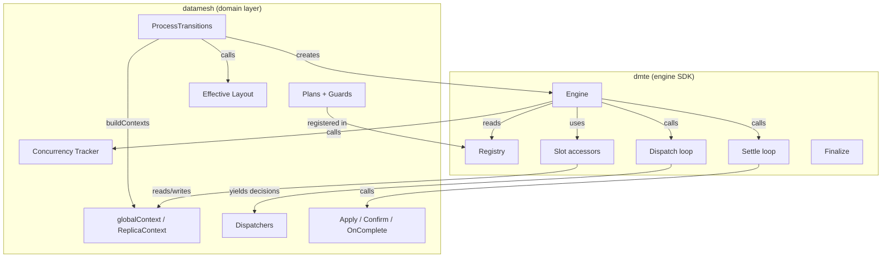
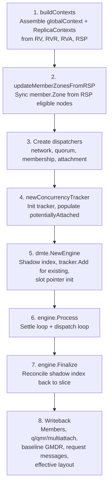

# Datamesh Internals

> Internal architecture reference for the `datamesh` package.
> Target audience: developers reading the code for the first time.

## 1. Overview

The datamesh transition system is split into two packages:

- **`dmte`** (datamesh transition engine) — a generic, domain-agnostic SDK. Owns plan
  registry, settle/dispatch loop, slot-based concurrency, shadow index, and finalize.
  Pure non-I/O. See [dmte/README.md](../dmte/README.md) for engine internals.

- **`datamesh`** — domain-specific wiring that uses `dmte`. Owns typed contexts,
  concrete plans (membership, quorum, attachment, network), guards, dispatchers,
  confirm callbacks, concurrency rules, effective layout computation, and writeback.



**Key files:**

| File | Purpose |
|------|---------|
| `datamesh.go` | Entry point (`ProcessTransitions`, `BuildRegistry`) |
| `context.go` | Data model (`globalContext`, `ReplicaContext`, `buildContexts`, writeback) |
| `slots.go` | Slot constants and accessors |
| `concurrency_tracker.go` | `CanAdmit` rules, transition tracking state |
| `helpers_confirm.go` | Shared confirm callbacks |
| `helpers_adapt.go` | Scope adapters (`asReplicaApply`, `asReplicaConfirm`) |
| `membership_helpers.go` | Computation helpers, step constructors, init/onComplete |
| `membership_helpers_apply.go` | Apply callbacks (`createMember`, `setType`, q/qmr) |
| `membership_helpers_guards.go` | All guard functions and predefined guard slices |
| `membership_plans.go` | Plan registration wiring |
| `membership_plan_*.go` | Plan definitions per type (access, tiebreaker, diskful, shadow-diskful, change-type, force-remove) |
| `membership_dispatch.go` | Membership dispatcher and plan selection |
| `quorum_plans.go` | ChangeQuorum plan definitions |
| `quorum_helpers.go` | `computeCorrectQuorum`, `updateBaselineGMDR` |
| `quorum_dispatch.go` | Quorum dispatcher |
| `attachment_plans.go` | Attach/Detach/ForceDetach/Multiattach plans and guards |
| `attachment_dispatch.go` | Attachment dispatcher (FIFO, multiattach toggle) |
| `network_plans.go` | RepairNetworkAddresses and ChangeSystemNetworks plans |
| `network_helpers.go` | Network apply/confirm/guard callbacks, connection verification |
| `network_dispatch.go` | Network dispatcher (repair priority, CSN plan selection) |
| `effective_layout.go` | `updateEffectiveLayout`, `isAgentReady` |

---

## 2. Entry Point: ProcessTransitions

`ProcessTransitions` is the only public function. Called once per reconciliation cycle
by `rv_controller`. It takes the current state (`rv`, `rsp`, `rvrs`, `rvas`, `features`),
mutates `rv.Status` in place, and returns `(changed bool, allReplicas []ReplicaContext)`.

The function runs 8 steps:



Steps 1-5 build the engine. Step 6 is the core work. Step 7 seals the engine.
Step 8 propagates mutations back to `rv.Status`.

---

## 3. Data Model

### 3.1 globalContext

Per-reconciliation structure holding datamesh-wide state. All fields are private —
access is within the `datamesh` package only.

**Read-only (set at construction):**

- `deletionTimestamp` — RV's DeletionTimestamp (nil if not deleting).
- `configuration` — resolved RV configuration (FTT, GMDR, topology, volumeAccess, pool name).
- `maxAttachments` — from `rv.Spec.MaxAttachments`.
- `replicatedStorageClassName` — from `rv.Spec` (empty in Manual mode). Used in user-facing messages.
- `rsp` — RSP interface for node eligibility lookups. Nil if RSP unavailable.
- `features` — cluster-level feature flags (`ShadowDiskful`).

**Mutable datamesh state (mutated by apply callbacks, written back after engine):**

- `datamesh.quorum` (q), `datamesh.quorumMinimumRedundancy` (qmr), `datamesh.multiattach`, `datamesh.systemNetworkNames`.
- `baselineGMDR` — committed GMDR level: `min(qmr-1, config.GMDR)`.

**Transition tracking state (maintained by concurrency tracker):**

- Global scope groups (bools): `hasFormationTransition`, `hasQuorumTransition`, `hasMultiattachTransition`, `hasNetworkTransition`.
- Replica scope groups (IDSets): `votingMembershipTransitions`, `nonVotingMembershipTransitions`, `attachmentTransitions`, `emergencyTransitions`.
- `potentiallyAttached` — IDSet of members that are or may still be Primary. Used for multiattach admission.
- `changeSystemNetworksTransition` — pointer to the active ChangeSystemNetworks transition (for from/to network access). Set/cleared by tracker.

**Lazy-computed:**

- `isQuorumSatisfied()` — checks if any voter member has quorum. Result cached for the reconciliation cycle.

**Replica index:**

- `replicas [32]*ReplicaContext` — ID-indexed lookup (0-31).
- `allReplicas []ReplicaContext` — backing slice including orphan RVA contexts.

### 3.2 ReplicaContext

Per-node structure. A `ReplicaContext` exists for every node that has at least one of:
RVR, Member, Request, or Transition.

| Category | Fields |
|----------|--------|
| Identity | `id` (0-31), `name` (e.g. "rv-1-5"), `nodeName` |
| State | `rvr` (RVR pointer, nil if none), `member` (member pointer, nil if not a member), `rvas` (sub-slice sorted by CreationTimestamp), `membershipRequest` (pending request, nil if none) |
| Slots | `membershipTransition`, `attachmentTransition` — set by engine via slot accessors |
| Output | `membershipMessage`, `attachmentConditionMessage`, `attachmentConditionReason` — set by slot `SetStatus` |
| Cached | `eligibleNode` (lazy, from RSP lookup), `eligibleNodeChecked` |

**Orphan contexts:** Nodes with only RVAs (no member/RVR/request/transition) get a
`ReplicaContext` with `member=nil`, `rvr=nil`. They are appended to `allReplicas` but
are NOT in the `replicas[32]` ID index.

**dmte.ReplicaCtx interface:** `ID()`, `Name()`, `Exists()` (rvr != nil), `Generation()`, `Conditions()`.

### 3.3 provider

Value type implementing `dmte.ContextProvider[*globalContext, *ReplicaContext]`.
`Global()` returns `*globalContext`, `Replica(id)` returns `gctx.replicas[id]` (nil for unused IDs).
Value type with value receivers for stenciling performance.

### 3.4 buildContexts

Three-step algorithm:

1. **Collect known IDs** — union of IDs from RVRs, Members, Requests, and replica-scoped Transitions. Allocate `allReplicas` with +1 capacity for a possible orphan.
2. **Populate by ID** — iterate RVRs (set `rvr`, `nodeName`, `name`), Members (set `member`, fill `nodeName`/`name` if empty), Requests (set `membershipRequest`, fill `name` if empty). RVR takes priority for `nodeName`.
3. **Assign RVAs by nodeName** — iterate sorted RVAs, match to existing contexts by `nodeName`. Unmatched nodes appended as orphan contexts. If append reallocates the backing array, rebuild the `replicas[32]` index.

Member pointers point into `rv.Status.Datamesh.Members` — stable during engine
processing because apply callbacks never mutate the slice (they set `rctx.member`
to nil or to a new heap-allocated object).

Transitions are NOT populated on `ReplicaContext` — the engine does it via slot
accessors in `NewEngine`.

---

## 4. Registry and Plans

### 4.1 Startup Registration

`BuildRegistry()` is called once at controller startup. It creates the registry and
registers all slots and plans. Panics if called twice.

```
BuildRegistry
├── registerSlots        (membershipSlot=0, attachmentSlot=1)
├── registerMembershipPlans
│   ├── registerAccessPlans
│   ├── registerTieBreakerPlans
│   ├── registerShadowDiskfulPlans
│   ├── registerDiskfulPlans
│   ├── registerChangeTypePlans
│   └── registerForceRemovePlans
├── registerQuorumPlans
├── registerAttachmentPlans
└── registerNetworkPlans
```

Transition handles (`RegisteredTransition`) carry scope and slot:
- `ReplicaTransition(type, slot)` — for membership and attachment.
- `GlobalTransition(type)` — for quorum, multiattach, and network.

Plans registered under a handle inherit its scope and slot.

### 4.2 Plan Anatomy

A plan defines:

- **Scope** — Global or Replica (inherited from `RegisteredTransition`).
- **Group** — concurrency group (e.g. `VotingMembership`, `NonVotingMembership`, `Attachment`, `Emergency`, `Quorum`, `Multiattach`, `Network`). Written to the transition.
- **Slot** — replica slot ID (Replica scope only).
- **DisplayName** — for auto-composed progress and blocked-by messages.
- **Guards** — precondition checks, evaluated in order before creation.
- **Steps** — ordered list (at least one). Each step has apply + confirm.
- **Init** — optional callback after creation, before tracker admission. Populates transition metadata.
- **OnComplete** — optional callback after all steps confirmed.
- **CancelActiveOnCreate** — cancel the active transition in the same slot before creating (Emergency only).

**PlanID format:** `"{name}/v{N}"` (e.g. `"diskful-q-up/v1"`). Persisted on transitions.

**Versioning rules** (from plan file headers):
- New version required: step composition changed, step apply semantics changed.
- Safe changes (no new version): guards, confirm, DisplayName, diagnostics, OnComplete.

### 4.3 Step Anatomy

Each step is a tagged union — exactly one of (globalApply + globalConfirm) or
(replicaApply + replicaConfirm) is set, determined by scope.

- **Apply** — mutates state (e.g. add member, change type, raise q). Returns `bool` (changed). The engine bumps `DatameshRevision` only when true. When false (no-op), agents already confirmed the current revision — the engine advances immediately.
- **Confirm** — returns `ConfirmResult{MustConfirm, Confirmed}` (IDSets). The engine normalizes `Confirmed = Confirmed ∩ MustConfirm`, then checks completion (`Confirmed == MustConfirm`).
- **OnComplete** (optional) — called after confirmation satisfied, before advancing to the next step.
- **Details** (optional) — opaque data passed to `slot.SetStatus` alongside the message.
- **DiagnosticConditions** — condition types to check on unconfirmed replicas for error reporting.
- **DiagnosticSkipError** — allows ignoring specific error conditions (e.g. PendingDatameshJoin on subject during AddReplica).

### 4.4 Domain Step Constructors

Each transition group has a step constructor that pre-applies `DiagnosticConditions(DRBDConfiguredType)`:

| Constructor | Group | Scope |
|-------------|-------|-------|
| `mrStep` | Membership | Replica |
| `mgStep` | Membership | Global |
| `arStep` | Attachment | Replica |
| `agStep` | Attachment | Global |
| `ngStep` | Network | Global |

**Scope adapters** (`helpers_adapt.go`): `asReplicaApply` and `asReplicaConfirm` wrap
global-scoped callbacks for use in `ReplicaStep`. Go cannot infer `R` from the input
argument — these thin wrappers pin `G=*globalContext, R=*ReplicaContext`.

---

## 5. Engine Lifecycle

> See [dmte/README.md](../dmte/README.md) for full details on shadow index, settle
> algorithm, progress messages, and finalize reconciliation.

Key points:

1. **NewEngine** — builds a shadow index (`[]*Transition`) from the original slice, calls `tracker.Add` for each existing transition, initializes slot pointers for replica-scoped transitions with known plans.

2. **Process** — outer convergence loop:
   - **Settle** existing transitions (confirm steps, advance, complete) until no progress.
   - **Dispatch** new transitions via registered dispatchers.
   - Repeat until dispatch creates nothing new (steady state). Safety bound of 10 outer iterations.

3. **Finalize** — reconciles the shadow index back to the original slice. Copies only where pointers diverge. Truncates for deletions, appends for creations. Updates slot pointers to reference the returned slice.

**Revision bumping:** `applyStep` bumps `*revision` only when the apply callback
returns `changed=true`. No-op steps (e.g. `setType` when already the target type)
do not bump — agents that already confirmed the current revision immediately satisfy
the confirm check, allowing the engine to advance through no-op steps within a single
`Process()` call.

---

## 6. Slots

Two replica slots, identified by constants:

| Constant | ID | Accessor | SetStatus writes |
|----------|-----|----------|------------------|
| `membershipSlot` | 0 | `membershipSlotAccessor` | `rctx.membershipMessage` |
| `attachmentSlot` | 1 | `attachmentSlotAccessor` | `rctx.attachmentConditionMessage` + `rctx.attachmentConditionReason` (from `details.(string)`) |

Each accessor implements `dmte.ReplicaSlotAccessor[*ReplicaContext]`:
- `GetActiveTransition(rctx)` — returns the slot's transition pointer.
- `SetActiveTransition(rctx, t)` — stores or clears the transition pointer.
- `SetStatus(rctx, msg, details)` — writes status output fields.

The engine uses slots for:
- **Init** — populates slot pointers from existing transitions during `NewEngine`.
- **Conflict detection** — same transition type active on slot → silent ignore (preserves settle progress). Different type → "blocked by active" message via `SetStatus`.
- **Status routing** — all status output (guards, tracker, progress, blocked) flows through `SetStatus`.

---

## 7. Concurrency Tracker

The tracker (`concurrency_tracker.go`) is a stateless behavior layer that reads and
mutates `globalContext` fields. It implements `dmte.Tracker`.

### Add / Remove

`Add` registers a transition: sets the group's bool/IDSet and updates `potentiallyAttached`
(for Attachment group). `Remove` reverses — with one asymmetry: Remove of a completed
Detach clears `potentiallyAttached` (node confirmed detached), but Remove of a completed
Attach keeps it (node confirmed attached — stays in the set).

For Network group, `Add` also sets `gctx.changeSystemNetworksTransition` (for CSN
plan access); `Remove` clears it.

### CanAdmit Rules

| Proposed ↓ | Formation | Emergency | VotingMembership | NonVotingMembership | Quorum | Network | Attachment | Multiattach |
|------------|-----------|-----------|------------------|---------------------|--------|---------|------------|-------------|
| **Blocked by active:** | everything except Network/Emergency | never blocked | another Voter, Quorum, Network | same-replica membership | another Quorum, Voter, Network | another Network | same-replica attachment, multiattach readiness | another Multiattach |

Additional per-member rules:
- At most one membership transition per replica (Voting or NonVoting).
- At most one attachment transition per replica.
- Emergency always allowed (caller cancels per-member conflicts via `CancelActiveOnCreate`).

**Multiattach readiness:** A second+ Attach requires `datamesh.multiattach == true`
AND no active Multiattach toggle (enable/disable confirmed). Uses `potentiallyAttached`
minus the proposed replica for accurate counting.

---

## 8. Dispatchers

Dispatchers are registered in order: **network → quorum → membership → attachment**.
Order matters: network repair has priority over membership (stale addresses must be
fixed before adding voters), and quorum check runs before membership to handle
standalone q/qmr corrections.

### 8.1 Network Dispatcher

Handles two transition types in priority order:

1. **RepairNetworkAddresses** — `needsAddressRepair` compares each member's addresses
   against `rvr.Status.Addresses` filtered by `datamesh.systemNetworkNames`. Three
   mismatch types: missing, wrong IP/port, stale. Dispatches `repair/v1`.

2. **ChangeSystemNetworks** — compares `datamesh.systemNetworkNames` (current) with
   `RSP.GetSystemNetworkNames()` (target). Computes added/removed/remaining sets.
   Plan selection:

   | added | removed | remaining | Plan |
   |-------|---------|-----------|------|
   | yes | yes | none | `migrate/v1` |
   | yes | yes | some | `update/v1` |
   | yes | no | — | `add/v1` |
   | no | yes | — | `remove/v1` |

   Skips if RSP nil, networks in sync, or repair already needed (Network serialized).
   Init callback (`setSystemNetworks`) captures from/to network names into the transition.

### 8.2 Quorum Dispatcher

Reconciles q and qmr to their correct values when they drift.

- **Skip** if a VotingMembership transition is active (voter count changing).
- **Defer** to membership if qmr differs by exactly ±1 and a matching D request exists
  (embedded qmr↑/qmr↓ step in AddReplica(D)/RemoveReplica(D) handles it).
- **Dispatch** `ChangeQuorum` otherwise. Uses `computeCorrectQuorum` as the single
  source of truth. Plan selection via `selectQuorumPlan`:

  | q direction | qmr direction | Plan |
  |-------------|---------------|------|
  | down or same | down or same | `lower/v1` |
  | up or same | up or same | `raise/v1` |
  | down | up | `lower-q-raise-qmr/v1` |
  | up | down | `raise-q-lower-qmr/v1` |

### 8.3 Membership Dispatcher

Request-driven. Iterates `allReplicas`, for each:

- If `membershipRequest` exists — maps operation to transition type + plan selection function:
  - `Join` → `AddReplica` via `planAddReplica`
  - `Leave` → `RemoveReplica` via `planRemoveReplica`
  - `ChangeRole` → `ChangeReplicaType` via `planChangeReplicaType`
  - `ForceLeave` → `ForceRemoveReplica` via `planForceRemoveReplica`
- If no request but `member != nil && rvr == nil` — orphan member (node permanently lost). Auto-dispatch `ForceRemoveReplica`.

**Plan selection** returns `(planID, "")` on success, `("", blocked)` if blocked
(written to slot via `NoDispatch`), `("", "")` to skip silently.

A special case: when a member is in a liminal state heading toward its resolved
type (LiminalDiskful with targetType=Diskful, or LiminalShadowDiskful with
targetType=ShadowDiskful), `planChangeReplicaType` returns skip `("", "")` —
the member is already mid-transition and no new dispatch is needed.

Diskful plan selection (`planAddDiskful`) is the most complex — 8 variants based on:
- Voter parity: even (no q↑) vs odd (q↑ needed)
- ShadowDiskful feature: A vestibule vs sD pre-sync
- qmr: needs raising vs not

RemoveReplica(D) has 4 variants based on parity × qmr direction.

### 8.4 Attachment Dispatcher

Processes attachment intent per replica:

1. **ForceDetach** — from requests, before normal decisions. Skips if member not attached.
2. **Multiattach toggle** — counts intended attachments (member + active RVA). Enable requires intended attachments > 1 and maxAttachments > 1. Disable is deferred while more than one member is potentially attached (concurrent Primary risk). Dispatches when toggle is needed and not already in progress.
3. **Collect candidates** — replicas with RVAs or attached members. FIFO sort by earliest active RVA timestamp (detach-only candidates get zero timestamp → sort first).
4. **Per-replica decision:**

   | State | Decision |
   |-------|----------|
   | Attached + active RVA + no transition | `NoDispatch` with "attached and ready" |
   | Has active RVA (not attached) | `DispatchReplica` Attach |
   | No active RVA + attached | `DispatchReplica` Detach |
   | Only deleting RVAs | `NoDispatch` with "detached" |
   | No RVAs + not attached | skip |

All admission checks (member existence, eligibility, quorum, slots) are handled
by guards on the plans and by the concurrency tracker — the dispatcher only decides intent.

---

## 9. Callback Taxonomy

### 9.1 Confirm Callbacks

The confirm model is IDSet-based. Each confirm callback returns
`ConfirmResult{MustConfirm, Confirmed}`. The engine normalizes
`Confirmed = Confirmed ∩ MustConfirm` and completes the step when
`Confirmed == MustConfirm`.

**Shared confirm hierarchy** (from `helpers_confirm.go`):

| Function | MustConfirm | Confirmed rule | Used by |
|----------|-------------|----------------|---------|
| `confirmSubjectOnly` | {subject} | rev >= stepRevision | D∅→D, D→D∅, sD∅→sD, sD→sD∅, Attach |
| `confirmSubjectOnlyLeaving` | {subject} | rev >= stepRevision OR rev == 0 | Star member removal within multi-step plans |
| `confirmSubjectOnlyLeavingOrGone` | {subject} | rev >= stepRevision OR rev == 0 OR rvr == nil | Detach (node may die) |
| `confirmFMPlusSubject` | FM ∪ {subject} | rev >= stepRevision | ✦→A, ✦→TB, A→TB, TB→A |
| `confirmFMPlusSubjectLeaving` | FM ∪ {subject} | rev >= stepRevision; subject: rev == 0 | A→✕, TB→✕ (final removal) |
| `confirmAllMembers` | all members | rev >= stepRevision | ✦→D∅, ✦→sD∅, topology changes, qmr↑/↓ |
| `confirmAllMembersLeaving` | all members ∪ {subject} | rev >= stepRevision; subject: rev == 0 | D∅→✕, sD∅→✕, sD→✕ |
| `confirmImmediate` | ∅ | ∅ (completes immediately) | ForceDetach |
| `confirmMultiattach` | D+sD+Attached members | rev >= stepRevision | Enable/DisableMultiattach |

**FM** = full-mesh members (D, D∅, sD, sD∅) — members where `Type.ConnectsToAllPeers()` is true.

**Network-specific confirms:**

- `confirmAllConnected` — all members, verified via `peerConnected` on each expected connection.
- `confirmAddedAddressesAvailable` — all members with rev confirmed AND `rvr.Status.Addresses` has entries for every added network.
- `confirmAllConnectedOnAddedNetworks` — all members, verified via `peerConnectedOnNetwork` for each added network.

**Connection verification** (`network_helpers.go`): A connection between two members
is verified if at least one side with a ready agent and `DatameshRevision >= minRevision`
reports the peer. Two `peerCheck` implementations: `peerConnected` (any connection) and
`peerConnectedOnNetwork(net)` (specific network in `ConnectionEstablishedOn`).

**Helper functions:** `fullMeshMemberIDs`, `allMemberIDs`, `confirmedReplicas` iterate
`gctx.allReplicas` and return IDSets.

### 9.2 Apply Callbacks

**Parameterized factories** (return `func(*globalContext, *ReplicaContext) bool`):

- `createMember(type)` — creates a new `DatameshMember` with zone from RSP, addresses cloned from RVR. Always returns true.
- `setType(type)` — sets `member.Type`. Returns false if already target type (key no-op for D→D∅ when already liminal).
- `setBackingVolumeFromRequest` — copies LVG/ThinPool from membership request to member.
- `clearBackingVolume` — clears LVG/ThinPool fields.

**Non-parameterized:**

- `removeMember` — sets `rctx.member = nil`. If `rvr` is also nil, clears the replica from `gctx.replicas[id]` index. Always returns true.

**Global q/qmr callbacks** (scope: GlobalApplyFunc, used via `asReplicaApply` in ReplicaStep):

- `raiseQ`/`lowerQ` — increment/decrement `gctx.datamesh.quorum`.
- `raiseQMR`/`lowerQMR` — increment/decrement `gctx.datamesh.quorumMinimumRedundancy`.
- `setCorrectQ`/`setCorrectQMR` — compute from `computeCorrectQuorum` and set. Return false if already correct (no-op).

**Baseline GMDR:**

- `updateBaselineGMDR` — sets `gctx.baselineGMDR = min(qmr-1, config.GMDR)`. Used in two modes:
  - **Lowering** (via `ComposeGlobalApply`): runs in the apply phase, baseline drops immediately.
  - **Raising** (via `AdaptApplyToOnComplete`): runs in OnComplete after replicas confirm, baseline rises after confirmation.

**Composability:** `dmte.ComposeReplicaApply` and `dmte.ComposeGlobalApply` combine
multiple callbacks. Return true if any sub-callback returned true (OR of all results).
All sub-callbacks always called regardless of earlier results.

**Change detection:** `dmte.SetChanged[T comparable](dst *T, val T)` assigns and
returns whether the value changed. Used in apply callbacks for the `bool` return.

### 9.3 Guard Groups

Guards are organized into predefined slices for reuse across plans:

| Slice | Used by | Guards |
|-------|---------|--------|
| `commonAddGuards` | All AddReplica plans | RVNotDeleting, RSPAvailable, NodeEligible, NodeHasAllSystemNetworks, NoMemberOnSameNode, AddressesPopulated |
| `commonRemoveGuards` | All RemoveReplica plans | NotAttached |
| `loseVoterGuards` | RemoveReplica(D), ChangeType(D→...) | VolumeAccessLocalForDemotion, GMDRPreserved, FTTPreserved, ZoneGMDRPreserved, ZoneFTTPreserved |
| `loseTBGuards` | RemoveReplica(TB), ChangeType(TB→...) | TBSufficient, ZoneTBSufficient |
| `gainVoterGuards` | AddReplica(D), ChangeType(→D) | ZonalSameZone, TransZonalVoterPlacement |
| `gainTBGuards` | AddReplica(TB), ChangeType(→TB) | ZonalSameZone, TransZonalTBPlacement |
| `forceRemoveGuards` | All ForceRemoveReplica plans | NotAttached, MemberUnreachable |

**Defense-in-depth guards** verify dispatcher decisions (should never fire in normal operation):

- `guardVotersEven`/`guardVotersOdd` — parity check matching the plan variant.
- `guardQMRRaiseNeeded`/`guardQMRLowerNeeded` — qmr direction check for qmr↑/qmr↓ plans.
- `guardShadowDiskfulSupported` — feature flag check for sD plans.
- `guardMaxDiskMembers` — DRBD limit of 8 disk-bearing members (counts current + pending).

**Zone guards** (TransZonal/Zonal topology only):

- `guardZonalSameZone` — blocks if replica zone differs from primary zone(s). Zonal only.
- `guardTransZonalVoterPlacement` — blocks if adding a voter would make any zone loss violate quorum or GMDR.
- `guardTransZonalTBPlacement` — blocks if TB zone has > 1 D voter.
- `guardZoneGMDRPreserved`/`guardZoneFTTPreserved` — blocks if removing a voter would violate zone-level guarantees.
- `guardZoneTBSufficient` — blocks if removing the last TB when TB coverage required.

**Attachment-specific guards:**

- `guardAttachNotDeleting` — blocks Attach if RV is being deleted.
- `guardNodeOperational` — blocks if node not in RSP, not ready, or agent not ready.
- `guardRVRReady` — blocks if RVR does not exist or is not Ready.
- `guardMemberExists` — blocks if no datamesh member on this node (with diagnostic messages).
- `guardQuorumSatisfied` — blocks if no voter has quorum (lazy-cached).
- `guardSlotAvailable` — blocks if `potentiallyAttached` count >= `maxAttachments`.
- `guardVolumeAccessLocalForAttach` — blocks non-Diskful members in Local mode.
- `guardDeviceNotInUse` — blocks Detach if `rvr.Status.Attachment.InUse`.

---

## 10. Writeback

After engine processing, mutations are propagated back to `rv.Status`:

**`writebackMembersFromContexts`** — pointer-based change detection. Walks `gctx.replicas[0..31]`
to find active members. Compares pointer identity with `rv.Status.Datamesh.Members` entries.
Fast path: same ID set + same pointers → no-op. Otherwise: compact surviving members
(pointer unchanged), append new/replaced members. Original order preserved for surviving;
new members appended at the end.

**`writebackDatameshFromContext`** — copies scalar parameters back: q, qmr, multiattach,
systemNetworkNames.

**`writebackBaselineGMDRFromContext`** — copies `gctx.baselineGMDR` to
`rv.Status.BaselineGuaranteedMinimumDataRedundancy`.

**`writebackRequestMessagesFromContexts`** — in-place update. `membershipRequest`
pointers point into `rv.Status.DatameshReplicaRequests` — mutations via
`rctx.membershipMessage` are written directly. Returns true if any message changed.

**`updateMemberZonesFromRSP`** — called before engine processing (step 2). Updates
`member.Zone` from RSP eligible node data. Returns true if any zone changed. Ensures
guards and dispatchers see up-to-date zone information.

---

## 11. Effective Layout

Computed unconditionally each reconciliation cycle — not gated by engine `changed`.
Reflects actual cluster state, which may change even without engine mutations (e.g.
voter failure/recovery).

**Single-pass classification** over `gctx.allReplicas`:

- Skip entries without both `member` and `rvr`.
- Classify by member type: voters (D, D∅) and TBs.
- **Ready agent**: `isAgentReady(rvr)` (DRBDConfigured reason != AgentNotReady) AND `rvr.Status.Quorum != nil`.
- From ready agents: own `quorumTrue`, `diskUpToDate`, and peer observations (`peerConnected`, `peerUpToDate`).

**Set algebra** for derived counts:

```
staleVoters      = voters - ready
reachableVoters  = (voters ∩ quorumTrue) ∪ (staleVoters ∩ peerConnected)
upToDateVoters   = (voters ∩ diskUpToDate) ∪ (staleVoters ∩ peerUpToDate)
reachableTBs     = tbs ∩ (ready ∪ peerConnected)
```

**Formulas:**

- `FTT = min(reachableD - q + tbBonus, upToDateD - qmr)`
  where tbBonus = 1 when reachableD is even and reachableTBs > 0.
- `GMDR = min(upToDateD, qmr) - 1`
- Both set to nil when no voters exist or no agents have fresh data.

**FTT and GMDR can be negative** — indicates degradation below the quorum settings.

**Diagnostic message** built via `setEffectiveLayoutMessage`: uses a 256-byte
stack-allocated buffer (`fmt.Appendf`). Zero heap allocations on the no-change path
(Go compiler optimizes `string([]byte) == string` comparison).

---

## 12. Testing Approach

Tests are organized by scope:

**Plan tests** (`*_plan_*_test.go`): test plan BEHAVIOR through `ProcessTransitions` — guards,
apply, confirm, onComplete, plan selection. Do not re-test engine mechanics
(covered by `dmte/*_test.go`), concurrency rules (`concurrency_tracker_test.go`),
or context building (`context_test.go`). A test belongs in a plan test file if it
catches a regression when someone changes a plan or dispatch file.

**Unit tests**: `context_test.go` (buildContexts, writeback, quorum check, zone sync),
`slots_test.go`, `concurrency_tracker_test.go`, `helpers_confirm_test.go`,
`effective_layout_test.go`, `network_helpers_test.go`, `membership_helpers_test.go`,
`membership_helpers_apply_test.go`, `membership_helpers_guards_test.go`, `quorum_helpers_test.go`.

**Integration tests**:
- `integration_quorum_test.go` — q/qmr invariants under add/remove D cycles for all 7 canonical layouts × 3 topologies × 2 feature variants.
- `integration_force_remove_quorum_test.go` — cascading ForceRemove preserves qmr/baseline.
- `integration_attachment_test.go` — full lifecycle (add+attach→detach+remove), multiattach, VolumeAccess=Local, ForceDetach+ForceRemove, quorum gating.
- `integration_layout_transitions_test.go` — all 42 layout pairs (7×6) for each topology, both all-at-once and step-by-step (D-first + TB-first orderings).
- `integration_topology_switch_test.go` — topology changes mid-flight (Ignored↔TransZonal↔Zonal).
- `integration_network_test.go` — sequential CSN, CSN+membership concurrency, repair+membership concurrency.

**Performance tests** (`performance_test.go`):
- Go benchmarks (`BenchmarkNoOp_*`, `BenchmarkDispatch_*`, `BenchmarkSettle_*`, `BenchmarkFullCycle_*`) — ns/op, allocs/op via `-benchmem`.
- Ginkgo allocation tests — assert < 30 allocs per no-op `ProcessTransitions` call across all layouts and topologies. Catch allocation regressions from refactoring.

**Test infrastructure:**
- `runSettleLoop` — iterates `ProcessTransitions` until stable, with pluggable simulation (`simulateRevisionBump`, `simulateWithPeers`, `simulateReadyReplicas`) and per-iteration checks.
- `assertSafetyInvariants` — checked at every iteration: `q == voters/2+1`, `qmr >= 1`. Always unconditional — no exceptions for "engine is still fixing".
- Feature variants: every integration test runs with `FeatureFlags{}` (A-vestibule) and `FeatureFlags{ShadowDiskful: true}` (sD-vestibule).
