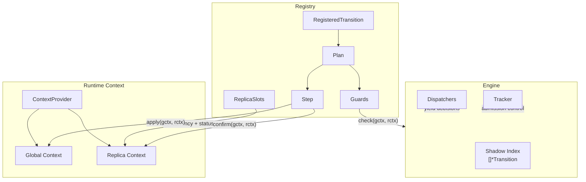
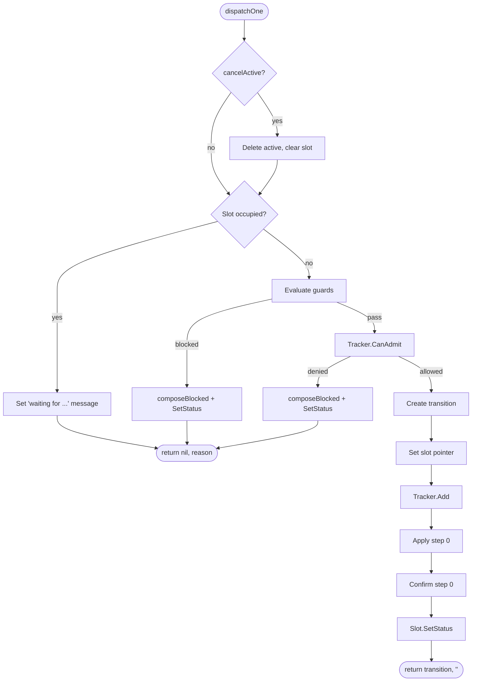
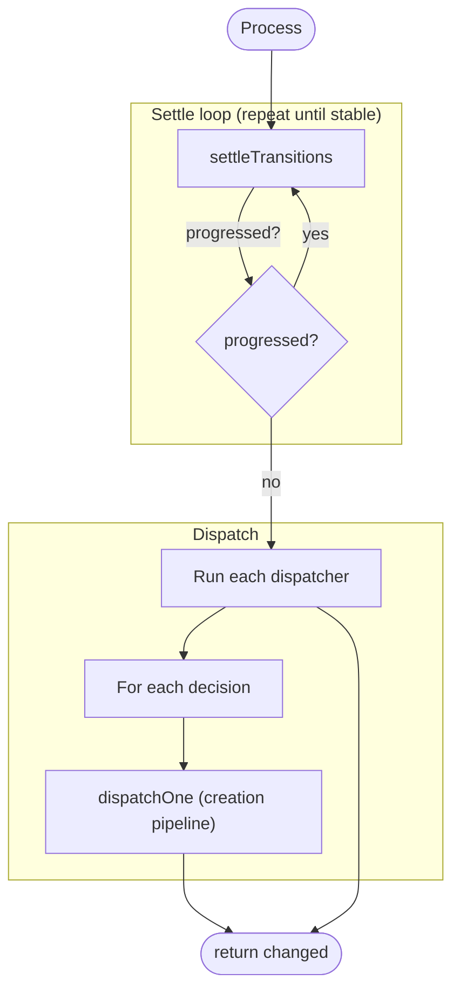

# Datamesh Transition Engine (dmte)

## What is this?

`dmte` is the **datamesh transition engine SDK** — a generic mechanism for managing
multi-step transitions with guards, admission tracking, and slot-based concurrency
control.

A **transition** is a structured, multi-step operation on a datamesh: adding or
removing a replica, attaching/detaching a volume, changing quorum, enabling
multiattach, and so on. Each transition follows a pre-declared **plan** that
defines the sequence of steps, preconditions, and completion callbacks.

The engine is **pure non-I/O**: it mutates transition storage and replica context
status in memory. The caller (the RV controller reconciler) owns `DeepCopy` for
patch base and persists the results to Kubernetes after the engine runs. This
separation keeps the engine testable and deterministic — all side effects are
explicit and controlled by the caller.

In the system architecture, `dmte` sits between the RV controller reconciler
and the Kubernetes API. The reconciler provides typed contexts (global state
and per-replica state), dispatchers (which decide what transitions to start),
and a tracker (which enforces concurrency rules). The engine decides which
transitions to create, advance, or complete — and writes status messages back
through slot accessors for the reconciler to persist.

## Core Concepts

### Transition

yrepresenting an active operation on the
datamesh. It carries:

- **Type** — what kind of operation (e.g., `AddReplica`, `Attach`, `ChangeQuorum`)
- **Group** — concurrency category (e.g., `VotingMembership`, `Attachment`)
- **PlanID** — which registered plan this transition follows (e.g., `"diskful-odd/v1"`)
- **Steps** — ordered list of step statuses (Pending → Active → Completed)
- **ReplicaName** — for replica-scoped transitions, the target replica

Transitions are stored in `.status.datameshTransitions` on the ReplicatedVolume
object and managed by the engine during each reconciliation.

### Plan

A **Plan** is a registered blueprint for a transition. Plans are registered at
startup time via a fluent DSL and are immutable at runtime.

A plan defines:

- The transition type and concurrency group
- A human-readable display name (for progress messages)
- An ordered sequence of **Steps**
- Optional **Guards** (preconditions)
- Optional **OnComplete** callback
- Optional **Init** callback (populates transition metadata at creation time)

Plans are keyed by `(TransitionType, PlanID)`. The `PlanID` is a versioned
identifier (e.g., `"access/v1"`, `"diskful-odd/v1"`) that enables safe plan
evolution across rolling upgrades.

### Step

A **Step** is one phase within a plan. Each step has two required callbacks
and one optional:

- **Apply** — mutates state (e.g., add a member to the datamesh, change quorum).
  Called once when the step is activated. The engine bumps `DatameshRevision`
  after apply.
- **Confirm** — checks convergence by returning two `IDSet`s: `MustConfirm`
  (replicas that need to see the new revision) and `Confirmed` (replicas that
  already have). The engine normalizes `Confirmed` to `Confirmed ∩ MustConfirm`
  before checking completion (`Confirmed == MustConfirm`).
- **OnComplete** (optional) — called after confirmation is fully satisfied,
  before the engine advances to the next step or completes the plan. Use for
  post-confirmation side effects that depend on all replicas having applied the
  change (e.g., updating `BaselineLayout` after replicas confirmed a q/qmr change).

Steps can be **replica-scoped** (receive both global and replica context) or
**global-scoped** (receive only global context). A plan can mix both scopes
in its step sequence.

### Scope

- **GlobalScope** — transitions/steps that act on the datamesh as a whole
  (e.g., change quorum, enable multiattach).
- **ReplicaScope** — transitions/steps that act on a specific replica
  (e.g., add replica, attach).

### Replica Slot

A **ReplicaSlot** is a fixed-size concurrency slot per replica. Each replica
has up to `MaxReplicaSlots` slots (currently 2), and each slot can hold at
most one active transition.

Slots serve two purposes:

1. **Concurrency control** — only one transition per slot per replica.
   If a dispatch decision targets a slot that already has an active transition,
   the engine writes a "blocked by active" message instead of creating a new one.
2. **Status routing** — the engine writes progress messages and details through
   the slot's `SetStatus` callback, which the reconciler maps to the
   appropriate status fields on the replica.

### Guard

A **Guard** is a precondition check evaluated before creating a transition.
Guards are registered on plans and evaluated in order — the first blocking
guard stops the pipeline. The engine composes the guard's reason with the
plan display name via `composeBlocked` (`"{plan} is blocked: {reason}"`)
and writes the composed message to the slot for user visibility.

### Tracker

The **Tracker** is a caller-provided component that enforces global admission
rules across transitions. Before creating a transition, the engine calls
`CanAdmit` on the tracker. The tracker decides based on concurrency groups
whether the new transition is allowed (e.g., only one voting membership
change at a time).

### Dispatcher

A **Dispatcher** is a function that examines the current state and yields
dispatch decisions. Multiple dispatchers can be registered; they execute in
registration order after the settle phase.

Each decision is one of:

- **DispatchReplica** — start a replica-scoped transition
- **DispatchGlobal** — start a global-scoped transition
- **NoDispatch** — no transition needed, but write a status message to the slot
  (e.g., "Volume is attached")

### ContextProvider

The **ContextProvider** gives the engine access to typed global and per-replica
contexts. It is generic on `[G, R]`:

- `Global() G` — returns the global context (domain-level collections, mutable by apply callbacks)
- `Replica(id uint8) R` — returns the replica context for a given ID (0–31)

The engine passes these contexts to step callbacks, guards, and dispatchers.

### Concept Map



## Engine Lifecycle

### Overview

The engine is created per reconciliation cycle and follows a strict lifecycle:

```
NewEngine → { Process() and/or Create*Transition() } → Finalize()
```

Between `NewEngine` and `Finalize`, the caller can use two mechanisms to
create transitions — both go through the same creation pipeline:

- **Process()** — the main loop: settles existing transitions, then runs
  registered dispatchers that yield decisions declaratively.
- **Create\*Transition()** — direct imperative creation by the reconciler
  (e.g., based on external input or a specific reconciliation phase).

Both can be called in any order, any number of times, and can be mixed
freely before `Finalize()`. Between `NewEngine` and `Finalize`, the original
transitions slice has indeterminate state. Only `Finalize()` returns the
authoritative result.

### NewEngine

Constructs the engine from the current state:

1. Builds a **shadow index** — `[]*Transition` with pointers into the
   original transitions slice.
2. Populates the **Tracker** with all existing transitions (`Add` for each).
3. Initializes **slot pointers** for replica-scoped transitions with known plans.

### Creation Pipeline

Both `Process` (via dispatchers) and `Create*Transition` (direct calls)
create transitions through the same `dispatchOne` pipeline:



At each gate (slot conflict, guards, tracker), a blocked result writes a
composed message to the slot and returns `(nil, composedMessage)` — no
transition is created. Guard and tracker messages are composed via
`composeBlocked("{plan} is blocked: {reason}"); slot conflicts use
`composeBlockedByActive`.

### Process

`Process()` is the main engine loop. It first settles existing transitions,
then runs dispatchers:



**Settle** performs a single pass over all active transitions:

1. Look up the plan for the transition.
2. Confirm the current step (run confirm callback, generate progress message).
3. If confirmed and more steps remain — advance to next step (apply + confirm).
4. If confirmed and last step — complete the transition (onComplete, clear slot, delete).
5. Repeat the entire pass if any transition was advanced or completed.

**Dispatch** runs each registered dispatcher and feeds each decision into
the creation pipeline.

### Create\*Transition

`CreateReplicaTransition` and `CreateGlobalTransition` are direct API calls
that bypass dispatchers and feed straight into the creation pipeline.

```go
t, reason := engine.CreateReplicaTransition(tt, planID, replicaID)
t, reason := engine.CreateGlobalTransition(tt, planID)
```

Returns `(transition, "")` on success or `(nil, reason)` if blocked by a
guard, tracker, or slot conflict. Panics on unknown plan, unknown replica ID,
or finalized engine.

Typical use: the reconciler calls `Process()` for the normal declarative
flow, then calls `Create*Transition()` for specific imperative actions
that don't fit the dispatcher model — or vice versa.

### Finalize

`Finalize()` reconciles the shadow index back to the original transitions slice:

1. Walks both slices in parallel — copies back only where pointers diverge.
2. Truncates for deletions.
3. Grows and appends for creations.
4. Updates slot pointers to reference the returned slice (not heap-allocated temporaries).

After `Finalize`, the engine is sealed — further calls panic.

## Quick Example

```go
// 1. Create registry and register a slot.
reg := dmte.NewRegistry[*GlobalCtx, *ReplicaCtx]()
reg.RegisterReplicaSlot(MembershipSlot, &membershipSlotAccessor{})

// 2. Register a plan via DSL.
reg.ReplicaTransition(TransitionTypeAddReplica, MembershipSlot).
    Plan("diskful-odd/v1").
    Group(GroupVotingMembership).
    DisplayName("Adding diskful replica").
    Init(func(gctx *GlobalCtx, rctx *ReplicaCtx, t *dmte.Transition) {
        t.ReplicaType = ReplicaTypeDiskful
    }).
    Guards(
        ReplicaGuardFunc[*GlobalCtx, *ReplicaCtx](guardNodeEligible),
    ).
    Steps(
        dmte.ReplicaStep("✦ → D∅", applyAddLiminal, confirmMembersReady).
            DiagnosticConditions("DRBDConfigured"),
        dmte.GlobalStep("qmr↑", applyBumpQuorum, confirmQuorumReady),
        dmte.ReplicaStep("D∅ → D", applyPromoteFull, confirmMembersReady).
            DiagnosticConditions("DRBDConfigured"),
    ).
    OnComplete(func(gctx *GlobalCtx, rctx *ReplicaCtx) {
        // Post-completion logic.
    }).
    Build()

// 3. Define a dispatcher.
dispatchers := []dmte.DispatchFunc[CtxProvider]{
    func(cp CtxProvider) iter.Seq[dmte.DispatchDecision] {
        return func(yield func(dmte.DispatchDecision) bool) {
            for _, rctx := range cp.Global().PendingReplicas() {
                if !yield(dmte.DispatchReplica(rctx, TransitionTypeAddReplica, "diskful-odd/v1")) {
                    return
                }
            }
        }
    },
}

// 4. Create engine with current state.
engine := dmte.NewEngine(ctx, reg, tracker, dispatchers,
    &rv.Status.DatameshRevision, rv.Status.DatameshTransitions, ctxProvider)

// 5. Process.
changed := engine.Process(ctx)

// 6. Finalize and assign back.
rv.Status.DatameshTransitions = engine.Finalize()
```

## DSL Reference

### Registry

```go
reg := dmte.NewRegistry[G, R]()
```

Creates an empty registry. Generic on `[G, R]` — the global and replica
context types.

### Replica Slots

```go
reg.RegisterReplicaSlot(id ReplicaSlotID, accessor ReplicaSlotAccessor[R])
```

Registers a slot accessor at the given index. Each slot maps to a
concurrency lane and status output path on the replica. Panics on duplicate
or out-of-range IDs.

### Transition Registration

```go
rt := reg.ReplicaTransition(tt TransitionType, slot ReplicaSlotID) // replica-scoped
rt := reg.GlobalTransition(tt TransitionType)                       // global-scoped
```

Returns a `RegisteredTransition` handle. Plans registered under it inherit
the scope and slot.

### Plan Builder

```go
rt.Plan(id PlanID) *PlanBuilder
```

Creates a `PlanBuilder`. `PlanID` must match `"{name}/v{N}"` format
(e.g., `"access/v1"`). The builder supports:

| Method | Description |
|---|---|
| `.Group(g)` | **Required.** Concurrency group for Tracker admission. |
| `.DisplayName(name)` | Human-readable name for progress and blocked messages. |
| `.Init(fn)` | Callback after transition creation, before tracker. Populates metadata. |
| `.Guards(guards...)` | Precondition checks. `ReplicaGuardFunc` or `GlobalGuardFunc`. |
| `.Steps(steps...)` | **Required.** At least one step. |
| `.OnComplete(fn)` | Callback after all steps are confirmed. |
| `.CancelActiveOnCreate(v)` | Cancel active slot transition before creating (replica only). |
| `.Build()` | Validates and registers. Panics on errors (startup-time safety). |

### Step Builders

```go
dmte.ReplicaStep[G, R](name, apply, confirm) *ReplicaStepBuilder
dmte.GlobalStep[G](name, apply, confirm)     *GlobalStepBuilder
```

Create step builders. Both support:

| Method | Description |
|---|---|
| `.Details(d)` | Opaque data passed to `slot.SetStatus` alongside the message. |
| `.DiagnosticConditions(types...)` | Condition types to check on unconfirmed replicas for error reporting. |
| `.DiagnosticSkipError(fn)` | Skip specific error conditions during diagnostic reporting. |
| `.OnComplete(fn)` | Optional callback invoked after confirmation, before advancing to the next step. |

### Callback Adapters & Combinators

Functions in `adapt.go` for composing and adapting callbacks across scopes.

#### Scope adapters (Global → Replica)

Wrap global-scoped callbacks for use in replica-scoped plans. The replica
context is ignored.

```go
dmte.AdaptGlobalApply[G, R](fn)      // GlobalApplyFunc → ReplicaApplyFunc
dmte.AdaptGlobalConfirm[G, R](fn)    // GlobalConfirmFunc → ReplicaConfirmFunc
dmte.AdaptGlobalOnComplete[G, R](fn) // GlobalOnCompleteFunc → ReplicaOnCompleteFunc
```

> **Note:** Go cannot infer `R` from the input argument (it only appears in
> the return type). Call sites that use these adapters frequently should
> define thin local wrappers that pin `G` and `R` to avoid verbose type
> parameters at every call site.

#### Cross-category adapter

```go
dmte.AdaptApplyToOnComplete[G](fn)   // GlobalApplyFunc (bool) → GlobalOnCompleteFunc (void)
```

Discards the bool return. Useful when an apply-style function (e.g.,
`updateBaselineGMDR`) is used as an OnComplete callback.

#### Combinators

```go
dmte.ComposeGlobalApply[G](fns...)   // combine multiple GlobalApplyFunc into one
dmte.ComposeReplicaApply[G, R](fns...) // combine multiple ReplicaApplyFunc into one
```

Returns true if any sub-callback changed state (OR of all results).
All sub-callbacks are always called regardless of earlier results.

#### Utility

```go
dmte.SetChanged[T comparable](dst *T, val T) bool
```

Assigns `val` to `*dst` and returns true if the value changed. Generic
helper for apply callbacks that need change detection — the bool return
aligns with the apply callback contract.

### Dispatch Decision Constructors

```go
dmte.DispatchReplica[R](rctx R, tt, planID)        // start a replica transition
dmte.DispatchGlobal(tt, planID)                      // start a global transition
dmte.NoDispatch[R](rctx R, slot, msg, details)      // write status, no transition
```

### Manual Transition Creation

```go
engine.CreateReplicaTransition(tt, planID, replicaID) (*Transition, string)
engine.CreateGlobalTransition(tt, planID)             (*Transition, string)
```

Create transitions outside the dispatcher flow. Returns `(transition, "")`
on success or `(nil, reason)` if blocked. Panics on unknown plan, unknown
replica, or finalized engine.

## Engine Internals

> This section is for developers modifying the engine itself, not for DSL users.

### Shadow Index

The engine maintains a **shadow index** `[]*Transition` parallel to the
original `[]Transition` slice passed to `NewEngine`. Pointers for existing
transitions point into the original backing array; newly created transitions
are heap-allocated. All mutations during `Process` go through the shadow index.
`Finalize` reconciles the shadow index back to the original slice.

This design avoids allocating a new slice when no mutations occur and enables
pointer-based identity tracking for slot management.

### Settle Algorithm

`settleTransitions` performs a single pass over the shadow index:

1. For each transition, look up its plan via `registry.get()`.
2. Resolve `rctx` and `slot` (replica-scoped only).
3. Find the current step via `findCurrentStepIdx` (first non-Completed step).
4. If all steps completed (index == -1) — call `completeTransition`.
5. Otherwise, run `confirmStep` (confirm callback + progress message generation).
6. If the step is confirmed:
   - Call step `OnComplete` (if set) — post-confirmation side effects.
   - If more steps remain — `advanceStep` + `applyStep` + `confirmStep` for the new step.
   - If last step — `completeTransition`.

The outer loop in `Process` re-runs `settleTransitions` as long as any
transition was advanced or completed (`progressed == true`), because
completing one transition may unblock another.

### Message Composition

All messages written to `slot.SetStatus` are composed by the engine —
guards, tracker, and step callbacks return raw content that the engine
wraps with the plan display name. Three compose functions in `message.go`:

| Function | When | Format |
|----------|------|--------|
| `composeProgressMessage` | Active transition settle | `"{plan}: {progress}"` or `"{plan} (step N/M: {step}): {progress}"` |
| `composeBlockedByActive` | Slot conflict (different type active) | `"{newPlan}: waiting for {activePlan} to complete[. {stepMsg}]"` |
| `composeBlocked` | Guard or tracker blocked | `"{plan} is blocked: {reason}"` |

**Progress messages** are generated in two layers:

1. **Raw progress** via `generateProgressMessage` — e.g.,
   `"3/4 replicas confirmed revision 7. Waiting: [#2]. Errors: #2 DRBDConfigured/SomeReason: msg"`
2. **Composed message** via `composeProgressMessage` — prepends plan name and
   step info: `"Adding replica (step 2/3: D∅ → D): 3/4 replicas confirmed revision 7"`

The raw progress is stored on `transition.Steps[].Message` (for kubectl/debug).
The composed message is passed to `slot.SetStatus` (for user-facing status).

Message changes are tracked via diff: `confirmStep` only sets `*changed = true`
when the raw message actually differs from the previous value, avoiding
unnecessary patch churn.

### Tracker Admission Stub

In `dispatchOne`, the tracker admission check uses a stack-allocated
`Transition` stub (`tempT`) with only the fields the Tracker needs
(`Type`, `Group`, `ReplicaName`). This avoids a heap allocation for
transitions that may be rejected by the tracker.

### Finalize Reconciliation

`Finalize` walks the shadow index and original slice in parallel:

1. For indices within the original length: copy back only where the shadow
   pointer diverges from the original address (`e.transitions[i] != &orig[i]`).
2. If the shadow index is shorter — truncate the original (deletions).
3. If the shadow index is longer — grow and append new transitions.
4. For each copied/appended transition, `replaceSlotPointer` updates slot
   accessors to point at the new address in the returned slice (not the
   stale heap pointer).

`replaceSlotPointer` scans all `MaxReplicaSlots` (currently 2) for the
transition's replica to find and update the matching slot pointer. This
avoids a plan lookup in the finalize path at the cost of an O(MaxReplicaSlots)
scan — acceptable given the small constant.
