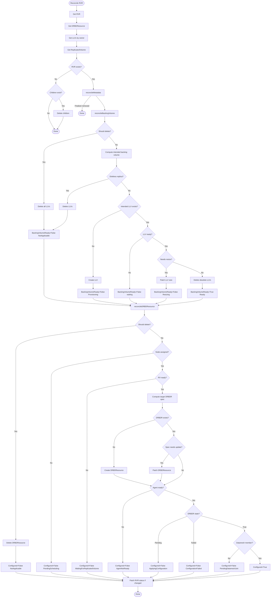
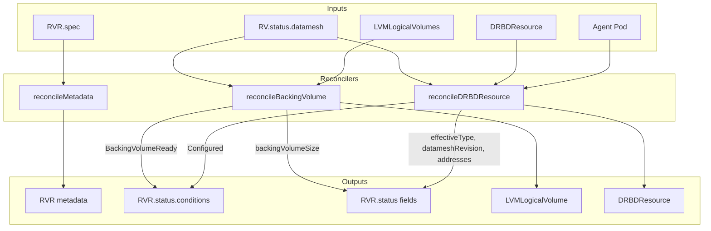

# rvr_controller

> **Note:** Core reconciliation logic (backing volume and DRBD resource lifecycle) is fully implemented.
> TODO items remaining are informational status fields only (attachment status, peers status, disk status, quorum status).

This controller manages `ReplicatedVolumeReplica` (RVR) resources by reconciling their backing volumes (LVMLogicalVolume) and DRBD resources.

## Purpose

The controller reconciles `ReplicatedVolumeReplica` with:

1. **Metadata management** — finalizers and labels on RVR and child resources
2. **Backing volume management** — creates, resizes, and deletes LVMLogicalVolume for diskful replicas
3. **DRBD resource management** — creates, configures, resizes, and deletes DRBDResource
4. **Conditions** — reports backing volume readiness (`BackingVolumeReady`) and DRBD configuration state (`Configured`)

## Interactions

| Direction | Resource/Controller | Relationship |
|-----------|---------------------|--------------|
| ← input | ReplicatedVolume | Reads datamesh configuration (size, membership, type transitions) |
| ← input | Pod (agent) | Checks agent readiness on target node before configuring DRBD |
| → manages | LVMLogicalVolume | Creates/resizes/deletes backing volumes |
| → manages | DRBDResource | Creates/configures/resizes/deletes DRBD resources |

## Algorithm

The controller reconciles individual RVRs:

```
shouldDelete = (RVR deleted) AND (only our finalizer remains)

if shouldDelete:
    delete children → remove finalizer → Done

if RVR exists:
    ensure metadata (finalizer + labels)

reconcile backing volume:
    if diskless or deleting → delete all LLVs
    else → ensure intended LLV exists and is ready

reconcile DRBD resource:
    if deleting → delete DRBDResource
    if node not assigned → Configured=False PendingScheduling
    if RV not ready → Configured=False WaitingForReplicatedVolume
    compute target DRBDR spec (type, size, peers)
    create or patch DRBDResource
    if agent not ready → Configured=False AgentNotReady
    if DRBDR pending → Configured=False ApplyingConfiguration
    if DRBDR failed → Configured=False ConfigurationFailed
    if not datamesh member → Configured=False PendingDatameshJoin
    else → Configured=True

patch status if changed
```

## Reconciliation Structure

```
Reconcile (root) [Pure orchestration]
├── getRVR
├── getDRBDR
├── getLLVs
├── getRV
├── reconcileMetadata [Target-state driven]
│   ├── isRVRMetadataInSync
│   ├── applyRVRMetadata (finalizer + labels)
│   └── patchRVR
├── reconcileBackingVolume [In-place reconciliation]
│   ├── rvrShouldNotExist check
│   ├── computeActualBackingVolume
│   ├── computeIntendedBackingVolume
│   ├── createLLV / patchLLV metadata / patchLLV resize
│   ├── reconcileLLVsDeletion (cleanup obsolete)
│   └── applyRVRBackingVolumeReadyCondTrue/False
├── reconcileDRBDResource [In-place reconciliation]
│   ├── rvrShouldNotExist → deleteDRBDR + applyRVRConfiguredCondFalse NotApplicable
│   ├── node not assigned → applyRVRConfiguredCondFalse PendingScheduling
│   ├── RV not ready → applyRVRConfiguredCondFalse WaitingForReplicatedVolume
│   ├── computeIntendedEffectiveType / computeTargetEffectiveType
│   ├── computeTargetDRBDRSpec (type, size, peers)
│   ├── createDRBDR / patchDRBDR
│   ├── applyRVRDatameshRevision / applyRVRDRBDResourceGeneration / applyRVREffectiveType
│   ├── getAgentReady → applyRVRConfiguredCondFalse AgentNotReady
│   ├── computeActualDRBDRConfigured → ApplyingConfiguration / ConfigurationFailed
│   ├── applyRVRAddresses
│   └── applyRVRConfiguredCondTrue Configured / applyRVRConfiguredCondFalse PendingDatameshJoin
├── ensureAttachmentStatus [TODO - informational]
├── ensurePeersStatus [TODO - informational]
├── ensureDiskStatus [TODO - informational]
├── ensureQuorumStatus [TODO - informational]
└── patchRVRStatus
```

## Algorithm Flow



## Conditions

### BackingVolumeReady

Indicates whether the backing volume (LVMLogicalVolume) is ready.

| Status | Reason | When |
|--------|--------|------|
| True | Ready | Backing volume exists and is ready |
| False | NotApplicable | Replica is diskless or being deleted |
| False | NotReady | Backing volume exists but not ready yet |
| False | PendingScheduling | Waiting for node or storage assignment |
| False | Provisioning | Creating new backing volume |
| False | ProvisioningFailed | Failed to create backing volume (validation error) |
| False | Reprovisioning | Creating new backing volume to replace existing one |
| False | ResizeFailed | Failed to resize backing volume (validation error) |
| False | Resizing | Resizing backing volume |
| False | WaitingForReplicatedVolume | Waiting for ReplicatedVolume to be ready |

### Configured

Indicates whether the replica's DRBD resource is configured.

| Status | Reason | When |
|--------|--------|------|
| True | Configured | DRBD resource is fully configured and replica is a datamesh member |
| False | AgentNotReady | Agent is not ready on the target node |
| False | ApplyingConfiguration | Waiting for agent to apply DRBD configuration |
| False | ConfigurationFailed | DRBD resource configuration failed |
| False | NotApplicable | Replica is being deleted |
| False | PendingDatameshJoin | DRBD preconfigured, waiting for datamesh membership |
| False | PendingScheduling | Waiting for node assignment |
| False | WaitingForReplicatedVolume | Waiting for ReplicatedVolume to be ready |

### Planned Conditions (TODO)

These informational conditions will be implemented to report observational status:

| Condition | Purpose |
|-----------|---------|
| Attached | Whether the replica is attached (primary) |
| FullyConnected | Whether the replica has established connections to all peers |
| DiskInSync | Whether the local disk is in sync with peers |
| Ready | Overall replica readiness for I/O (combines quorum and other states) |

## Status Fields

The controller manages the following status fields on RVR:

| Field | Description | Source |
|-------|-------------|--------|
| `backingVolumeSize` | Size of the backing LVM logical volume (Diskful only) | From target LLV spec |
| `effectiveType` | Current effective replica type (may differ from spec during transitions) | Computed from datamesh member state |
| `datameshRevision` | Datamesh revision this replica was configured for | From RV status |
| `drbdResourceGeneration` | Generation of the DRBDResource that was last applied | From DRBDR metadata |
| `addresses` | DRBD addresses assigned to this replica | From DRBDR status |

### Planned Status Fields (TODO)

| Field | Description |
|-------|-------------|
| `peers` | Peer connectivity information (name, type, attached, established networks, connectionState, diskState) |
| `quorumSummary` | Quorum state summary (quorum M/N, data quorum J/K) |
| `diskState` | Local disk state from DRBD |

## Backing Volume Management

The controller manages LVMLogicalVolume resources as backing storage for diskful replicas.

### When backing volume is needed

A backing volume is needed if **all** conditions are met:

1. **Replica type is Diskful** — diskless replicas do not need backing storage
2. **RVR is not being deleted** — no backing volume during deletion
3. **Configuration is complete** — nodeName and lvmVolumeGroupName are set

For replicas that are members of the datamesh:
- Type must be `Diskful` AND typeTransition must NOT be `ToDiskless`
- When transitioning to diskless, backing volume is removed first

### LLV naming

LVMLogicalVolume names are computed deterministically:

```
llvName = rvrName + "-" + fnv128(lvgName + thinPoolName)
```

For migration support: if an existing LLV is already referenced by DRBDResource on the same LVG/ThinPool, its name is reused.

### Size source

The backing volume size is taken from `rv.Status.Datamesh.Size` (after DRBD overhead adjustment), not directly from RV spec. This ensures consistency during resize operations when datamesh has not yet propagated the new size.

### Lifecycle

1. **Create**: When intended LLV does not exist, create it with ownerRef, finalizer, and labels
2. **Resize**: When LLV is ready but actual size < intended size, patch spec.size
3. **Delete**: Remove finalizer, then delete LLV

## Managed Metadata

| Type | Key | Managed On | Purpose |
|------|-----|------------|---------|
| Finalizer | `sds-replicated-volume.deckhouse.io/rvr-controller` | RVR | Prevent deletion while children exist |
| Finalizer | `sds-replicated-volume.deckhouse.io/rvr-controller` | LLV | Prevent premature deletion |
| Finalizer | `sds-replicated-volume.deckhouse.io/rvr-controller` | DRBDResource | Prevent premature deletion |
| Label | `sds-replicated-volume.deckhouse.io/replicated-volume` | RVR | Link to parent ReplicatedVolume |
| Label | `sds-replicated-volume.deckhouse.io/replicated-storage-class` | RVR | Link to ReplicatedStorageClass |
| Label | `sds-replicated-volume.deckhouse.io/lvm-volume-group` | RVR | Link to LVMVolumeGroup |
| Label | `sds-replicated-volume.deckhouse.io/replicated-volume` | LLV | Link to parent ReplicatedVolume |
| Label | `sds-replicated-volume.deckhouse.io/replicated-storage-class` | LLV | Link to ReplicatedStorageClass |
| OwnerRef | controller reference | LLV | Owner reference to RVR |
| OwnerRef | controller reference | DRBDResource | Owner reference to RVR |

## Watches

The controller watches five event sources:

| Resource | Events | Handler |
|----------|--------|---------|
| ReplicatedVolumeReplica | Generation changes, Finalizers changes | For() (primary) |
| LVMLogicalVolume | All fields (Status, Spec, Labels, Finalizers, OwnerRefs) | Owns() |
| DRBDResource | All fields | Owns() |
| ReplicatedVolume | DatameshRevision changes, ReplicatedStorageClassName changes | mapRVToRVRs |
| Pod (agent) | Ready condition changes, Create/Delete | mapAgentPodToRVRs |

### RVR Predicates

- Reacts to Generation change (spec changes)
- Reacts to Finalizers change
- Skips pure Status updates and Labels/Annotations changes

### LLV Predicates

Intentionally empty: we need to react to all LLV fields (Status, Spec, Labels, Finalizers, OwnerReferences).

### DRBDResource Predicates

Intentionally empty: we need to react to all DRBDResource fields.

### RV Predicates

- Reacts to DatameshRevision changes (covers Size, membership changes, type transitions)
- Reacts to Spec.ReplicatedStorageClassName changes (for labels)
- Does not react to Create/Delete (RVRs handle their own lifecycle)

### Agent Pod Predicates

- Filters to Pods in the agent namespace with label `app=agent`
- Reacts to Ready condition changes
- Reacts to Create/Delete events

## Indexes

| Index | Field | Purpose |
|-------|-------|---------|
| `IndexFieldLLVByRVROwner` | `metadata.ownerReferences.rvr` | List LVMLogicalVolumes owned by RVR |
| `IndexFieldRVRByReplicatedVolumeName` | `spec.replicatedVolumeName` | Map ReplicatedVolume events to RVRs |
| `IndexFieldRVRByNodeName` | `spec.nodeName` | Map agent Pod events to RVRs on the same node |
| `IndexFieldPodByNodeName` | `spec.nodeName` | Find agent Pod on a specific node |

## Data Flow


