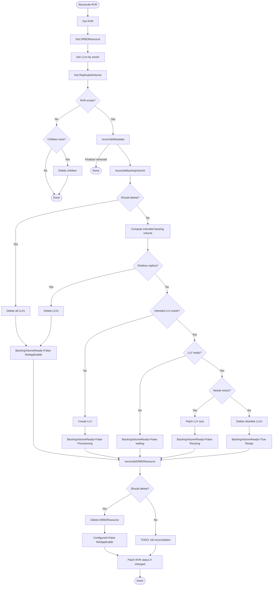
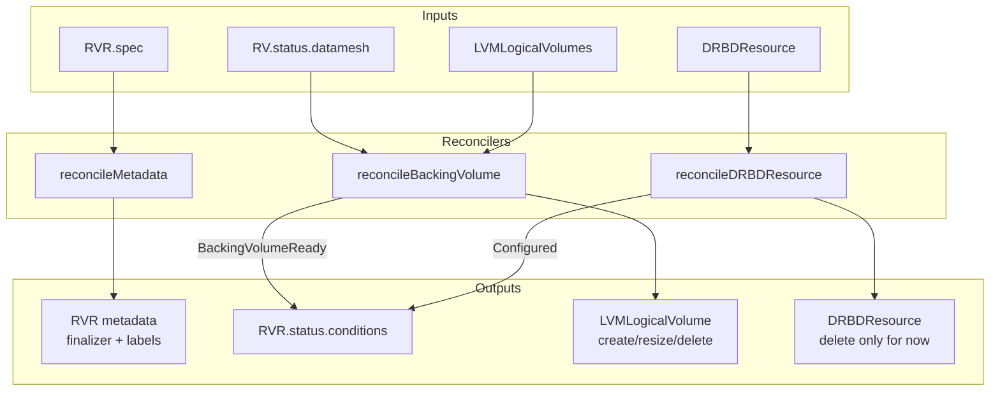

# rvr_controller

> **TODO: IMPORTANT!** DRBDResource reconciliation is not yet implemented.
> Currently only deletion of DRBDResource is supported.
> Full reconciliation (create, configure, resize) will be added in a future iteration.

This controller manages `ReplicatedVolumeReplica` (RVR) resources by reconciling their backing volumes (LVMLogicalVolume) and DRBD resources.

## Purpose

The controller reconciles `ReplicatedVolumeReplica` with:

1. **Metadata management** — finalizers and labels on RVR and child resources
2. **Backing volume management** — creates, resizes, and deletes LVMLogicalVolume for diskful replicas
3. **DRBD resource management** — manages DRBDResource lifecycle (deletion only for now)
4. **Conditions** — reports backing volume readiness and configuration state

## Interactions

| Direction | Resource/Controller | Relationship |
|-----------|---------------------|--------------|
| ← input | ReplicatedVolume | Reads datamesh configuration (size, membership, type transitions) |
| → manages | LVMLogicalVolume | Creates/updates/deletes backing volumes |
| → manages | DRBDResource | Manages DRBD resource (deletion only for now) |

## Algorithm

The controller reconciles individual RVRs:

```
shouldDelete = (RVR deleted) AND (only our finalizer remains)

if shouldDelete:
    delete children → remove finalizer → Done

if RVR exists:
    ensure metadata (finalizer + labels)

reconcile backing volume:
    if diskless or deleting → delete all LLVs
    else → ensure intended LLV exists and is ready

reconcile DRBD resource:
    if deleting → delete DRBDResource
    else → TODO (not implemented)

patch status if changed
```

## Reconciliation Structure

```
Reconcile (root) [Pure orchestration]
├── getRVR
├── getDRBDR
├── getLLVs
├── getRV
├── reconcileMetadata [Target-state driven]
│   ├── isRVRMetadataInSync
│   ├── applyRVRMetadata (finalizer + labels)
│   └── patchRVR
├── reconcileBackingVolume [In-place reconciliation]
│   ├── rvrShouldNotExist check
│   ├── computeActualBackingVolume
│   ├── computeIntendedBackingVolume
│   ├── createLLV / patchLLV metadata / patchLLV resize
│   ├── reconcileLLVsDeletion (cleanup obsolete)
│   └── applyRVRBackingVolumeReadyCondTrue/False
├── reconcileDRBDResource [In-place reconciliation]
│   ├── patchDRBDR (remove finalizer)
│   ├── deleteDRBDR
│   └── applyRVRConfiguredCondFalse
└── patchRVRStatus
```

## Algorithm Flow



## Conditions

### BackingVolumeReady

Indicates whether the backing volume (LVMLogicalVolume) is ready.

| Status | Reason | When |
|--------|--------|------|
| True | Ready | Backing volume exists and is ready |
| False | NotApplicable | Replica is diskless or being deleted |
| False | Provisioning | Creating new backing volume |
| False | Reprovisioning | Creating new backing volume to replace existing one |
| False | Resizing | Resizing backing volume |
| False | ProvisioningFailed | Failed to create backing volume (validation error) |
| False | ResizeFailed | Failed to resize backing volume (validation error) |
| False | NotReady | Backing volume exists but not ready yet |

### Configured

Indicates whether the replica's DRBD resource is configured.

| Status | Reason | When |
|--------|--------|------|
| False | NotApplicable | Replica is being deleted |

> **Note:** Additional reasons will be added when DRBDResource reconciliation is implemented.

## Backing Volume Management

The controller manages LVMLogicalVolume resources as backing storage for diskful replicas.

### When backing volume is needed

A backing volume is needed if **all** conditions are met:

1. **Replica type is Diskful** — diskless replicas do not need backing storage
2. **RVR is not being deleted** — no backing volume during deletion
3. **Configuration is complete** — nodeName and lvmVolumeGroupName are set

For replicas that are members of the datamesh:
- Type must be `Diskful` AND typeTransition must NOT be `ToDiskless`
- When transitioning to diskless, backing volume is removed first

### LLV naming

LVMLogicalVolume names are computed deterministically:

```
llvName = rvrName + "-" + fnv128(lvgName + thinPoolName)
```

For migration support: if an existing LLV is already referenced by DRBDResource on the same LVG/ThinPool, its name is reused.

### Size source

The backing volume size is taken from `rv.Status.Datamesh.Size` (after DRBD overhead adjustment), not directly from RV spec. This ensures consistency during resize operations when datamesh has not yet propagated the new size.

### Lifecycle

1. **Create**: When intended LLV does not exist, create it with ownerRef, finalizer, and labels
2. **Resize**: When LLV is ready but actual size < intended size, patch spec.size
3. **Delete**: Remove finalizer, then delete LLV

## Managed Metadata

| Type | Key | Managed On | Purpose |
|------|-----|------------|---------|
| Finalizer | `sds-replicated-volume.deckhouse.io/rvr-controller` | RVR | Prevent deletion while children exist |
| Finalizer | `sds-replicated-volume.deckhouse.io/rvr-controller` | LLV | Prevent premature deletion |
| Finalizer | `sds-replicated-volume.deckhouse.io/rvr-controller` | DRBDResource | Prevent premature deletion |
| Label | `sds-replicated-volume.deckhouse.io/replicated-volume` | RVR | Link to parent ReplicatedVolume |
| Label | `sds-replicated-volume.deckhouse.io/replicated-storage-class` | RVR | Link to ReplicatedStorageClass |
| Label | `sds-replicated-volume.deckhouse.io/lvm-volume-group` | RVR | Link to LVMVolumeGroup |
| Label | `sds-replicated-volume.deckhouse.io/replicated-volume` | LLV | Link to parent ReplicatedVolume |
| Label | `sds-replicated-volume.deckhouse.io/replicated-storage-class` | LLV | Link to ReplicatedStorageClass |
| OwnerRef | controller reference | LLV | Owner reference to RVR |

## Watches

The controller watches four event sources:

| Resource | Events | Handler |
|----------|--------|---------|
| ReplicatedVolumeReplica | Generation changes, Finalizers changes | For() (primary) |
| LVMLogicalVolume | All fields (Status, Spec, Labels, Finalizers, OwnerRefs) | Owns() |
| DRBDResource | All fields | Owns() |
| ReplicatedVolume | DatameshRevision changes, ReplicatedStorageClassName changes | mapRVToRVRs |

### RVR Predicates

- Reacts to Generation change (spec changes)
- Reacts to Finalizers change
- Skips pure Status updates and Labels/Annotations changes

### LLV Predicates

Intentionally empty: we need to react to all LLV fields (Status, Spec, Labels, Finalizers, OwnerReferences).

### DRBDResource Predicates

Intentionally empty: we need to react to all DRBDResource fields.

### RV Predicates

- Reacts to DatameshRevision changes (covers Size, membership changes, type transitions)
- Reacts to Spec.ReplicatedStorageClassName changes (for labels)
- Does not react to Create/Delete (RVRs handle their own lifecycle)

## Indexes

| Index | Field | Purpose |
|-------|-------|---------|
| `IndexFieldLLVByRVROwner` | `metadata.ownerReferences.rvr` | List LVMLogicalVolumes owned by RVR |
| `IndexFieldRVRByReplicatedVolumeName` | `spec.replicatedVolumeName` | Map ReplicatedVolume events to RVRs |

## Data Flow


