# rvr_controller

This controller manages `ReplicatedVolumeReplica` (RVR) resources by reconciling their backing volumes (LVMLogicalVolume) and DRBD resources.

## Purpose

The controller reconciles `ReplicatedVolumeReplica` with:

1. **Metadata management** — finalizers and labels on RVR and child resources
2. **Backing volume management** — creates, resizes, and deletes LVMLogicalVolume for diskful replicas
3. **DRBD resource management** — creates, configures, resizes, and deletes DRBDResource
4. **Conditions** — reports backing volume readiness (`BackingVolumeReady`) and DRBD configuration state (`DRBDConfigured`)

## Interactions

| Direction | Resource/Controller | Relationship |
|-----------|---------------------|--------------|
| ← input | ReplicatedVolume | Reads datamesh configuration (size, membership, type transitions) |
| ← input | ReplicatedStoragePool | Reads eligible nodes for eligibility verification |
| ← input | Pod (agent) | Checks agent readiness on target node before configuring DRBD |
| → manages | LVMLogicalVolume | Creates/resizes/deletes backing volumes |
| → manages | DRBDResource | Creates/configures/resizes/deletes DRBD resources |

## Algorithm

The controller reconciles individual RVRs:

```
shouldDelete = (RVR deleted) AND (only our finalizer remains)

if shouldDelete:
    delete children → remove finalizer → Done

if RVR exists:
    ensure metadata (finalizer + labels)

reconcile backing volume:
    if diskless or deleting → delete all LLVs
    else → ensure intended LLV exists and is ready

reconcile DRBD resource:
    if deleting → delete DRBDResource
    if node not assigned → DRBDConfigured=False PendingScheduling
    if RV not ready → DRBDConfigured=False WaitingForReplicatedVolume
    compute target DRBDR spec (type, size, peers)
    create or patch DRBDResource
    if agent not ready → DRBDConfigured=False AgentNotReady
    if DRBDR pending → DRBDConfigured=False ApplyingConfiguration
    if DRBDR failed → DRBDConfigured=False ConfigurationFailed
    if not datamesh member → DRBDConfigured=False PendingDatameshJoin
    else → DRBDConfigured=True

patch status if changed
```

## Reconciliation Structure

```
Reconcile (root) [Pure orchestration]
├── getRVR
├── getDRBDR
├── getLLVs
├── getRV
├── getRSPEligibilityView (RSP type, eligible node data)
├── reconcileMetadata [Target-state driven]
│   ├── isRVRMetadataInSync
│   ├── applyRVRMetadata (finalizer + labels)
│   └── patchRVR
├── reconcileBackingVolume [In-place reconciliation] ← details
│   ├── rvrShouldNotExist check
│   ├── computeActualBackingVolume
│   ├── computeIntendedBackingVolume
│   ├── createLLV / patchLLV metadata / patchLLV resize
│   ├── reconcileLLVsDeletion (cleanup obsolete)
│   └── applyBackingVolumeReadyCondTrue/False
├── reconcileDRBDResource [In-place reconciliation] ← details
│   ├── rvrShouldNotExist → deleteDRBDR + applyDRBDConfiguredCondFalse NotApplicable
│   ├── node not assigned → applyDRBDConfiguredCondFalse PendingScheduling
│   ├── RV/datamesh not ready → applyDRBDConfiguredCondFalse WaitingForReplicatedVolume
│   ├── computeIntendedType / computeTargetType / computeTargetDRBDRReconciliationCache
│   ├── createDRBDR (computeTargetDRBDRSpec) / patchDRBDR
│   ├── applyRVRDRBDRReconciliationCache
│   ├── getAgentReady → applyDRBDConfiguredCondFalse AgentNotReady
│   ├── check DRBDR DRBDConfigured condition → ApplyingConfiguration / ConfigurationFailed
│   ├── targetType != intendedType → applyDRBDConfiguredCondFalse WaitingForBackingVolume
│   └── applyDRBDConfiguredCondTrue Configured / applyDRBDConfiguredCondFalse PendingDatameshJoin
├── ensureStatusAddressesAndType ← details
│   └── updates rvr.Status.Addresses and rvr.Status.Type from DRBDR
├── ensureStatusAttachment ← details
│   └── applyRVRAttachment
├── ensureStatusPeers ← details
│   └── mirrors drbdr.Status.Peers to rvr.Status.Peers
├── ensureConditionAttached ← details
│   └── applyAttachedCond*
├── ensureConditionFullyConnected ← details
│   └── applyFullyConnectedCond*
├── ensureStatusBackingVolume ← details
├── ensureConditionBackingVolumeUpToDate ← details
│   ├── computeHasUpToDatePeer
│   ├── computeHasConnectedAttachedPeer
│   └── applyBackingVolumeUpToDateCond*
├── ensureStatusQuorum ← details
├── ensureConditionReady ← details
│   └── applyReadyCond*
├── ensureConditionSatisfyEligibleNodes [EnsureReconcileHelper] ← details
│   ├── computeEligibilityWarnings
│   ├── findLVGInEligibleNode / findLVGInEligibleNodeByName
│   └── applySatisfyEligibleNodesCond*
├── ensureStatusDatameshPendingTransitionAndConfiguredCond [EnsureReconcileHelper] ← details
│   ├── computeTargetDatameshPendingTransition
│   ├── rspEligibilityView.isStorageEligible (shared with computeIntendedBackingVolume)
│   ├── applyDatameshPendingTransition
│   └── applyConfiguredCond*
└── patchRVRStatus
```

Links to detailed algorithms: [`reconcileBackingVolume`](#reconcilebackingvolume-details), [`reconcileDRBDResource`](#reconciledrbdresource-details), [`ensureStatusAddressesAndType`](#ensurestatusaddressesandtype-details), [`ensureStatusAttachment`](#ensurestatusattachment-details), [`ensureStatusPeers`](#ensurestatuspeers-details), [`ensureConditionAttached`](#ensureconditionattached-details), [`ensureConditionFullyConnected`](#ensureconditionfullyconnected-details), [`ensureStatusBackingVolume`](#ensurestatusbackingvolume-details), [`ensureConditionBackingVolumeUpToDate`](#ensureconditionbackingvolumeinsync-details), [`ensureStatusQuorum`](#ensurestatusquorum-details), [`ensureConditionReady`](#ensureconditionready-details), [`ensureConditionSatisfyEligibleNodes`](#ensureconditionsatisfyeligiblenodes-details), [`ensureStatusDatameshPendingTransitionAndConfiguredCond`](#ensurestatusdatameshpendingandconfiguredcond-details)

## Algorithm Flow

High-level overview of reconciliation phases. See [Detailed Algorithms](#detailed-algorithms) for step-by-step breakdowns.

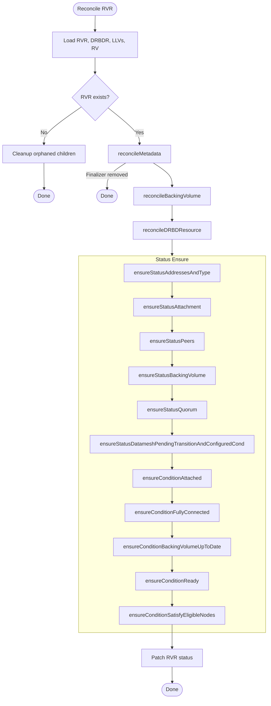

## Conditions

### Configured

Indicates whether the replica configuration matches the intended state from spec.

| Status | Reason | When |
|--------|--------|------|
| True | Configured | Replica is a datamesh member and actual configuration matches spec |
| False | PendingJoin | Waiting to join the datamesh |
| False | PendingLeave | Waiting to leave the datamesh (during deletion) |
| False | PendingRoleChange | Waiting to change role in the datamesh |
| False | PendingBackingVolumeChange | Waiting to change backing volume |
| False | PendingScheduling | Waiting for node or storage assignment |
| False | NodeNotEligible | Node is not in the eligible nodes list of the storage pool |
| False | StorageNotEligible | Intended storage (LVG/ThinPool) is not eligible on the node |
| Unknown | PendingConfiguration | Configuration data is not yet available (e.g., RSP not found) |
| (absent) | - | RVR is deleting and is no longer a datamesh member |

### BackingVolumeReady

Indicates whether the backing volume (LVMLogicalVolume) is ready.

| Status | Reason | When |
|--------|--------|------|
| True | Ready | Backing volume exists and is ready |
| False | NotApplicable | Replica is diskless or being deleted |
| False | NotReady | Backing volume exists but not ready yet |
| False | PendingScheduling | Waiting for node or storage assignment |
| False | Provisioning | Creating new backing volume |
| False | ProvisioningFailed | Failed to create backing volume (validation error) |
| False | Reprovisioning | Creating new backing volume to replace existing one |
| False | ResizeFailed | Failed to resize backing volume (validation error) |
| False | Resizing | Resizing backing volume |
| False | WaitingForReplicatedVolume | Waiting for ReplicatedVolume to be ready |

### DRBDConfigured

Indicates whether the replica's DRBD resource is configured.

| Status | Reason | When |
|--------|--------|------|
| True | Configured | DRBD resource is fully configured and replica is a datamesh member |
| False | AgentNotReady | Agent is not ready on the target node |
| False | ApplyingConfiguration | Waiting for agent to apply DRBD configuration |
| False | ConfigurationFailed | DRBD resource configuration failed |
| False | NotApplicable | Replica is being deleted |
| False | PendingDatameshJoin | DRBD preconfigured, waiting for datamesh membership |
| False | PendingScheduling | Waiting for node assignment |
| False | WaitingForBackingVolume | Waiting for backing volume (creating, resizing, or replacing) |
| False | WaitingForReplicatedVolume | Waiting for ReplicatedVolume to be ready |

### Attached

Indicates whether the replica is attached (primary) and ready for I/O.

| Status | Reason | When |
|--------|--------|------|
| True | Attached | Attached and ready for I/O |
| True | DetachmentFailed | Expected detached but still attached |
| False | AttachmentFailed | Expected attached but not attached |
| False | IOSuspended | Attached but I/O is suspended |
| Unknown | AgentNotReady | Agent is not ready |
| Unknown | ApplyingConfiguration | Configuration is being applied |
| (absent) | - | DRBDR does not exist or not relevant for attachment |

### BackingVolumeUpToDate

Indicates whether the local backing volume is in sync with peers.

| Status | Reason | When |
|--------|--------|------|
| True | UpToDate | Backing volume is fully up-to-date |
| False | Attaching | Backing volume is being attached |
| False | Detaching | Backing volume is being detached |
| False | Failed | Backing volume failed due to I/O errors |
| False | Absent | Backing volume is not present |
| False | Synchronizing | Backing volume is synchronizing |
| False | SynchronizationBlocked | Sync blocked awaiting peer |
| False | UnknownState | Unknown backing volume state |
| Unknown | AgentNotReady | Agent is not ready |
| Unknown | ApplyingConfiguration | Configuration is being applied |
| (absent) | - | Diskless replica or no DRBDR |

### FullyConnected

Indicates whether the replica has established connections to all peers.

| Status | Reason | When |
|--------|--------|------|
| True | FullyConnected | Fully connected to all peers on all paths |
| True | ConnectedToAllPeers | All peers connected but not all paths established |
| False | NoPeers | No peers configured |
| False | NotConnected | Not connected to any peer |
| False | PartiallyConnected | Connected to some but not all peers |
| Unknown | AgentNotReady | Agent is not ready |
| (absent) | - | No DRBDR exists or not applicable |

### Ready

Indicates overall replica readiness for I/O (based on quorum state).

| Status | Reason | When |
|--------|--------|------|
| True | Ready | Ready for I/O (quorum message) |
| False | Deleting | Replica is being deleted |
| False | QuorumLost | Quorum is lost (quorum message) |
| Unknown | AgentNotReady | Agent is not ready |
| Unknown | ApplyingConfiguration | Configuration is being applied |

### SatisfyEligibleNodes

Indicates whether the replica satisfies the eligible nodes requirements from its storage pool.

| Status | Reason | When |
|--------|--------|------|
| True | Satisfied | Replica satisfies eligible nodes requirements |
| False | NodeMismatch | Node is not in the eligible nodes list |
| False | LVMVolumeGroupMismatch | Node is eligible, but LVMVolumeGroup is not allowed for this node |
| False | ThinPoolMismatch | Node and LVMVolumeGroup are eligible, but ThinPool is not allowed |
| Unknown | PendingConfiguration | Configuration not yet available (RSP not found) |
| (absent) | - | Node not yet assigned |

### Configured

Indicates whether the replica is configured as intended within the datamesh. This condition is only set when the replica is a datamesh member (DatameshRevision != 0).

| Status | Reason | When |
|--------|--------|------|
| True | Configured | Replica is fully configured as a datamesh member matching spec |
| False | NodeNotEligible | Node is not in the eligible nodes list of the storage pool |
| False | PendingBackingVolumeChange | Replica is waiting to change its backing volume |
| False | PendingJoin | Replica is waiting to join the datamesh |
| False | PendingLeave | Replica is waiting to leave the datamesh (during deletion) |
| False | PendingRoleChange | Replica is waiting to change its role in the datamesh |
| False | PendingScheduling | Replica is waiting for node or storage assignment |
| False | StorageNotEligible | The intended storage (LVG/ThinPool) is not eligible on the node |
| Unknown | PendingConfiguration | Configuration data is not yet available (e.g., RSP not found) |
| (absent) | - | Replica is not a datamesh member |

## Status Fields

The controller manages the following status fields on RVR:

| Field | Description | Source |
|-------|-------------|--------|
| `addresses` | DRBD addresses assigned to this replica | From DRBDR status |
| `attachment` | Device attachment info (device path, I/O suspended) | From DRBDR status |
| `type` | Observed DRBD type (Diskful/Diskless) | From DRBDR status.activeConfiguration.type |
| `backingVolume` | Backing volume info (size, state, LVG name, thin pool) | From DRBDR + LLV status |
| `datameshPendingTransition` | Pending datamesh transitions (join/leave/role change/BV change) | Computed from spec vs status |
| `datameshRevision` | Datamesh revision for which the replica was fully configured | Set when DRBDConfigured=True |
| `drbd` | DRBD-specific status info (config, actual, status) | From RVR spec + DRBDR |
| `drbdrReconciliationCache` | Cache of target configuration that DRBDR spec was last applied for | Computed |
| `peers` | Peer connectivity status | Merged from datamesh + DRBDR |
| `quorum` | Whether this replica has quorum | From DRBDR status |
| `quorumSummary` | Detailed quorum info (voting peers, thresholds) | Computed from DRBDR + peers |

### Attachment

The `attachment` field is a nested struct with device attachment information. Only set when the replica is attached.

| Field | Description |
|-------|-------------|
| `devicePath` | Block device path (e.g., /dev/drbd10012) |
| `ioSuspended` | Whether I/O is suspended on the device |

### BackingVolume

The `backingVolume` field is a nested struct with information about the backing LVM logical volume. Only set for Diskful replicas.

| Field | Description |
|-------|-------------|
| `size` | Size of the backing LVM logical volume |
| `state` | Local backing volume state (UpToDate/Outdated/etc.) |
| `lvmVolumeGroupName` | Name of the LVM volume group |
| `lvmVolumeGroupThinPoolName` | Thin pool name (empty if thick provisioned) |

### DRBDRReconciliationCache

The `drbdrReconciliationCache` field caches the target configuration that DRBDR spec was last applied for. These fields are used to optimize controller operation by avoiding redundant computations and DRBDR spec updates. **Important**: these fields reflect the *target* revision, not the revision that DRBDR has actually transitioned to.

| Field | Description |
|-------|-------------|
| `datameshRevision` | Datamesh revision this replica was configured for |
| `drbdrGeneration` | Generation of the DRBDResource that was last targeted |
| `rvrType` | RVR type (Diskful/TieBreaker/Access) that was last targeted |

### PeerStatus

Each entry in `peers` contains:

| Field | Description |
|-------|-------------|
| `name` | Peer RVR name |
| `type` | Replica type (Diskful/TieBreaker/Access), empty if orphan |
| `attached` | Whether peer is attached (primary) |
| `connectionEstablishedOn` | System networks with established connection |
| `connectionState` | DRBD connection state |
| `backingVolumeState` | Peer's backing volume state |

### QuorumSummary

| Field | Description |
|-------|-------------|
| `connectedVotingPeers` | Count of connected voting peers |
| `quorum` | Quorum threshold |
| `connectedUpToDatePeers` | Count of connected UpToDate peers |
| `quorumMinimumRedundancy` | Minimum UpToDate nodes required |

### DatameshPendingTransition

The `datameshPendingTransition` field describes pending datamesh transition. Only set when there's a pending change.

| Field | Description |
|-------|-------------|
| `member` | `true` = pending join, `false` = pending leave, absent = role/BV change |
| `role` | Intended role (Diskful/Access/TieBreaker) when joining or changing role |
| `lvmVolumeGroupName` | LVG name for Diskful role |
| `thinPoolName` | Thin pool name (optional, for LVMThin) |

**Operation examples:**

| Operation | Fields |
|-----------|--------|
| Join as Diskful | `member: true, role: Diskful, lvmVolumeGroupName: "vg-1"` |
| Join as TieBreaker | `member: true, role: TieBreaker` |
| Leave datamesh | `member: false` |
| Change to Diskful | `role: Diskful, lvmVolumeGroupName: "vg-2"` |
| Change backing volume | `lvmVolumeGroupName: "vg-new"` |
| Configured (no pending) | `nil` |

## Backing Volume Management

The controller manages LVMLogicalVolume resources as backing storage for diskful replicas.

### When backing volume is needed

A backing volume is needed if **all** conditions are met:

1. **Replica type is Diskful** — diskless replicas do not need backing storage
2. **RVR is not being deleted** — no backing volume during deletion
3. **Configuration is complete** — nodeName and lvmVolumeGroupName are set

For replicas that are members of the datamesh:
- Type must be `Diskful` AND typeTransition must NOT be `ToDiskless`
- When transitioning to diskless, backing volume is removed first

### LLV naming

LVMLogicalVolume names are computed deterministically:

```
llvName = rvrName + "-" + fnv128(lvgName + thinPoolName)
```

For migration support: if an existing LLV is already referenced by DRBDResource on the same LVG/ThinPool, its name is reused.

### Size source

The backing volume size is taken from `rv.Status.Datamesh.Size` (after DRBD overhead adjustment), not directly from RV spec. This ensures consistency during resize operations when datamesh has not yet propagated the new size.

### Lifecycle

1. **Create**: When intended LLV does not exist, create it with ownerRef, finalizer, and labels
2. **Resize**: When LLV is ready but actual size < intended size, patch spec.size
3. **Delete**: Remove finalizer, then delete LLV

## Managed Metadata

| Type | Key | Managed On | Purpose |
|------|-----|------------|---------|
| Finalizer | `sds-replicated-volume.deckhouse.io/rvr-controller` | RVR | Prevent deletion while children exist |
| Finalizer | `sds-replicated-volume.deckhouse.io/rvr-controller` | LLV | Prevent premature deletion |
| Finalizer | `sds-replicated-volume.deckhouse.io/rvr-controller` | DRBDResource | Prevent premature deletion |
| Label | `sds-replicated-volume.deckhouse.io/replicated-volume` | RVR | Link to parent ReplicatedVolume |
| Label | `sds-replicated-volume.deckhouse.io/replicated-storage-class` | RVR | Link to ReplicatedStorageClass |
| Label | `sds-replicated-volume.deckhouse.io/lvm-volume-group` | RVR | Link to LVMVolumeGroup |
| Label | `sds-replicated-volume.deckhouse.io/replicated-volume` | LLV | Link to parent ReplicatedVolume |
| Label | `sds-replicated-volume.deckhouse.io/replicated-storage-class` | LLV | Link to ReplicatedStorageClass |
| OwnerRef | controller reference | LLV | Owner reference to RVR |
| OwnerRef | controller reference | DRBDResource | Owner reference to RVR |

## Watches

The controller watches six event sources:

| Resource | Events | Handler |
|----------|--------|---------|
| ReplicatedVolumeReplica | Generation changes, Finalizers changes | For() (primary) |
| LVMLogicalVolume | All fields (Status, Spec, Labels, Finalizers, OwnerRefs) | Owns() |
| DRBDResource | All fields | Owns() |
| ReplicatedVolume | DatameshRevision changes, ReplicatedStorageClassName changes | mapRVToRVRs |
| ReplicatedStoragePool | EligibleNodes changes (per-node) | rspEventHandler |
| Pod (agent) | Ready condition changes, Create/Delete | mapAgentPodToRVRs |

### RVR Predicates

- Reacts to Generation change (spec changes)
- Reacts to Finalizers change
- Skips pure Status updates and Labels/Annotations changes

### LLV Predicates

Intentionally empty: we need to react to all LLV fields (Status, Spec, Labels, Finalizers, OwnerReferences).

### DRBDResource Predicates

Intentionally empty: we need to react to all DRBDResource fields.

### RV Predicates

- Reacts to DatameshRevision changes (covers Size, membership changes, type transitions)
- Reacts to Spec.ReplicatedStorageClassName changes (for labels)
- Does not react to Create/Delete (RVRs handle their own lifecycle)

### RSP Predicates

- Reacts to eligibleNodes changes (compares old and new lists)
- On Create/Delete: always triggers
- On Update: triggers only if eligibleNodes differ

### RSP EventHandler

Custom EventHandler that computes changed nodes and enqueues only RVRs on those nodes:
- On Create: enqueues all RVRs on all eligible nodes
- On Update: computes nodes that were added/removed/modified, enqueues RVRs on those nodes
- On Delete: enqueues all RVRs that were on eligible nodes

Uses composite index to efficiently find RVRs by (replicatedVolumeName, nodeName).

### Agent Pod Predicates

- Filters to Pods in the agent namespace with label `app=agent`
- Reacts to Ready condition changes
- Reacts to Create/Delete events

## Indexes

| Index | Field | Purpose |
|-------|-------|---------|
| `IndexFieldLLVByRVROwner` | `metadata.ownerReferences.rvr` | List LVMLogicalVolumes owned by RVR |
| `IndexFieldRVRByReplicatedVolumeName` | `spec.replicatedVolumeName` | Map ReplicatedVolume events to RVRs |
| `IndexFieldRVRByNodeName` | `spec.nodeName` | Map agent Pod events to RVRs on the same node |
| `IndexFieldRVRByRVAndNode` | `spec.replicatedVolumeName+nodeName` | Find RVR by RV and node (composite) |
| `IndexFieldRVByStoragePoolName` | `status.configuration.storagePoolName` | Find RVs using a specific RSP |
| `IndexFieldPodByNodeName` | `spec.nodeName` | Find agent Pod on a specific node |

## Data Flow

```mermaid
flowchart TD
    subgraph inputs [Inputs]
        RVRSpec[RVR.spec]
        RVStatus[RV.status.datamesh]
        LLVs[LVMLogicalVolumes]
        DRBDR[DRBDResource]
        AgentPod[Agent Pod]
        RSP[ReplicatedStoragePool]
    end

    subgraph reconcilers [Reconcilers]
        ReconcileMeta[reconcileMetadata]
        ReconcileBV[reconcileBackingVolume]
        ReconcileDRBD[reconcileDRBDResource]
    end

    subgraph statusEnsure [Status Ensure]
        EnsureStatusAddrType[ensureStatusAddressesAndType]
        EnsureStatusAttach[ensureStatusAttachment]
        EnsureStatusPeers[ensureStatusPeers]
        EnsureBVStatus[ensureStatusBackingVolume]
        EnsureStatusQuorum[ensureStatusQuorum]
        EnsureDmPendingAndCond[ensureStatusDatameshPendingTransitionAndConfiguredCond]
        EnsureCondAttach[ensureConditionAttached]
        EnsureCondFC[ensureConditionFullyConnected]
        EnsureBVInSync[ensureConditionBackingVolumeUpToDate]
        EnsureCondReady[ensureConditionReady]
        EnsureCondSEN[ensureConditionSatisfyEligibleNodes]
    end

    subgraph outputs [Outputs]
        RVRMeta[RVR metadata]
        RVRStatusConds[RVR.status.conditions]
        RVRStatusFields[RVR.status fields]
        LLVManaged[LVMLogicalVolume]
        DRBDRManaged[DRBDResource]
    end

    RVRSpec --> ReconcileMeta
    RVStatus --> ReconcileBV
    RVStatus --> ReconcileDRBD
    LLVs --> ReconcileBV
    DRBDR --> ReconcileDRBD
    AgentPod --> ReconcileDRBD
    RSP --> ReconcileBV
    RSP --> EnsureCondSEN

    ReconcileMeta --> RVRMeta
    ReconcileBV --> LLVManaged
    ReconcileBV -->|BackingVolumeReady| RVRStatusConds
    ReconcileDRBD --> DRBDRManaged
    ReconcileDRBD -->|DRBDConfigured| RVRStatusConds
    ReconcileDRBD -->|drbdrReconciliationCache| RVRStatusFields

    DRBDR --> EnsureStatusAddrType
    DRBDR --> EnsureStatusAttach
    DRBDR --> EnsureStatusPeers
    DRBDR --> EnsureBVStatus
    DRBDR --> EnsureStatusQuorum
    DRBDR --> EnsureCondAttach
    DRBDR --> EnsureCondFC
    DRBDR --> EnsureBVInSync
    DRBDR --> EnsureCondReady
    LLVs --> EnsureBVStatus

    EnsureStatusAddrType -->|addresses, type| RVRStatusFields
    EnsureStatusAttach -->|attachment| RVRStatusFields
    EnsureStatusPeers -->|peers| RVRStatusFields
    EnsureBVStatus -->|backingVolume| RVRStatusFields
    EnsureStatusQuorum -->|quorum, quorumSummary| RVRStatusFields
    EnsureCondAttach -->|Attached| RVRStatusConds
    EnsureCondFC -->|FullyConnected| RVRStatusConds
    EnsureBVInSync -->|BackingVolumeUpToDate| RVRStatusConds
    EnsureCondReady -->|Ready| RVRStatusConds
    EnsureCondSEN -->|SatisfyEligibleNodes| RVRStatusConds
    EnsureDmPendingAndCond -->|datameshPendingTransition| RVRStatusFields
    EnsureDmPendingAndCond -->|Configured| RVRStatusConds
    RSP --> EnsureDmPendingAndCond
```

---

## Detailed Algorithms

### reconcileBackingVolume Details

**Purpose**: Manages LVMLogicalVolume (LLV) lifecycle for diskful replicas — creation, resize, and deletion.

**Algorithm**:

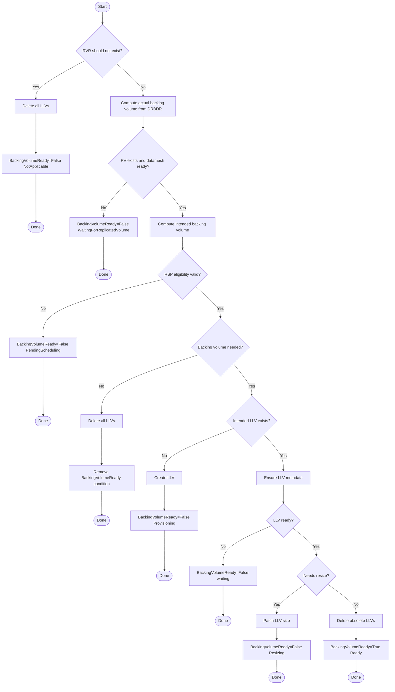

**Data Flow**:

| Input | Description |
|-------|-------------|
| `rvr.Spec` | Node name, LVG name, thin pool name, replica type |
| `rv.Status.Datamesh` | Target size (after DRBD overhead adjustment), membership state |
| `drbdr.Spec.LVMLogicalVolumeName` | Currently referenced LLV (actual state) |
| `llvs[]` | List of LLVs owned by this RVR |
| `rspView` | RSP eligibility view (node eligibility, RSP type, LVG list) |

| Output | Description |
|--------|-------------|
| `LVMLogicalVolume` | Created/patched/deleted backing volume |
| `BackingVolumeReady` condition | Reports LLV lifecycle state |
| `targetBV`, `intendedBV` | Backing volume pointers for reconcileDRBDResource |

---

### reconcileDRBDResource Details

**Purpose**: Manages DRBDResource lifecycle — creation, configuration, resize, and deletion. Coordinates with agent for DRBD configuration.

**Algorithm**:

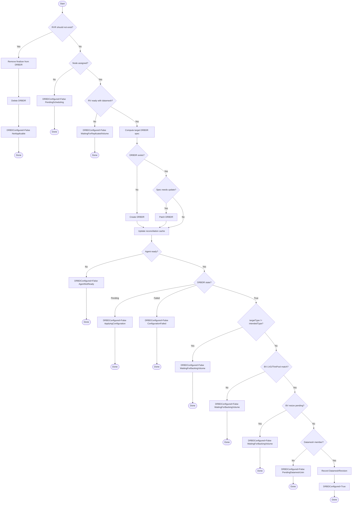

**Data Flow**:

| Input | Description |
|-------|-------------|
| `rvr.Spec` | Node name, replica type, LVG/thin pool for diskful |
| `rv.Status.Datamesh` | System networks, members, size, type transitions |
| `targetBV`, `intendedBV` | Backing volume pointers from reconcileBackingVolume |
| `agent Pod` | Agent readiness on target node |

| Output | Description |
|--------|-------------|
| `DRBDResource` | Created/patched/deleted DRBD resource |
| `DRBDConfigured` condition | Reports DRBD configuration state |
| `status.datameshRevision` | Datamesh revision for which replica was fully configured |
| `status.drbdrReconciliationCache` | Cache of target configuration (datameshRevision, drbdrGeneration, rvrType) |

---

### ensureConditionSatisfyEligibleNodes Details

**Purpose**: Verifies that the replica's node, LVMVolumeGroup, and ThinPool satisfy the eligible nodes requirements from the ReplicatedStoragePool. This is a non-I/O EnsureReconcileHelper that receives pre-fetched RSP eligibility data.

**Algorithm**:

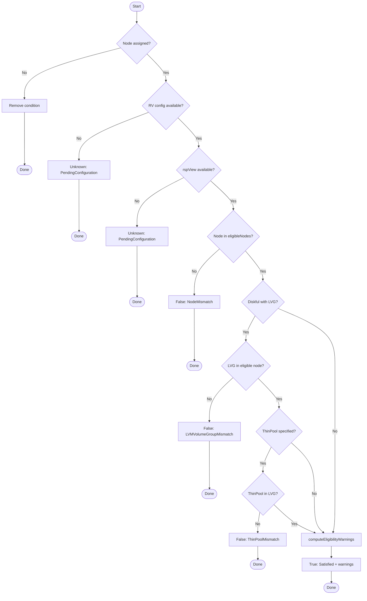

**Data Flow**:

| Input | Description |
|-------|-------------|
| `rvr.Spec` | Node name, LVG name, thin pool name, replica type |
| `rv` | ReplicatedVolume (for configuration availability check) |
| `rspView` | Pre-fetched RSP eligibility view (from Reconcile via getRSPEligibilityView) |

| Output | Description |
|--------|-------------|
| `SatisfyEligibleNodes` condition | Reports eligibility verification result |

---

### ensureStatusAddressesAndType Details

**Purpose**: Updates the `status.addresses` and `status.type` fields from DRBDR status.

**Algorithm**:

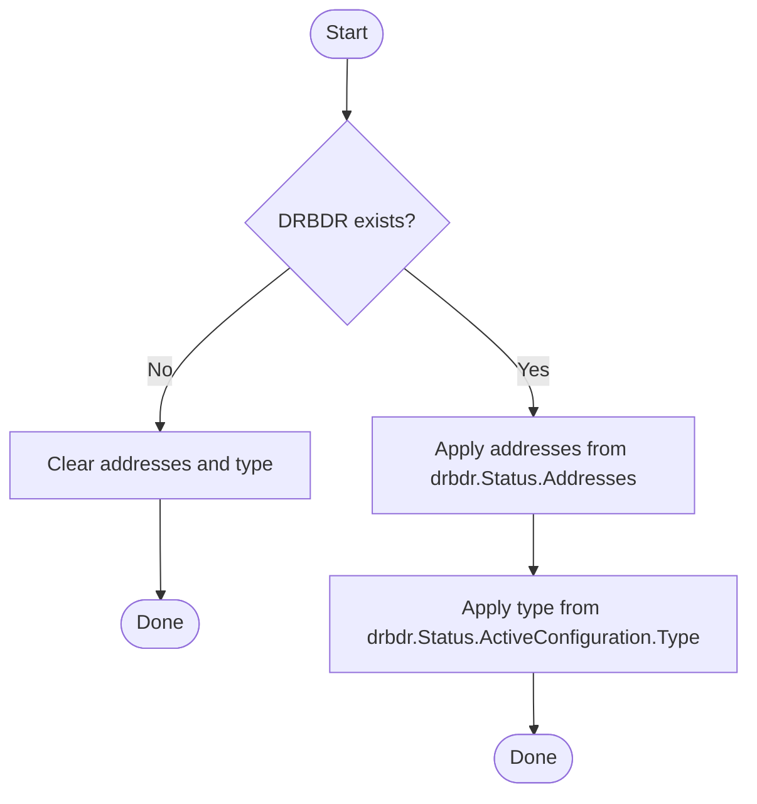

**Data Flow**:

| Input | Description |
|-------|-------------|
| `drbdr.Status.Addresses` | DRBD addresses assigned to this replica |
| `drbdr.Status.ActiveConfiguration.Type` | Observed DRBD type (Diskful/Diskless) |

| Output | Description |
|--------|-------------|
| `status.addresses` | DRBD addresses (cloned from DRBDR) |
| `status.type` | Observed DRBD type (Access/TieBreaker appear as Diskless) |

---

### ensureStatusAttachment Details

**Purpose**: Updates the `status.attachment` field with device path and I/O suspension status.

**Algorithm**:

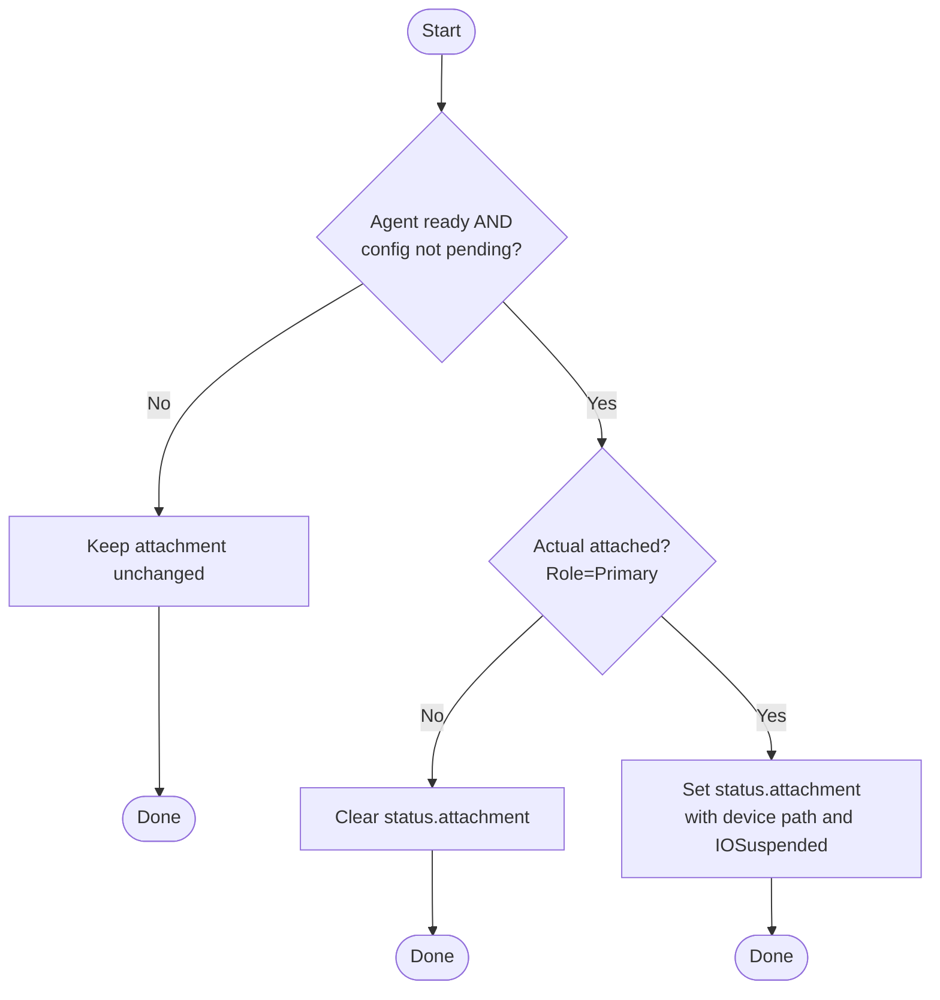

**Data Flow**:

| Input | Description |
|-------|-------------|
| `drbdr.Status.ActiveConfiguration.Role` | Actual attachment state |
| `drbdr.Status.Device` | Device path when attached |
| `drbdr.Status.DeviceIOSuspended` | I/O suspension flag |

| Output | Description |
|--------|-------------|
| `status.attachment.devicePath` | Block device path |
| `status.attachment.ioSuspended` | I/O suspension status |

---

### ensureConditionAttached Details

**Purpose**: Reports whether the replica is attached (primary) and ready for I/O.

**Algorithm**:

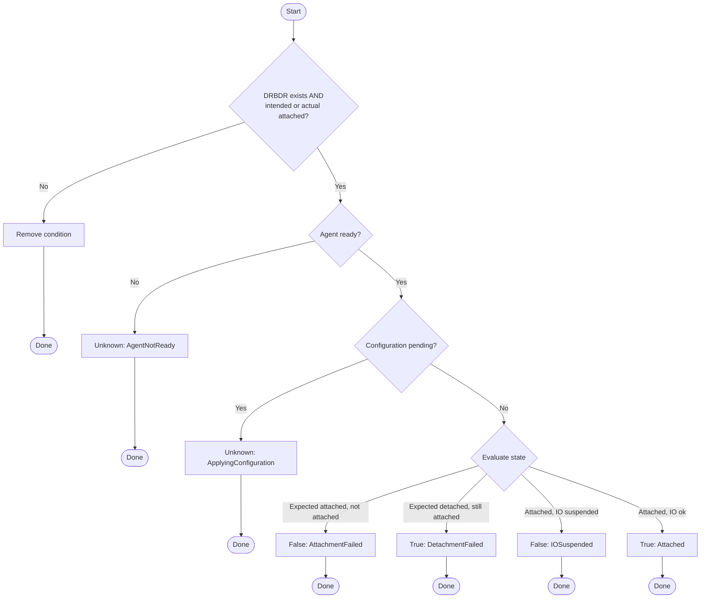

**Data Flow**:

| Input | Description |
|-------|-------------|
| `drbdr.Status.ActiveConfiguration.Role` | Actual attachment state |
| `datameshMember.Attached` | Intended attachment state |
| `drbdr.Status.DeviceIOSuspended` | I/O suspension flag |

| Output | Description |
|--------|-------------|
| `Attached` condition | Reports attachment state |

---

### ensureStatusPeers Details

**Purpose**: Mirrors DRBDR peer status to RVR status. Populates `rvr.Status.Peers` directly from `drbdr.Status.Peers`.

**Algorithm**:

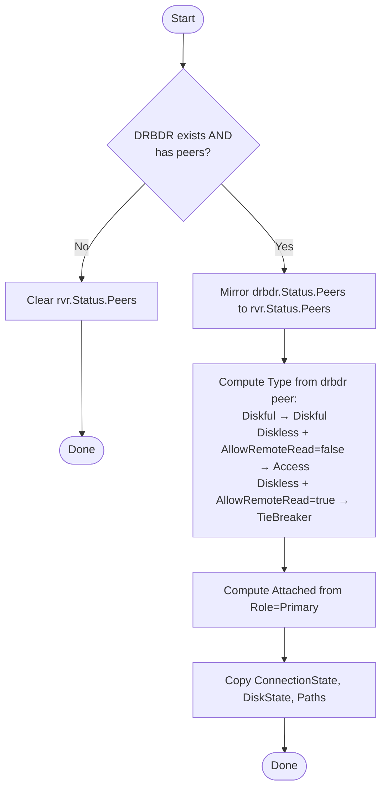

**Data Flow**:

| Input | Description |
|-------|-------------|
| `drbdr.Status.Peers` | Peer status from DRBD |

| Output | Description |
|--------|-------------|
| `status.peers[]` | Mirrored peer status list |

---

### ensureConditionFullyConnected Details

**Purpose**: Reports peer connectivity status via the `FullyConnected` condition. Uses `rvr.Status.Addresses` to determine expected system networks.

**Algorithm**:

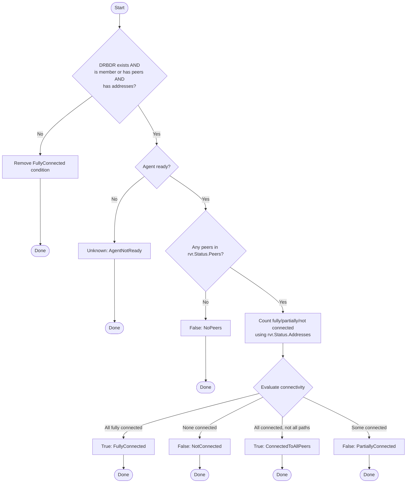

**Data Flow**:

| Input | Description |
|-------|-------------|
| `rvr.Status.Peers` | Peer status (from ensureStatusPeers) |
| `rvr.Status.Addresses` | Expected system network names |
| `datamesh` | Datamesh membership check |

| Output | Description |
|--------|-------------|
| `FullyConnected` condition | Reports peer connectivity |

---

### ensureStatusBackingVolume Details

**Purpose**: Populates the `rvr.Status.BackingVolume` struct fields (size, state, LVM volume group info) from DRBDR and LLV status.

**Algorithm**:

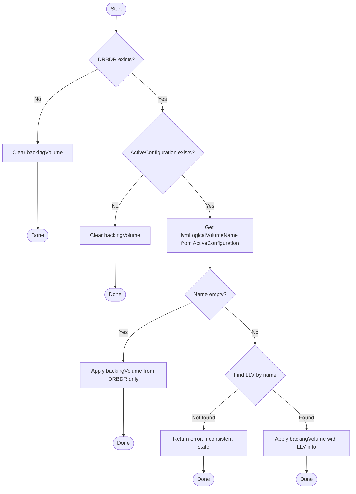

**Data Flow**:

| Input | Description |
|-------|-------------|
| `drbdr.Status.DiskState` | Local backing volume state from DRBD |
| `drbdr.Status.ActiveConfiguration.LVMLogicalVolumeName` | Name of the backing LLV |
| `llvs` | List of LVMLogicalVolumes on this node |
| `llv.Status.ActualSize` | Actual size of the backing LLV |

| Output | Description |
|--------|-------------|
| `status.backingVolume.size` | Size of the backing LVM logical volume |
| `status.backingVolume.state` | Local backing volume state (UpToDate/Outdated/etc.) |
| `status.backingVolume.lvmVolumeGroupName` | LVG name |
| `status.backingVolume.lvmVolumeGroupThinPoolName` | Thin pool name (if applicable) |

---

### ensureConditionBackingVolumeUpToDate Details

**Purpose**: Reports local backing volume synchronization state for diskful replicas via the `BackingVolumeUpToDate` condition.

**Algorithm**:

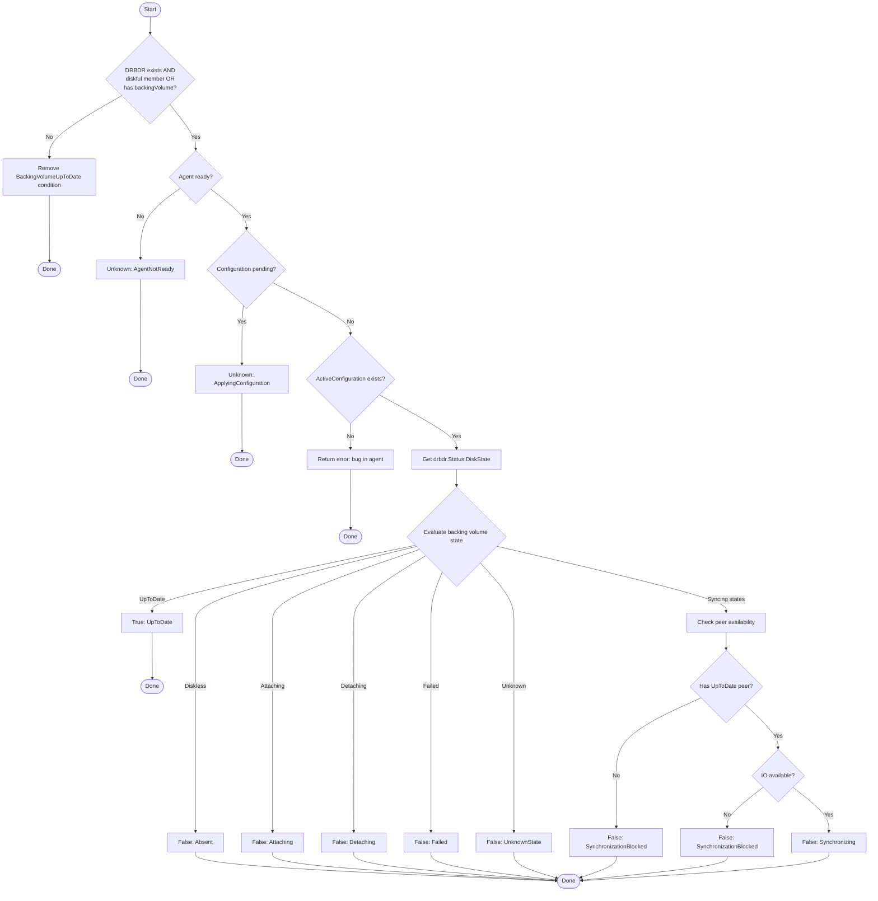

**Data Flow**:

| Input | Description |
|-------|-------------|
| `drbdr.Status.DiskState` | Local backing volume state from DRBD |
| `drbdr.Status.ActiveConfiguration.Role` | Local attachment state |
| `rvr.Status.Peers` | Peer states for sync availability check |
| `rvr.Status.BackingVolume` | Current backing volume info (for relevance check) |
| `datameshMember` | Whether this replica is a datamesh member |

| Output | Description |
|--------|-------------|
| `BackingVolumeUpToDate` condition | Reports backing volume sync state |

---

### ensureStatusQuorum Details

**Purpose**: Populates the `rvr.Status.Quorum` and `rvr.Status.QuorumSummary` fields from DRBDR state.

**Algorithm**:

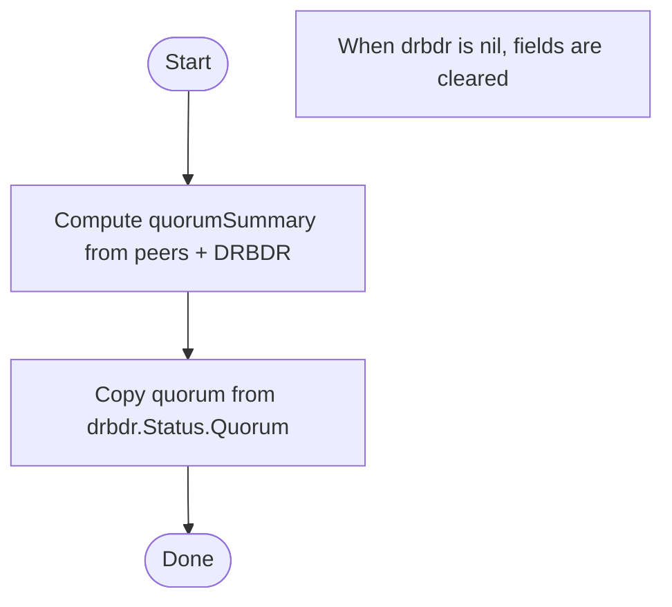

**Data Flow**:

| Input | Description |
|-------|-------------|
| `drbdr.Status.Quorum` | Quorum flag from DRBD (nil clears the field) |
| `drbdr.Status.ActiveConfiguration` | Quorum and QMR thresholds |
| `rvr.Status.Peers` | Peer states for voting/UpToDate counts |

| Output | Description |
|--------|-------------|
| `status.quorum` | Quorum flag |
| `status.quorumSummary` | Detailed quorum info |

---

### ensureConditionReady Details

**Purpose**: Reports overall replica readiness via the `Ready` condition.

**Algorithm**:

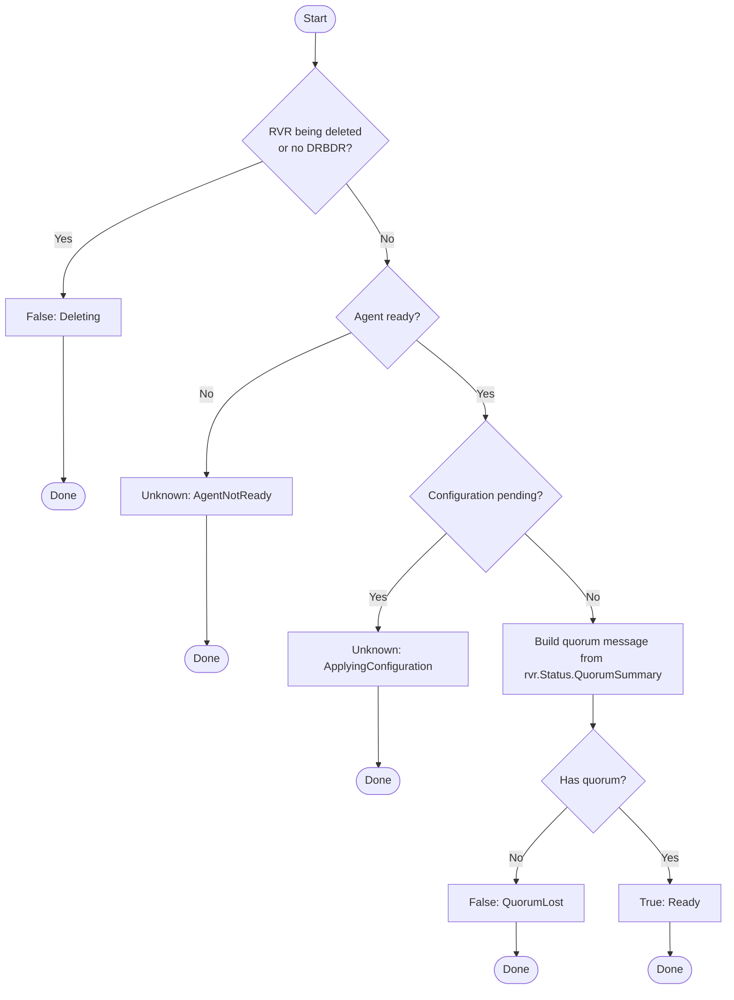

**Data Flow**:

| Input | Description |
|-------|-------------|
| `drbdr.Status.Quorum` | Quorum flag from DRBD |
| `rvr.Status.QuorumSummary` | Quorum summary for message building |

| Output | Description |
|--------|-------------|
| `Ready` condition | Reports overall readiness |

---

### ensureStatusDatameshPendingTransitionAndConfiguredCond Details

**Purpose**: Populates both `rvr.Status.DatameshPendingTransition` field and the `Configured` condition based on comparison of `rvr.Spec` (intended) vs `rvr.Status` (actual) and eligibility checks.

This function combines two logically related status updates to avoid duplicate `computeTargetDatameshPendingTransition` calls.

**RV Message Enrichment**: When a pending transition exists (`target != nil`) and the parent `ReplicatedVolume` has a matching entry in `rv.Status.DatameshPendingReplicaTransitions` for this replica, the message from that entry is appended to the condition message with a `"; "` separator. This allows the RV controller to provide additional context about the overall datamesh transition progress.

**Algorithm (computeTargetDatameshPendingTransition)**:

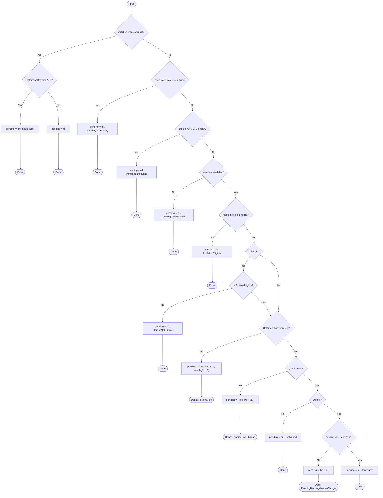

**Algorithm (Configured condition application)**:

The `Configured` condition is set based on the `condReason` returned from `computeTargetDatameshPendingTransition`:

- If `condReason` is empty → remove condition (non-member being deleted)
- If `condReason` is `Configured` → set `True`
- If `condReason` is `PendingConfiguration` → set `Unknown`
- Otherwise → set `False` with the reason

**Data Flow**:

| Input | Description |
|-------|-------------|
| `rvr.Spec` | Intended state (nodeName, type, lvmVolumeGroupName, thinPoolName) |
| `rvr.Status.DatameshRevision` | Whether replica is a datamesh member (!=0 means member) |
| `rvr.Status.Type` | Actual DRBD type (Diskful/Diskless) |
| `rvr.Status.BackingVolume` | Actual backing volume info |
| `rv` | Parent ReplicatedVolume (optional, used for message enrichment) |
| `rv.Status.DatameshPendingReplicaTransitions` | RV-level pending transitions with messages |
| `rspView` | RSP eligibility view (node eligibility, LVG list) |

| Output | Description |
|--------|-------------|
| `status.datameshPendingTransition` | Pending operation (nil if none) |
| `Configured` condition | Reports whether config matches intent (message may include RV context) |
