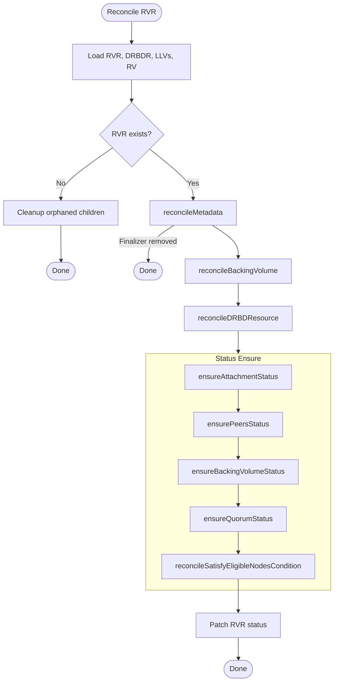
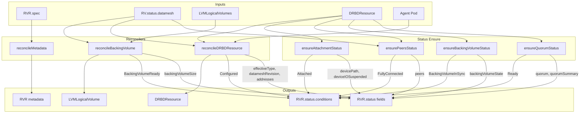
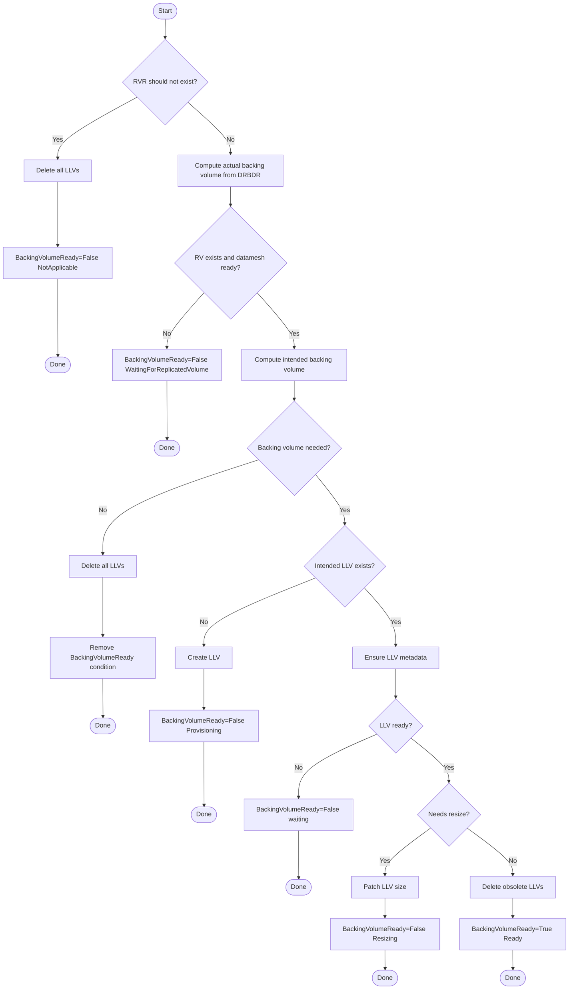
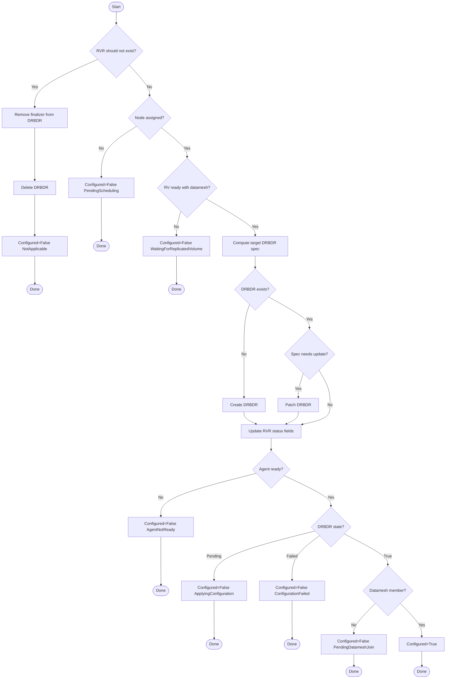
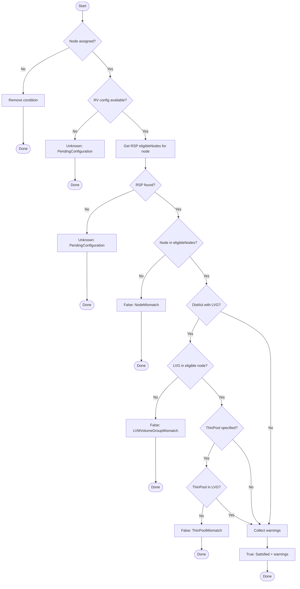
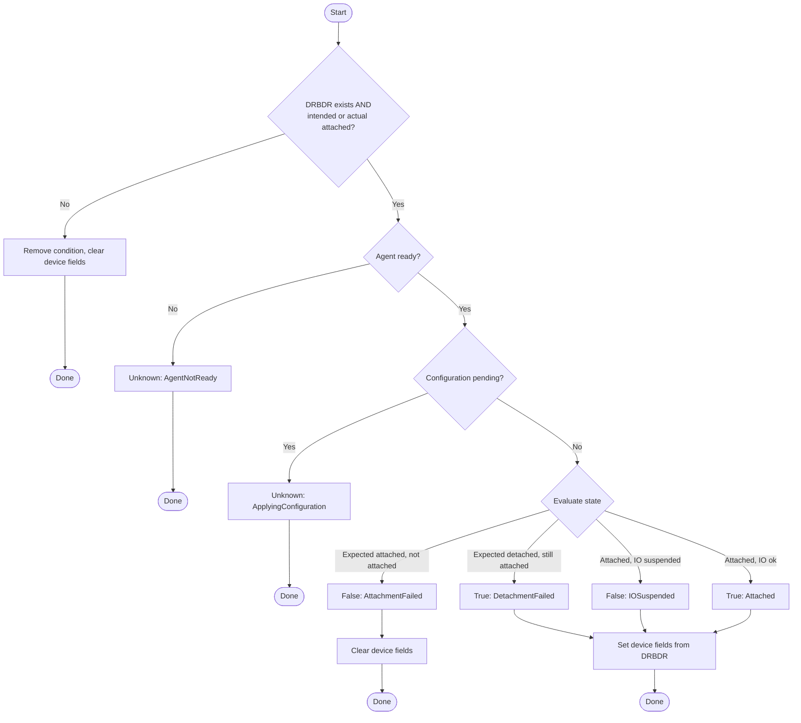
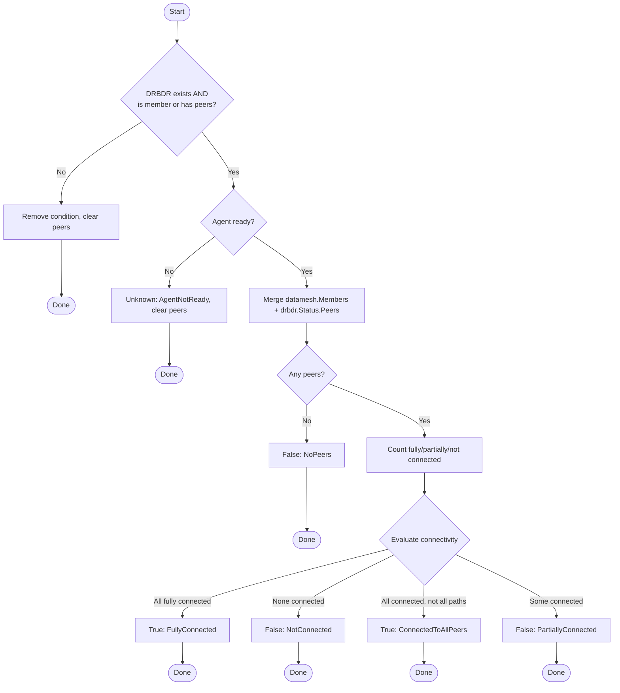
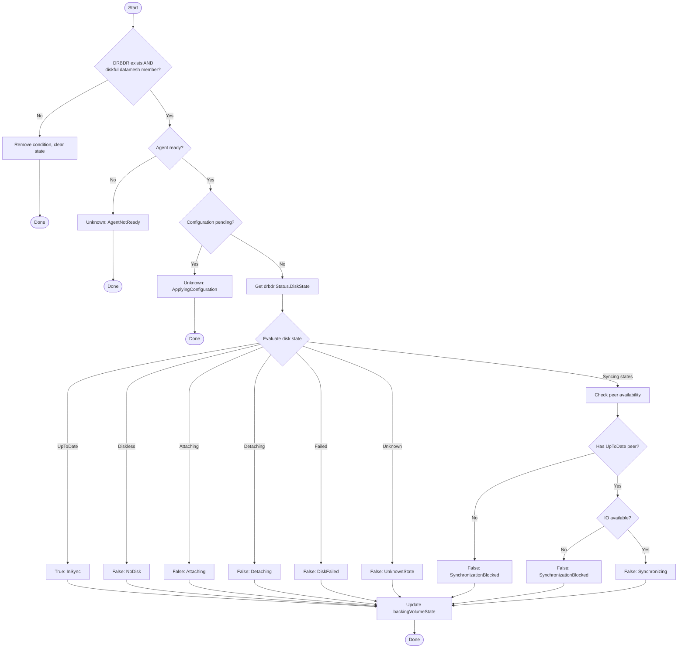
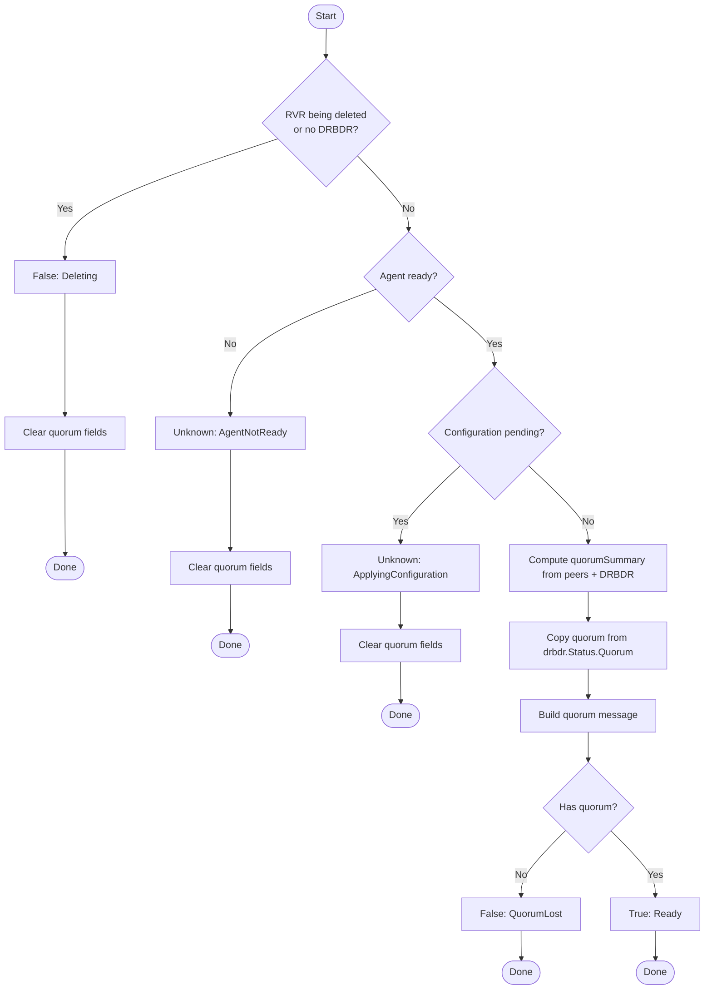

# rvr_controller

This controller manages `ReplicatedVolumeReplica` (RVR) resources by reconciling their backing volumes (LVMLogicalVolume) and DRBD resources.

## Purpose

The controller reconciles `ReplicatedVolumeReplica` with:

1. **Metadata management** — finalizers and labels on RVR and child resources
2. **Backing volume management** — creates, resizes, and deletes LVMLogicalVolume for diskful replicas
3. **DRBD resource management** — creates, configures, resizes, and deletes DRBDResource
4. **Conditions** — reports backing volume readiness (`BackingVolumeReady`) and DRBD configuration state (`Configured`)

## Interactions

| Direction | Resource/Controller | Relationship |
|-----------|---------------------|--------------|
| ← input | ReplicatedVolume | Reads datamesh configuration (size, membership, type transitions) |
| ← input | ReplicatedStoragePool | Reads eligible nodes for eligibility verification |
| ← input | Pod (agent) | Checks agent readiness on target node before configuring DRBD |
| → manages | LVMLogicalVolume | Creates/resizes/deletes backing volumes |
| → manages | DRBDResource | Creates/configures/resizes/deletes DRBD resources |

## Algorithm

The controller reconciles individual RVRs:

```
shouldDelete = (RVR deleted) AND (only our finalizer remains)

if shouldDelete:
    delete children → remove finalizer → Done

if RVR exists:
    ensure metadata (finalizer + labels)

reconcile backing volume:
    if diskless or deleting → delete all LLVs
    else → ensure intended LLV exists and is ready

reconcile DRBD resource:
    if deleting → delete DRBDResource
    if node not assigned → Configured=False PendingScheduling
    if RV not ready → Configured=False WaitingForReplicatedVolume
    compute target DRBDR spec (type, size, peers)
    create or patch DRBDResource
    if agent not ready → Configured=False AgentNotReady
    if DRBDR pending → Configured=False ApplyingConfiguration
    if DRBDR failed → Configured=False ConfigurationFailed
    if not datamesh member → Configured=False PendingDatameshJoin
    else → Configured=True

patch status if changed
```

## Reconciliation Structure

```
Reconcile (root) [Pure orchestration]
├── getRVR
├── getDRBDR
├── getLLVs
├── getRV
├── reconcileMetadata [Target-state driven]
│   ├── isRVRMetadataInSync
│   ├── applyRVRMetadata (finalizer + labels)
│   └── patchRVR
├── reconcileBackingVolume [In-place reconciliation] ← details
│   ├── rvrShouldNotExist check
│   ├── computeActualBackingVolume
│   ├── computeIntendedBackingVolume
│   ├── createLLV / patchLLV metadata / patchLLV resize
│   ├── reconcileLLVsDeletion (cleanup obsolete)
│   └── applyRVRBackingVolumeReadyCondTrue/False
├── reconcileDRBDResource [In-place reconciliation] ← details
│   ├── rvrShouldNotExist → deleteDRBDR + applyRVRConfiguredCondFalse NotApplicable
│   ├── node not assigned → applyRVRConfiguredCondFalse PendingScheduling
│   ├── RV/datamesh not ready → applyRVRConfiguredCondFalse WaitingForReplicatedVolume
│   ├── computeIntendedType / computeTargetType / computeTargetDRBDRReconciliationCache
│   ├── createDRBDR (computeTargetDRBDRSpec) / patchDRBDR
│   ├── applyRVRDRBDRReconciliationCache
│   ├── getAgentReady → applyRVRConfiguredCondFalse AgentNotReady
│   ├── computeActualDRBDRConfigured → ApplyingConfiguration / ConfigurationFailed
│   ├── applyRVRAddresses
│   └── applyRVRConfiguredCondTrue Configured / applyRVRConfiguredCondFalse PendingDatameshJoin
├── ensureAttachmentStatus ← details
│   ├── computeIntendedType
│   ├── applyRVRAttachedCond*
│   ├── applyRVRDevicePath
│   └── applyRVRDeviceIOSuspended
├── ensurePeersStatus ← details
│   ├── ensureRVRStatusPeers (O(m+n) merge)
│   └── applyRVRFullyConnectedCond*
├── ensureBackingVolumeStatus ← details
│   ├── computeHasUpToDatePeer
│   ├── computeHasConnectedAttachedPeer
│   ├── applyRVRBackingVolumeInSyncCond*
│   └── applyRVRBackingVolumeState
├── ensureQuorumStatus ← details
│   ├── ensureRVRStatusQuorumSummary
│   ├── applyRVRStatusQuorum
│   └── applyRVRReadyCond*
├── reconcileSatisfyEligibleNodesCondition [In-place reconciliation] ← details
│   ├── getNodeEligibility (from RSP)
│   └── applySatisfyEligibleNodesCond*
└── patchRVRStatus
```

Links to detailed algorithms: [`reconcileBackingVolume`](#reconcilebackingvolume-details), [`reconcileDRBDResource`](#reconciledrbdresource-details), [`ensureAttachmentStatus`](#ensureattachmentstatus-details), [`ensurePeersStatus`](#ensurepeersstatus-details), [`ensureBackingVolumeStatus`](#ensurebackingvolumestatus-details), [`ensureQuorumStatus`](#ensurequorumstatus-details), [`reconcileSatisfyEligibleNodesCondition`](#reconcilesatisfyeligiblenodescondition-details)

## Algorithm Flow

High-level overview of reconciliation phases. See [Detailed Algorithms](#detailed-algorithms) for step-by-step breakdowns.



## Conditions

### BackingVolumeReady

Indicates whether the backing volume (LVMLogicalVolume) is ready.

| Status | Reason | When |
|--------|--------|------|
| True | Ready | Backing volume exists and is ready |
| False | NotApplicable | Replica is diskless or being deleted |
| False | NotReady | Backing volume exists but not ready yet |
| False | PendingScheduling | Waiting for node or storage assignment |
| False | Provisioning | Creating new backing volume |
| False | ProvisioningFailed | Failed to create backing volume (validation error) |
| False | Reprovisioning | Creating new backing volume to replace existing one |
| False | ResizeFailed | Failed to resize backing volume (validation error) |
| False | Resizing | Resizing backing volume |
| False | WaitingForReplicatedVolume | Waiting for ReplicatedVolume to be ready |

### Configured

Indicates whether the replica's DRBD resource is configured.

| Status | Reason | When |
|--------|--------|------|
| True | Configured | DRBD resource is fully configured and replica is a datamesh member |
| False | AgentNotReady | Agent is not ready on the target node |
| False | ApplyingConfiguration | Waiting for agent to apply DRBD configuration |
| False | ConfigurationFailed | DRBD resource configuration failed |
| False | NotApplicable | Replica is being deleted |
| False | PendingDatameshJoin | DRBD preconfigured, waiting for datamesh membership |
| False | PendingScheduling | Waiting for node assignment |
| False | WaitingForReplicatedVolume | Waiting for ReplicatedVolume to be ready |

### Attached

Indicates whether the replica is attached (primary) and ready for I/O.

| Status | Reason | When |
|--------|--------|------|
| True | Attached | Attached and ready for I/O |
| True | DetachmentFailed | Expected detached but still attached |
| False | AttachmentFailed | Expected attached but not attached |
| False | IOSuspended | Attached but I/O is suspended |
| Unknown | AgentNotReady | Agent is not ready |
| Unknown | ApplyingConfiguration | Configuration is being applied |
| (absent) | - | No DRBDR exists or not applicable |

### BackingVolumeInSync

Indicates whether the local backing volume is in sync with peers.

| Status | Reason | When |
|--------|--------|------|
| True | InSync | Disk is fully up-to-date |
| False | Attaching | Disk is being attached |
| False | Detaching | Disk is being detached |
| False | DiskFailed | Disk failed due to I/O errors |
| False | NoDisk | No local disk attached |
| False | Synchronizing | Disk is synchronizing |
| False | SynchronizationBlocked | Sync blocked awaiting peer |
| False | UnknownState | Unknown disk state |
| Unknown | AgentNotReady | Agent is not ready |
| Unknown | ApplyingConfiguration | Configuration is being applied |
| (absent) | - | Diskless replica or no DRBDR |

### FullyConnected

Indicates whether the replica has established connections to all peers.

| Status | Reason | When |
|--------|--------|------|
| True | FullyConnected | Fully connected to all peers on all paths |
| True | ConnectedToAllPeers | All peers connected but not all paths established |
| False | NoPeers | No peers configured |
| False | NotConnected | Not connected to any peer |
| False | PartiallyConnected | Connected to some but not all peers |
| Unknown | AgentNotReady | Agent is not ready |
| (absent) | - | No DRBDR exists or not applicable |

### Ready

Indicates overall replica readiness for I/O (based on quorum state).

| Status | Reason | When |
|--------|--------|------|
| True | Ready | Ready for I/O (quorum message) |
| False | Deleting | Replica is being deleted |
| False | QuorumLost | Quorum is lost (quorum message) |
| Unknown | AgentNotReady | Agent is not ready |
| Unknown | ApplyingConfiguration | Configuration is being applied |

### SatisfyEligibleNodes

Indicates whether the replica satisfies the eligible nodes requirements from its storage pool.

| Status | Reason | When |
|--------|--------|------|
| True | Satisfied | Replica satisfies eligible nodes requirements |
| False | NodeMismatch | Node is not in the eligible nodes list |
| False | LVMVolumeGroupMismatch | Node is eligible, but LVMVolumeGroup is not allowed for this node |
| False | ThinPoolMismatch | Node and LVMVolumeGroup are eligible, but ThinPool is not allowed |
| Unknown | PendingConfiguration | Configuration not yet available (RSP not found) |
| (absent) | - | Node not yet assigned |

## Status Fields

The controller manages the following status fields on RVR:

| Field | Description | Source |
|-------|-------------|--------|
| `addresses` | DRBD addresses assigned to this replica | From DRBDR status |
| `backingVolumeSize` | Size of the backing LVM logical volume (Diskful only) | From target LLV spec |
| `backingVolumeState` | Local disk state (UpToDate/Outdated/etc.) | From DRBDR status |
| `datameshRevision` | Datamesh revision this replica was configured for | From RV status |
| `deviceIOSuspended` | Whether I/O is suspended on the device | From DRBDR status |
| `devicePath` | Block device path when attached (e.g., /dev/drbd10012) | From DRBDR status |
| `drbdResourceGeneration` | Generation of the DRBDResource that was last applied | From DRBDR metadata |
| `effectiveType` | Current effective replica type (may differ from spec during transitions) | Computed from datamesh member state |
| `peers` | Peer connectivity status | Merged from datamesh + DRBDR |
| `quorum` | Whether this replica has quorum | From DRBDR status |
| `quorumSummary` | Detailed quorum info (voting peers, thresholds) | Computed from DRBDR + peers |

### PeerStatus

Each entry in `peers` contains:

| Field | Description |
|-------|-------------|
| `name` | Peer RVR name |
| `type` | Replica type (Diskful/TieBreaker/Access), empty if orphan |
| `attached` | Whether peer is attached (primary) |
| `connectionEstablishedOn` | System networks with established connection |
| `connectionState` | DRBD connection state |
| `backingVolumeState` | Peer's disk state |

### QuorumSummary

| Field | Description |
|-------|-------------|
| `connectedVotingPeers` | Count of connected voting peers |
| `quorum` | Quorum threshold |
| `connectedUpToDatePeers` | Count of connected UpToDate peers |
| `quorumMinimumRedundancy` | Minimum UpToDate nodes required |

## Backing Volume Management

The controller manages LVMLogicalVolume resources as backing storage for diskful replicas.

### When backing volume is needed

A backing volume is needed if **all** conditions are met:

1. **Replica type is Diskful** — diskless replicas do not need backing storage
2. **RVR is not being deleted** — no backing volume during deletion
3. **Configuration is complete** — nodeName and lvmVolumeGroupName are set

For replicas that are members of the datamesh:
- Type must be `Diskful` AND typeTransition must NOT be `ToDiskless`
- When transitioning to diskless, backing volume is removed first

### LLV naming

LVMLogicalVolume names are computed deterministically:

```
llvName = rvrName + "-" + fnv128(lvgName + thinPoolName)
```

For migration support: if an existing LLV is already referenced by DRBDResource on the same LVG/ThinPool, its name is reused.

### Size source

The backing volume size is taken from `rv.Status.Datamesh.Size` (after DRBD overhead adjustment), not directly from RV spec. This ensures consistency during resize operations when datamesh has not yet propagated the new size.

### Lifecycle

1. **Create**: When intended LLV does not exist, create it with ownerRef, finalizer, and labels
2. **Resize**: When LLV is ready but actual size < intended size, patch spec.size
3. **Delete**: Remove finalizer, then delete LLV

## Managed Metadata

| Type | Key | Managed On | Purpose |
|------|-----|------------|---------|
| Finalizer | `sds-replicated-volume.deckhouse.io/rvr-controller` | RVR | Prevent deletion while children exist |
| Finalizer | `sds-replicated-volume.deckhouse.io/rvr-controller` | LLV | Prevent premature deletion |
| Finalizer | `sds-replicated-volume.deckhouse.io/rvr-controller` | DRBDResource | Prevent premature deletion |
| Label | `sds-replicated-volume.deckhouse.io/replicated-volume` | RVR | Link to parent ReplicatedVolume |
| Label | `sds-replicated-volume.deckhouse.io/replicated-storage-class` | RVR | Link to ReplicatedStorageClass |
| Label | `sds-replicated-volume.deckhouse.io/lvm-volume-group` | RVR | Link to LVMVolumeGroup |
| Label | `sds-replicated-volume.deckhouse.io/replicated-volume` | LLV | Link to parent ReplicatedVolume |
| Label | `sds-replicated-volume.deckhouse.io/replicated-storage-class` | LLV | Link to ReplicatedStorageClass |
| OwnerRef | controller reference | LLV | Owner reference to RVR |
| OwnerRef | controller reference | DRBDResource | Owner reference to RVR |

## Watches

The controller watches six event sources:

| Resource | Events | Handler |
|----------|--------|---------|
| ReplicatedVolumeReplica | Generation changes, Finalizers changes | For() (primary) |
| LVMLogicalVolume | All fields (Status, Spec, Labels, Finalizers, OwnerRefs) | Owns() |
| DRBDResource | All fields | Owns() |
| ReplicatedVolume | DatameshRevision changes, ReplicatedStorageClassName changes | mapRVToRVRs |
| ReplicatedStoragePool | EligibleNodes changes (per-node) | rspEventHandler |
| Pod (agent) | Ready condition changes, Create/Delete | mapAgentPodToRVRs |

### RVR Predicates

- Reacts to Generation change (spec changes)
- Reacts to Finalizers change
- Skips pure Status updates and Labels/Annotations changes

### LLV Predicates

Intentionally empty: we need to react to all LLV fields (Status, Spec, Labels, Finalizers, OwnerReferences).

### DRBDResource Predicates

Intentionally empty: we need to react to all DRBDResource fields.

### RV Predicates

- Reacts to DatameshRevision changes (covers Size, membership changes, type transitions)
- Reacts to Spec.ReplicatedStorageClassName changes (for labels)
- Does not react to Create/Delete (RVRs handle their own lifecycle)

### RSP Predicates

- Reacts to eligibleNodes changes (compares old and new lists)
- On Create/Delete: always triggers
- On Update: triggers only if eligibleNodes differ

### RSP EventHandler

Custom EventHandler that computes changed nodes and enqueues only RVRs on those nodes:
- On Create: enqueues all RVRs on all eligible nodes
- On Update: computes nodes that were added/removed/modified, enqueues RVRs on those nodes
- On Delete: enqueues all RVRs that were on eligible nodes

Uses composite index to efficiently find RVRs by (replicatedVolumeName, nodeName).

### Agent Pod Predicates

- Filters to Pods in the agent namespace with label `app=agent`
- Reacts to Ready condition changes
- Reacts to Create/Delete events

## Indexes

| Index | Field | Purpose |
|-------|-------|---------|
| `IndexFieldLLVByRVROwner` | `metadata.ownerReferences.rvr` | List LVMLogicalVolumes owned by RVR |
| `IndexFieldRVRByReplicatedVolumeName` | `spec.replicatedVolumeName` | Map ReplicatedVolume events to RVRs |
| `IndexFieldRVRByNodeName` | `spec.nodeName` | Map agent Pod events to RVRs on the same node |
| `IndexFieldRVRByRVAndNode` | `spec.replicatedVolumeName+nodeName` | Find RVR by RV and node (composite) |
| `IndexFieldRVByStoragePoolName` | `status.configuration.storagePoolName` | Find RVs using a specific RSP |
| `IndexFieldPodByNodeName` | `spec.nodeName` | Find agent Pod on a specific node |

## Data Flow



---

## Detailed Algorithms

### reconcileBackingVolume Details

**Purpose**: Manages LVMLogicalVolume (LLV) lifecycle for diskful replicas — creation, resize, and deletion.

**Algorithm**:



**Data Flow**:

| Input | Description |
|-------|-------------|
| `rvr.Spec` | Node name, LVG name, thin pool name, replica type |
| `rv.Status.Datamesh` | Target size (after DRBD overhead adjustment), membership state |
| `drbdr.Spec.LVMLogicalVolumeName` | Currently referenced LLV (actual state) |
| `llvs[]` | List of LLVs owned by this RVR |

| Output | Description |
|--------|-------------|
| `LVMLogicalVolume` | Created/patched/deleted backing volume |
| `BackingVolumeReady` condition | Reports LLV lifecycle state |
| `status.backingVolumeSize` | Actual size of the backing volume |

---

### reconcileDRBDResource Details

**Purpose**: Manages DRBDResource lifecycle — creation, configuration, resize, and deletion. Coordinates with agent for DRBD configuration.

**Algorithm**:



**Data Flow**:

| Input | Description |
|-------|-------------|
| `rvr.Spec` | Node name, replica type, LVG/thin pool for diskful |
| `rv.Status.Datamesh` | System networks, members, size, type transitions |
| `targetLLVName` | LLV name from reconcileBackingVolume |
| `agent Pod` | Agent readiness on target node |

| Output | Description |
|--------|-------------|
| `DRBDResource` | Created/patched/deleted DRBD resource |
| `Configured` condition | Reports DRBD configuration state |
| `status.effectiveType` | Current effective replica type |
| `status.datameshRevision` | Datamesh revision this replica was configured for |
| `status.drbdResourceGeneration` | DRBDR generation that was last applied |
| `status.addresses` | DRBD addresses assigned to this replica |

---

### reconcileSatisfyEligibleNodesCondition Details

**Purpose**: Verifies that the replica's node, LVMVolumeGroup, and ThinPool satisfy the eligible nodes requirements from the ReplicatedStoragePool.

**Algorithm**:



**Data Flow**:

| Input | Description |
|-------|-------------|
| `rvr.Spec` | Node name, LVG name, thin pool name, replica type |
| `rv.Status.Configuration.StoragePoolName` | RSP name |
| `RSP.Status.EligibleNodes` | List of eligible nodes with LVG details |

| Output | Description |
|--------|-------------|
| `SatisfyEligibleNodes` condition | Reports eligibility verification result |

---

### ensureAttachmentStatus Details

**Purpose**: Reports whether the replica is attached (primary) and ready for I/O. Updates device path and I/O suspension status.

**Algorithm**:



**Data Flow**:

| Input | Description |
|-------|-------------|
| `drbdr.Status.ActiveConfiguration.Role` | Actual attachment state |
| `datameshMember.Role` | Intended attachment state |
| `drbdr.Status.Device` | Device path when attached |
| `drbdr.Status.DeviceIOSuspended` | I/O suspension flag |

| Output | Description |
|--------|-------------|
| `Attached` condition | Reports attachment state |
| `status.devicePath` | Block device path |
| `status.deviceIOSuspended` | I/O suspension status |

---

### ensurePeersStatus Details

**Purpose**: Reports peer connectivity status. Merges datamesh members with DRBDR peer status.

**Algorithm**:



**Data Flow**:

| Input | Description |
|-------|-------------|
| `drbdr.Status.Peers` | Connection state from DRBD |
| `datamesh.Members` | Expected peers from datamesh |
| `datamesh.SystemNetworkNames` | Expected network paths |

| Output | Description |
|--------|-------------|
| `FullyConnected` condition | Reports peer connectivity |
| `status.peers[]` | Merged peer status list |

---

### ensureBackingVolumeStatus Details

**Purpose**: Reports local disk synchronization state for diskful replicas.

**Algorithm**:



**Data Flow**:

| Input | Description |
|-------|-------------|
| `drbdr.Status.DiskState` | Local disk state from DRBD |
| `drbdr.Status.ActiveConfiguration.Role` | Local attachment state |
| `rvr.Status.Peers` | Peer states for sync availability check |

| Output | Description |
|--------|-------------|
| `BackingVolumeInSync` condition | Reports disk sync state |
| `status.backingVolumeState` | Raw disk state value |

---

### ensureQuorumStatus Details

**Purpose**: Reports quorum status and overall replica readiness.

**Algorithm**:



**Data Flow**:

| Input | Description |
|-------|-------------|
| `drbdr.Status.Quorum` | Quorum flag from DRBD |
| `drbdr.Status.ActiveConfiguration` | Quorum and QMR thresholds |
| `rvr.Status.Peers` | Peer states for voting/UpToDate counts |

| Output | Description |
|--------|-------------|
| `Ready` condition | Reports overall readiness |
| `status.quorum` | Quorum flag |
| `status.quorumSummary` | Detailed quorum info |
