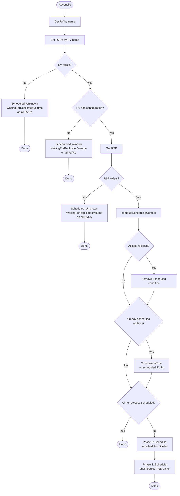
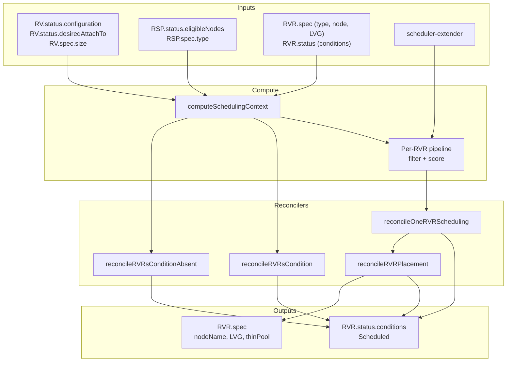
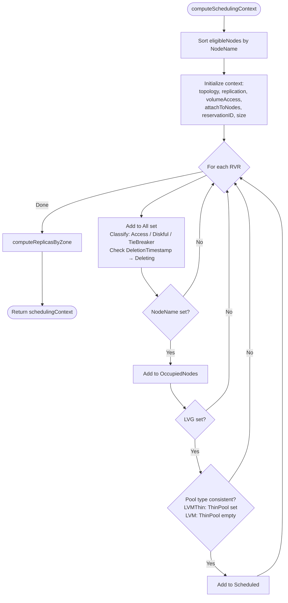
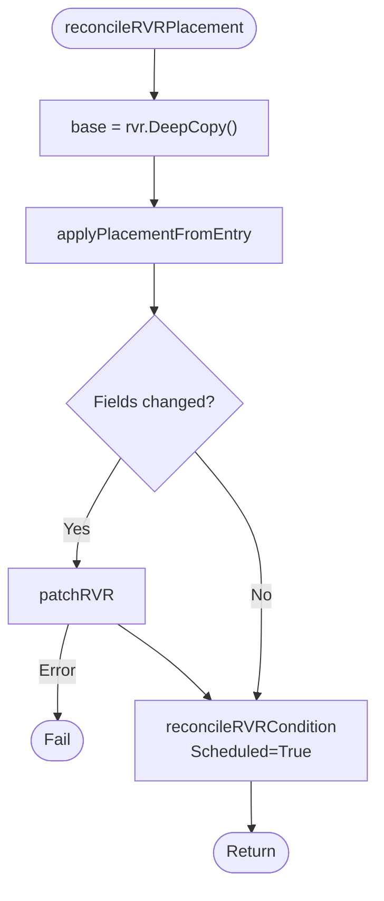

```mermaid
flowchart TD
    Start([reconcileOneRVRScheduling]) --> BuildSource{Diskful?}
    BuildSource -->|Yes| LVGSource[TakeLVGsFromEligibleNodes]
    BuildSource -->|No| NodeSource[TakeOnlyNodesFromEligibleNodes]

    LVGSource --> NodeFilter
    NodeSource --> NodeFilter

    NodeFilter["Filter: node not ready<br/>(Unschedulable, NodeReady, AgentReady)"]
    NodeFilter --> LVGFilter{Diskful?}
    LVGFilter -->|Yes| LVGReadyFilter["Filter: LVG not ready<br/>(Unschedulable, Ready)"]
    LVGFilter -->|No| OccupiedFilter

    LVGReadyFilter --> OccupiedFilter
    OccupiedFilter{NodeName set?}
    OccupiedFilter -->|No| ExcludeOccupied["Filter: node occupied"]
    OccupiedFilter -->|Yes| NarrowToNode["Filter: node mismatch<br/>(keep only assigned node)"]

    ExcludeOccupied --> ZoneFilter
    NarrowToNode --> ZoneFilter

    ZoneFilter{Topology?}
    ZoneFilter -->|Zonal| ZonalFilter["Filter: zonal majority<br/>(most Diskful)"]
    ZoneFilter -->|TransZonal| TransZonalFilter["Filter: transZonal min<br/>(fewest replicas)"]
    ZoneFilter -->|Ignored| ScoringStep

    ZonalFilter --> ScoringStep
    TransZonalFilter --> ScoringStep

    ScoringStep{Diskful?}
    ScoringStep -->|Yes| ExtenderScore["FilteredAndScoredBySchedulerExtender"]
    ExtenderScore -->|Error| SetExtUnavail["Scheduled=False<br/>ExtenderUnavailable"]
    SetExtUnavail --> ReturnErr([Return error])

    ExtenderScore -->|OK| AttachBonus{AttachTo nodes?}
    AttachBonus -->|Yes| AddBonus["+1000 attach-to bonus"]
    AttachBonus -->|No| MultiLVG
    AddBonus --> MultiLVG

    ScoringStep -->|No| SelectStep

    MultiLVG{volumeAccess != Any?}
    MultiLVG -->|Yes| MultiLVGBonus["+2 multi-LVG bonus"]
    MultiLVG -->|No| ZonePenalty

    MultiLVGBonus --> ZonePenalty
    ZonePenalty{Zonal + remainingDemand > 0?}
    ZonePenalty -->|Yes| AddPenalty["-800 zone capacity penalty"]
    ZonePenalty -->|No| SelectStep
    AddPenalty --> SelectStep

    SelectStep[SelectBest]
    SelectStep --> CheckBest{Best found?}
    CheckBest -->|No| SetFailed["Scheduled=False<br/>SchedulingFailed<br/>(pipeline summary)"]
    SetFailed --> ReturnFail([Return])

    CheckBest -->|Yes| NarrowRes{Diskful?}
    NarrowRes -->|Yes| CallNarrow[NarrowReservation]
    CallNarrow -->|Error| SetNarrowFail["Scheduled=False<br/>ExtenderUnavailable"]
    SetNarrowFail --> ReturnNarrowErr([Return error])

    CallNarrow -->|OK| Place
    NarrowRes -->|No| Place

    Place[reconcileRVRPlacement]
    Place --> UpdateCtx["sctx.Update:<br/>mark node occupied,<br/>add to zone replica set"]
    UpdateCtx --> ReturnOK([Continue])
```

# rvr_scheduling_controller

This controller schedules `ReplicatedVolumeReplica` (RVR) resources by selecting the best node and LVMVolumeGroup for each unscheduled replica.

## Purpose

The controller reconciles all RVRs belonging to a single `ReplicatedVolume` (RV) in one pass:

1. **Node/LVG selection** — selects node and LVMVolumeGroup (and ThinPool for LVMThin) for unscheduled Diskful and TieBreaker replicas
2. **Topology-aware placement** — Zonal (sticky zone), TransZonal (round-robin across zones), or Ignored (no zone constraints)
3. **Extender integration** — calls the scheduler-extender for Diskful capacity scoring (`FilterAndScore`) and reservation confirmation (`NarrowReservation`)
4. **Condition management** — sets the `Scheduled` condition on RVRs to report scheduling outcome
5. **Access replica handling** — removes stale `Scheduled` conditions from Access replicas (Access replicas are not scheduled by this controller)

## Interactions

| Direction | Resource/Controller | Relationship |
|-----------|---------------------|--------------|
| ← input | ReplicatedVolume | Reads configuration (topology, replication, volumeAccess, storagePoolName), attachTo nodes, reservation annotation, volume size |
| ← input | ReplicatedStoragePool | Reads eligible nodes (with node/LVG readiness and zone info), pool type |
| ← input | ReplicatedVolumeReplica | Reads spec (type, nodeName, LVG), classifies by type/scheduling state/deletion |
| → manages | ReplicatedVolumeReplica | Patches spec (NodeName, LVMVolumeGroupName, LVMVolumeGroupThinPoolName) and status (Scheduled condition) |
| ↔ external | scheduler-extender | FilterAndScore (capacity scoring) + NarrowReservation (reservation confirmation) |

## Algorithm

The controller is triggered by RV name (primary resource) and reconciles all RVRs for that RV:

```
load RV, RVRs (sorted by ID), RSP

Guard 1: RV not found → WaitingForReplicatedVolume on all RVRs → Done
Guard 2: RV has no configuration → WaitingForReplicatedVolume on all RVRs → Done
Guard 3: RSP not found → WaitingForReplicatedVolume on all RVRs → Done

build schedulingContext (classify RVRs, compute zones, eligible nodes, occupied nodes)

if Access replicas exist:
    remove Scheduled condition from Access RVRs

if Scheduled replicas exist:
    set Scheduled=True on already-scheduled RVRs

if all non-Access replicas are scheduled → Done

compute unscheduled = All - Scheduled - Deleting

Phase 2: for each unscheduled Diskful (in ID order):
    build per-RVR pipeline → filter → score via extender → SelectBest
    NarrowReservation on best candidate
    patch RVR spec + set Scheduled condition
    update schedulingContext (occupied nodes, zone counts)

Phase 3: for each unscheduled TieBreaker (in ID order):
    build per-RVR pipeline → filter → SelectBest (no extender scoring)
    patch RVR spec + set Scheduled condition
    update schedulingContext
```

## Reconciliation Structure

```
Reconcile (root) [Pure orchestration]
├── getRV, getRVRsByRVName
├── Guard 1: RV not found → reconcileRVRsCondition (WaitingForReplicatedVolume) → Done
├── Guard 2: no configuration → reconcileRVRsCondition (WaitingForReplicatedVolume) → Done
├── getRSP
├── Guard 3: RSP not found → reconcileRVRsCondition (WaitingForReplicatedVolume) → Done
├── computeSchedulingContext
├── reconcileRVRsConditionAbsent (Access replicas) [In-place reconciliation]
├── reconcileRVRsCondition (Scheduled=True for already-scheduled) [In-place reconciliation]
├── all scheduled? → Done
├── Phase 2: for each unscheduled Diskful
│   └── reconcileOneRVRScheduling [In-place reconciliation]
│       ├── Build pipeline (TakeLVGsFromEligibleNodes or TakeOnlyNodesFromEligibleNodes)
│       ├── WithPredicate: node not ready (Unschedulable, NodeReady, AgentReady)
│       ├── WithPredicate: LVG not ready (Diskful only)
│       ├── WithPredicate: node occupied / node mismatch (assigned)
│       ├── WithPredicate: zone filter (Zonal: majority zone, TransZonal: least-loaded zone)
│       ├── FilteredAndScoredBySchedulerExtender (Diskful only)
│       ├── WithPredicate: attach-to bonus +1000 (Diskful only)
│       ├── WithNodeScore: multi-LVG node bonus +2 (Diskful, volumeAccess != Any)
│       ├── WithZoneScore: zone capacity penalty -800 (Diskful + Zonal only)
│       ├── SelectBest (by score → node name → LVG name)
│       ├── NarrowReservation (Diskful only)
│       └── reconcileRVRPlacement [In-place reconciliation]
│           ├── applyPlacementFromEntry → patchRVR (main domain)
│           └── reconcileRVRCondition (Scheduled=True)
├── Phase 3: for each unscheduled TieBreaker
│   └── reconcileOneRVRScheduling (same pipeline, no extender scoring)
└── Done
```

## Algorithm Flow



## Scheduling Pipeline

Each unscheduled RVR is processed through a per-RVR scheduling pipeline built from composable steps:

```
Source → Predicate filters → Scoring → SelectBest
```

### Pipeline Components

| Component | Type | Description |
|-----------|------|-------------|
| `TakeLVGsFromEligibleNodes` | Source | One candidate per node×LVG pair (Diskful) |
| `TakeOnlyNodesFromEligibleNodes` | Source | One candidate per node, no LVG (TieBreaker) |
| `WithPredicate` | Filter | Removes candidates that don't match a condition |
| `FilteredAndScoredBySchedulerExtender` | Filter+Score | Calls extender, merge-joins scores, excludes unscored/zero-score |
| `WithNodeScore` | Score | Groups by node, adds score to all candidates in a group |
| `WithZoneScore` | Score | Groups by zone, adds score to all candidates in a group |
| `SelectBest` | Selection | Picks the candidate with the highest score (deterministic tiebreak) |

### Pipeline Steps (per RVR)

1. **Source**: `TakeLVGsFromEligibleNodes` (Diskful) or `TakeOnlyNodesFromEligibleNodes` (TieBreaker)
2. **Node readiness**: exclude Unschedulable, NodeReady=false, AgentReady=false
3. **LVG readiness** (Diskful only): exclude Unschedulable or Ready=false LVGs
4. **Node occupancy**: exclude occupied nodes (unscheduled RVR) or narrow to assigned node (partially-scheduled RVR)
5. **Zone filter** (topology-dependent): Zonal majority or TransZonal least-loaded
6. **Extender scoring** (Diskful only): `FilterAndScore` via scheduler-extender
7. **Attach-to bonus** (Diskful only): +1000 to nodes in `rv.Status.DesiredAttachTo`
8. **Multi-LVG bonus** (Diskful, volumeAccess != Any): +2 to nodes with >1 LVG
9. **Zone capacity penalty** (Diskful + Zonal only): -800 to zones with insufficient free nodes
10. **SelectBest**: highest score → alphabetical node name → alphabetical LVG name

### Diagnostic Summary

Each pipeline step tracks how many candidates it excluded. When no candidate survives, the `SchedulingFailed` condition message contains the full pipeline summary (e.g., `"4 candidates (node×LVG) from 2 eligible nodes; 4 excluded: node not ready"`).

## Conditions

### Scheduled

Indicates whether the replica has been fully scheduled (node, LVG, and ThinPool if applicable are all assigned).

| Status | Reason | When |
|--------|--------|------|
| True | Scheduled | Node, LVG, and ThinPool (if applicable) are all assigned |
| False | SchedulingFailed | No suitable candidate found (pipeline summary in message) |
| False | ExtenderUnavailable | Scheduler extender is unreachable or reservation failed |
| Unknown | WaitingForReplicatedVolume | RV not found, RV has no configuration, or RSP not found |
| (absent) | — | Access replica (condition removed by this controller) |

## Zone Scheduling Logic

Zone filtering depends on the topology mode configured in the RSC (via `rv.Status.Configuration.Topology`).

### Ignored

No zone filtering. Replicas are placed purely by score.

### Zonal (sticky)

All replicas (Diskful and TieBreaker) should land in the **same zone**.

**Zone preference**: `computePreferredZones` selects zones with the **most Diskful replicas** (sticky behavior). If replicas are already spread across multiple zones (inconsistent state), all tied zones are preferred and a warning is logged.

**Zone capacity penalty** (Diskful only): zones where the number of free nodes is less than `remainingDemand` receive a **-800** score penalty.

| Replication mode | Required Diskful |
|------------------|-----------------|
| None | 1 |
| Availability / Consistency | 2 |
| ConsistencyAndAvailability | 3 |

`remainingDemand = requiredDiskful - alreadyScheduledDiskful`. When `remainingDemand <= 0`, no penalty is applied.

### TransZonal (round-robin)

Replicas should be **evenly spread** across zones.

**Diskful zone preference**: zones with the **fewest Diskful replicas** (balances quorum across zones).

**TieBreaker zone preference**: zones with the fewest total replicas (Diskful + TieBreaker); among ties, zones with the fewest TieBreaker replicas (balances the tie-breaker quorum independently).

No zone capacity penalty is applied for TransZonal — replicas are already spread by the zone filter.

## Scheduling Context

The `schedulingContext` is built once per Reconcile invocation by `computeSchedulingContext` and shared across all per-RVR pipeline runs. It is updated after each successful placement.

| Field | Source | Description |
|-------|--------|-------------|
| `EligibleNodes` | `rsp.Status.EligibleNodes` | Candidate nodes (sorted by NodeName) |
| `OccupiedNodes` | RVRs with `spec.nodeName != ""` | Nodes already used by any RVR |
| `AttachToNodes` | `rv.Status.DesiredAttachTo` | Nodes preferred for attachment |
| `ReservationID` | RV annotation or computed from LLV name | Scheduler-extender reservation key |
| `Size` | `rv.Spec.Size` | Volume size in bytes |
| `Topology` | `rv.Status.Configuration.Topology` | Zonal / TransZonal / Ignored |
| `Replication` | `rv.Status.Configuration.Replication` | None / Availability / Consistency / ConsistencyAndAvailability |
| `VolumeAccess` | `rv.Status.Configuration.VolumeAccess` | Any / Local / PreferablyLocal |
| `ReplicasByZone` | Computed from eligible nodes + RVRs | Zone → IDSet of replicas in that zone |
| `All` | RVRs | IDSet of all RVR IDs |
| `Access` | RVRs with type=Access | IDSet |
| `Diskful` | RVRs with type=Diskful | IDSet |
| `TieBreaker` | RVRs with type=TieBreaker | IDSet |
| `Deleting` | RVRs with DeletionTimestamp | IDSet |
| `Scheduled` | RVRs with NodeName + LVG + valid pool type | IDSet |

### Scheduled Detection

An RVR is considered "scheduled" when all conditions are met:
- `spec.nodeName` is set
- `spec.lvmVolumeGroupName` is set
- Pool type consistency: for LVMThin, `spec.lvmVolumeGroupThinPoolName` must be set; for LVM (thick), it must be empty

## Managed Metadata

This controller does not manage finalizers, labels, or owner references. It only patches:

| Domain | Fields | Purpose |
|--------|--------|---------|
| RVR spec (main) | `nodeName`, `lvmVolumeGroupName`, `lvmVolumeGroupThinPoolName` | Placement result |
| RVR status | `conditions[Scheduled]` | Scheduling outcome |

## Watches

| Resource | Events | Handler |
|----------|--------|---------|
| ReplicatedVolume | Create, Delete, Generic (default); Update: `status.configurationGeneration` changes | For() (primary) |
| ReplicatedVolumeReplica | Create (default); Update: spec changes (generation bump) or `SatisfyEligibleNodes=False`; Delete: never | mapRVRToRV (by `spec.replicatedVolumeName`) |
| ReplicatedStoragePool | Create, Delete, Generic (default); Update: `status.eligibleNodesRevision` changes | mapRSPToRV (index lookup by storage pool name) |

### RV Predicates

- Update: reacts to `status.configurationGeneration` changes (configuration resolved by rv_controller)
- Create, Delete, Generic: default `true` (not explicitly filtered)

### RVR Predicates

- Create: default `true` (new RVR needs scheduling)
- Update: generation changed (spec changes) OR `SatisfyEligibleNodes` condition is False (needs re-scheduling after node changes)
- Delete: explicitly `false` (scheduling controller doesn't handle deletion)
- Generic: default `true`

### RSP Predicates

- Create, Delete, Generic: default `true`
- Update: `status.eligibleNodesRevision` changed (eligible nodes updated by rsp_controller)

## Indexes

| Index | Field | Purpose |
|-------|-------|---------|
| `IndexFieldRVRByReplicatedVolumeName` | `spec.replicatedVolumeName` | List RVRs for an RV (used by `getRVRsByRVName`) |
| `IndexFieldRVByStoragePoolName` | `status.configuration.storagePoolName` | Map RSP events to RVs (used by `mapRSPToRV`) |

## Data Flow



---

## Detailed Algorithms

### computeSchedulingContext Details

**Purpose:** Builds the shared scheduling state from RV, RSP, and RVRs in a single pass.

**Algorithm:**



**Data Flow:**

| Input | Description |
|-------|-------------|
| `rv.Status.Configuration` | Topology, replication, volumeAccess |
| `rv.Status.DesiredAttachTo` | Preferred attachment nodes |
| `rv.Annotations[SchedulingReservationIDAnnotationKey]` | CSI reservation ID (if set) |
| `rv.Spec.Size` | Volume size |
| `rsp.Status.EligibleNodes` | Candidate nodes with LVG/zone info |
| `rsp.Spec.Type` | LVM or LVMThin (for scheduled detection) |
| `rvrs` | All RVRs for this RV |

| Output | Description |
|--------|-------------|
| `schedulingContext` | Shared mutable state for per-RVR pipeline runs |

---

### reconcileOneRVRScheduling Details

**Purpose:** Builds a fresh candidate pipeline for a single unscheduled RVR, selects the best candidate, and places the RVR. Updates the scheduling context after successful placement.

**Algorithm:**



**Data Flow:**

| Input | Description |
|-------|-------------|
| `rvr` | The RVR to schedule |
| `sctx` | Shared scheduling context (eligible nodes, topology, zones, occupied nodes) |
| scheduler-extender | Capacity scores and reservation (Diskful only) |

| Output | Description |
|--------|-------------|
| RVR spec patch | `nodeName`, `lvmVolumeGroupName`, `lvmVolumeGroupThinPoolName` |
| Scheduled condition | True (placed), False (failed/extender unavailable) |
| `sctx` mutation | Updated occupied nodes and zone replica counts |

---

### reconcileRVRPlacement Details

**Purpose:** Applies placement from a CandidateEntry to an RVR and patches both the main (spec) and status domains.

**Algorithm:**



**Data Flow:**

| Input | Description |
|-------|-------------|
| `rvr` | RVR to place |
| `entry` | Best candidate (node, LVG, ThinPool, score) |

| Output | Description |
|--------|-------------|
| `rvr.Spec.NodeName` | Set to `entry.Node.NodeName` |
| `rvr.Spec.LVMVolumeGroupName` | Set to `entry.LVGName()` |
| `rvr.Spec.LVMVolumeGroupThinPoolName` | Set to `entry.ThinPoolName()` |
| Scheduled condition | True / Scheduled |
