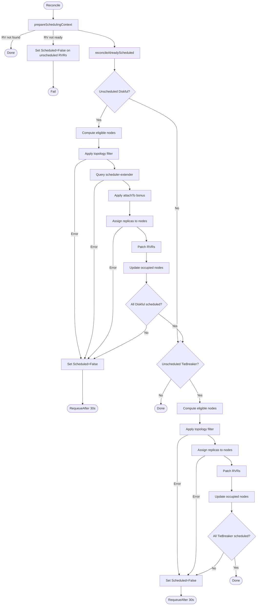
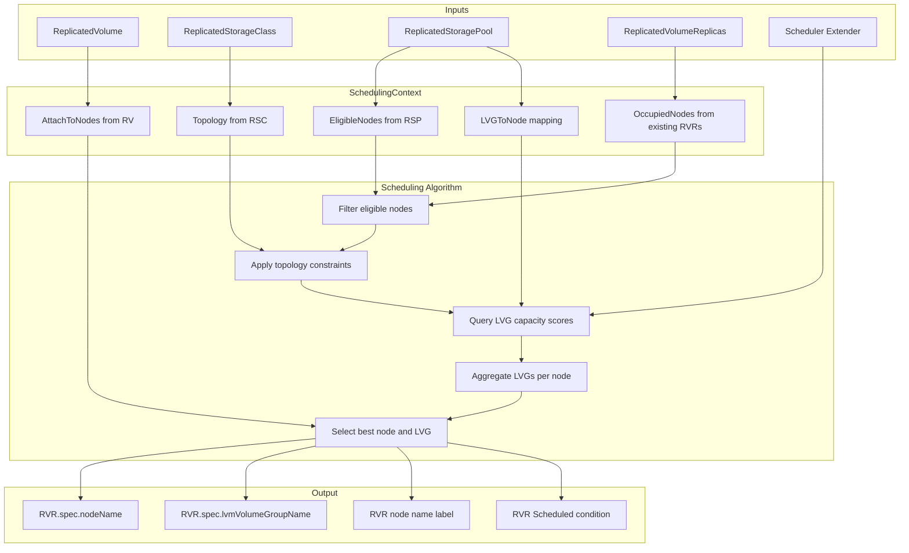

# rvr_scheduling_controller

This controller assigns nodes to ReplicatedVolumeReplicas based on topology, storage capacity, and placement requirements.

## Purpose

The controller performs intelligent replica placement by:

- Assigning unique nodes to each replica of a ReplicatedVolume
- Respecting topology constraints (Zonal, TransZonal, Ignored)
- Checking storage capacity via scheduler-extender API
- Preferring nodes in `rv.status.desiredAttachTo` when possible
- Handling different scheduling requirements for Diskful and TieBreaker replicas

## Interactions

| Direction | Resource/Controller | Relationship |
|-----------|---------------------|--------------|
| ← input | ReplicatedVolume | Reads RV spec and status (size, RSC name, desiredAttachTo) |
| ← input | ReplicatedStorageClass | Reads topology mode and zones |
| ← input | ReplicatedStoragePool | Reads eligible nodes list (with LVGs per node) |
| ← input | scheduler-extender | Queries storage capacity per LVG for Diskful replicas |
| → output | ReplicatedVolumeReplica | Assigns `spec.nodeName`, `spec.lvmVolumeGroupName`, and updates `status.conditions[Scheduled]` |

## Algorithm

### Node Selection Criteria

Eligible nodes are determined by intersection of:

- Nodes in zones specified by `rsc.spec.zones` (or all zones if not specified)
- Nodes from `rsp.status.eligibleNodes` that are:
  - Ready (`nodeReady = true`)
  - Not unschedulable (`unschedulable = false`)
  - Have ready agent (`agentReady = true`)
- Nodes not already hosting any replica of this RV

For Diskful replicas, additional capacity filtering via scheduler-extender API is applied.

### Node and LVG Selection Algorithm

For Diskful replicas, the scheduler selects both the best node and the best LVG on that node:

1. Query scheduler-extender for capacity scores of all LVGs on candidate nodes
2. For each node, aggregate LVG scores:
   - **BestScore** - highest LVG score on the node
   - **LVGCount** - number of suitable LVGs with sufficient capacity
   - **SumScore** - sum of all LVG scores
3. Sort nodes by (BestScore DESC, LVGCount DESC, SumScore DESC):
   - Primary: Prefer node with highest LVG score
   - Secondary: Prefer node with more suitable LVGs (more options = better)
   - Tertiary: Prefer node with higher total capacity

**Examples:**

```
Example 1: Same BestScore, different LVGCount
  Node-1: lvg-1=9, lvg-2=5       → BestScore=9, Count=2, Sum=14
  Node-2: lvg-1=9                → BestScore=9, Count=1, Sum=9
  Winner: Node-1 (same BestScore, but Count 2 > 1)

Example 2: Same BestScore and LVGCount, different SumScore
  Node-1: lvg-1=9, lvg-2=5       → BestScore=9, Count=2, Sum=14
  Node-2: lvg-1=9, lvg-2=2       → BestScore=9, Count=2, Sum=11
  Winner: Node-1 (same BestScore, same Count, but Sum 14 > 11)

Example 3: Different BestScore
  Node-1: lvg-1=9, lvg-2=5       → BestScore=9, Count=2, Sum=14
  Node-2: lvg-1=10               → BestScore=10, Count=1, Sum=10
  Winner: Node-2 (BestScore 10 > 9)
```

### Scheduling Phases

The controller schedules replicas in two sequential phases:

**Phase 1: Diskful Replicas**

1. Compute eligible nodes from RSP, excluding occupied nodes
2. Apply topology filter based on RSC topology mode
3. Query scheduler-extender for storage capacity scores
4. Apply attachTo bonus to preferred nodes
5. Assign replicas to best-scoring nodes

**Phase 2: TieBreaker Replicas**

1. Compute eligible nodes from RSP, excluding occupied nodes
2. Apply topology filter (no capacity check required)
3. Assign replicas to available nodes respecting topology

### Topology Modes

| Mode | Diskful Behavior | TieBreaker Behavior |
|------|------------------|---------------------|
| **Ignored** | No zone constraints | No zone constraints |
| **Zonal** | All replicas in one zone (prefer existing Diskful zone or attachTo zone) | Same zone as Diskful replicas |
| **TransZonal** | Distribute evenly across zones | Place in zone with fewest replicas |

## Reconciliation Structure

```
Reconcile (root)
├── prepareSchedulingContext             — fetch RV, RSC, RSP, all RVRs
│   ├── getRV                            — fetch ReplicatedVolume
│   ├── isRVReadyToSchedule              — validate RV has finalizer and required fields
│   ├── getRSC                           — fetch ReplicatedStorageClass
│   ├── getRSP                           — fetch ReplicatedStoragePool
│   └── listRVRsByRV                     — list all RVRs for this RV
│
├── reconcileAlreadyScheduled            — update conditions on already scheduled RVRs
│   └── updateScheduledConditionOnScheduledRVRs
│       ├── applyNodeNameLabelIfMissing  — ensure node name label exists
│       └── applyScheduledConditionTrue  — set Scheduled=True
│
├── reconcileDiskful                     — schedule Diskful replicas
│   ├── computeEligibleNodeNames         — filter eligible nodes
│   ├── applyTopologyFilter              — filter by topology mode
│   ├── applyCapacityFilterAndScore      — query scheduler-extender for capacity
│   ├── applyAttachToBonus               — boost score for attachTo nodes
│   ├── assignReplicasToNodes            — select best nodes per topology
│   ├── updateScheduledRVRs              — patch spec.nodeName and status
│   └── updateStateAfterScheduling       — mark nodes as occupied
│
└── reconcileTieBreaker                  — schedule TieBreaker replicas
    ├── computeEligibleNodeNames         — filter eligible nodes
    ├── applyTopologyFilter              — filter by topology mode
    ├── assignReplicasToNodes            — select nodes per topology
    ├── updateScheduledRVRs              — patch spec.nodeName and status
    └── updateStateAfterScheduling       — mark nodes as occupied
```

## Algorithm Flow


```mermaid
flowchart TD
    Start([Reconcile]) --> Prepare[prepareSchedulingContext]
    Prepare -->|RV not found| Done1([Done])
    Prepare -->|RV not ready| SetFailed1[Set Scheduled=False on unscheduled RVRs]
    SetFailed1 --> Fail1([Fail])

    Prepare --> ReconcileScheduled[reconcileAlreadyScheduled]
    ReconcileScheduled --> CheckDiskful{Unscheduled Diskful?}

    CheckDiskful -->|No| CheckTieBreaker{Unscheduled TieBreaker?}
    CheckDiskful -->|Yes| FilterDiskful[Compute eligible nodes]

    FilterDiskful --> TopologyDiskful[Apply topology filter]
    TopologyDiskful -->|Error| FailDiskful[Set Scheduled=False]
    FailDiskful --> RequeueD([RequeueAfter 30s])

    TopologyDiskful --> CapacityFilter[Query scheduler-extender]
    CapacityFilter -->|Error| FailDiskful

    CapacityFilter --> AttachToBonus[Apply attachTo bonus]
    AttachToBonus --> AssignDiskful[Assign replicas to nodes]
    AssignDiskful -->|Error| FailDiskful
    AssignDiskful --> UpdateDiskful[Patch RVRs]
    UpdateDiskful --> UpdateStateDiskful[Update occupied nodes]
    UpdateStateDiskful --> CheckAllDiskfulScheduled{All Diskful scheduled?}

    CheckAllDiskfulScheduled -->|No| FailDiskful
    CheckAllDiskfulScheduled -->|Yes| CheckTieBreaker

    CheckTieBreaker -->|No| Done2([Done])
    CheckTieBreaker -->|Yes| FilterTieBreaker[Compute eligible nodes]

    FilterTieBreaker --> TopologyTieBreaker[Apply topology filter]
    TopologyTieBreaker -->|Error| FailTieBreaker[Set Scheduled=False]
    FailTieBreaker --> RequeueT([RequeueAfter 30s])

    TopologyTieBreaker --> AssignTieBreaker[Assign replicas to nodes]
    AssignTieBreaker -->|Error| FailTieBreaker
    AssignTieBreaker --> UpdateTieBreaker[Patch RVRs]
    UpdateTieBreaker --> UpdateStateTieBreaker[Update occupied nodes]
    UpdateStateTieBreaker --> CheckAllTieBreakerScheduled{All TieBreaker scheduled?}

    CheckAllTieBreakerScheduled -->|No| FailTieBreaker
    CheckAllTieBreakerScheduled -->|Yes| Done3([Done])
```

## Conditions

### Scheduled

Indicates whether the replica has been assigned to a node.

| Status | Reason | When |
|--------|--------|------|
| True | ReplicaScheduled | Node successfully assigned |
| False | NoAvailableNodes | No candidate nodes available |
| False | TopologyConstraintsFailed | Topology requirements cannot be satisfied |
| False | SchedulingPending | RV not ready for scheduling (missing finalizer, RSC, etc.) |
| False | SchedulingFailed | Other scheduling errors |

## Managed Metadata

| Type | Key | Managed On | Purpose |
|------|-----|------------|---------|
| Spec field | `spec.nodeName` | RVR | Assigned node for the replica |
| Spec field | `spec.lvmVolumeGroupName` | RVR | Assigned LVG for Diskful replicas |
| Spec field | `spec.lvmVolumeGroupThinPoolName` | RVR | Assigned thin pool for LVMThin storage |
| Label | `storage.deckhouse.io/sds-replicated-volume-node-name` | RVR | Node name for indexing |
| Status condition | `status.conditions[Scheduled]` | RVR | Scheduling success/failure status |

## Watches

| Resource | Events | Handler |
|----------|--------|---------|
| ReplicatedVolume | Status changes (desiredAttachTo) | Maps to all RVRs of this RV |
| ReplicatedVolumeReplica | Generation changes, nodeName empty | Direct (primary) |
| ReplicatedStoragePool | eligibleNodesRevision changes | Maps to RVRs via RSC lookup |

## Indexes

| Index | Field | Purpose |
|-------|-------|---------|
| RVR by RV name | `spec.replicatedVolumeName` | List all RVRs for a ReplicatedVolume |

## Data Flow


```mermaid
flowchart TD
    subgraph inputs [Inputs]
        RV[ReplicatedVolume]
        RSC[ReplicatedStorageClass]
        RSP[ReplicatedStoragePool]
        RVRs[ReplicatedVolumeReplicas]
        Extender[Scheduler Extender]
    end

    subgraph context [SchedulingContext]
        EligibleNodes[EligibleNodes from RSP]
        LVGToNode[LVGToNode mapping]
        AttachTo[AttachToNodes from RV]
        Topology[Topology from RSC]
        OccupiedNodes[OccupiedNodes from existing RVRs]
    end

    subgraph scheduling [Scheduling Algorithm]
        FilterEligible[Filter eligible nodes]
        ApplyTopology[Apply topology constraints]
        QueryCapacity[Query LVG capacity scores]
        AggregateLVG[Aggregate LVGs per node]
        SelectBest[Select best node and LVG]
    end

    subgraph output [Output]
        NodeName[RVR.spec.nodeName]
        LVGName[RVR.spec.lvmVolumeGroupName]
        NodeLabel[RVR node name label]
        ScheduledCond[RVR Scheduled condition]
    end

    RV --> AttachTo
    RSC --> Topology
    RSP --> EligibleNodes
    RSP --> LVGToNode
    RVRs --> OccupiedNodes

    EligibleNodes --> FilterEligible
    OccupiedNodes --> FilterEligible
    FilterEligible --> ApplyTopology
    Topology --> ApplyTopology
    ApplyTopology --> QueryCapacity
    LVGToNode --> QueryCapacity
    Extender --> QueryCapacity
    QueryCapacity --> AggregateLVG
    AggregateLVG --> SelectBest
    AttachTo --> SelectBest

    SelectBest --> NodeName
    SelectBest --> LVGName
    SelectBest --> NodeLabel
    SelectBest --> ScheduledCond
```

## Scheduler-Extender Integration

For Diskful replicas, the controller queries the scheduler-extender API to:

- Filter LVGs with sufficient storage capacity
- Get capacity scores for each LVG (used for node and LVG ranking)

The extender is queried with:
- LVG names and thin pool names from eligible nodes
- Volume size and type (thick/thin) from RV spec

The extender returns a score per LVG. LVGs without sufficient capacity are excluded from the response. The controller then aggregates these scores by node to determine the best placement.

## Special Notes

**Best Zone Selection (Zonal topology):**
- Chooses the zone with highest total capacity score × node count
- Considers existing Diskful replica zones first
- Falls back to attachTo node zones if no Diskful replicas exist

**TransZonal Distribution:**
- Places each replica in the zone with fewest replicas of the same type
- Fails if even distribution across zones is impossible
- Ensures replicas survive zone failures

**AttachTo Preference:**
- Nodes in `rv.status.desiredAttachTo` receive a score bonus (+1000)
- This makes them preferred but not required
- Useful for co-locating replicas with workloads
