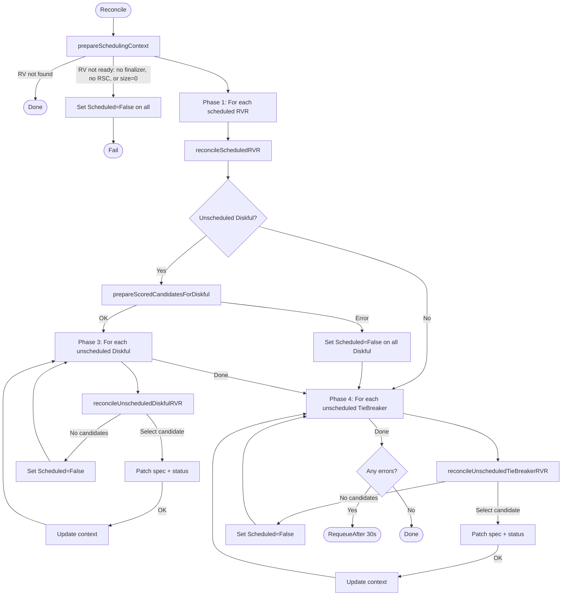
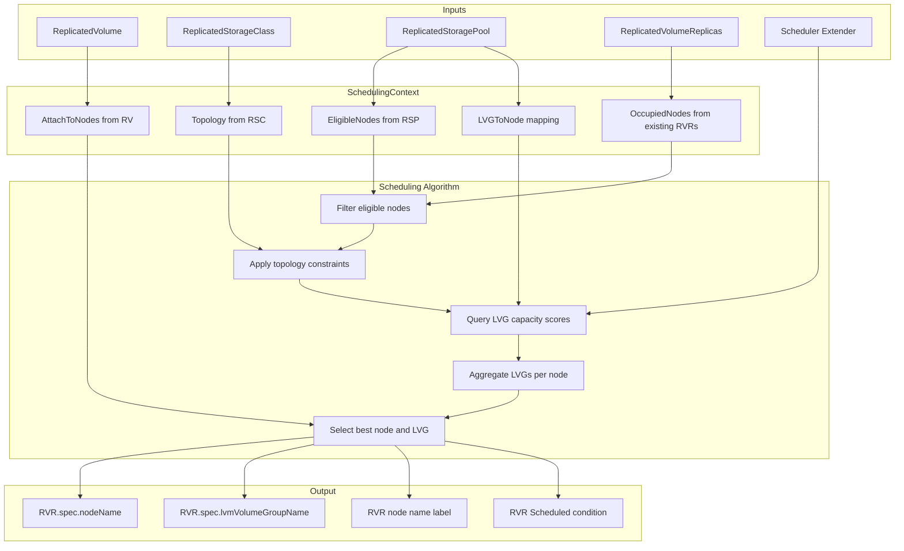

# rvr_scheduling_controller

This controller assigns nodes to ReplicatedVolumeReplicas based on topology, storage capacity, and placement requirements.

## Purpose

The controller performs intelligent replica placement by:

- Assigning unique nodes to each replica of a ReplicatedVolume
- Respecting topology constraints (Zonal, TransZonal, Ignored)
- Checking storage capacity via scheduler-extender API
- Preferring nodes in `rv.status.desiredAttachTo` when possible
- Handling different scheduling requirements for Diskful and TieBreaker replicas

## Interactions

| Direction | Resource/Controller | Relationship |
| --------- | ------------------- | ------------ |
| ← input | ReplicatedVolume | Reads RV spec and status (size, RSC name, desiredAttachTo) |
| ← input | ReplicatedStorageClass | Reads topology mode and zones |
| ← input | ReplicatedStoragePool | Reads eligible nodes list (with LVGs per node) |
| ← input | scheduler-extender | Queries storage capacity per LVG for Diskful replicas |
| → output | ReplicatedVolumeReplica | Assigns `spec.nodeName`, `spec.lvmVolumeGroupName`, node name label, and updates `status.conditions[Scheduled]` |

## Algorithm

### Node Selection Criteria

Eligible nodes are determined by intersection of:

- Nodes from `rsp.status.eligibleNodes` that are:
  - Ready (`nodeReady = true`)
  - Not unschedulable (`unschedulable = false`)
  - Have ready agent (`agentReady = true`)
  - Have at least one ready LVG (`lvg.ready = true` and `lvg.unschedulable = false`)
- Nodes not already hosting any replica of this RV
- Nodes in zones specified by `rsc.spec.zones` (or all zones if not specified)

For Diskful replicas, additional capacity filtering via scheduler-extender API is applied.

### Node and LVG Selection Algorithm

For Diskful replicas, the scheduler selects both the best node and the best LVG on that node:

1. Query scheduler-extender for capacity scores of all LVGs on candidate nodes
2. For each node, aggregate LVG scores:
   - **BestScore** - highest LVG score on the node
   - **LVGCount** - number of suitable LVGs with sufficient capacity
   - **SumScore** - sum of all LVG scores
3. Sort nodes by (BestScore DESC, LVGCount DESC, SumScore DESC):
   - Primary: Prefer node with highest LVG score
   - Secondary: Prefer node with more suitable LVGs (more options = better)
   - Tertiary: Prefer node with higher total capacity

**Examples:**

```text
Example 1: Same BestScore, different LVGCount
  Node-1: lvg-1=9, lvg-2=5       → BestScore=9, Count=2, Sum=14
  Node-2: lvg-1=9                → BestScore=9, Count=1, Sum=9
  Winner: Node-1 (same BestScore, but Count 2 > 1)

Example 2: Same BestScore and LVGCount, different SumScore
  Node-1: lvg-1=9, lvg-2=5       → BestScore=9, Count=2, Sum=14
  Node-2: lvg-1=9, lvg-2=2       → BestScore=9, Count=2, Sum=11
  Winner: Node-1 (same BestScore, same Count, but Sum 14 > 11)

Example 3: Different BestScore
  Node-1: lvg-1=9, lvg-2=5       → BestScore=9, Count=2, Sum=14
  Node-2: lvg-1=10               → BestScore=10, Count=1, Sum=10
  Winner: Node-2 (BestScore 10 > 9)
```

### Scheduling Phases

The controller schedules replicas using per-RVR reconciliation with error resilience:

#### Phase 1: Already Scheduled RVRs

For each scheduled RVR: ensure node name label and Scheduled=True condition.

#### Phase 2: Prepare Diskful Candidates (once)

1. Compute eligible nodes from RSP, excluding occupied nodes
2. Apply topology filter based on RSC topology mode
3. Query scheduler-extender for storage capacity scores (once for all Diskful)
4. Apply attachTo bonus to preferred nodes
5. Store candidates in SchedulingContext for use by individual RVR reconcilers

#### Phase 3: Unscheduled Diskful RVRs (per-RVR)

For each unscheduled Diskful RVR:

1. Select best candidate based on topology
2. Apply placement (node, LVG) using canonical apply pattern
3. Patch RVR spec with optimistic lock
4. On success: update SchedulingContext (mark node occupied, remove candidate)
5. On failure: continue to next RVR (node remains available)
6. Patch RVR status with Scheduled=True condition

#### Phase 4: Unscheduled TieBreaker RVRs (per-RVR)

For each unscheduled TieBreaker RVR:

1. Compute eligible nodes (no capacity scoring)
2. Apply topology filter
3. Select best candidate based on topology
4. Apply placement and patch spec with optimistic lock
5. Update SchedulingContext on success
6. Patch RVR status with Scheduled=True condition

### Topology Modes

| Mode | Diskful Behavior | TieBreaker Behavior |
| ------ | ------------------ | --------------------- |
| **Ignored** | No zone constraints | No zone constraints |
| **Zonal** | All replicas in one zone (prefer existing Diskful zone or attachTo zone) | Same zone as Diskful replicas |
| **TransZonal** | Distribute evenly across zones | Place in zone with fewest replicas |

## Reconciliation Structure

```
Reconcile (root) — per-RVR orchestration with error resilience
├── prepareSchedulingContext               — fetch RV, RSC, RSP, all RVRs
│   ├── getRV                              — fetch ReplicatedVolume
│   ├── isRVReadyToSchedule                — validate RV has finalizer and required fields
│   ├── getRSC                             — fetch ReplicatedStorageClass
│   ├── getRSP                             — fetch ReplicatedStoragePool
│   └── listRVRsByRV                       — list all RVRs for this RV
│
├── [for each scheduled RVR] reconcileScheduledRVR
│   ├── applyNodeNameLabelIfMissing        — ensure node name label exists
│   ├── patchRVR (if changed)              — patch with optimistic lock
│   ├── applyScheduledConditionTrue        — set Scheduled=True
│   └── patchRVRStatus (if changed)        — patch status
│
├── prepareScoredCandidatesForDiskful      — compute candidates once for all Diskful
│   ├── computeEligibleNodeNames           — filter eligible nodes
│   ├── applyTopologyFilter                — filter by topology mode
│   ├── applyCapacityFilterAndScore        — query scheduler-extender for capacity
│   └── applyAttachToBonus                 — boost score for attachTo nodes
│
├── [for each unscheduled Diskful] reconcileUnscheduledDiskfulRVR
│   ├── selectBestCandidate                         — select node+LVG based on topology
│   ├── applyPlacement                              — set nodeName, lvmVolumeGroupName
│   ├── patchRVR (if changed)                       — patch with optimistic lock
│   ├── SchedulingContext.MarkNodeOccupied          — update context on success
│   ├── SchedulingContext.RemoveCandidate           — remove used node from candidates
│   ├── SchedulingContext.IncrementZoneReplicaCount — for TransZonal: update zone count
│   ├── applyScheduledConditionTrue                 — set Scheduled=True
│   └── patchRVRStatus (if changed)                 — patch status
│
└── [for each unscheduled TieBreaker] reconcileUnscheduledTieBreakerRVR
    ├── computeEligibleNodeNames           — filter eligible nodes
    ├── applyTopologyFilter                — filter by topology mode
    ├── selectBestCandidateFromZones       — select node based on topology
    ├── applyPlacement                     — set nodeName
    ├── patchRVR (if changed)              — patch with optimistic lock
    ├── SchedulingContext.MarkNodeOccupied — update context on success
    ├── applyScheduledConditionTrue        — set Scheduled=True
    └── patchRVRStatus (if changed)        — patch status
```

## Algorithm Flow


```mermaid
flowchart TD
    Start([Reconcile]) --> Prepare[prepareSchedulingContext]
    Prepare -->|RV not found| Done1([Done])
    Prepare -->|RV not ready: no finalizer, no RSC, or size=0| SetFailed1[Set Scheduled=False on all]
    SetFailed1 --> Fail1([Fail])

    Prepare --> Phase1[Phase 1: For each scheduled RVR]
    Phase1 --> ReconcileScheduled[reconcileScheduledRVR]
    ReconcileScheduled --> Phase2{Unscheduled Diskful?}

    Phase2 -->|No| Phase4
    Phase2 -->|Yes| PrepareCandidates[prepareScoredCandidatesForDiskful]
    PrepareCandidates -->|Error| MarkFailed[Set Scheduled=False on all Diskful]
    MarkFailed --> Phase4
    PrepareCandidates -->|OK| Phase3[Phase 3: For each unscheduled Diskful]

    Phase3 --> ReconcileDiskful[reconcileUnscheduledDiskfulRVR]
    ReconcileDiskful -->|Select candidate| PatchDiskful[Patch spec + status]
    PatchDiskful -->|OK| UpdateCtx[Update context]
    UpdateCtx --> Phase3
    ReconcileDiskful -->|No candidates| SetFalse2[Set Scheduled=False]
    SetFalse2 --> Phase3

    Phase3 -->|Done| Phase4[Phase 4: For each unscheduled TieBreaker]
    Phase4 --> ReconcileTB[reconcileUnscheduledTieBreakerRVR]
    ReconcileTB -->|Select candidate| PatchTB[Patch spec + status]
    PatchTB -->|OK| UpdateCtx2[Update context]
    UpdateCtx2 --> Phase4
    ReconcileTB -->|No candidates| SetFalse3[Set Scheduled=False]
    SetFalse3 --> Phase4

    Phase4 -->|Done| CheckErrors{Any errors?}
    CheckErrors -->|Yes| Requeue([RequeueAfter 30s])
    CheckErrors -->|No| Done2([Done])
```

## Conditions

### Scheduled

Indicates whether the replica has been assigned to a node.

| Status | Reason | When |
| ------ | ------ | ---- |
| True | ReplicaScheduled | Node successfully assigned |
| False | NoAvailableNodes | No candidate nodes available |
| False | TopologyConstraintsFailed | Topology requirements cannot be satisfied |
| False | SchedulingPending | RV not ready for scheduling (missing finalizer, RSC, etc.) |
| False | SchedulingFailed | Other scheduling errors |

## Managed Metadata

| Type | Key | Managed On | Purpose |
| ---- | --- | ---------- | ------- |
| Spec field | `spec.nodeName` | RVR | Assigned node for the replica |
| Spec field | `spec.lvmVolumeGroupName` | RVR | Assigned LVG for Diskful replicas |
| Spec field | `spec.lvmVolumeGroupThinPoolName` | RVR | Assigned thin pool for LVMThin storage |
| Label | `storage.deckhouse.io/sds-replicated-volume-node-name` | RVR | Node name for agent watch filtering |
| Status condition | `status.conditions[Scheduled]` | RVR | Scheduling success/failure status |

## Watches

| Resource | Events | Handler |
| -------- | ------ | ------- |
| ReplicatedVolumeReplica | Create only | EnqueueRequestForOwner (maps to owner RV) |
| ReplicatedStoragePool | Update (only if eligibleNodes changed) | mapRSPToRV (maps to RVs that use this RSP and have unscheduled non-Access RVRs) |

## Indexes

| Index | Field | Purpose |
| ----- | ----- | ------- |
| RVR by RV name | `spec.replicatedVolumeName` | List all RVRs for a ReplicatedVolume |
| RVR unscheduled non-Access by RV | composite: unscheduled + non-Access + RV name | Find unscheduled Diskful/TieBreaker RVRs for a specific RV |
| RV by RSC name | `spec.replicatedStorageClassName` | Find RVs using a specific RSC |

Note: RSC names are obtained directly from `rsp.Status.UsedBy.ReplicatedStorageClassNames` (no index needed).

## Data Flow


```mermaid
flowchart TD
    subgraph inputs [Inputs]
        RV[ReplicatedVolume]
        RSC[ReplicatedStorageClass]
        RSP[ReplicatedStoragePool]
        RVRs[ReplicatedVolumeReplicas]
        Extender[Scheduler Extender]
    end

    subgraph context [SchedulingContext]
        EligibleNodes[EligibleNodes from RSP]
        LVGToNode[LVGToNode mapping]
        AttachTo[AttachToNodes from RV]
        Topology[Topology from RSC]
        OccupiedNodes[OccupiedNodes from existing RVRs]
    end

    subgraph scheduling [Scheduling Algorithm]
        FilterEligible[Filter eligible nodes]
        ApplyTopology[Apply topology constraints]
        QueryCapacity[Query LVG capacity scores]
        AggregateLVG[Aggregate LVGs per node]
        SelectBest[Select best node and LVG]
    end

    subgraph output [Output]
        NodeName[RVR.spec.nodeName]
        LVGName[RVR.spec.lvmVolumeGroupName]
        NodeLabel[RVR node name label]
        ScheduledCond[RVR Scheduled condition]
    end

    RV --> AttachTo
    RSC --> Topology
    RSP --> EligibleNodes
    RSP --> LVGToNode
    RVRs --> OccupiedNodes

    EligibleNodes --> FilterEligible
    OccupiedNodes --> FilterEligible
    FilterEligible --> ApplyTopology
    Topology --> ApplyTopology
    ApplyTopology --> QueryCapacity
    LVGToNode --> QueryCapacity
    Extender --> QueryCapacity
    QueryCapacity --> AggregateLVG
    AggregateLVG --> SelectBest
    AttachTo --> SelectBest

    SelectBest --> NodeName
    SelectBest --> LVGName
    SelectBest --> NodeLabel
    SelectBest --> ScheduledCond
```

## Scheduler-Extender Integration

For Diskful replicas, the controller queries the scheduler-extender API to:

- Filter LVGs with sufficient storage capacity
- Get capacity scores for each LVG (used for node and LVG ranking)

The extender is queried with:

- LVG names and thin pool names from eligible nodes
- Volume size and type (thick/thin) from RV spec

The extender returns a score per LVG. LVGs without sufficient capacity are excluded from the response. The controller then aggregates these scores by node to determine the best placement.

## Architecture Principles

### Per-RVR Reconciliation

Each RVR is reconciled independently. This design provides:

- **Error resilience**: If scheduling fails for one RVR (e.g., patch conflict), other RVRs continue processing
- **Mutable context**: SchedulingContext is updated after each successful scheduling, ensuring subsequent RVRs see the most current state
- **Optimistic locking**: All RVR patches use optimistic locking (`MergeFromWithOptimisticLock`) to prevent overwriting concurrent changes

### Canonical Apply Pattern

All apply functions follow the pattern:

```go
// base -> apply -> patch (only if changed)
base := rvr.DeepCopy()
changed := applyFunction(rvr, ...)
if changed {
    err := r.patchRVR(ctx, rvr, base, true /* optimisticLock */)
}
```

Apply functions are pure (no I/O) and return a `bool` indicating whether changes were made. Patches are only executed when actual changes occurred.

### Error Handling

**Errors causing requeue (exponential backoff):**

- API patch failures (conflicts, network errors, timeouts)
- Errors during scheduling context preparation (fetching RV, RSC, RSP)

**Scheduling failures causing requeue (fixed 30s):**

- No candidate nodes available from storage pool
- No suitable zone matches topology constraints
- All eligible nodes already occupied by other replicas
- Scheduler extender returned empty capacity scores

For scheduling failures, the controller sets `Scheduled=False` condition on the RVR and requeues after 30 seconds. This handles capacity changes that don't trigger RSP watch events (e.g., volume deleted, freeing LVG space).

**Error collection behavior:**

- Errors from individual RVR reconciliation are collected, not propagated immediately
- The controller continues processing other RVRs even if one fails
- If a patch fails due to conflict, the node remains available for subsequent RVRs

## Special Notes

**Best Zone Selection (Zonal topology):**

- Chooses the zone with highest total capacity score × node count
- Considers existing Diskful replica zones first
- Falls back to attachTo node zones if no Diskful replicas exist

**TransZonal Distribution:**

- Places each replica in the zone with fewest replicas of the same type
- Fails if even distribution across zones is impossible

Per-RVR zone distribution mechanism:

1. `prepareScoredCandidatesForDiskful` initializes `ZoneReplicaCounts` with existing Diskful counts per zone
2. For each unscheduled Diskful, `selectBestCandidateTransZonal` picks the zone with minimum count
3. After successful patch, `IncrementZoneReplicaCount` updates the count immediately
4. Next RVR sees updated counts and picks a different zone

Example with 2 unscheduled Diskful and 3 zones (all starting at count=0):

- RVR-1: zone-a=0, zone-b=0, zone-c=0 → selects zone-a → increments → zone-a=1
- RVR-2: zone-a=1, zone-b=0, zone-c=0 → selects zone-b (minimum count)

**AttachTo Preference:**

- Nodes in `rv.status.desiredAttachTo` receive a score bonus (+1000)
- This makes them preferred but not required
- Useful for co-locating replicas with workloads
