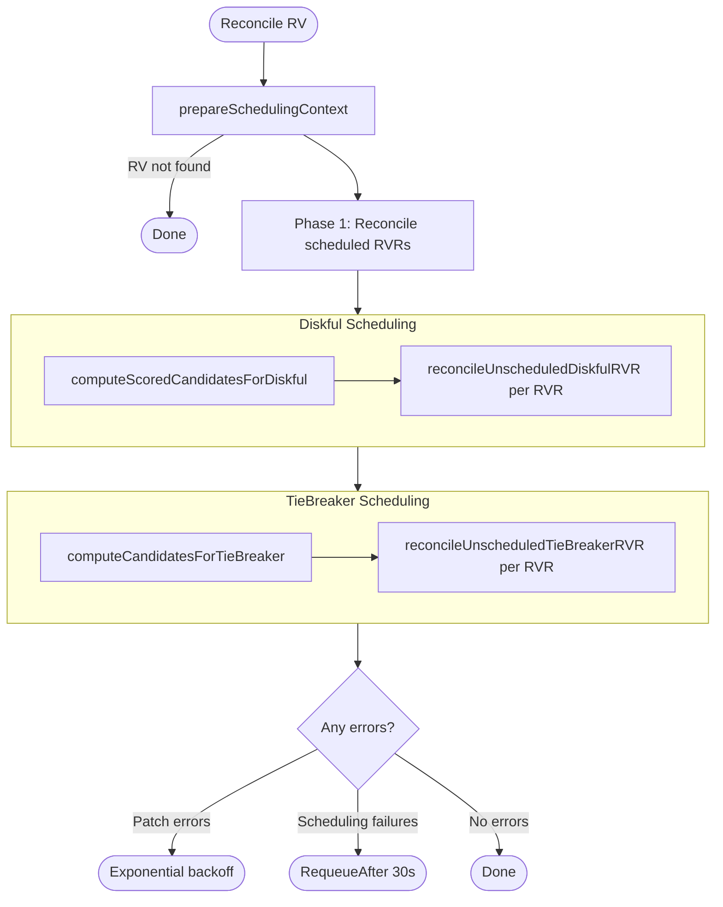
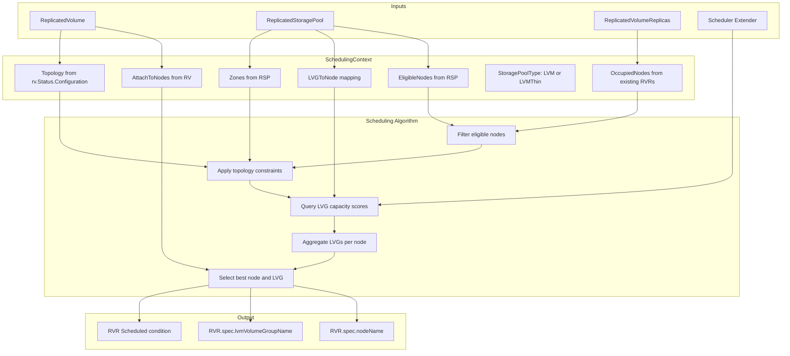
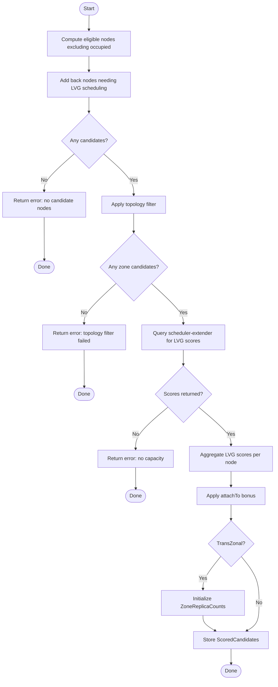
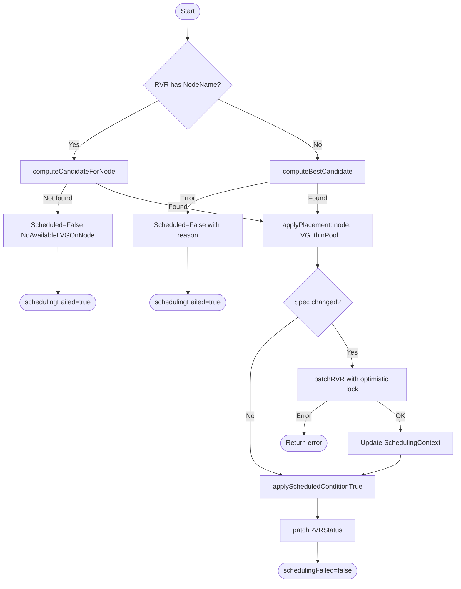
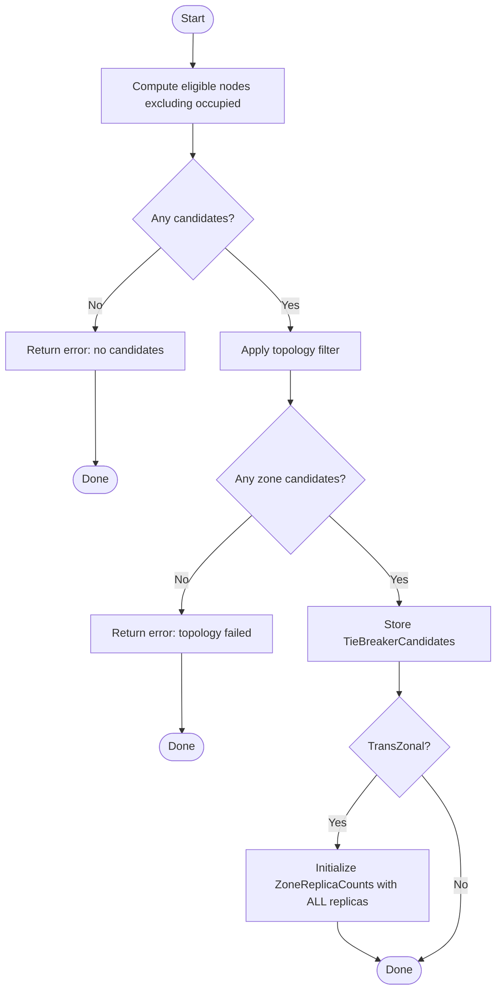
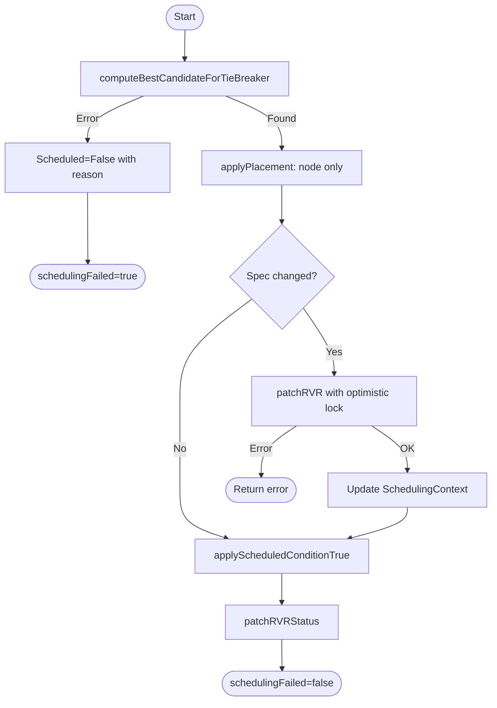
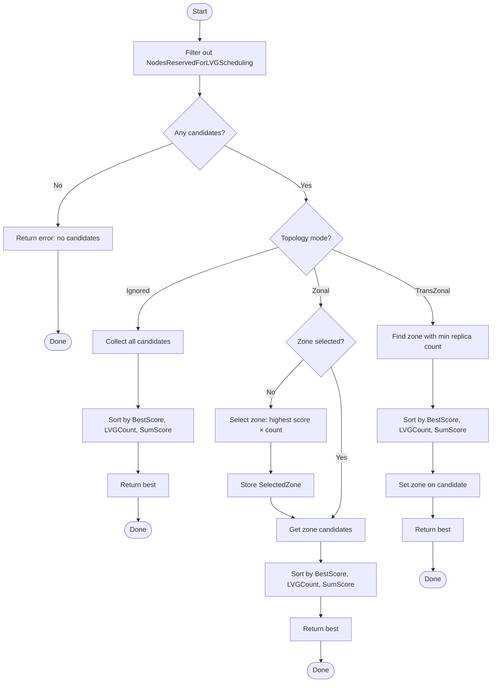

# rvr_scheduling_controller

This controller assigns nodes to ReplicatedVolumeReplicas based on topology, storage capacity, and placement requirements.

## Purpose

The controller performs replica placement by:

- Assigning unique nodes to each replica of a ReplicatedVolume
- Respecting topology constraints (Zonal, TransZonal, Ignored)
- Checking storage capacity via scheduler-extender API
- Preferring nodes in `rv.status.desiredAttachTo` when possible
- Handling different scheduling requirements for Diskful and TieBreaker replicas

## Interactions

| Direction | Resource/Controller | Relationship |
|-----------|---------------------|--------------|
| ← input | ReplicatedVolume | Reads RV spec and status (size, desiredAttachTo, configuration with topology/storagePoolName) |
| ← input | ReplicatedStoragePool | Reads eligible nodes list (with LVGs per node), zones, and pool type |
| ← input | scheduler-extender | Queries storage capacity per LVG for Diskful replicas |
| → output | ReplicatedVolumeReplica | Assigns `spec.nodeName`, `spec.lvmVolumeGroupName`, `spec.lvmVolumeGroupThinPoolName`, and updates `status.conditions[Scheduled]` |

## Algorithm

### Node Selection Criteria

Eligible nodes are determined by intersection of:

- Nodes from `rsp.status.eligibleNodes` that are:
  - Ready (`nodeReady = true`)
  - Not unschedulable (`unschedulable = false`)
  - Have ready agent (`agentReady = true`)
- Nodes not already hosting any replica of this RV
- Nodes in zones specified by `rsp.spec.zones` (or all zones if not specified)

For Diskful replicas, additional filtering is applied:

- LVG readiness filtering: only LVGs with `lvg.ready = true` and `lvg.unschedulable = false` are considered when building the LVG-to-node mapping
- Capacity filtering via scheduler-extender API: only nodes with at least one LVG having sufficient capacity remain as candidates

### Node and LVG Selection Algorithm

For Diskful replicas, the scheduler selects both the best node and the best LVG on that node:

1. Query scheduler-extender for capacity scores of all LVGs on candidate nodes
2. For each node, aggregate LVG scores:
   - **BestScore** - highest LVG score on the node
   - **LVGCount** - number of suitable LVGs with sufficient capacity
   - **SumScore** - sum of all LVG scores
3. Sort nodes by (BestScore DESC, LVGCount DESC, SumScore DESC):
   - Primary: Prefer node with highest LVG score
   - Secondary: Prefer node with more suitable LVGs (more options = better)
   - Tertiary: Prefer node with higher total capacity

**Examples:**

```text
Example 1: Same BestScore, different LVGCount
  Node-1: lvg-1=9, lvg-2=5       → BestScore=9, Count=2, Sum=14
  Node-2: lvg-1=9                → BestScore=9, Count=1, Sum=9
  Winner: Node-1 (same BestScore, but Count 2 > 1)

Example 2: Same BestScore and LVGCount, different SumScore
  Node-1: lvg-1=9, lvg-2=5       → BestScore=9, Count=2, Sum=14
  Node-2: lvg-1=9, lvg-2=2       → BestScore=9, Count=2, Sum=11
  Winner: Node-1 (same BestScore, same Count, but Sum 14 > 11)

Example 3: Different BestScore
  Node-1: lvg-1=9, lvg-2=5       → BestScore=9, Count=2, Sum=14
  Node-2: lvg-1=10               → BestScore=10, Count=1, Sum=10
  Winner: Node-2 (BestScore 10 > 9)
```

### Scheduling Phases

The controller schedules replicas using per-RVR reconciliation with error resilience:

#### Phase 1: Already Scheduled RVRs

For each scheduled RVR: ensure Scheduled=True condition.

#### Phase 2: Prepare Diskful Candidates (once)

1. Compute eligible nodes from RSP, excluding occupied nodes
2. Apply topology filter based on rv.Status.Configuration.Topology
3. Query scheduler-extender for storage capacity scores (once for all Diskful)
4. Apply attachTo bonus to preferred nodes
5. Store candidates in SchedulingContext for use by individual RVR reconcilers

#### Phase 3: Unscheduled Diskful RVRs (per-RVR)

For each unscheduled Diskful RVR:

1. Select best candidate based on topology
2. Apply placement (node, LVG) using canonical apply pattern
3. Patch RVR spec with optimistic lock
4. On success: update SchedulingContext (mark node occupied, remove candidate)
5. On failure: continue to next RVR (node remains available)
6. Patch RVR status with Scheduled=True condition

#### Phase 4a: Prepare TieBreaker Candidates (once)

1. Compute eligible nodes from RSP, excluding occupied nodes (no capacity scoring)
2. Apply topology filter based on rv.Status.Configuration.Topology
3. Store candidates in SchedulingContext for use by individual RVR reconcilers
4. Initialize ZoneReplicaCounts with ALL replica counts (for TransZonal topology)

#### Phase 4b: Unscheduled TieBreaker RVRs (per-RVR)

For each unscheduled TieBreaker RVR:

1. Select best candidate based on topology (from pre-computed TieBreakerCandidates)
2. Apply placement and patch spec with optimistic lock
3. Update SchedulingContext on success
4. Patch RVR status with Scheduled=True condition

### Topology Modes

| Mode | Diskful Behavior | TieBreaker Behavior |
|------|------------------|---------------------|
| **Ignored** | No zone constraints | No zone constraints |
| **Zonal** | All replicas in one zone (prefer existing Diskful zone or attachTo zone) | Same zone as Diskful replicas |
| **TransZonal** | Distribute evenly across zones | Place in zone with fewest replicas |

## Reconciliation Structure

```
Reconcile (root) [Per-RVR orchestration with error resilience]
├── prepareSchedulingContext
│   ├── getRV
│   ├── isRVReadyToSchedule
│   ├── getRSP
│   ├── getRVRsByRVName
│   └── categorizeRVRsIntoContext
├── [for each scheduled RVR] reconcileScheduledRVR
│   ├── applyScheduledConditionTrue
│   └── patchRVRStatus
├── computeScoredCandidatesForDiskful ← details
│   ├── computeEligibleNodeNames
│   ├── applyTopologyFilter
│   ├── applyCapacityFilterAndScore
│   └── applyAttachToBonus
├── [for each unscheduled Diskful] reconcileUnscheduledDiskfulRVR ← details
│   ├── computeCandidateForNode / computeBestCandidate
│   ├── applyPlacement
│   ├── patchRVR
│   ├── SchedulingContext updates
│   ├── applyScheduledConditionTrue
│   └── patchRVRStatus
├── computeCandidatesForTieBreaker ← details
│   ├── computeEligibleNodeNames
│   └── applyTopologyFilter
└── [for each unscheduled TieBreaker] reconcileUnscheduledTieBreakerRVR ← details
    ├── computeBestCandidateForTieBreaker
    ├── applyPlacement
    ├── patchRVR
    ├── SchedulingContext updates
    ├── applyScheduledConditionTrue
    └── patchRVRStatus
```

Links to detailed algorithms: [`computeScoredCandidatesForDiskful`](#computescoredcandidatesfordiskful-details), [`reconcileUnscheduledDiskfulRVR`](#reconcileunscheduleddiskfulrvr-details), [`computeCandidatesForTieBreaker`](#computecandidatesfortiebreaker-details), [`reconcileUnscheduledTieBreakerRVR`](#reconcileunscheduledtiebreakerrvr-details), [`computeBestCandidate`](#computebestcandidate-details)

## Algorithm Flow

High-level overview of reconciliation phases. See [Detailed Algorithms](#detailed-algorithms) for step-by-step breakdowns.


```mermaid
flowchart TD
    Start([Reconcile RV]) --> Prepare[prepareSchedulingContext]
    Prepare -->|RV not found| Done1([Done])

    Prepare --> Phase1[Phase 1: Reconcile scheduled RVRs]
    Phase1 --> DiskfulBlock

    subgraph DiskfulBlock [Diskful Scheduling]
        ComputeDiskful[computeScoredCandidatesForDiskful]
        ComputeDiskful --> ReconcileDiskful[reconcileUnscheduledDiskfulRVR per RVR]
    end

    DiskfulBlock --> TieBreakerBlock

    subgraph TieBreakerBlock [TieBreaker Scheduling]
        ComputeTB[computeCandidatesForTieBreaker]
        ComputeTB --> ReconcileTB[reconcileUnscheduledTieBreakerRVR per RVR]
    end

    TieBreakerBlock --> CheckErrors{Any errors?}
    CheckErrors -->|Patch errors| Backoff([Exponential backoff])
    CheckErrors -->|Scheduling failures| Requeue([RequeueAfter 30s])
    CheckErrors -->|No errors| Done2([Done])
```

## Conditions

### Scheduled

Indicates whether the replica has been assigned to a node.

| Status | Reason | When |
|--------|--------|------|
| True | ReplicaScheduled | Node successfully assigned |
| False | NoAvailableLVGOnNode | Node is assigned but no suitable LVG found on it |
| False | NoAvailableNodes | No candidate nodes available |
| False | TopologyConstraintsFailed | Topology requirements cannot be satisfied |
| False | SchedulingPending | RV not ready for scheduling (missing finalizer, configuration, etc.) |
| False | SchedulingFailed | Other scheduling errors |

## Status Fields

The controller manages the following status fields on RVR:

| Field | Description | Source |
|-------|-------------|--------|
| `conditions[Scheduled]` | Indicates whether replica has been scheduled to a node | Set by controller after scheduling decision |

Note: This controller primarily manages spec fields (`nodeName`, `lvmVolumeGroupName`, `lvmVolumeGroupThinPoolName`) and labels documented in Managed Metadata below.

## Managed Metadata

| Type | Key | Managed On | Purpose |
|------|-----|------------|---------|
| Spec field | `spec.nodeName` | RVR | Assigned node for the replica |
| Spec field | `spec.lvmVolumeGroupName` | RVR | Assigned LVG for Diskful replicas |
| Spec field | `spec.lvmVolumeGroupThinPoolName` | RVR | Assigned thin pool for LVMThin storage |
| Status condition | `status.conditions[Scheduled]` | RVR | Scheduling success/failure status |

## Watches

| Resource | Events | Handler |
|----------|--------|---------|
| ReplicatedVolumeReplica | Create; Update: only if Diskful needs LVG scheduling | EnqueueRequestForOwner (maps to owner RV) |
| ReplicatedStoragePool | Create, Delete, Generic: always; Update: only if eligibleNodesRevision changed | mapRSPToRV (lists RVs by storage pool, filters by UnscheduledRVRsCount > 0) |

### RVR Predicates

- Reacts to Create events
- Reacts to Update events when Diskful RVR needs LVG scheduling:
  - LVG was cleared (had LVG → no LVG)
  - ThinPool was cleared (for LVMThin)
  - Became Diskful but missing LVG/ThinPool (transition from Diskless)
- Does not react to Delete/Generic events

### RSP Predicates

- Reacts to eligibleNodesRevision changes (covers all eligibleNodes changes: node names, zones, LVGs, readiness, schedulability)
- On Create/Delete: always triggers
- On Update: triggers only if eligibleNodesRevision differs

## Indexes

| Index | Field | Purpose |
|-------|-------|---------|
| RVR by RV name | `spec.replicatedVolumeName` | List all RVRs for a ReplicatedVolume |
| RV by storage pool name | `status.configuration.storagePoolName` | Find RVs using a specific RSP (used by RSP watch mapper) |

## Data Flow


```mermaid
flowchart TD
    subgraph inputs [Inputs]
        RV[ReplicatedVolume]
        RSP[ReplicatedStoragePool]
        RVRs[ReplicatedVolumeReplicas]
        Extender[Scheduler Extender]
    end

    subgraph context [SchedulingContext]
        EligibleNodes[EligibleNodes from RSP]
        LVGToNode[LVGToNode mapping]
        AttachTo[AttachToNodes from RV]
        Topology[Topology from rv.Status.Configuration]
        Zones[Zones from RSP]
        StoragePoolType[StoragePoolType: LVM or LVMThin]
        OccupiedNodes[OccupiedNodes from existing RVRs]
    end

    subgraph scheduling [Scheduling Algorithm]
        FilterEligible[Filter eligible nodes]
        ApplyTopology[Apply topology constraints]
        QueryCapacity[Query LVG capacity scores]
        AggregateLVG[Aggregate LVGs per node]
        SelectBest[Select best node and LVG]
    end

    subgraph output [Output]
        NodeName[RVR.spec.nodeName]
        LVGName[RVR.spec.lvmVolumeGroupName]
        ScheduledCond[RVR Scheduled condition]
    end

    RV --> AttachTo
    RV --> Topology
    RSP --> EligibleNodes
    RSP --> LVGToNode
    RSP --> Zones
    RVRs --> OccupiedNodes

    EligibleNodes --> FilterEligible
    OccupiedNodes --> FilterEligible
    FilterEligible --> ApplyTopology
    Topology --> ApplyTopology
    Zones --> ApplyTopology
    ApplyTopology --> QueryCapacity
    LVGToNode --> QueryCapacity
    Extender --> QueryCapacity
    QueryCapacity --> AggregateLVG
    AggregateLVG --> SelectBest
    AttachTo --> SelectBest

    SelectBest --> NodeName
    SelectBest --> LVGName
    SelectBest --> ScheduledCond
```

## Scheduler-Extender Integration

For Diskful replicas, the controller queries the scheduler-extender API to:

- Filter LVGs with sufficient storage capacity
- Get capacity scores for each LVG (used for node and LVG ranking)

The extender is queried with:

- LVG names and thin pool names from eligible nodes
- Volume size and type (thick/thin) from RV spec

The extender returns a score per LVG. LVGs without sufficient capacity are excluded from the response. The controller then aggregates these scores by node to determine the best placement.

## Architecture Principles

### Per-RVR Reconciliation

Each RVR is reconciled independently. This design provides:

- **Error resilience**: If scheduling fails for one RVR (e.g., patch conflict), other RVRs continue processing
- **Mutable context**: SchedulingContext is updated after each successful scheduling, ensuring subsequent RVRs see the most current state
- **Optimistic locking**: All RVR patches use optimistic locking (`MergeFromWithOptimisticLock`) to prevent overwriting concurrent changes

### Canonical Apply Pattern

All apply functions follow the pattern:

```go
// base -> apply -> patch (only if changed)
base := rvr.DeepCopy()
changed := applyFunction(rvr, ...)
if changed {
    err := r.patchRVR(ctx, rvr, base, true /* optimisticLock */)
}
```

Apply functions are pure (no I/O) and return a `bool` indicating whether changes were made. Patches are only executed when actual changes occurred.

### Error Handling

**Errors causing requeue (exponential backoff):**

- API patch failures (conflicts, network errors, timeouts)
- Errors during scheduling context preparation (fetching RV, RSP)

**Scheduling failures causing requeue (fixed 30s):**

- No candidate nodes available from storage pool
- No suitable zone matches topology constraints
- All eligible nodes already occupied by other replicas
- Scheduler extender returned empty capacity scores

For scheduling failures, the controller sets `Scheduled=False` condition on the RVR and requeues after 30 seconds. This handles capacity changes that don't trigger RSP watch events (e.g., volume deleted, freeing LVG space).

**Note on error precedence:** Patch/context errors take priority over scheduling failures. The fixed 30s requeue for scheduling failures only applies when there are no patch errors. If any patch errors occurred during reconciliation, the controller returns an error (triggering exponential backoff) instead of using the fixed 30s requeue.

**Error collection behavior:**

- Errors from individual RVR reconciliation are collected, not propagated immediately
- The controller continues processing other RVRs even if one fails
- If a patch fails due to conflict, the node remains available for subsequent RVRs

---

## Detailed Algorithms

### computeScoredCandidatesForDiskful Details

**Purpose**: Computes candidates with capacity scores for Diskful replicas. Called once before processing unscheduled Diskful RVRs.

**Algorithm**:


```mermaid
flowchart TD
    Start([Start]) --> ComputeEligible[Compute eligible nodes excluding occupied]
    ComputeEligible --> AddReserved[Add back nodes needing LVG scheduling]
    AddReserved --> CheckCandidates{Any candidates?}
    CheckCandidates -->|No| ErrorNoCandidates[Return error: no candidate nodes]
    ErrorNoCandidates --> End1([Done])

    CheckCandidates -->|Yes| ApplyTopology[Apply topology filter]
    ApplyTopology --> CheckZoneCandidates{Any zone candidates?}
    CheckZoneCandidates -->|No| ErrorNoZones[Return error: topology filter failed]
    ErrorNoZones --> End2([Done])

    CheckZoneCandidates -->|Yes| QueryExtender[Query scheduler-extender for LVG scores]
    QueryExtender --> CheckScores{Scores returned?}
    CheckScores -->|No| ErrorNoCapacity[Return error: no capacity]
    ErrorNoCapacity --> End3([Done])

    CheckScores -->|Yes| AggregateLVG[Aggregate LVG scores per node]
    AggregateLVG --> ApplyBonus[Apply attachTo bonus]
    ApplyBonus --> InitZoneCounts{TransZonal?}
    InitZoneCounts -->|Yes| InitCounts[Initialize ZoneReplicaCounts]
    InitCounts --> StoreCandidates[Store ScoredCandidates]
    InitZoneCounts -->|No| StoreCandidates
    StoreCandidates --> End4([Done])
```

**Data Flow**:

| Input | Description |
|-------|-------------|
| `sctx.EligibleNodes` | Nodes from RSP with readiness/schedulability info |
| `sctx.OccupiedNodes` | Nodes already hosting replicas of this RV |
| `sctx.UnscheduledDiskful` | RVRs that may have node but need LVG |
| `sctx.Topology` | Topology mode (Ignored/Zonal/TransZonal) |
| `sctx.LVGToNode` | LVG to node mapping with thin pool info |
| `sctx.RV.Spec.Size` | Volume size for capacity query |

| Output | Description |
|--------|-------------|
| `sctx.ScoredCandidates` | Map of zone to scored NodeCandidate list |
| `sctx.NodesReservedForLVGScheduling` | Nodes that have owning RVRs needing LVG |
| `sctx.ZoneReplicaCounts` | Diskful replica counts per zone (TransZonal only) |

---

### reconcileUnscheduledDiskfulRVR Details

**Purpose**: Schedules a single Diskful RVR. Handles two cases: RVR with existing node (needs LVG only) and RVR without node (needs both).

**Algorithm**:


```mermaid
flowchart TD
    Start([Start]) --> CheckNode{RVR has NodeName?}

    CheckNode -->|Yes| FindLVG[computeCandidateForNode]
    FindLVG -->|Not found| SetFalse1[Scheduled=False NoAvailableLVGOnNode]
    SetFalse1 --> ReturnFailed1([schedulingFailed=true])

    CheckNode -->|No| SelectBest[computeBestCandidate]
    SelectBest -->|Error| SetFalse2[Scheduled=False with reason]
    SetFalse2 --> ReturnFailed2([schedulingFailed=true])

    FindLVG -->|Found| ApplyPlacement[applyPlacement: node, LVG, thinPool]
    SelectBest -->|Found| ApplyPlacement

    ApplyPlacement --> CheckChanged{Spec changed?}
    CheckChanged -->|No| UpdateStatus
    CheckChanged -->|Yes| PatchSpec[patchRVR with optimistic lock]
    PatchSpec -->|Error| ReturnErr([Return error])
    PatchSpec -->|OK| UpdateContext[Update SchedulingContext]
    UpdateContext --> UpdateStatus[applyScheduledConditionTrue]
    UpdateStatus --> PatchStatus[patchRVRStatus]
    PatchStatus --> ReturnOK([schedulingFailed=false])
```

**Data Flow**:

| Input | Description |
|-------|-------------|
| `rvr` | ReplicatedVolumeReplica to schedule |
| `sctx.ScoredCandidates` | Pre-computed candidates with LVG scores |
| `sctx.NodesReservedForLVGScheduling` | Nodes reserved for their owning RVRs |

| Output | Description |
|--------|-------------|
| `rvr.Spec.NodeName` | Assigned node |
| `rvr.Spec.LVMVolumeGroupName` | Assigned LVG |
| `rvr.Spec.LVMVolumeGroupThinPoolName` | Assigned thin pool (if LVMThin) |
| `rvr.Status.Conditions[Scheduled]` | Scheduling result |
| `sctx` updates | OccupiedNodes, ScoredCandidates, ZoneReplicaCounts |

---

### computeCandidatesForTieBreaker Details

**Purpose**: Computes candidates for TieBreaker replicas. No capacity scoring needed. Called once before processing unscheduled TieBreaker RVRs.

**Algorithm**:


```mermaid
flowchart TD
    Start([Start]) --> ComputeEligible[Compute eligible nodes excluding occupied]
    ComputeEligible --> CheckCandidates{Any candidates?}
    CheckCandidates -->|No| ErrorNoCandidates[Return error: no candidates]
    ErrorNoCandidates --> End1([Done])

    CheckCandidates -->|Yes| ApplyTopology[Apply topology filter]
    ApplyTopology --> CheckZoneCandidates{Any zone candidates?}
    CheckZoneCandidates -->|No| ErrorNoZones[Return error: topology failed]
    ErrorNoZones --> End2([Done])

    CheckZoneCandidates -->|Yes| StoreCandidates[Store TieBreakerCandidates]
    StoreCandidates --> InitZoneCounts{TransZonal?}
    InitZoneCounts -->|Yes| InitCounts[Initialize ZoneReplicaCounts with ALL replicas]
    InitCounts --> End3([Done])
    InitZoneCounts -->|No| End3
```

**Data Flow**:

| Input | Description |
|-------|-------------|
| `sctx.EligibleNodes` | Nodes from RSP with readiness/schedulability info |
| `sctx.OccupiedNodes` | Nodes already hosting replicas of this RV |
| `sctx.Topology` | Topology mode (Ignored/Zonal/TransZonal) |
| `sctx.NodeToZone` | Node to zone mapping |
| `sctx.AllRVRs` | All RVRs for counting replicas per zone |

| Output | Description |
|--------|-------------|
| `sctx.TieBreakerCandidates` | Map of zone to NodeCandidate list (no scores) |
| `sctx.ZoneReplicaCounts` | ALL replica counts per zone (TransZonal only) |

---

### reconcileUnscheduledTieBreakerRVR Details

**Purpose**: Schedules a single TieBreaker RVR. TieBreaker replicas only need node assignment, no LVG.

**Algorithm**:


```mermaid
flowchart TD
    Start([Start]) --> SelectBest[computeBestCandidateForTieBreaker]
    SelectBest -->|Error| SetFalse[Scheduled=False with reason]
    SetFalse --> ReturnFailed([schedulingFailed=true])

    SelectBest -->|Found| ApplyPlacement[applyPlacement: node only]
    ApplyPlacement --> CheckChanged{Spec changed?}
    CheckChanged -->|No| UpdateStatus
    CheckChanged -->|Yes| PatchSpec[patchRVR with optimistic lock]
    PatchSpec -->|Error| ReturnErr([Return error])
    PatchSpec -->|OK| UpdateContext[Update SchedulingContext]
    UpdateContext --> UpdateStatus[applyScheduledConditionTrue]
    UpdateStatus --> PatchStatus[patchRVRStatus]
    PatchStatus --> ReturnOK([schedulingFailed=false])
```

**Data Flow**:

| Input | Description |
|-------|-------------|
| `rvr` | ReplicatedVolumeReplica to schedule |
| `sctx.TieBreakerCandidates` | Pre-computed candidates |
| `sctx.Topology` | Topology mode |
| `sctx.ZoneReplicaCounts` | For TransZonal zone selection |

| Output | Description |
|--------|-------------|
| `rvr.Spec.NodeName` | Assigned node |
| `rvr.Status.Conditions[Scheduled]` | Scheduling result |
| `sctx` updates | OccupiedNodes, TieBreakerCandidates, ZoneReplicaCounts |

---

### computeBestCandidate Details

**Purpose**: Selects the best candidate node+LVG based on topology mode. Excludes nodes reserved for LVG-only scheduling.

**Algorithm**:


```mermaid
flowchart TD
    Start([Start]) --> FilterReserved[Filter out NodesReservedForLVGScheduling]
    FilterReserved --> CheckCandidates{Any candidates?}
    CheckCandidates -->|No| ErrorNoCandidates[Return error: no candidates]
    ErrorNoCandidates --> End1([Done])

    CheckCandidates -->|Yes| CheckTopology{Topology mode?}

    CheckTopology -->|Ignored| IgnoredMode[Collect all candidates]
    IgnoredMode --> ComputeBest1[Sort by BestScore, LVGCount, SumScore]
    ComputeBest1 --> ReturnBest1[Return best]
    ReturnBest1 --> End2([Done])

    CheckTopology -->|Zonal| ZonalMode{Zone selected?}
    ZonalMode -->|No| SelectZone[Select zone: highest score × count]
    SelectZone --> StoreZone[Store SelectedZone]
    StoreZone --> GetCandidates1[Get zone candidates]
    ZonalMode -->|Yes| GetCandidates1
    GetCandidates1 --> ComputeBest2[Sort by BestScore, LVGCount, SumScore]
    ComputeBest2 --> ReturnBest2[Return best]
    ReturnBest2 --> End3([Done])

    CheckTopology -->|TransZonal| FindMinZone[Find zone with min replica count]
    FindMinZone --> ComputeBest3[Sort by BestScore, LVGCount, SumScore]
    ComputeBest3 --> SetZone[Set zone on candidate]
    SetZone --> ReturnBest3[Return best]
    ReturnBest3 --> End4([Done])
```

**Data Flow**:

| Input | Description |
|-------|-------------|
| `sctx.ScoredCandidates` | Map of zone to scored NodeCandidate list |
| `sctx.NodesReservedForLVGScheduling` | Nodes to exclude from selection |
| `sctx.Topology` | Topology mode |
| `sctx.ZoneReplicaCounts` | Replica counts per zone (TransZonal) |
| `sctx.SelectedZone` | Previously selected zone (Zonal) |

| Output | Description |
|--------|-------------|
| `NodeCandidate` | Selected candidate with Name, Zone, LVGName, ThinPoolName, scores |
| `sctx.SelectedZone` | Updated zone selection (Zonal mode, first call only) |

---

### TransZonal Zone Distribution

Per-RVR zone distribution mechanism for even replica placement:

**For Diskful replicas:**

1. `computeScoredCandidatesForDiskful` initializes `ZoneReplicaCounts` with existing Diskful counts
2. For each RVR, `computeBestCandidateTransZonal` picks zone with minimum count
3. After successful patch, `IncrementZoneReplicaCount` updates immediately
4. Next RVR sees updated counts, picks different zone

**For TieBreaker replicas:**

1. `computeCandidatesForTieBreaker` initializes `ZoneReplicaCounts` with ALL replica counts
2. For each RVR, `computeBestCandidateForTieBreaker` picks zone with minimum count
3. After successful patch, `IncrementZoneReplicaCount` updates immediately
4. Next RVR sees updated counts, picks different zone

**Example** (2 unscheduled Diskful, 3 zones):

- RVR-1: zone-a=0, zone-b=0, zone-c=0 → selects zone-a → zone-a=1
- RVR-2: zone-a=1, zone-b=0, zone-c=0 → selects zone-b

---

### AttachTo Bonus

Nodes in `rv.status.desiredAttachTo` receive a score bonus (+1000). This makes them preferred but not required — useful for co-locating replicas with workloads.

---

### Zonal Zone Selection

Best zone selection algorithm for Zonal topology:

1. Calculate score for each zone: `totalCapacityScore × nodeCount`
2. Select zone with highest score
3. Store selection in `sctx.SelectedZone` for subsequent replicas

The selection is sticky: once a zone is selected for the first Diskful replica, all subsequent replicas use the same zone.
