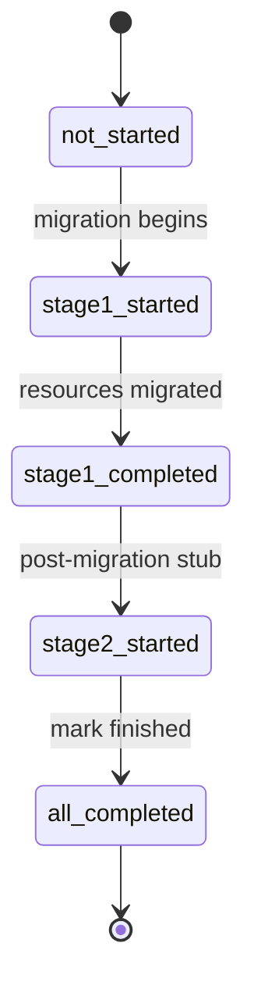
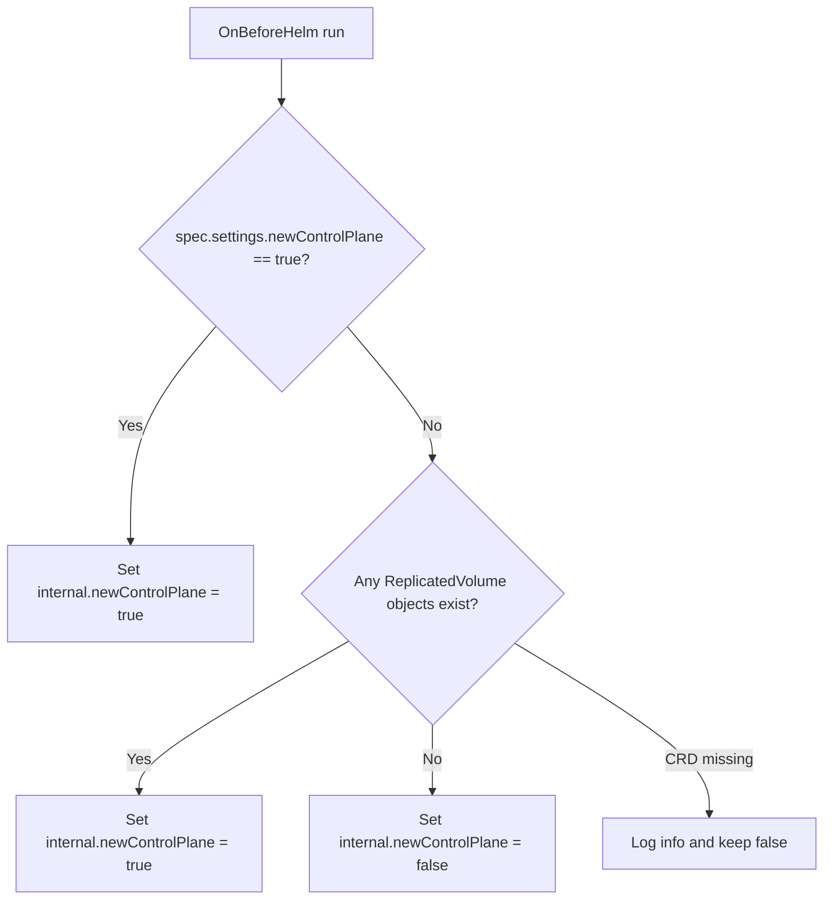

# Control-Plane Migration Process

This document describes the current migration flow from the legacy LINSTOR-based control plane to the new `sds-replicated-volume` control plane.

## Overview

The migration is driven by two values and one ConfigMap:

- `spec.settings.newControlPlane` in `ModuleConfig/sds-replicated-volume` is the user-facing switch.
- `sdsReplicatedVolume.internal.newControlPlane` is computed by a hook and is what templates actually use.
- `ConfigMap/control-plane-migration` in `d8-sds-replicated-volume` stores the migration state in `.data.state`.

## State Machine

Current state values:

- `not_started`
- `stage1_started`
- `stage1_completed`
- `stage2_started` (during the short post-migration stub, until `all_completed`)
- `all_completed`

The implementation uses these states as follows:

- `stage1` performs the actual resource migration from LINSTOR to new control-plane CRs;
- `stage2` is a short post-migration wait (10 seconds), then the state is set to `all_completed`.



## Hooks

### OnBeforeHelm: `computeInternalNewControlPlane`

The OnBeforeHelm hook computes `sdsReplicatedVolume.internal.newControlPlane`.



### Kubernetes hook: `syncControlPlaneMigrationState`

This hook watches `ConfigMap/control-plane-migration` in `d8-sds-replicated-volume` and copies `.data.state` into `sdsReplicatedVolume.internal.controlPlaneMigration`.

Behavior:

- runs on synchronization and on ConfigMap events;
- if `.data.state` is empty, it uses `not_started`;
- if the ConfigMap does not exist, it does nothing.

The last point matters because deleting the ConfigMap does not itself reset the internal Helm value. The migrator recreates the ConfigMap when it starts, but the hook does not recreate it on its own.

## Template Gating

Helm templates use `sdsReplicatedVolume.internal.newControlPlane` and `sdsReplicatedVolume.internal.controlPlaneMigration`.

| Component group | Render condition |
|---|---|
| Legacy LINSTOR stack, old controller, old CSI, metadata-backup, certs | `internal.newControlPlane == false` |
| Webhooks and rollback `ValidatingAdmissionPolicy` | `internal.newControlPlane == true` |
| `linstor-migrator` Job and its RBAC | `internal.newControlPlane == true` and state is not `all_completed` |
| New controller and agent | `internal.newControlPlane == true` |
| New CSI resources | `internal.newControlPlane == true` and `internal.controlPlaneMigration` is not `not_started`, `stage1_started`, or `stage1_completed` |

Operationally this means:

- enabling the new control plane removes the legacy LINSTOR-based components from templates immediately;
- the migrator Job is expected to bridge the gap and populate new control-plane resources;
- the new controller and agent are rendered as soon as `internal.newControlPlane` is true;
- the new CSI stack is rendered after stage 1 completes (state past `stage1_completed`), while the Job may still be in the stage 2 stub until `all_completed`.

## Migrator Workflow

`linstor-migrator` is a standalone CLI binary run as a Kubernetes Job. It is designed to be idempotent.

### Pre-flight checks

On startup the migrator:

1. verifies that `ModuleConfig/sds-replicated-volume.spec.settings.newControlPlane == true`;
2. verifies that the new control-plane CRD `replicatedvolumes.storage.deckhouse.io` exists;
3. ensures `ConfigMap/control-plane-migration` exists.

During **stage 1**, after `linstor-controller` is gone, if the LINSTOR CRD `nodes.internal.linstor.linbit.com` is missing, the migrator sets `stage1_completed` and skips the rest of stage 1; **stage 2** stub then sets `all_completed`.

### Stage 1

`stage1` performs the actual migration.

High-level flow:

1. set state to `stage1_started`;
2. wait until `Deployment/linstor-controller` disappears from `d8-sds-replicated-volume` (up to 10 minutes);
3. if the LINSTOR CRD is missing, set `stage1_completed` and skip the rest of stage 1;
4. discover every `CustomResourceDefinition` with `spec.group` `internal.linstor.linbit.com`, write their definitions to `crds.gz`, list all instances of each CRD and write them to `crs.gz`, and write `readme.txt` under `MigratorHostDir/MigratorLinstorBackupDirName` (default subdirectory name `linstor-backup-db`);
5. load LINSTOR data from CRDs into an in-memory snapshot;
6. list `PersistentVolume`, `ReplicatedStorageClass`, `VolumeAttachment`, and `LVMVolumeGroup` objects;
7. classify LINSTOR resources into:
   - resources with a matching replicated PV,
   - resources without a PV,
   - resources without a LINSTOR `ResourceDefinition` (these are skipped);
8. create one migration `ReplicatedStoragePool` per distinct LINSTOR storage pool;
9. migrate resources with PVs first, then resources without PVs;
10. delete every `CustomResourceDefinition` with `spec.group` `internal.linstor.linbit.com` (cluster data was backed up in step 4);
11. delete all `ReplicatedStorageMetadataBackup` objects (cluster-held LINSTOR metadata backups);
12. delete legacy `ReplicatedStoragePool` objects whose names equal a migrated LINSTOR storage pool name (skips `linstor-auto-*` and `auto-rsp-*`);
13. set state to `stage1_completed`.

### Stage 2

`stage2` is a short coordination stub after migration:

1. set state to `stage2_started`;
2. wait 10 seconds;
3. set state to `all_completed`.

There is no real post-migration verification yet.

## How a LINSTOR Resource Is Migrated

For each LINSTOR resource selected for migration, the migrator:

1. resolves the LINSTOR pool and the volume size;
2. resolves the DRBD shared secret from LINSTOR metadata;
3. picks an existing `ReplicatedStorageClass` for auto mode when possible:
   - prefer `PV.spec.storageClassName` if it matches an existing `ReplicatedStorageClass`;
   - if there is no PV, fall back to legacy `ReplicatedStorageClass.spec.storagePool` matching;
4. creates per-replica resources:
   - `LVMLogicalVolume` for diskful replicas only,
   - `DRBDResource` for every replica,
   - `ReplicatedVolumeReplica` for every replica;
5. patches owner references so `LVMLogicalVolume` and `DRBDResource` are owned by their `ReplicatedVolumeReplica`;
6. computes manual FTT/GMDR heuristics when auto mode is not possible;
7. creates `ReplicatedVolume`;
8. creates `ReplicatedVolumeAttachment` objects from matching `VolumeAttachment` objects when a PV exists.

Replica type mapping:

- LINSTOR `0` -> `Diskful`
- LINSTOR `388` -> `TieBreaker`
- LINSTOR `260` and everything else -> `Access`

DRBD resource type mapping:

- `Diskful` replica -> DRBD diskful resource;
- `TieBreaker` and `Access` replicas -> DRBD diskless resource.

## Automatically Created `ReplicatedStoragePool`

Before per-volume migration, the migrator creates one `ReplicatedStoragePool` for each distinct LINSTOR pool referenced by resources being migrated.

Current behavior:

- object name: `linstor-auto-<slugified-linstor-pool-name>`;
- type is derived from LINSTOR `NodeStorPool.driverName`:
  - `LVM` -> `ReplicatedStoragePoolTypeLVM`
  - `LVM_THIN` -> `ReplicatedStoragePoolTypeLVMThin`
- `lvmVolumeGroups` are resolved by matching:
  - LINSTOR `PropsContainers` key `StorDriver/StorPoolName`,
  - per-node LINSTOR `NodeStorPool`,
  - cluster `LVMVolumeGroup` objects;
- `systemNetworkNames` is hard-coded to `["Internal"]`;
- `eligibleNodesPolicy.notReadyGracePeriod` is hard-coded to 10 minutes.

If the migrator cannot resolve the corresponding `LVMVolumeGroup` or thin pool for a LINSTOR pool, it fails fast.

After stage 1 step 12, any `ReplicatedStoragePool` that was named exactly like a LINSTOR pool (typical for manually created pools on the old control plane) is removed. Pools created by this migrator (`linstor-auto-*`) or by the RSC controller (`auto-rsp-*`) are left in place.

## Created Resources

| Resource | Created when | Notes |
|---|---|---|
| `ReplicatedStoragePool` | once per distinct LINSTOR pool | auto-created as `linstor-auto-*` |
| `LVMLogicalVolume` | per diskful replica | object name is hash-based; `actualLVNameOnTheNode` stays `<resource>_00000` |
| `DRBDResource` | per replica | name matches the replica name; `maintenance=NoResourceReconciliation` |
| `ReplicatedVolumeReplica` | per replica | name is derived from resource name and DRBD node ID |
| `ReplicatedVolume` | once per resource | `maxAttachments=1`, created with the adopt-RVR annotation |
| `ReplicatedVolumeAttachment` | for resources with PVs and matching `VolumeAttachment` objects | one per matching node attachment |

Additional details for `ReplicatedVolume`:

- if an existing `ReplicatedStorageClass` is found, the migrator uses `configurationMode=Auto`;
- otherwise it uses `configurationMode=Manual` and writes:
  - `replicatedStoragePoolName`,
  - `topology=Ignored`,
  - `volumeAccess=PreferablyLocal`,
  - computed `failuresToTolerate`,
  - computed `guaranteedMinimumDataRedundancy`;
- if the LINSTOR resource has no matching PV, the migrator labels the `ReplicatedVolume` with `sds-replicated-volume.deckhouse.io/no-persistent-volume=true`.

## Current Limitations

- The stage 2 stub does not validate migrated resources.
- DRBD shared secrets are read from LINSTOR, but they are not yet propagated into the created `ReplicatedVolume`.
- Manual topology and volume access are still hard-coded (`Ignored` and `PreferablyLocal`).
- Migration relies on the legacy `ReplicatedStorageClass.spec.storagePool` fallback when a resource has no PV.

## Idempotency and Restart

The migrator uses create-if-not-exists semantics for all created resources:

1. attempt `Create`;
2. if the object already exists, log and continue;
3. otherwise fail on error.

Owner reference updates are also safe to repeat because the migrator first checks whether the target owner reference is already present.

Practical consequences:

- rerunning stage 1 is safe for already migrated resources;
- partial restarts during migration are expected;
- resources without PVs are still migrated and explicitly marked on the resulting `ReplicatedVolume`.

## Recovery Notes

If the migration Job fails, the most useful recovery lever is the ConfigMap state:

- delete the `Job/control-plane-migrator` in `d8-sds-replicated-volume` if it already exists; 
- set `state: not_started` to rerun the full current flow (stage 1 migration, then stage 2 stub);
- set `state: stage1_completed` to rerun only the stage 2 stub;
- keep in mind that deleting the ConfigMap does not itself update the internal Helm value until the hook sees a new ConfigMap object again.

Example reset:

```bash
kubectl -n d8-sds-replicated-volume delete job/control-plane-migrator --ignore-not-found
cat <<'EOF' | kubectl apply -f -
apiVersion: v1
kind: ConfigMap
metadata:
  name: control-plane-migration
  namespace: d8-sds-replicated-volume
data:
  state: not_started
EOF
```
