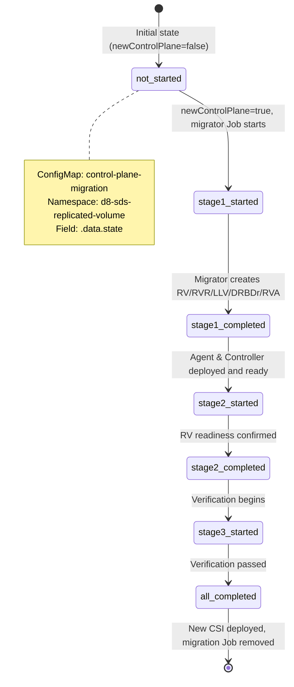
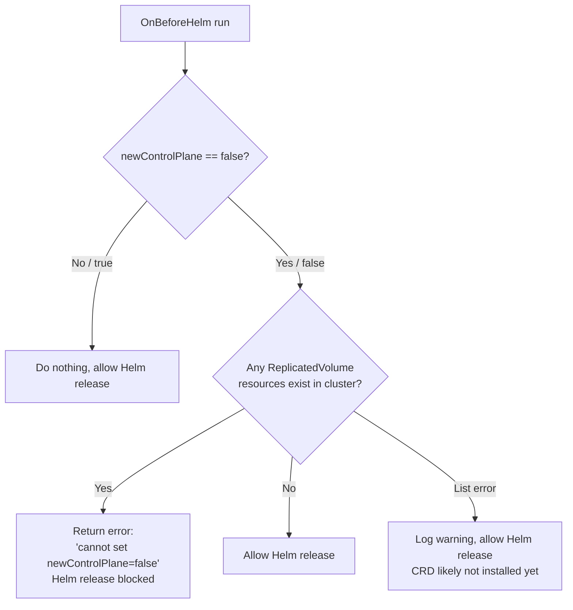
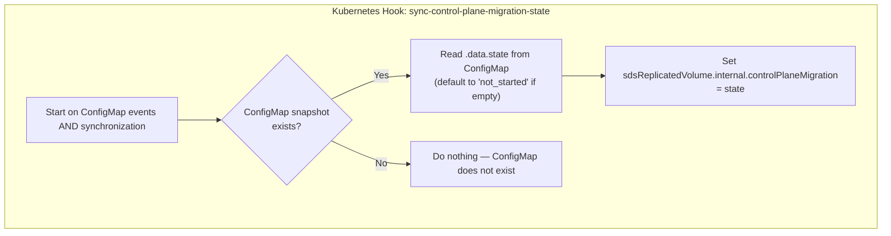
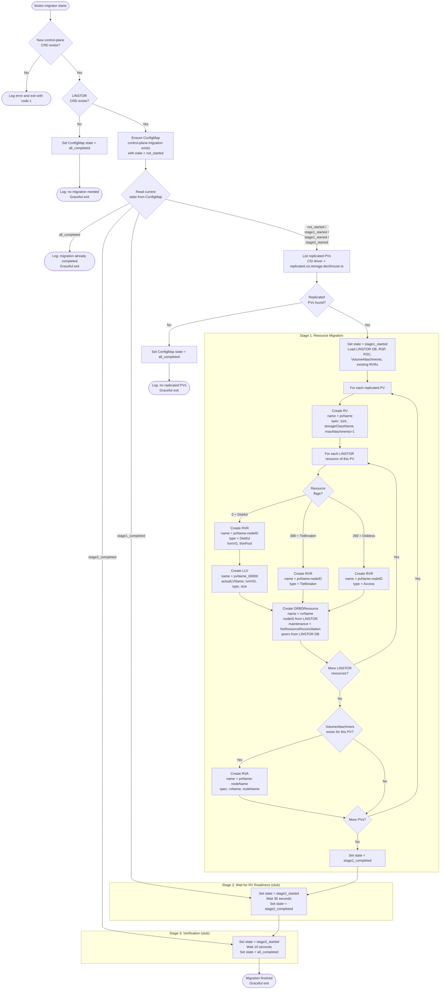

# Control-Plane Migration Process

## Overview

Migration from LINSTOR to the new control-plane in the sds-replicated-volume module.

### High-level approach
- `ModuleConfig.newControlPlane` (boolean, default `false`) enables the new control-plane
- Control-plane migration state is stored in ConfigMap `control-plane-migration` in namespace `d8-sds-replicated-volume`, field `.data.state`
- OnBeforeHelm hook (`guard-against-reset-newControlPlane`) prevents setting `newControlPlane` back to `false` if any ReplicatedVolume resources exist
- A `ValidatingAdmissionPolicy` (deployed when `newControlPlane=true`) also blocks reverting `newControlPlane` from `true` to `false` at the Kubernetes API level
- Kubernetes hook (`sync-control-plane-migration-state`) watches the ConfigMap and sets `sdsReplicatedVolume.internal.controlPlaneMigration` to trigger Helm template re-renders
- Components deployment depends on both `newControlPlane` and `internal.controlPlaneMigration`

## State Diagram (High-Level Migration Flow)



## Hooks Implementation

### OnBeforeHelm Hook (`guard-against-reset-newControlPlane`)

Registered with `OnBeforeHelm` (order 5). Prevents accidentally reverting to the old control-plane:



Source: `hooks/go/085-control-plane-migration/control-plane-migration.go` — `guardAgainstResetNewControlPlane()`

### Kubernetes Hook (`sync-control-plane-migration-state`)

Watches ConfigMap `control-plane-migration` in `d8-sds-replicated-volume` namespace. Runs on Added/Modified/Deleted events and on synchronization (`ExecuteHookOnSynchronization: true`):



Source: `hooks/go/085-control-plane-migration/control-plane-migration.go` — `syncControlPlaneMigrationState()`

## Component Deployment Matrix

Helm templates conditionally deploy components based on `newControlPlane` and `internal.controlPlaneMigration`:

| Component | Condition | Deployed when |
|-----------|-----------|---------------|
| **LINSTOR stack** (controller, satellite, affinity-controller, scheduler-extender, old controller, SPAAS, certs, metadata-backup) | `newControlPlane == false` | Only in legacy mode |
| **Old CSI driver** (linstor-csi) | `newControlPlane == false` | Only in legacy mode |
| **Webhooks** (deployment, service, ValidatingWebhookConfiguration) | `newControlPlane == true` | Always when new CP enabled |
| **ValidatingAdmissionPolicy** (blocks reverting newControlPlane) | `newControlPlane == true` | Always when new CP enabled |
| **Migration Job** (linstor-migrator) | `newControlPlane == true` AND state != `all_completed` | While migration is in progress |
| **Agent** (DaemonSet) | `newControlPlane == true` AND state NOT IN (`not_started`, `stage1_started`) | After stage 1 completed |
| **Controller** (Deployment) | `newControlPlane == true` AND state NOT IN (`not_started`, `stage1_started`) | After stage 1 completed |
| **New CSI driver** (CSIDriver, controller, RBAC, VolumeSnapshotClass) | `newControlPlane == true` AND state == `all_completed` | Only after migration fully completed |

### Deployment Timeline

```
newControlPlane=false          newControlPlane=true
        │                              │
        ▼                              ▼
┌───────────────┐              ┌───────────────────────────────────────────────────────────────────┐
│ LINSTOR stack │              │ Webhooks + ValidatingAdmissionPolicy                              │
│ Old CSI       │              ├─────────────────────────────────────────────────────┬─────────────┤
│               │              │ Migration Job                                       │ (removed)   │
│               │              ├─────────────────┬───────────────────────────────────┤             │
│               │              │                 │ Agent + Controller                │             │
│               │              │                 ├───────────────────────────────────┼─────────────┤
│               │              │                 │                                   │ New CSI     │
└───────────────┘              └─────────────────┴───────────────────────────────────┴─────────────┘
                               not_started ──► stage1_completed ──────────────────► all_completed
```

## Recovery Procedure

If migration Job fails:

1. Delete the failed Job:
   ```bash
   kubectl delete job <migration-job> -n d8-sds-replicated-volume
   ```

2. Delete the existing ConfigMap (if it exists):
   ```bash
   kubectl delete configmap control-plane-migration -n d8-sds-replicated-volume
   ```

3. Recreate the ConfigMap with the desired state:
   ```bash
   cat <<EOF | kubectl apply -f -
   apiVersion: v1
   kind: ConfigMap
   metadata:
     name: control-plane-migration
     namespace: d8-sds-replicated-volume
   data:
     state: not_started
   EOF
   ```

4. The hook will detect the new ConfigMap state and allow the module templates to recreate the Job to retry migration.

## Important Notes

- The Kubernetes hook does NOT automatically recreate the ConfigMap when it is deleted.
- If the ConfigMap is deleted, the internal state value remains unchanged until a new ConfigMap is created manually.
- `ExecuteHookOnSynchronization` is enabled (`true`), ensuring the hook runs during initial synchronization and captures the ConfigMap state properly.
- Setting `newControlPlane=true` immediately stops all LINSTOR components and the old CSI driver.
- The new CSI driver is deployed **only** after migration reaches `all_completed`.

## Migrator Workflow

The `linstor-migrator` is a standalone CLI tool (run as a Kubernetes Job) that transfers entities from LINSTOR CRs into the new control-plane CRs: ReplicatedVolume (RV), ReplicatedVolumeReplica (RVR), ReplicatedVolumeAttachment (RVA), DRBDResource (DRBDr), and LVMLogicalVolume (LLV).

The migrator is **idempotent** — it can be safely restarted at any point.

### Migrator Internal Flow



### Resources Created per PV

For each replicated PersistentVolume, the migrator creates:

| Resource | Name Pattern | Key Fields |
|----------|-------------|------------|
| ReplicatedVolume | `<pvName>` | size, replicatedStorageClassName, maxAttachments=1 |
| ReplicatedVolumeReplica | `<pvName>-<linstorNodeID>` | replicatedVolumeName, nodeName, type (Diskful/TieBreaker/Access), lvmVG (Diskful only) |
| LVMLogicalVolume | `<pvName>_00000` | actualLVName, lvmVG, type (Thin/Thick), size (Diskful replicas only) |
| DRBDResource | `<pvName>-<linstorNodeID>` | nodeName, nodeID, type, systemNetworks, maintenance=NoResourceReconciliation, peers |
| ReplicatedVolumeAttachment | `<pvName>-<nodeName>` | replicatedVolumeName, nodeName (only if VolumeAttachment exists) |

### Idempotency

All resource creation functions use a **create-if-not-exists** pattern:
1. Attempt `Create` on the API server.
2. If `AlreadyExists` — log and skip.
3. If another error — fail immediately.

On restart, the migrator reads the current state from the ConfigMap and skips already completed stages. Within Stage 1, resources that were already created are safely skipped.
