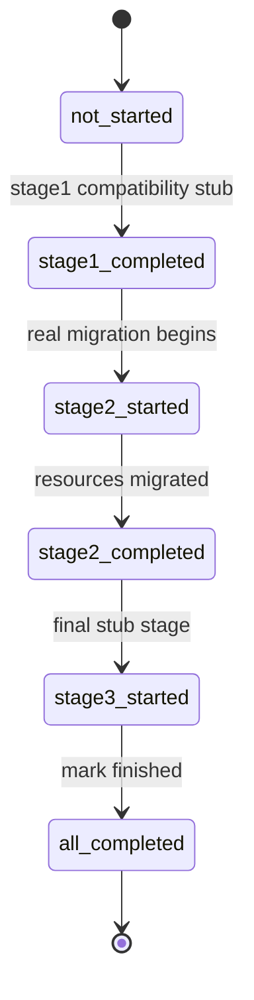
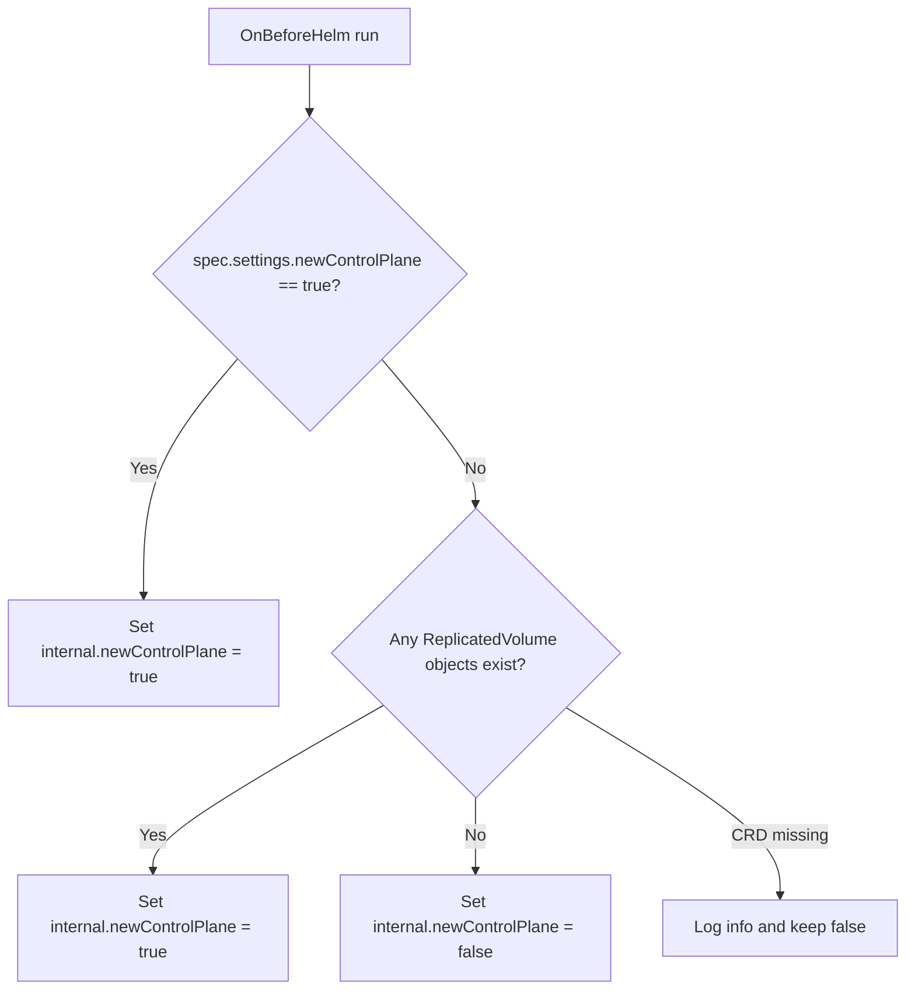

# Control-Plane Migration Process

This document describes the current migration flow from the legacy LINSTOR-based control plane to the new `sds-replicated-volume` control plane.

## Overview

The migration is driven by two values and one ConfigMap:

- `spec.settings.newControlPlane` in `ModuleConfig/sds-replicated-volume` is the user-facing switch.
- `sdsReplicatedVolume.internal.newControlPlane` is computed by a hook and is what templates actually use.
- `ConfigMap/control-plane-migration` in `d8-sds-replicated-volume` stores the migration state in `.data.state`.

The important detail is that `internal.newControlPlane` is no longer a direct copy of the user setting:

- if `newControlPlane=true`, the hook sets `internal.newControlPlane=true`;
- if `newControlPlane=false`, the hook checks whether any `ReplicatedVolume` objects already exist;
- if `ReplicatedVolume` objects exist, the hook still sets `internal.newControlPlane=true`;
- otherwise it keeps `internal.newControlPlane=false`.

This makes the Helm rendering path sticky once the cluster already contains new control-plane resources.

## State Machine

Current state values:

- `not_started`
- `stage1_started`
- `stage1_completed`
- `stage2_started`
- `stage2_completed`
- `stage3_started`
- `all_completed`

The current implementation uses these states as follows:

- `stage1` is a compatibility stub that immediately moves the migration to `stage1_completed`;
- `stage2` performs the actual resource migration;
- `stage3` is still a stub that waits 10 seconds and marks the migration as completed.



## Hooks

### OnBeforeHelm: `computeInternalNewControlPlane`

The OnBeforeHelm hook computes `sdsReplicatedVolume.internal.newControlPlane`.



Notes:

- the hook no longer rejects Helm renders when the user tries to switch back to `false`;
- instead it derives the internal value from the actual cluster state;
- the API-level rollback protection is handled separately by a `ValidatingAdmissionPolicy`.

### Kubernetes hook: `syncControlPlaneMigrationState`

This hook watches `ConfigMap/control-plane-migration` in `d8-sds-replicated-volume` and copies `.data.state` into `sdsReplicatedVolume.internal.controlPlaneMigration`.

Behavior:

- runs on synchronization and on ConfigMap events;
- if `.data.state` is empty, it uses `not_started`;
- if the ConfigMap does not exist, it does nothing.

The last point matters because deleting the ConfigMap does not itself reset the internal Helm value. The migrator recreates the ConfigMap when it starts, but the hook does not recreate it on its own.

## Template Gating

Helm templates use `sdsReplicatedVolume.internal.newControlPlane` and `sdsReplicatedVolume.internal.controlPlaneMigration`.

| Component group | Render condition |
|---|---|
| Legacy LINSTOR stack, old controller, old CSI, metadata-backup, certs | `internal.newControlPlane == false` |
| Webhooks and rollback `ValidatingAdmissionPolicy` | `internal.newControlPlane == true` |
| `linstor-migrator` Job and its RBAC | `internal.newControlPlane == true` and state is not `all_completed` |
| New controller and agent | `internal.newControlPlane == true` and state is not `not_started` or `stage1_started` |
| New CSI resources | `internal.newControlPlane == true` and state contains `all_completed` |

Operationally this means:

- enabling the new control plane removes the legacy LINSTOR-based components from templates immediately;
- the migrator Job is expected to bridge the gap and populate new control-plane resources;
- the new CSI is rendered only after the migration reaches `all_completed`.

## Migrator Workflow

`linstor-migrator` is a standalone CLI binary run as a Kubernetes Job. It is designed to be idempotent.

### Pre-flight checks

On startup the migrator:

1. verifies that `ModuleConfig/sds-replicated-volume.spec.settings.newControlPlane == true`;
2. verifies that the new control-plane CRD `replicatedvolumes.storage.deckhouse.io` exists;
3. checks whether the LINSTOR CRD `nodes.internal.linstor.linbit.com` exists;
4. ensures `ConfigMap/control-plane-migration` exists.

If the LINSTOR CRD does not exist, the migrator sets the state to `all_completed` and exits successfully.

### Resume logic

The migrator resumes based on the current ConfigMap state:

- `all_completed`: exit immediately;
- `stage2_completed`: run only `stage3`;
- any other state: run `stage1` stub, then `stage2`, then `stage3`.

This means that a restart from `not_started`, `stage1_started`, `stage1_completed`, `stage2_started`, or `stage3_started` re-enters the real migration through `stage2`.

### Stage 1

`stage1` is intentionally a stub for compatibility with the existing template choreography:

- it logs that the stage is skipped;
- it updates the ConfigMap state to `stage1_completed`.

### Stage 2

`stage2` performs the actual migration.

High-level flow:

1. set state to `stage2_started`;
2. wait until `Deployment/linstor-controller` disappears from `d8-sds-replicated-volume` (up to 10 minutes);
3. load LINSTOR data from CRDs into an in-memory snapshot;
4. list `PersistentVolume`, `ReplicatedStorageClass`, `VolumeAttachment`, and `LVMVolumeGroup` objects;
5. classify LINSTOR resources into:
   - resources with a matching replicated PV,
   - resources without a PV,
   - resources without a LINSTOR `ResourceDefinition` (these are skipped);
6. create one migration `ReplicatedStoragePool` per distinct LINSTOR storage pool;
7. migrate resources with PVs first, then resources without PVs;
8. set state to `stage2_completed`.

### Stage 3

`stage3` is currently a stub:

- set state to `stage3_started`;
- wait 10 seconds;
- set state to `all_completed`.

There is no real post-migration verification yet.

## How a LINSTOR Resource Is Migrated

For each LINSTOR resource selected for migration, the migrator:

1. resolves the LINSTOR pool and the volume size;
2. resolves the DRBD shared secret from LINSTOR metadata;
3. picks an existing `ReplicatedStorageClass` for auto mode when possible:
   - prefer `PV.spec.storageClassName` if it matches an existing `ReplicatedStorageClass`;
   - if there is no PV, fall back to legacy `ReplicatedStorageClass.spec.storagePool` matching;
4. creates per-replica resources:
   - `LVMLogicalVolume` for diskful replicas only,
   - `DRBDResource` for every replica,
   - `ReplicatedVolumeReplica` for every replica;
5. patches owner references so `LVMLogicalVolume` and `DRBDResource` are owned by their `ReplicatedVolumeReplica`;
6. computes manual FTT/GMDR heuristics when auto mode is not possible;
7. creates `ReplicatedVolume`;
8. creates `ReplicatedVolumeAttachment` objects from matching `VolumeAttachment` objects when a PV exists.

Replica type mapping:

- LINSTOR `0` -> `Diskful`
- LINSTOR `388` -> `TieBreaker`
- LINSTOR `260` and everything else -> `Access`

DRBD resource type mapping:

- `Diskful` replica -> DRBD diskful resource;
- `TieBreaker` and `Access` replicas -> DRBD diskless resource.

## Automatically Created `ReplicatedStoragePool`

Before per-volume migration, the migrator creates one `ReplicatedStoragePool` for each distinct LINSTOR pool referenced by resources being migrated.

Current behavior:

- object name: `linstor-auto-<slugified-linstor-pool-name>`;
- type is derived from LINSTOR `NodeStorPool.driverName`:
  - `LVM` -> `ReplicatedStoragePoolTypeLVM`
  - `LVM_THIN` -> `ReplicatedStoragePoolTypeLVMThin`
- `lvmVolumeGroups` are resolved by matching:
  - LINSTOR `PropsContainers` key `StorDriver/StorPoolName`,
  - per-node LINSTOR `NodeStorPool`,
  - cluster `LVMVolumeGroup` objects;
- `systemNetworkNames` is hard-coded to `["Internal"]`;
- `eligibleNodesPolicy.notReadyGracePeriod` is hard-coded to 10 minutes.

If the migrator cannot resolve the corresponding `LVMVolumeGroup` or thin pool for a LINSTOR pool, it fails fast.

## Created Resources

| Resource | Created when | Notes |
|---|---|---|
| `ReplicatedStoragePool` | once per distinct LINSTOR pool | auto-created as `linstor-auto-*` |
| `LVMLogicalVolume` | per diskful replica | object name is hash-based; `actualLVNameOnTheNode` stays `<resource>_00000` |
| `DRBDResource` | per replica | name matches the replica name; `maintenance=NoResourceReconciliation` |
| `ReplicatedVolumeReplica` | per replica | name is derived from resource name and DRBD node ID |
| `ReplicatedVolume` | once per resource | `maxAttachments=1`, created with the adopt-RVR annotation |
| `ReplicatedVolumeAttachment` | for resources with PVs and matching `VolumeAttachment` objects | one per matching node attachment |

Additional details for `ReplicatedVolume`:

- if an existing `ReplicatedStorageClass` is found, the migrator uses `configurationMode=Auto`;
- otherwise it uses `configurationMode=Manual` and writes:
  - `replicatedStoragePoolName`,
  - `topology=Ignored`,
  - `volumeAccess=PreferablyLocal`,
  - computed `failuresToTolerate`,
  - computed `guaranteedMinimumDataRedundancy`;
- if the LINSTOR resource has no matching PV, the migrator labels the `ReplicatedVolume` with `sds-replicated-volume.deckhouse.io/no-persistent-volume=true`.

## Current Limitations

- `stage3` is still a stub and does not validate migrated resources.
- DRBD shared secrets are read from LINSTOR, but they are not yet propagated into the created `ReplicatedVolume`.
- Manual topology and volume access are still hard-coded (`Ignored` and `PreferablyLocal`).
- Migration relies on the legacy `ReplicatedStorageClass.spec.storagePool` fallback when a resource has no PV.

## Idempotency and Restart

The migrator uses create-if-not-exists semantics for all created resources:

1. attempt `Create`;
2. if the object already exists, log and continue;
3. otherwise fail on error.

Owner reference updates are also safe to repeat because the migrator first checks whether the target owner reference is already present.

Practical consequences:

- rerunning `stage2` is safe for already migrated resources;
- partial restarts during migration are expected;
- resources without PVs are still migrated and explicitly marked on the resulting `ReplicatedVolume`.

## Recovery Notes

If the migration Job fails, the most useful recovery lever is the ConfigMap state:

- set `state: not_started` to rerun the full current flow (`stage1` stub -> `stage2` -> `stage3`);
- set `state: stage2_completed` to rerun only the final stub stage;
- keep in mind that deleting the ConfigMap does not itself update the internal Helm value until the hook sees a new ConfigMap object again.

Example reset:

```bash
cat <<'EOF' | kubectl apply -f -
apiVersion: v1
kind: ConfigMap
metadata:
  name: control-plane-migration
  namespace: d8-sds-replicated-volume
data:
  state: not_started
EOF
```
