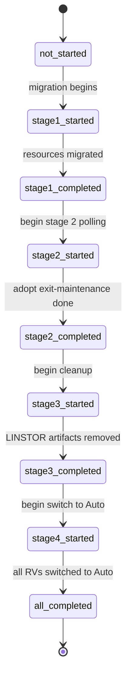
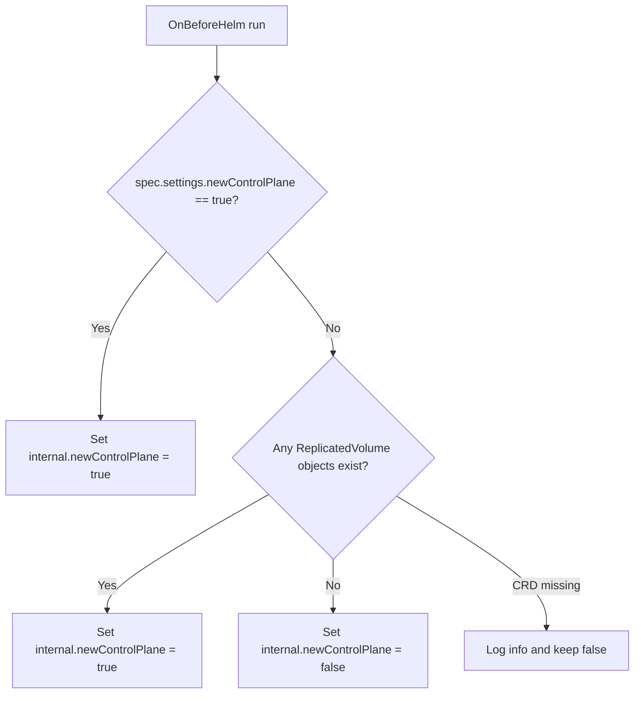

# Control-Plane Migration Process

This document describes the current migration flow from the legacy LINSTOR-based control plane to the new `sds-replicated-volume` control plane.

## Overview

The migration is driven by two values and one ConfigMap:

- `spec.settings.newControlPlane` in `ModuleConfig/sds-replicated-volume` is the user-facing switch.
- `sdsReplicatedVolume.internal.newControlPlane` is computed by a hook and is what templates actually use.
- `ConfigMap/control-plane-migration` in `d8-sds-replicated-volume` stores the migration state in `.data.state`.

## State Machine

Current state values:

- `not_started`
- `stage1_started`
- `stage1_completed`
- `stage2_started`
- `stage2_completed`
- `stage3_started`
- `stage3_completed`
- `stage4_started`
- `all_completed`

The implementation uses these states as follows:

- `stage1` performs the actual resource migration from LINSTOR to new control-plane CRs;
- `stage2` polls adopt `ReplicatedVolume` objects, clears `DRBDResource` maintenance when adopt formation reaches the Exit maintenance step, removes adopt annotations, then sets `stage2_completed`;
- `stage3` backs up and removes LINSTOR CRs, metadata backups, and legacy `ReplicatedStoragePool` objects, then sets `stage3_completed`;
- `stage4` switches `ReplicatedVolume` objects that had a matching PersistentVolume from Manual to Auto configuration once their `ReplicatedStorageClass` reaches `phase=Ready`, creates temporary conversion `ReplicatedStoragePool` objects for RSC still using the deprecated `spec.storagePool` field, cleans them up after conversion, then sets `all_completed`.



## Hooks

### OnBeforeHelm: `computeInternalNewControlPlane`

The OnBeforeHelm hook computes `sdsReplicatedVolume.internal.newControlPlane`.



### Kubernetes hook: `syncControlPlaneMigrationState`

This hook watches `ConfigMap/control-plane-migration` in `d8-sds-replicated-volume` and copies `.data.state` into `sdsReplicatedVolume.internal.controlPlaneMigration`.

Behavior:

- runs on synchronization and on ConfigMap events;
- if `.data.state` is empty, it uses `not_started`;
- if the ConfigMap does not exist, it does nothing.

The last point matters because deleting the ConfigMap does not itself reset the internal Helm value. The migrator recreates the ConfigMap when it starts, but the hook does not recreate it on its own.

## Template Gating

Helm templates use `sdsReplicatedVolume.internal.newControlPlane` and `sdsReplicatedVolume.internal.controlPlaneMigration`.

| Component group | Render condition |
|---|---|
| Legacy LINSTOR stack, old controller, old CSI, metadata-backup, certs | `internal.newControlPlane == false` |
| Webhooks and rollback `ValidatingAdmissionPolicy` | `internal.newControlPlane == true` |
| `linstor-migrator` Job and its RBAC | `internal.newControlPlane == true` and state is not `all_completed` |
| New controller and agent | `internal.newControlPlane == true` |
| New CSI resources | `internal.newControlPlane == true` and `internal.controlPlaneMigration` is not `not_started`, `stage1_started`, or `stage1_completed` |

Operationally this means:

- enabling the new control plane removes the legacy LINSTOR-based components from templates immediately;
- the migrator Job is expected to bridge the gap and populate new control-plane resources;
- the new controller and agent are rendered as soon as `internal.newControlPlane` is true;
- the new CSI stack is rendered after stage 1 completes (state past `stage1_completed`), while the Job may still be in stages 2–4 until `all_completed`.

## Migrator Workflow

`linstor-migrator` is a standalone CLI binary run as a Kubernetes Job. It is designed to be idempotent.

Optional flags (defaults match prior hard-coded behavior):

| Flag | Default | Meaning |
|------|---------|---------|
| `--log-level` | `info` | `debug`, `info`, `warn`, or `error` |
| `--retry-interval` | `2s` | Interval between ConfigMap state update retries and stage 2 polling rounds |
| `--stage2-worker-count` | `5` | Parallel workers for stage 2 |
| `--stage4-max-iterations` | `500` | Maximum number of stage 4 polling iterations while waiting for ReplicatedStorageClasses to become Ready; exceeding it fails the migration with a clear error |
| `--stage4-poll-interval` | `2s` | Interval between stage 4 polling iterations |
 
## How a LINSTOR Resource Is Migrated

For each LINSTOR resource selected for migration, the migrator creates the corresponding new control-plane CRs: `ReplicatedVolumeReplica` per replica, `LVMLogicalVolume` and `DRBDResource` per diskful replica, a single `ReplicatedVolume` in Manual mode, and `ReplicatedVolumeAttachment` objects from matching `VolumeAttachment` resources. The migrator computes FTT/GMDR heuristics from legacy replica counts and wires owner references so `LVMLogicalVolume` and `DRBDResource` are owned by their `ReplicatedVolumeReplica`.

## Migration `ReplicatedStoragePool`

In stage 1, the migrator creates one `ReplicatedStoragePool` (`linstor-auto-<slug>`) per distinct LINSTOR storage pool, with the pool type and `LVMVolumeGroup` references derived from LINSTOR data. These pools persist after migration.

In stage 3, any legacy `ReplicatedStoragePool` (not `linstor-auto-*` or `auto-rsp-*`) is backed up and removed.

In stage 4, temporary conversion `ReplicatedStoragePool` objects may be created for RSC still using the deprecated `spec.storagePool` field (see Stage 4 above). They are labeled `sds-replicated-volume.deckhouse.io/migration-conversion-rsp=true` and deleted once the referencing RSC is converted. After stage 4, the cluster contains only `linstor-auto-*` (migrator) and `auto-rsp-*` (RSC controller) pools.

## Created Resources

| Resource | Created in | Notes |
|---|---|---|
| `ReplicatedStoragePool` (`linstor-auto-*`) | stage 1 | one per LINSTOR pool; persists |
| `ReplicatedStoragePool` (conversion) | stage 4 | temporary, labeled `migration-conversion-rsp=true`; deleted after RSC conversion |
| `LVMLogicalVolume` | stage 1 | per diskful replica |
| `DRBDResource` | stage 1 | per replica; created in maintenance mode, cleared in stage 2 |
| `ReplicatedVolumeReplica` | stage 1 | per replica |
| `ReplicatedVolume` | stage 1 | `maxAttachments=2`, starts in Manual; switched to Auto in stage 4 if PV exists |
| `ReplicatedVolumeAttachment` | stage 1 | for resources with matching `VolumeAttachment` |

### `ReplicatedVolume` labels

The migrator labels each `ReplicatedVolume` at creation time to signal how stage 4 should handle it:

- `sds-replicated-volume.deckhouse.io/switch-to-auto-configuration=true` — set for volumes with a matching PV; stage 4 switches them to Auto.
- `sds-replicated-volume.deckhouse.io/no-persistent-volume=true` — set for volumes without a PV; they stay in Manual mode.

During stage 4, the switch-to-auto label is replaced as follows:

- successful switch to Auto → label removed;
- PV gone before the switch → replaced with `no-persistent-volume=true`;
- RSC missing, in a terminal phase (`InsufficientNodes`, `InvalidConfiguration`, `PartiallyAligned`, `Terminating`), or in `WaitingForStoragePool` with no conversion RSP (source `linstor-auto-*` not found) → replaced with `sds-replicated-volume.deckhouse.io/auto-configuration-blocked=true` (the volume stays in Manual mode; suitable for an operator alert).

## Current Limitations

- Manual topology and volume access are still hard-coded (`Ignored` and `PreferablyLocal`).
## Idempotency and Restart

The migrator is designed to be idempotent: all `Create` calls use create-if-not-exists semantics, patch helpers skip no-op patches, and stage 4 tracks conversion RSPs by label (not in-memory), so a restart recovers from cluster state. Partial restarts at any stage are expected and safe.

## Recovery Notes

```bash
kubectl -n d8-sds-replicated-volume delete job/control-plane-migrator --ignore-not-found
cat <<'EOF' | kubectl apply -f -
apiVersion: v1
kind: ConfigMap
metadata:
  name: control-plane-migration
  namespace: d8-sds-replicated-volume
data:
  state: not_started
EOF
```

## LINSTOR backup viewer (`linstor-viewer`)

After stage 3, the backup directory contains a read-only helper binary `linstor-viewer` that prints LINSTOR-style listings reconstructed from `crs.gz` (no live LINSTOR controller required). Fields not stored in the CR backup are shown as `-`.

```bash
cd /opt/deckhouse/tmp/linstor-migrator/linstor-backup-db
./linstor-viewer crs.gz node list
./linstor-viewer crs.gz storage-pool list
./linstor-viewer crs.gz volume list
./linstor-viewer --help
```

To rebuild the embedded viewer when developing the migrator locally, see `internal/linstorbackup/embedded/README.md`.
